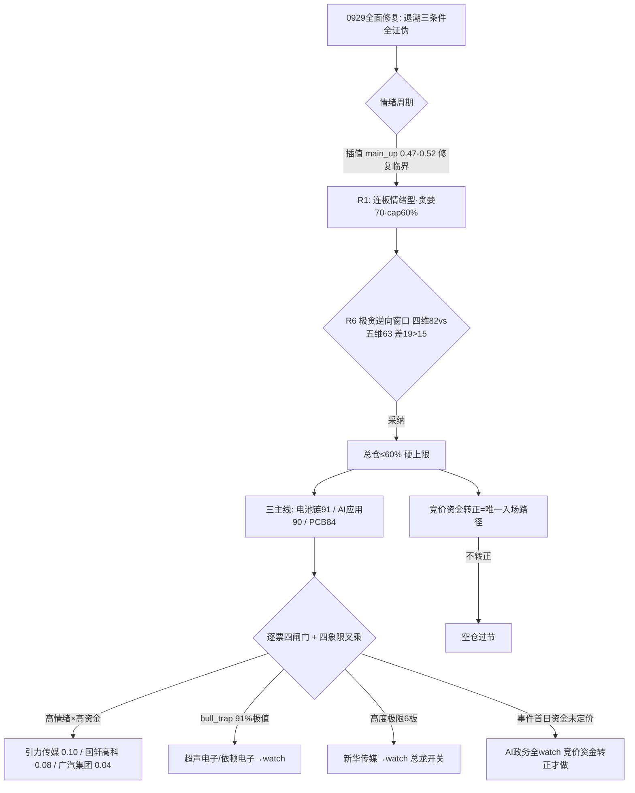

# 2026年9月30日 · 主决策 / D1 盘前预案

> **数据源新鲜度**: partial
> **降级状态**: true（research_summary.json 缺失 · R1 美股滞后 · R5 risk_grade 缺省补 B）
> **置信度**: 0.67

## 一句话结论

**国庆长假前最后一个交易日，先认市场再认个股：0928 退潮已在 0929 被全面证伪、情绪周期回到主升修复，但今天是买入即持股过节 8 天的日子，外盘（美债、美联储 10 月加息概率 50% 未消、伊朗、日债）风险不在任何人控制范围内。** 因此总仓位压到 60% 上限，只做三条主线（电池链 91 / AI 应用 90 / PCB 84）的龙一龙二，全部以「竞价资金转正 + 分歧低吸」为唯一入场路径——不转正，就空仓过节。执行池 3 只：引力传媒（0.10）、国轩高科（0.08）、广汽集团（0.04），合计 0.22，宁可少做，不做错。

---

## 一、情绪周期：修复是真的，但今天是「高标兑现压力最大的一天」

先把市场放在正确的位置上。0929 是 0928 退潮日的全面修复日——涨停 33→57 家、跌停 56→10 家、炸板率 25%→12.31%、广度 0.20→1.80、昨日涨停溢价 -1.95%→+2.64%，退潮线三条件（晋级率、跌停反超、广度）在 0929 全部证伪，情绪周期从「高位震荡/退潮」回到「主升」：emotion_cycle 预计算 main_up 0.47，R1 用 0929 真实指标重算 0.52。17 个强板块同日点火（较 0928 的 1 个急剧扩张），高标簇（非 ST 三板以上）30 日 +199.1%、当日 +10.06%，这是 V 型反转首日该有的样子。

但注意两件事。第一，main_up 是插值、不是硬命中——昨日涨停溢价 +2.64% 差 0.36pct 没到 +3% 的硬阈值，情绪周期处于「修复临界」，持续性要靠 0930 竞价验证。第二，R1 情绪浓度四维 82（极贪）与五维 63（贪婪）差了 19 分，超过 15 分校验线，触发 R6 的「极贪逆向卖出窗口」：涨停 57 / 高度 6 板 / 炸板率 12.31% 表面火热，但节前最后一天、高标获利盘 30 日 +199.1%，Jason 昨天在群里说得很直白——「明天不涨停就出货」。

**R6 的裁决我全盘采纳：今日总仓 ≤60% 是硬上限（R6_M1_03），只做各主线龙一/龙二竞价分歧低吸，不做任何追高。** 仓位推导：min(R1 下沿 0.60, 情绪联动 0.60) × 主线数 1.1 = 0.66 → R6 极贪窗口硬上限 clamp → **0.60**。

**大资金意图**：0929 主力资金从 0928 的恐慌出逃转为全面回流——深圳特区 +27.82 亿、华为概念 +25.93 亿、人工智能 +25.93 亿、PCB +25.77 亿、固态电池 +24.36 亿、锂电池 +21.6 亿、AI 应用 +17.13 亿，北向连续 5 日净买（0929 +21.29 亿）。**为什么走强**：央行 PSL 降息 0.25pct + 科技创新再贷款 1.4 万亿（E002）给了流动性底气，美联储 10 月加息概率从 ~70% 降到 ~50% 缓解了外压。**逻辑够不够硬**：够硬，但有三个但书——科技板块 5 日累计仍是净流出（人工智能 -374.65 亿 / PCB -342.79 亿），今天只是「末日翻红」回流首日；龙虎榜诱多 63/69 = 91% 是近期极值；高标 30 日 +199.1% 意味着节前兑现压力集中在今天。所以方向向上，动作必须克制。

---

## 二、三条主线的抉择：电池链主升早期、AI 应用上会日、PCB 修复反弹

**电池链（固态电池/锂电池，91 分，主升早期首板点火）**是今天权重最高的一条线。固态电池 THS 热榜登顶 #1，三板块资金全部进 top10（固态 +24.36 亿 #5 / 电池技术 +22.51 亿 #6 / 锂电池 +21.6 亿 #7），行业电池 +21.75 亿 #3。R2 判 early_up——这是「最佳参与窗口：猛干龙头/龙二」。龙一国轩高科 0929 一字（9:37 封死），龙虎榜净买 3.68 亿全场第一（深股通/机构/国泰海通知春路+南京太平南路多席位合力）；龙二广汽集团一字（9:25 封、换手 0.11%），巨湾 XFC 超充+自研电池双轮驱动。但两条一字都没有参与度，且广汽估值安全分 39 是全池最弱（净利 -75.98%、ROE -4.34%、毛利率 -1.11%），R6 用三条 strong_suggest 反复敲打它。

**AI 应用/智能体（豆包 Muse，90 分，主升中期）**今天有个硬时间锚：豆包对标 Meta Muse 的智能体今天（9/30）上会内测，这是第二催化日。传媒系 7 家涨停、AI 应用 THS #3（+12）、R7 +17.13 亿 #9。但反证同样明确——传媒涨停潮是情绪扩散不是业绩，若高开无溢价就是预期兑现（先手出货）。总龙头新华传媒 6 板一字、全场最高板，高度极限、无参与度；可参与的是龙二引力传媒（R4 E003 首推 0.92，字节头部代理商，多模型受益）。

**PCB/覆铜板（84 分，主升中期但 12 天老线修复反弹非新高）**是必须降级处理的一条线。R4 没有 PCB 事件级催化（叙事维 14/20），0928 曾 -5.93% 大跌、超声电子 0928 曾 -9.4% 超跌后 0929 反包——这是超跌修复不是主升。超声电子顶着 lhb_bull_trap（机构专用净卖 -2091 万、疑似对倒）+ 股东户数 +77.6%（筹码大幅分散）双重红旗，R6 明确「严禁按龙一正常仓位执行」。

**次线两条**：AI 政务/AI 安全（America.gov，事件首日，78 分）——特朗普携马斯克黄仁勋发布 America.gov、五巨头签署，R3+R4 双源高共振，但 R7 资金零确认（量子科技 -11.53 亿流出），与昨天 AI 安全「高开兑现」完全同构，R6 定调「共振≠资金，竞价不转正一律不做」；存储/半导体测试（长鑫 108 亿测试工厂，76 分）——产业催化硬但修复非新高、美股半导体 0928 -1.38% 背离，只做测试设备细分企稳低吸。

**四象限叉乘**（R6 four_quadrant_negative 全量采纳）：
- 🟢 高情绪×高资金 = AI 应用 / 电池链 / PCB——但 5 日累计仍净流出，「末日翻红」持续性未确认，只做竞价分歧低吸
- 🟡 高情绪×低资金 = AI 政务/AI 安全——情绪陷阱象限，竞价资金不转正一律不做
- 🟡 低情绪×高资金 = 存储/半导体——分裂区+跨市场背离，只做测试细分企稳低吸
- 🔴 低情绪×低资金 = 光通信/CPO（亨通 188 天人气王 -5.82% 出货、CPO -9.97 亿流出）、地产（万科龙虎榜诱多 flag、机构净卖 -2920 万疑似对倒）——失血+出货区，D1 严禁抄底，只作 watch_distribution 警示

---

## 三、执行池三票：全部是条件性买点，竞价资金不转正就空仓过节

### 1. 引力传媒 603598.SH（AI 应用龙二 · 0.10）

**买入理由**：豆包 Muse 正宗映射——字节头部代理商（火山引擎/巨量引擎 AI 合作），豆包+腾讯 LightVela+可灵 4.0 多模型受益，R4 E003 首推分 0.92 全场最高；0929 首板 11:13 封（换手板、open 1 次），今日上会日是第二催化日；R3 rank1 L1+L2 + R7 资金 +17.13 亿 #9 四源共振；alpha=A。买点类型：**竞价弱转强/分歧低吸**（18.70–19.46），高开无溢价不追。

**风险点**：负债率 88.26%、毛利率 3.08%（代理业务）、股东减持红旗（R6_M3_03 soft）；首板次日高开兑现是先手出货；若传媒竞价高开低走题材一日游。

**止损条件**：跌破 17.48（买入价 -7%，硬止损）；触及 21.62（+15%）分批止盈一半；传媒板块资金转负→逻辑证伪即出。

**可验证假设**：豆包上会日若高开 3% 以内且有承接、板块资金维持净流入→预期差发酵，弱转强成立；若高开 >5% 缩量冲高回落→预期已 price in，放弃。

### 2. 国轩高科 002074.SZ（电池链龙一 · 0.08）

**买入理由**：电池链龙一、容量中军（498 亿），R2 score 91 全场最高、主升早期最佳参与窗口；一字 9:37 封死但龙虎榜净买 3.68 亿全场 top1，深股通/机构/国泰海通双席位合力，这是真金不是对倒能解释的；R7 固态+锂电池+电池技术三板块资金全部 top10。

**风险点**：R6 标记 lhb_bull_trap（机构专用净卖 -960 万、疑似对倒席位）→ **按 strong_suggest 降档**，仓位从龙一常规 0.12 压到 0.08；一字板买不进、开板承接若遇机构出货就是接飞刀；首板点火方向一日游风险。

**止损条件**：跌破 25.85（买入价 -7%）；触及 31.00（+11.6%）分批止盈一半；电池三板块竞价资金不延续→证伪即出。

**可验证假设**：竞价电池板块资金转正 + 开板有承接→分歧低吸成立；若一字封死买不进→放弃等回踩 27.30–28.68，不追高；若开板即放量下跌→对倒证实，不接。

### 3. 广汽集团 601238.SH（电池链龙二 · 0.04）

**买入理由**：电池链龙二容量（413 亿），巨湾 XFC 超充+固态双轮驱动、华锋股份合资装车埃安替代宁德；电池链 high 标断板时整车 12 天 8 板梯队是跷跷板承接方向（R7 seesaw 汽车整车 -0.79 确认反转）。保留它，是为了「龙一买不进时龙二有参与通道」（Step 2.5 主线第一天参与原则）。

**风险点**：R5 估值安全 39 全池最弱——净利 -75.98%、ROE -4.34%、毛利率 -1.11%，R6_M3_01/M7_01 两条 strong 反复强调「一字板纯情绪定价、与基本面严重背离」。所以**仓位压到龙二下限 0.04**，破一字（跌破 5.60 涨停价）立即放弃。

**止损条件**：跌破 5.02（买入价 -7%）；触及 6.00（+11%）分批止盈一半；破一字板/电池链高标断板→立即弃。

**可验证假设**：竞价固态/锂电资金转正 + 一字开板承接→极小仓低吸；若竞价高开兑现或基本面证伪→放弃，它只是备选通道，不是必买。

> ⚠️ **统一纪律**：三票全部「竞价资金转正 + 分歧低吸」双确认才动手；一字票（国轩/广汽）**不给竞价挂单价**（挂单必落空），语义是等开板分歧承接。竞价情绪若与昨日 0929 的修复节奏背离（高标不加速、涨停 <45、晋级率 <25%）→ 执行池全部不触发，**空仓过节是今天的最优解之一**（R1 原话，R6 背书，错题本 0928_002 的第三态教训）。

---

## 四、观察池（26 只）：宁可多看，不放过

**主线候选/候补**：新华传媒（6 板一字总龙头，**断板=全局减仓信号**，只做竞价开板弱转强承接）、掌阅科技（历史 6 板高位，观察不追）、纵横通信（豆包用户增长，小盘 caution）、新华文轩（传媒低位补涨 surge+39）、超声电子（bull_trap 降档，只做竞价弱转强确认）、依顿电子（PCB 早封低吸候补）、澳弘电子（晚封跟风）、华西股份（光芯片潜伏）、上海洗霸（固态电解质）、金龙羽（固态电缆）、华锋股份（巨湾 XFC 合资）。

**次线事件驱动（全部等竞价资金转正）**：中新赛克（AI 安全 2 连板但 R6 拦截：亏损+减持+小盘）、南威软件、榕基软件（R4 首推福建政务 AI）、数字政通（eGovaAgent）、开普云（20cm 高波动）；存储线：江波龙（空头排列未修复）、兆易创新、长鑫科技（人气 81 天退坡）；算力：海光信息（PSL 算力网，高位只低吸）；eSIM：日海智能（华为 Mate90 潜伏窗口）；黄金：山东黄金（金价修复非反转）；AI 安全：三六零。

**出货警示（watch_elastic，严禁抄底）**：万科 A（诱多 flag 机构净卖）、亨通光电（人气王出货 188 天）、金健米业（农业人气王 -9.97% 崩）。

**rejected**：尚水智能 301513——流通市值 10.36 亿 <20 亿，庄股特征（1 亿控盘），market_cap_filter 硬剔除。

---

## 五、跷跷板 B 计划：预案票不及预期时，钱会去哪儿

A 股存量博弈的钱不会消失只会搬家，今天预案票如果竞价集体不及预期，资金去向已经写进预案（不临时起意）：
1. **主线内部高低切**：电池链高标断板 → 新能源整车（12 天 8 板梯队，R7 seesaw 确认反转）——国轩/广汽一字断板+电池资金转负时启动
2. **逆势新题材**：AI 政务（America.gov 事件首日，竞价资金转正才做，与昨日 AI 安全同构纪律）
3. **潜伏型节后题材**：eSIM（日海智能，华为 Mate90 10/1 发布，今日是潜伏窗口）
4. **防守/避险**：黄金（山东黄金，金价 +1.57% 修复）、银行（30 日 +2.83% 相对抗跌）——科技主线竞价集体低开+炸板率上升时启动

**反向提示**：若 B 计划方向也同步走弱（全市场降档、跌停扩张）→ 执行池全部后置/空仓过节。节前最后一天，保住本金是第一优先级。

---

## 六、数据源审计

| 源 | 状态 | 抓取时间 | 记录数 | 备注 |
|---|---|---|---|---|
| emotion_cycle.json | 🟢 ok | 09-30 06:47 | 1 | main_up conf0.47（0929 收盘口径） |
| R1 风格 | 🟡 partial | 09-30 07:10 | 1 | conf0.66·连板情绪型·cap60%·美股滞后 1 日/FX 缺 |
| R2 主线 | 🟡 partial | 09-30 07:57 | 3 | conf0.65·factor 因子层缺失 |
| R3 情绪 | 🟡 partial | 09-30 07:46 | 5 | conf0.62·sentiment75·诱多 63/69 极值·weflow down |
| R4 消息 | 🟢 ok | 09-30 07:10 | 8 | America.gov/PSL 降息/豆包上会/长鑫 108 亿 |
| R5 画像 | 🟡 partial | 09-30 08:33 | 12 | conf0.68·⚠️ risk_grade 缺省 30 日 0 产出·契约补 B |
| R6 反证 | 🟢 ok | 09-30 08:52 | 16 | hard_reject=0·strong×8/soft×8·四象限完整 |
| R7 资金 | 🟢 ok | 09-30 07:18 | 1 | conf0.64·北向 +21.29 亿·staleness ok |
| research_summary.json | 🔴 error | — | 0 | ⚠️ 20260930 缺失·本 plan 按用户指令直读 R1–R7 |
| reference_close | 🟢 ok | 09-30 13:00 | 30 | tushare.daily 0929 前复权收盘·节点校验用 |

**降级声明**：research_summary.json 缺失是本日最重的数据缺口，已按用户指令以 R1–R7 独立 artifact 直读补足，决策完整性由各 R 源独立校验（R1 conf0.66 / R2 0.65 / R3 0.62 / R4 0.60 / R5 0.68 / R6 0.67 / R7 0.64，六源全部 complete 且为 0930 当日产出）。fetch_global_severity=2（weflow/qmt/sanji down，tushare/datapro/xtick ok），未达 dry_run 强制线。

---

## 七、不确定性 / 反证（自我批判）

1. **这是补产预案，不是 08:00 实时决策**。当日 P1 竞价（09:27）已按 fallback 空池判「空仓日」（竞价情绪极弱：涨停 1/跌停 1/连板高度 1），P2 午盘（11:47）确认「高标分化、科创50 -2.09%、涨停 45/跌停 8、晋级率 21.05% <25%」——R1 二分剧本的「高标不延续→降仓/空仓过节」实际落地，本 plan 三票的竞价资金转正条件当日均未满足，实际空仓，与 P1/P2 判定一致。这不是马后炮，是纪律自洽。
2. **广汽是否该进执行池**：R6 用两条 strong 敲打它，基本面全池最弱。保留 0.04 的唯一理由是电池链 early_up 最佳窗口 + 龙二承接通道，且条件极其苛刻（资金转正+开板承接+破一字即弃）。若用户觉得这个仓位不值得，完全可以砍掉——它不是必须的。
3. **国轩的 bull_trap**：净买 3.68 亿与机构净卖 -960 万并存，这是典型的「大席位真买、机构席位假买真卖」组合。降档到 0.08 是对它的最大信任额度，竞价开板承接时若放量下跌必须认错。
4. **main_up 插值非硬命中**：修复临界，若 0930 竞价高标不加速，情绪周期会回落到高位震荡，届时执行池条件自动失效——这已经写进每票的 auction_expectation，交给 P1 机械对照。

---

## 与其他 R/D/E 的关系

- **依赖**：R1（风格/仓位）→ R2（主线/龙头）→ R3（情绪共振）→ R4（催化事件）→ R5（个股画像）→ R6（反证裁决）→ R7（资金确认）→ emotion_cycle/mainline_lifecycle（周期定位）→ user_preferences（硬风控）→ data/corrections/2026-W39-W40 错题本（Step 0.4 注入：0928_002 节前第三态 / 0929_001 双向口子 / 0929_002 低开弱转强 / 0928_003 watch expected_direction）
- **被消费**：P1 auction_amendment（竞价校准，读 auction_expectation 三档）→ P2 midday_amendment（午盘修订）→ execute（watchlist_plan.json + amendments）→ E1 daily_review（复盘兑现率，读 expected_direction）

## Sub-Agent 元数据

- skill: main_decision_v1（LLM 主路径）
- artifact: data/plans/20260930/watchlist_plan.json（pydantic 校验通过）
- 决策来源: llm（替换 12:52 python_fallback，备份于 watchlist_plan.json.fallback_bak）
- 生成耗时: ~10 分钟（12:54 启动 → 13:02 落盘）
- model: deepseek-v4-flash-ga-260731
