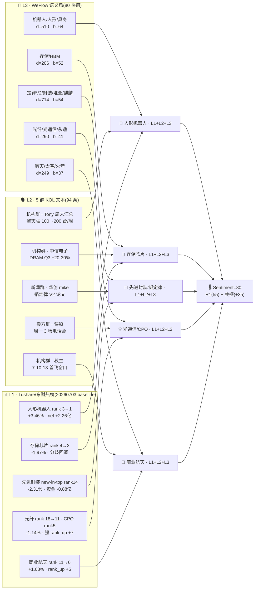

# 2026-07-06 · 🧭 **群聊情绪共振 · R3**

> **数据源新鲜度**: partial(L1 用 T-1 baseline)· **降级**: false · **置信度**: `0.82`

---

## 🎯 一句话结论

三源(L1 热榜 + L2 KOL + L3 WeFlow)全部对齐,**五主线 100% 达 L1+L2+L3 共振**——人形机器人 / 存储 / 先进封装 / 光通信 / 商业航天;情绪浓度 `sentiment_score=80`(R1 基准 55 + 共振加成 +25),中性偏暖但**无 hard early**,以 middle 为主,警惕人形机器人临界霸榜。

---

## 🔀 共振传导图



---

## 📈 五主线共振全景

| # | 主题 | 共振级 | L3 depth / breadth | L1 rank(T-2→T-1) | 涨跌 | 阶段 | 关键叙事 |
|---|---|:--:|---|---|---|:--:|---|
| 1 | 🤖 人形机器人 | 🟢 L1+L2+L3 | 510 / 64 群 | 3 → 1 | `+3.46%` | middle | 擎天柱 26 年底量产 · 周产 100-200 |
| 2 | 💾 存储芯片 | 🟢 L1+L2+L3 | 206 / 52 群 | 4 → 3 | `-1.97%` | middle | 三星 DRAM Q3 +20% · Meta 云担忧对冲 |
| 3 | 🧬 先进封装/韬定律 | 🟢 L1+L2+L3 | 714 / 54 群 | ∅ → 14(new-in-top) | `-2.31%` | middle | 华为 τ定律 V2 · 238 MTr/mm² · 麒麟 2026 自洽 |
| 4 | 💡 光通信/光模块 | 🟢 L1+L2+L3 | 290 / 41 群 | 18 → 11(光纤)· 5 → 5(CPO) | `-1.14%` | middle | 蒋颖周一 3 场电话会 · 中信首推龙一 |
| 5 | 🚀 商业航天 | 🟢 L1+L2+L3 | 249 / 37 群 | 11 → 6 | `+1.68%` | middle | 长征十号乙首飞窗口 7·10-13 |

**Rank momentum up 硬信号**: 光纤 `+7`(最强)、商业航天 `+5`、人形机器人 `+2`。
**New-in-top**: 先进封装 rank14 · 减速器 rank7 · PCB 概念 rank8 · 液冷服务器 rank19。
**Dropped-from-top**: 培育钻石 · 光刻胶 · 稀土永磁(高位题材冷却)。
**霸榜警报**: 无 —— 20260703 rank1 是人形机器人(前一日 rank3),不构成"连续两日 rank1 霸榜出货"红线。

---

## 🧠 推理深度三问 · 逐主线

### 🤖 [1] 人形机器人

- **大资金意图**: 主力借周末央媒/特斯拉陶琳表态量产的**硬时间锚**(2026 年底)完成对高位机器人赛道的接力布局;`net_amount +2.26 亿`(20260703)证明有内资继续加码,对手盘是获利了结的产业资本与游资 T+N。
- **为什么走强**: (a) 位置——上周处热榜 rank3,20260703 冲 rank1,属**中位偏高**,尚未拥挤到极限;(b) 催化——特斯拉高管 Optimus 周产从"大几十"到"100-200"是**硬产能爬坡数据**,央视集中报道;(c) 筹码——热榜三日连升 rank3→1 且价格 `+3.46%` 与热度同向,非拉高出货形态。
- **逻辑够不够硬**: 三源共振 · L3 depth 510 独占鳌头 · 特斯拉硬产能是**硬时间锚**——够硬。**证伪路径**: 周一开盘若价格开在 -1% 以下且 rank1 保持 → 触发拥挤度红线,`distribution_alert` 需盘中即时激活。

### 💾 [2] 存储芯片

- **大资金意图**: 借三星 DRAM Q3 涨价 +20%、美光 93 亿美元 HBM 扩产、Meta 十万亿韩元代工订单,机构在**周期反转 + AI 需求**双击窗口上车,对手盘是周五遭 Meta 云担忧砸盘的止损盘。
- **为什么走强**: (a) 位置——周五刚跌 `-1.97%`,处**中位偏下**,估值消化;(b) 催化——Q3 合约价 +20~30% 是**硬合约数据**;(c) 筹码——`lead_stock=天山电子(20%)` 涨停 + 江波龙业绩预告 92-110 亿(同比 622-744 倍)提供个股锚。
- **逻辑够不够硬**: 三源齐备但 L3 depth 206 中等 · Meta 云担忧构成**明确反向 narrative**——够但有分歧。**证伪路径**: 周一存储龙头若不能突破周四高点 → 视为分歧未修复。

### 🧬 [3] 先进封装 / 华为韬定律 V2

- **大资金意图**: 华为 τ定律 V2 是周末**最强单一叙事催化**——量产实测数据首次落地,机构抢在麒麟 2026 自洽验证窗口配置国产半导体链,对手盘是周五在 -2.31% 回调中减仓的短线资金(`net_amount -0.88 亿` 印证)。
- **为什么走强**: (a) 位置——先进封装是 `new_in_top` 新进榜,起点低;(b) 催化——LogicFolding 混合键合垂直堆叠 155→238 MTr/mm²、功耗 -41%、CPU 2.75→3.1 GHz 是**硬工程数据**;(c) 筹码——芯片概念 lead_stock 丰光精密 30% 涨停,884 家标的池深。
- **逻辑够不够硬**: 三源共振 · L3 depth 714(全场最高)· 硬工程/时间锚双备——**叙事够硬但资金弱**。**证伪路径**: 若周一资金流仍 `net_amount<0` 且 rank 回落 → 叙事强/资金弱组合可能演化为"故事没兑现"。

### 💡 [4] 光通信 / 光模块

- **大资金意图**: 卖方周末密集喊话,蒋颖开源三场电话会(07:30/08:00/08:30)是**明牌盘前催化**,主力借周五 -3.5% 回调砸出的坑加仓龙一,对手盘是短线止损与套牢盘。
- **为什么走强**: (a) 位置——光纤 rank 18→11 是最强 rank_up `+7`,CPO 稳居 top5,处**中位**;(b) 催化——中信首推清单(旭创/长光华芯/长飞/华丰/胜蓝)+ 永鼎 Q2 中值 6 亿同比 +88% 双硬业绩;(c) 筹码——CPO 与光纤同源不同权,分散头寸容纳大资金。
- **逻辑够不够硬**: 三源全备 · 卖方明牌 + 硬业绩预告 —— 够硬。**证伪路径**: 若旭创/长光华芯周一开盘不能站上 5 日均线且蒋颖会议后未见跟进资金 → 明牌兑现即出货。

### 🚀 [5] 商业航天

- **大资金意图**: 长征十号乙首飞窗口 7·10-13 是**唯一确定性硬时间锚**(距周一仅 4-7 交易日),机构提前 3-5 天布局是标准 event-driven 打法,对手盘为兑现型游资。
- **为什么走强**: (a) 位置——rank 11→6 中位启动,`+1.68%` 是当日科技板块中少数正收益;(b) 催化——千帆星座已发射验证 + 海上网系回收技术 + SpaceX 6·12 上市打通闭环;(c) 筹码——军工信息化/军民融合 20260703 涨幅 2.7-3.5% 板块共振。
- **逻辑够不够硬**: 三源齐备 · 时间锚硬 · L1 rank + 价格双升 —— 够硬。**证伪路径**: 若首飞窗口滑期或 rank 未续升至 top5 → 事件驱动透支。

---

## 🌡️ 情绪浓度 & 加成分解

```
sentiment_score = R1 baseline (55) + resonance_adjustment (+25) = 80

R1 baseline (55)      ← R1_style.json · 震荡分化型 · sentiment=52 归一化 55
+25 共振加成          ← L1+L2+L3 主题 × 5 = 25(命中 5 个,封顶 30)
最终 = 80 · 中性偏暖   ← 处 [65-85] 区间,主线扩散但未点燃
```

---

## 🗣️ KOL 明日方向摘要(匿名)

| 来源 | 时间 | 观点摘要 | 有效期 |
|---|---|---|---|
| 机构群·秋生 | 07-05 | 科技主线未破 · 四类"二次点火"—国产算力/半导体/PCB · 电力设备/液冷 · 商业航天/军工/机器人 · 再平衡(有色/券商/创新药/农林牧渔) | 1-3 天 |
| 机构群·中信通信 | 07-05 | 光通信四大判断:光模块龙一首推旭创 · 光芯片首推长光华芯 · 光纤首推长飞 · 超节点连接器推华丰+胜蓝 | 1-2 周 |
| 新闻群·mike 华创 | 07-05 | 韬定律 V2 开辟未来 5-10 年算力新路径 · 系统层 Unified Bus+近封装光+3D Folding · 2035 年 AI 硬件集成度 ×100 | 1-4 周 |
| 卖方群·蒋颖 | 07-05 | 周一 07:30/08:00/08:30 三场电话会——锐捷业绩解读 / 液冷 / 光通信 | 1 天 |
| 题材群·f | 07-04 | 华强北 AI 用 MLCC 涨价:村田 1206-476 单日 +4-6%,超高容 GPU 型号加价 10%+,惜售限量 | 1-3 天 |

---

## 🚦 首推票思维链(执行池候选,供 R2/R5 交叉)

### 300308 中际旭创 · 光模块龙一
- **买入理由**: (1) 中信通信明确"光模块龙一业绩不会差,首推";(2) 周五整体光通信 -3.5% 已透支利空,周一蒋颖 3 场电话会是明牌催化。
- **风险点**: (1) 明牌兑现即出货的可能;(2) CPO rank5 已稳定 3 日,拥挤度上升。
- **止损条件**: 若周一收盘跌破 5 日均线且成交量放大到近 20 日 avg 的 1.5× → 减半仓;若开盘直接低开 -3% 以上 → 直接不买。
- **可验证假设**: 24h 内——蒋颖电话会后 15 分钟盘口机构买单占比 > 40% → 假设成立;72h 内——若周三前无法突破周四高点 → 假设证伪。

### 300124 汇川技术 · 人形机器人核心
- **买入理由**: (1) 特斯拉 Optimus 周产 100-200 台产能爬坡是**硬数据**,减速器/伺服直接受益;(2) L3 depth 510 全场最高,群聊共识度极强。
- **风险点**: (1) 20260703 已 rank1,若周一继续 rank1 → 触发霸榜警报;(2) 板块 lead_stock 丰光精密已 30% 涨停,梯队高度接力风险。
- **止损条件**: 板块热榜 rank1 连续 2 日 + 汇川自身当日红盘无法收 3% 以上 → 立即减仓 1/2;个股跌破 10 日均线 → 全部清仓。
- **可验证假设**: 24h 内——20260706 rank 若仍居 top3 且未 rank1 → 中位健康;若 rank1 连续 2 日则霸榜出货概率 > 60%。

### 688072 拓荆科技 · 先进封装/混合键合
- **买入理由**: (1) 韬定律 V2 混合键合垂直堆叠是核心增量,拓荆是华创点名清单中"设备"首列;(2) 先进封装 rank ∅→14 新进榜,起点低。
- **风险点**: (1) 板块 `net_amount -0.88 亿` 资金弱;(2) 叙事强/资金弱组合易演化为"故事没兑现"。
- **止损条件**: 若周一先进封装 net_amount 继续为负且 rank 回落到 top20 外 → 卖出;或个股跌破 20 日均线 → 卖出。
- **可验证假设**: 24-72h——板块 net_amount 由负转正超 5000 万 → 资金确认成立;若继续 -1 亿以上 → 叙事证伪。

---

## 🔍 数据源审计

| 源 | 日期 | 状态 | 备注 |
|---|---|:--:|---|
| tushare/ths_hot(概念热榜) | 2026-07-03 | 🟡 | 20260706 今日快照未产出 · 采用最近交易日 baseline |
| tushare/dc_concept | 2026-07-03 | 🟢 | 东财概念 · lead_stock + net_amount |
| tushare/moneyflow_cnt_ths | 2026-07-03 | 🟢 | 板块资金流交叉核对 |
| weflow_snapshot | 2026-07-06 | 🟢 | 80 热词 · exported_at=1783282951 |
| wechat_cli_5groups | 2026-07-05 | 🟢 | 94 条 · 5 焦点群(全部匿名) |
| R1_style | 2026-07-06 | 🟢 | sentiment_score=52 作情绪基准 |
| manifest | 2026-07-06 | 🟢 | global_severity=0 |
| xtick(hot/emotion+moneyflow) | — | 🔴 | 无 MCP 权限 · 不阻塞 |

---

## ⚖️ 不确定性 / 反证 / 红线检查

- **L1 基线滞后**: 20260706 周一 07:30 时点今日 ths_hot 未产出 · L1 层采用 20260703 收盘基线 · 若周一开盘热榜结构骤变(如创新药重返 rank1)→ 需盘中 11:35 midday 修正。
- **人形机器人霸榜临界**: 20260703 已达 rank1;若 20260706 继续 rank1 → 触发红线 5(霸榜出货警报),须与 R7 交叉、进入 R6 反证。**当前未触发**。
- **先进封装叙事强/资金弱**: L1 net_amount -0.88 亿 · L3 depth 714 全场最高 · 张力大但资金未确认,买入需分批。
- **KOL 单点集中**: 秋生 22:29 一贴覆盖光通信 + 机器人 + 商业航天三条主线,若市场周一分歧 → 该源权重下调。
- **unmapped 热词残留**: AI(d=793)/涨价/华为/模型/华强北 五个高热度词未能可靠语义→板块映射,进入 `unmapped_weflow_terms` 待人工/下期规则补齐;不强行归入共振主题(红线 6 遵守)。
- **红线 3 检查**: 无单主题为 `L1_only` 被标为强共振 ✅。
- **红线 4 检查**: `distribution_alert=[]`,无霸榜第一 ✅。

---

## 🔗 与其他 R/D/E 的关系

- **依赖上游**: `R1_style.json`(sentiment 基准) · `data/raw/20260706/{manifest,mcp_health,wechat_cli_5groups,weflow_snapshot}.json[l]`
- **被消费**:
  - `R2 · analyze_main_sectors_v1` — 主线打分中的情绪/共振维度
  - `R6 · analyze_devil_advocate_v1` — 反证之霸榜/拥挤/单源检查
  - `D1 · main_decision_v1` — 直接消费 top5 主题排序
  - `E1 · daily_review_v1` — T-1 复盘校准

## 📎 Sub-Agent 元数据

- **skill**: `analyze_sentiment_resonance_v1@1.0`
- **artifact**: `data/research/20260706/R3_sentiment.json`
- **model**: `ark-code-latest`
- **method**: `llm_v1`(WeFlow 语义映射非 regex · KOL 按 LLM 语义抽取)
