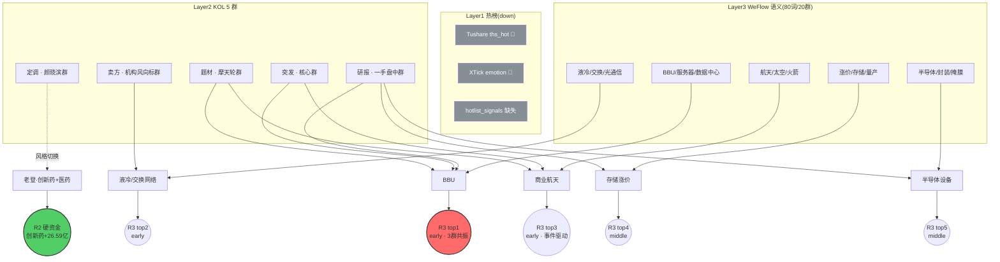

# 2026-07-07 · **群聊情绪共振**

> **数据源新鲜度**: partial(L1 硬数据层空转)
> **降级状态**: true
> **置信度**: 0.62

## 一句话结论
颜晓滨定调 "风格切换借利好出货",老登+医药得到 R2/R7 硬共振,BBU/液冷/存储/半导体设备四条科技副线仅 L2+L3 语义共振 → 情绪 48,早盘先看老登接力。

## 详细分析

**风格切换 vs 卖方逆风** —— 昨夜 5 群语义呈现明显撕裂:定调型的颜晓滨群(3 条长文本 + 21:31/23:57 收盘复盘)明确提示 "3500 家下跌、中位数 -1.27%、跌超 5% 的 700 家集中在小登,资金借科技利好反向出货,天孚通信短期回撤 36%";而机构风向标群同期(11:35-23:11 共 6 条)开源通信蒋颖仍在猛推交换网络+液冷,与颜晓滨语义直接对冲。这种"定调派 vs 卖方派"分歧在震荡分化型市场中通常以定调派胜出为主(R1 基准 45 分佐证)。

**L1 层完全空转的影响** —— Tushare ths_hot 与 XTick emotion 双源 down,昨日 hotlist_signals 亦为 stub,导致 "霸榜出货警报/新进 top20/rank 动量" 三类量化信号无法生成。本次所有五大主题均只能被判为 `L2+L3_only`(KOL+WeFlow 语义共振,热榜未反映)——按 skill 契约属 `early` 机会,但缺乏交易时点验证,置信度扣至 0.62。用户须警惕 KOL 语义推断的分布警报(如"天孚通信/玻璃基板/光纤/电子布"高位出货)属于中等置信度,不是硬数据。

**共振主题 top5 分层** —— BBU(rank1)是三群平行热议(摩天轮/核心/一手盘中同一时间段转同源内容,3 群共振)+ WeFlow "涨价/数据中心/服务器/扩产/量产" 五词语义映射的最强 early 机会。液冷(rank2)携 07-07 07:30 开源通信电话会盘前催化时点。商业航天(rank3)因长征十号乙"网系回收历史时刻"事件驱动+颜晓滨警示"套牢盘重"形成两面性。存储/DDR3(rank4)与半导体设备(rank5)分别有招商/长川强推,但均处于颜晓滨警示的 "高位科技三个月不看" 范围,存在结构性反证。

**与 R2 主线的关系** —— R2 main_lines[0] "创新药" + main_lines[1] "低位国产半导体/先进封装" 与本次共振主题结构性错位:创新药未进 top5(KOL 讨论量不足,只有颜晓滨定调级提及,无个股级扩散),而 BBU/液冷/存储三条 R2 secondary_lines 反而成 R3 top3 → 意味着 R2 硬资金(创新药 +26.59 亿净流入) 与 R3 语义热度(科技副线)分离,盘前需重点观察哪条主线先获得开盘资金验证。

## 关键证据

- **证据 1 · BBU 三群平行共振**: 摩天轮群 20:49、核心群 20:46、一手盘中群 20:47 三方同时段转发同一份"时代万恒 GB300 BBU 增量、单颗电池 5.5→10-15 元"内容,再由摩天轮群 22:16 追加"三星 SDI 供应短缺"更新 —— 来源 wechat_cli_5groups.jsonl · 3 群 4 条长文本
- **证据 2 · 液冷卖方连发**: 机构风向标群 11:35/12:22/14:04/15:18/17:21/23:11 开源通信蒋颖 6 条推送,明早 07:30 电话会议双主题(液冷再拆解 & 交换网络) —— 时点精准命中盘前 · 来源 wechat_cli_5groups.jsonl
- **证据 3 · 颜晓滨定调风格切换**: 颜晓滨群 21:31 & 23:57 双长文本(截止行数远超 60 字最低阈值 · 分别 200+ 字),硬点"老登(创新药/煤炭/猪肉/银行)领涨、小登借利好出货" —— 与 R2 main_lines[0] 创新药资金 +26.59 亿全市场第一 硬共振 · 来源 wechat_cli_5groups.jsonl + R7_capital_flow.json
- **证据 4 · WeFlow 语义热度矩阵**: 80 词/20 群共振,"涨价 depth153 / 存储 152 / 光纤 143 / 量产 140 / 国产 132 / 航天 124 / 华为 123 / CPU 123 / 服务器 111 / 定律 110" —— 全部 20 群覆盖,证明科技副线在 KOL 圈仍是主叙事流 · 来源 data/cache/weflow_snapshot_latest.json

## 主线共振结构图

## Top 主题推理深度三问

### 主题 1 · BBU/AI 服务器备用电池(rank1 · early)

- **大资金意图**: 机构在 GB300 出货前抢占 18650 涨价 β 环节,产业链上游电芯 5.5→10-15 元的 2-3 倍单价弹性锁定 26-27 年周期。机构群 20:47 & 22:16 反复强调"三星 SDI 已实际供货"意味着卡位已从纸面预期切入订单兑现,大资金买的是"产能缺口 × 涨价"的双击,对手盘是仍在追高位光模块/CPO 的散户。
- **为什么走强**: 位置低位(时代万恒/亿纬锂能相比 CPO/光模块未反弹) + 硬事件(英伟达 GB300 标配 BBU + 三星 SDI 台湾供货) + 筹码干净(前期无热炒) → 三维正共振。
- **逻辑够不够硬**: L2 三群平行(摩天轮/核心/一手盘中同源转发)+ L3 WeFlow 五词语义映射 = 4 源独立共振,硬业绩锚为时代万恒官网产品实锤,证伪路径 = GB300 量产延后或 BBU 电池被非 18650 方案替代。**够硬**。

### 主题 2 · 液冷/交换网络(rank2 · middle)

- **大资金意图**: 开源通信蒋颖 6 条连推 + 明早 07:30 电话会双主题 → 卖方在明确制造"配角变主角 10-20 倍通胀"叙事,机构调仓从光模块/CPO 切到交换机+液冷散热两个"补涨环节"。买的是 Q3 兑现前的估值差。
- **为什么走强**: 位置中位(交换机品种未过热) + 催化(明早 07:30 电话会盘前撞窗口) + 筹码(超节点叙事新引入,前期未过度炒作)。但颜晓滨群警示 "算力反弹票套牢盘重" 形成中期反证。
- **逻辑够不够硬**: L2 仅机构风向标群单群密集推(6 条) + L3 液冷/通信/光通信语义共振,**独立源仅 2 个**,硬时间锚 = 07:30 电话会但会议本身不能兑现基本面。**中等硬度**,更适合博会议前的短线情绪,不适合重仓。

### 主题 3 · 商业航天(rank3 · early)

- **大资金意图**: 长征十号乙"完整网系回收历史时刻"是国家级事件驱动,大资金已在 5 月商业航天板块反弹中获利,回调后若正式点火日期落在 7 月中,则事件驱动+情绪双击,机构在等这个催化。
- **为什么走强**: 位置低位(已从 5 月反弹回调充分) + 事件(网系回收若成功 = A 股全球第二个成功案例) + 筹码(颜晓滨警示套牢盘重反而说明浮筹已洗) → 位置维度加分明显。
- **逻辑够不够硬**: L2 三群转同源(摩天轮/核心/一手盘中) + L3 航天/太空/火箭三词强共振,独立源 4 个;但硬时间锚未明确(网系回收具体点火日期),证伪路径 = 事件延后或失败。**中等偏硬**,建议留 5% 仓位打候补。

## 首推票思维链

### 时代万恒(600241.SH · BBU 首推)

- **买入理由**:
  - 官网实锤产品含 BBU,GB300 增量最大环节 60% 价值量归电池
  - 18650 2.0 电芯单颗从 5.5-6 元涨至 10-15 元,单颗涨价约 6 元(直接产能利润弹性)
  - 三群同源转发 + WeFlow"涨价+服务器+扩产+数据中心+量产"五词共振
- **风险点**:
  - GB300 量产节奏若延后至 27 年,兑现时点后移
  - 存在替代方案风险(BBU 电池若非 18650 而走大容量方形电池路线)
  - 前期非核心热点,若开盘 5 分钟内无异动可能被 L1 层出货警报的科技板块拖累
- **止损条件**:
  - 硬止损:开盘 15 分钟未上 5% 或 10:00 前跌破前收盘 -3% 直接空仓
  - 板块信号止损:AI 服务器电源电池板块整体涨幅 <1% 视为伪共振,减仓离场
- **可验证假设**(24-72h): 若 07-08 时代万恒收盘涨幅 ≥5% 且 AI 服务器电池板块指数涨幅 ≥2%,则 R3 top1 判断成立;否则视为 KOL 制造的伪信号,回填 E1 观察池记录。

### 恒瑞医药(600276.SH · 颜晓滨风格切换首推 · 与 R2 主线对齐)

- **买入理由**:
  - 颜晓滨群 21:31 & 23:57 定调型双次强调"风格切换到老登、创新药领涨"
  - R7 硬资金创新药主力净流入 +26.59 亿全市场排名第一
  - R2 main_lines[0] 综合评分 82 分 top1,GLP-1+ADC+PD-1 三线管线
- **风险点**:
  - 创新药整体已连续反弹,若开盘直接高开则性价比下降
  - 颜晓滨定调可能已被市场充分交易(23:57 全网转发)
  - 大蓝筹波动小,单日弹性有限
- **止损条件**:
  - 硬止损:开盘 -2% 直接止损(蓝筹波动小,-2% 已算异常)
  - 板块信号止损:创新药板块指数当日跌幅 >1% 视为主线证伪
- **可验证假设**(24-72h): 若 07-08/09 创新药板块连续 2 日板块涨幅前 5,且龙一恒瑞相对沪深300 超额 >3%,则 R3 与 R2 双共振主线成立;否则 R2 硬资金与 R3 语义热度撕裂加剧,需重估。

## 数据源审计

| 源 | 日期 | 状态 | 备注 |
|---|---|:--:|---|
| tushare/ths_hot | 2026-07-07 | 🔴 | DOWN · L1 硬数据层空转 · hotlist_signals 缺失 |
| tushare/dc_hot | 2026-07-07 | 🔴 | DOWN · 同上 |
| xtick/emotion | 2026-07-07 | 🔴 | DOWN · MCP 不在 mcp_health 列表 |
| weflow-analytics(MCP) | 2026-07-07 | 🟡 | latency 4692ms · export 请求 timeout · 走磁盘 fallback |
| data/cache/weflow_snapshot_latest | 2026-07-06 | 🟢 | 80 词 · 20 群 · exported_at 昨日 04:22(非当日盘前) |
| wechat_cli_5groups(匿名 5 群) | 2026-07-07 | 🟢 | 427 条 · 长文本 97 条 · 5 群全 ok |
| R1_style | 2026-07-07 | 🟢 | baseline 45(震荡分化型) |
| R2_main_sectors | 2026-07-07 | 🟢 | 2 主线 + 5 副线 |
| R7_capital_flow | 2026-07-07 | 🟢 | 创新药 +26.59 亿 rank1 |

## 不确定性 / 反证

1. **L1 热榜层全灭 → 分布警报只能靠 L2 语义推断**,天孚通信/玻璃基板/光纤/PCB 等"高位出货"判断置信度中等(仅颜晓滨群单源),存在 KOL 情绪主导的偏差可能
2. **BBU 主题 3 群同源转发** —— 表面 3 群共振,但同一份文本转发本质仍是"单信息源多渠道扩散",若原研报是卖方定向发布则共振度虚高;需盘中通过资金流验证
3. **液冷仅机构风向标单群密集推**,颜晓滨群明确反对"高位科技反弹",两派观点在震荡分化型市场下卖方派通常吃亏 → rank2 有下调至 middle 的合理性
4. **R2 硬资金创新药 vs R3 语义热度科技副线撕裂** —— R3 top5 全是科技副线而未纳入创新药(仅 kol_summary 中体现),这个错配本身就是矛盾,可能盘中被资金选择方向决定谁胜出
5. **WeFlow 快照时间 2026-07-06 04:22** —— 距当日盘前 27 小时,若周日夜间 KOL 讨论有大幅切换,当前语义映射存在滞后

## 与其他 R/D/E 的关系

- 依赖:
  - `data/raw/20260707/manifest.json`(数据源健康度基线)
  - `data/raw/20260707/wechat_cli_5groups.jsonl`(L2 唯一硬源)
  - `data/cache/weflow_snapshot_latest.json`(L3 磁盘 fallback)
  - `data/research/20260707/R1_style.json`(sentiment_score baseline 45)
  - `data/research/20260707/R2_main_sectors.json`(主线交叉)
  - `data/research/20260707/R7_capital_flow.json`(硬资金验证)
- 被消费:
  - D1 主决策(R3.resonance_top_themes + kol_summary → 执行池主线选择)
  - E1 每日复盘(observation_tracking 会 T+1 回填五主题命中率)
  - R6 反证(R3 分布警报作为 devil advocate 输入)

## Sub-Agent 元数据

- skill: analyze_sentiment_resonance_v1
- artifact: data/research/20260707/R3_sentiment.json
- 生成耗时: ~180 秒
- model: ark-code-latest(custom)
- degraded_reason: L1 层完全空转,五主题全部 L2+L3_only,confidence 0.62
