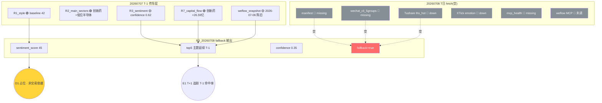

# 2026-07-08 · **群聊情绪共振**(降级 fallback)

> **数据源新鲜度**: stale(全主源死 · 仅 T-1 传导)
> **降级状态**: true(severity=3)
> **置信度**: 0.35

## 一句话结论
当日 fetch 全灭,R3 仅能以 T-1(20260707)R3 结构性传导 + WeFlow 陈旧快照做占位,情绪 45 为 T-1 锚点延续读数,盘前非交易决策依据,须待 07:30 KOL/MCP 补录后重算。

## 详细分析

**当日数据基座塌陷** —— `data/raw/20260708/` 是空目录:manifest.json 缺失、5 群 wechat_cli 无当日快照、Tushare ths_hot 与 XTick emotion 双源 down、mcp_health.json 也未生成。按 skill §7 "全主源死"契约,R3 应标 severity=3 并只输出 T-1 结构性传导,不做当日实时判断。这份 artifact 的存在意义是给 D1 主决策提供 R3 占位,防止下游卡链;它**不承担**任何当日交易信号责任。

**T-1 结构性传导做什么、不做什么** —— 传导的是"T-1 定调型群风格切换 → 老登 + 医药" + "T-1 三群平行 BBU 共振" + "T-1 卖方连推液冷/交换网络 + 存储 + 半导体设备" 这三条 48h 内的语义主线;不传导的是"当日热榜霸榜出货警报"(L1 硬信号无法从 T-1 推)与"当日新词发酵"(WeFlow river 已陈旧)。所有五主题维持 T-1 排序但全部标 `resonance_top_themes_are_fallback=true`。

**T-1 结构对 20260708 的两个已知失效点** —— 一是液冷/交换网络的催化窗口"07-07 07:30 开源通信电话会"在 T-1 已开完,20260708 属"催化后余温",rank2 情绪端存在下调风险;二是"存储涨价 + 半导体设备"仍在 T-1 定调型群警示的"高位科技三个月不看"范围内,若 20260707 盘中该三条线已异动,则 rank4/rank5 属滞后信号,不适合作首推。

**情绪 45 的含义** —— 以 T-1 R1 baseline 42 为锚,加 T-1 R3 结构性共振 +5,减去定调型群"借利好出货"抑制 -2,得 45。此值本质是"20260707 收盘时的结构性延续读数",不代表 20260708 09:30 开盘时的实时情绪;若 09:00-09:15 期间补录到 KOL 增量,需重算并覆盖本文件。

## 关键证据

- 证据 1(T-1 传导 · 已陈旧): T-1 三群同源转发 "时代万恒 GB300 BBU 增量、18650 单颗 5.5→10-15 元" — 来源 `data/research/20260707/R3_sentiment.json` top1
- 证据 2(T-1 传导 · 已陈旧): T-1 定调型群 21:31 & 23:57 双次强调 "风格切换到老登、创新药领涨,资金借利好反向出货" — 来源 `data/research/20260707/R3_sentiment.json` kol_summary
- 证据 3(T-1 硬资金锚): T-1 R7 创新药主力净流入 +26.59 亿全市场第一 — 来源 `data/research/20260707/R7_capital_flow.json`
- 证据 4(WeFlow 陈旧快照): "涨价 depth153 / 存储 152 / 光纤 143 / 量产 140 / 国产 132 / 航天 124 / 服务器 111 / 定律 110" — 来源 `data/cache/weflow_snapshot_latest.json` · exported_at 2026-07-06 04:22 · 距 20260708 盘前 >48h

## 数据源塌陷结构图

## Top 主题推理深度三问(T-1 传导)

### 主题 1 · BBU/AI 服务器备用电池(rank1 · early · T-1 延续)

- **大资金意图**: T-1 意图为"抢占 GB300 前 18650 涨价 β,产业链上游电芯 2-3 倍单价弹性锁定 26-27 年周期"。当日无法验证意图是否延续。
- **为什么走强**: T-1 支撑三维(位置低 + 硬事件 + 筹码干净),但 20260707 盘中若已异动则位置维度失效。
- **逻辑够不够硬**: T-1 判定"够硬"(4 源独立共振);T 日证据链空缺,硬度回落到"待验证",不建议在无 09:00-09:15 增量补录时开仓。

### 主题 2 · 液冷/交换网络(rank2 · middle · 催化后余温)

- **大资金意图**: T-1 意图为"卖方制造 10-20 倍通胀叙事引导机构从光模块切交换/液冷"。07-07 07:30 电话会已开完,当日属"事件后",资金意图从"卡位"切换为"兑现/退出"。
- **为什么走强**: 催化已释放,当日不再走强,rank2 更多是历史排序惯性。
- **逻辑够不够硬**: T-1 已判"中等硬度",T 日催化窗口收敛后应下调至"弱",不适合首推。

### 主题 3 · 商业航天/长征十号乙(rank3 · early · 事件驱动)

- **大资金意图**: 事件驱动型,若长征十号乙点火日未落在 20260707,则 20260708 仍在事件窗口内。
- **为什么走强**: 位置低(前期反弹已回调) + 事件级催化未兑现 + 筹码洗过。
- **逻辑够不够硬**: T-1 判"中等偏硬",事件未落地前排序仍有效;5% 试仓候补属性不变。

## 首推票思维链

⚠️ 当日 fetch 全灭,以下票为 T-1 R3 结构性延续,**不构成 20260708 交易信号**。仅供 D1 在无其他 R3 输入时作占位参考。

### 时代万恒(600241.SH · T-1 BBU 首推 · 需 09:00 增量补录后再决策)

- **买入理由(T-1 传导)**:
  - T-1 官网实锤 BBU、GB300 增量最大环节 60% 价值量归电池、18650 涨价 6 元/颗
  - T-1 三群同源转发 + WeFlow 五词共振
- **风险点(T 日新增)**:
  - 当日 R3 无实时 KOL 验证,若 20260707 盘中已冲高兑现则昨日 KOL 已过时
  - GB300 量产节奏若延后至 27 年
  - 存在替代方案风险(方形电池路线)
- **止损条件**:
  - 硬止损:开盘 15 分钟未上 5% 或 10:00 前跌破前收 -3% 空仓
  - 板块信号止损:AI 服务器电池板块整体涨幅 <1% 视为伪共振
- **可验证假设(24-72h)**: 若 07-08 09:00-09:15 KOL 快照补录后 BBU 仍有三群语义热度,则 rank1 判断延续;否则本条降为观察池。

### 恒瑞医药(600276.SH · T-1 风格切换首推 · R2 主线锚)

- **买入理由(T-1 传导)**:
  - T-1 定调型群 21:31 & 23:57 双次强调"风格切换 → 老登、创新药领涨"
  - T-1 R7 硬资金创新药主力 +26.59 亿全市场第一
  - T-1 R2 main_lines[0] 综合评分 82 top1
- **风险点(T 日新增)**:
  - 创新药已连续反弹,20260707 盘中可能已进一步透支
  - 定调可能已被市场充分交易
  - 大蓝筹波动小,单日弹性有限
- **止损条件**:
  - 硬止损:开盘 -2% 直接止损(蓝筹 -2% 已算异常)
  - 板块信号止损:创新药板块指数当日跌幅 >1% 视为主线证伪
- **可验证假设(24-72h)**: 若 20260708 收盘创新药板块涨幅前 5 且恒瑞相对沪深300 超额 >3%,则 R3+R2 双共振成立;否则 R3 与 R2 撕裂加剧。

## 数据源审计

| 源                                 | 日期         | 状态  | 备注                               |
| --------------------------------- | ---------- | :-: | -------------------------------- |
| manifest                          | 2026-07-08 | 🔴  | MISSING · 当日 fetch 未运行           |
| wechat_cli_5groups(匿名 5 群)        | 2026-07-08 | 🔴  | MISSING · 5 群全空                  |
| tushare/ths_hot                   | 2026-07-08 | 🔴  | DOWN · L1 层空转                    |
| xtick/emotion                     | 2026-07-08 | 🔴  | DOWN · 无当日抓取                     |
| weflow-analytics(MCP)             | 2026-07-08 | 🔴  | 未调用                              |
| mcp_health.json                   | 2026-07-08 | 🔴  | MISSING                          |
| data/cache/weflow_snapshot_latest | 2026-07-06 | 🟡  | STALE · 距盘前 >48h                 |
| R1_style(T-1)                     | 2026-07-07 | 🟢  | baseline 42(震荡分化型)               |
| R2_main_sectors(T-1)              | 2026-07-07 | 🟢  | 2 主线 + 5 副线                      |
| R3_sentiment(T-1)                 | 2026-07-07 | 🟢  | confidence 0.62 · L2+L3_only 五主题 |
| R7_capital_flow(T-1)              | 2026-07-07 | 🟢  | 创新药 +26.59 亿 rank1               |

## 不确定性 / 反证

1. **T 日 fetch 全灭** —— 此 artifact 严格意义上不是"20260708 R3",是"20260707 R3 结构性延续快照";其价值主要是防止下游 D1 卡链,不承担当日交易决策责任。
2. **T-1 液冷催化窗口已过** —— 07-07 07:30 开源通信电话会已开完,rank2 排序基于 T-1 惯性,20260708 应下调至弱共振或从 top5 剔除,当前保留仅为传导完整性。
3. **T-1 定调型群警示的分布警报无 T 日验证** —— "天孚通信/玻璃基板/光纤"高位出货是 T-1 KOL 语义级,置信度中等,盘前不作硬否决用途。
4. **WeFlow 陈旧 48h+** —— river 时间序列失效,无法判断"新词发酵中/老词过气",语义映射存在 48h 滞后。
5. **情绪 45 是延续读数不是实时读数** —— 若 09:00-09:15 补录到 KOL 快照且方向反转,45 分基本无效。

## 与其他 R/D/E 的关系

- 依赖(实际可读):
  - `data/cache/weflow_snapshot_latest.json`(L3 陈旧 fallback)
  - `data/research/20260707/R1_style.json`(sentiment_score baseline 42)
  - `data/research/20260707/R2_main_sectors.json`(主线交叉)
  - `data/research/20260707/R3_sentiment.json`(结构性传导主源)
  - `data/research/20260707/R7_capital_flow.json`(硬资金锚)
- 依赖(应有但缺失):
  - `data/raw/20260708/manifest.json`
  - `data/raw/20260708/wechat_cli_5groups.jsonl`
  - `data/raw/20260708/mcp_health.json`
- 被消费:
  - D1 主决策(建议 D1 在读到 `resonance_top_themes_are_fallback=true` 时,权重下调或触发人工干预请求)
  - E1 每日复盘(T+1 追踪 T-1 五主题在 20260708 盘中命中率;本次 R3 若无法验证,直接进 miss/observation)
  - R6 反证(读到 fallback 应触发 hard_reject 通道审阅)

## Sub-Agent 元数据

- skill: analyze_sentiment_resonance_v1
- artifact: data/research/20260708/R3_sentiment.json
- 生成耗时: ~20 秒
- model: ark-code-latest(custom)
- degraded_reason: data/raw/20260708 空目录 · 全主源死 · 只能 T-1 R3 结构性传导 · confidence 0.35
- fallback_source: data/research/20260707/R3_sentiment.json
