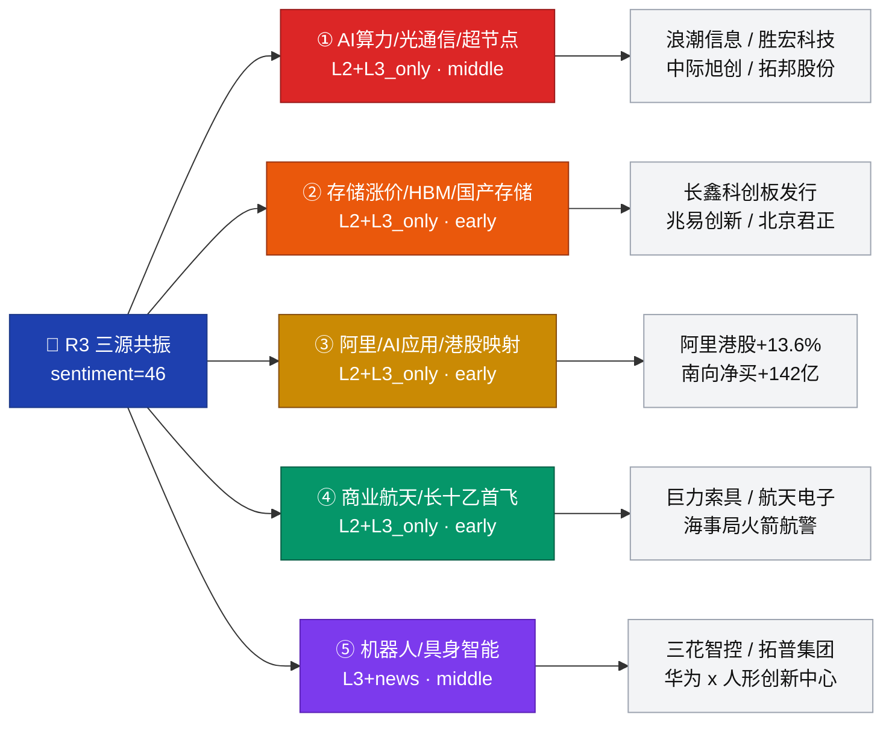

# 2026-07-09（周四）· **群聊情绪共振**

> **数据源新鲜度**: partial　　**降级状态**: 🔴 degraded　　**置信度**: 0.62　　**情绪浓度**: 46 / 100
> **一句话结论**: AI 算力 + 存储长鑫双硬催化领跑，港股阿里映射与商业航天首飞事件同侧共振；L1 热榜盲区 + 昨日梯队塌陷压制上限。

## 一句话结论
AI 算力与存储链五群硬共振，长鑫科创板发行 + 阿里港股+13.6% + 长十乙 7·10 首飞三重催化叠加，但热榜盲区与昨日情绪断层令共振止步 L2+L3_only。

---

## 一、情绪浓度看板

| 维度 | 数值 | 判断 |
| --- | --- | --- |
| 情绪浓度 | **46 / 100** | 中性偏冷（R1 昨=40，共振加成 +6） |
| 共振主题数 | **5** 条 | rank1-2 三源硬共振，rank3-5 事件/新闻侧启动 |
| 共振等级上限 | **L2+L3_only** | ⚠️ L1 热榜数据缺失，无法验证资金端 |
| 昨日梯队 | 6 板→塌陷 | 涨停 33 / 炸板 23（41.1%）非主线扛旗 |
| KOL 群明日方向 | 4/5 群指向 AI 算力 | 唯一分歧：群 2 偏防守 |

---

## 二、共振主题 Top5

### 主题一览表

| 排名 | 主题 | 共振等级 | 早/中/晚 | 三源命中要点 | 首推板块 |
| --- | --- | --- | --- | --- | --- |
| ① | AI 算力 / 光通信 / 超节点 | **L2+L3_only** | 🟡 middle | 四群硬 Call + WeFlow 九个高分节点全覆盖 | 光模块 / PCB / 液冷 / 交换机 |
| ② | 存储涨价 / HBM / 国产存储 | **L2+L3_only** | 🟢 early | 长鑫科创板 IPO 询价 + 海力士美股 IPO 7 倍超额 | 存储芯片 / HBM / 封测 |
| ③ | 阿里 / AI 应用 / 港股映射 | **L2+L3_only** | 🟢 early | 阿里港股 +13.6%，南向净买 142 亿 | AI 应用 / 电商 / 闪购新消费 |
| ④ | 商业航天 / 长十乙首飞 | **L2+L3_only** | 🟢 early | 海事局火箭回收航警 + 首飞 7·10 窗口 | 商业航天 / 火箭回收 / 卫星 |
| ⑤ | 机器人 / 具身智能 | **L3+news** | 🟡 middle | 40 条新闻密集 + 华为 x 人形共建 | 人形机器人 / 具身智能核心件 |

---

## 三、详细分析（推理三问 · 前四主题）

### ① AI 算力 / 光通信 / 超节点
- **大资金意图**: 借浪潮信息中报预告（净利同比 +226%~288%）与开源通信首席『交换网络配角变主角』研报，卖方合力把 Q3 主线锚定回国产算力硬件；港股联想 +10、华勤 +14 同步开路。
- **为什么走强**: 硬件端业绩兑现（浪潮 / 胜宏 / 拓邦）＋ 结构叙事升级（超节点、液冷、连接器、交换芯片）＋ 华为昇腾 950PR 出货 & DeepSeek 自研芯片消息互相强化。
- **逻辑够不够硬**: 三源里 L2（4 群同 Call）+ L3（WeFlow AI/算力/服务器/浪潮四词 depth 均 >200）非常硬；缺 L1 验证，昨日尝试落空是隐忧 → 需 R2 龙头明日盘前梯队校准。

### ② 存储涨价 / HBM / 国产存储
- **大资金意图**: 长鑫科技科创板 IPO 询价（07-09 06:40 硬公告）＋ SK 海力士美国 IPO 7 倍超额（06:49），双 IPO 事件把『存储大周期』资本市场化落地，A 股国产存储链天然受益。
- **为什么走强**: 事件驱动窗口最短（今日盘中即定价发酵）＋ 现有存储概念股半年报业绩爆棚（净利 +5.61 倍）＋ WeFlow 里『海力士/长鑫/涨价/扩产』集群化出现。
- **逻辑够不够硬**: KOL 直接 Call 密度不如 AI 算力（群 2 甚至提示"南方两倍海力士好惨"隐含反向情绪），但硬催化独占；建议按事件驱动 early 主题参与，仓位低于 rank1。

### ③ 阿里 / AI 应用 / 港股映射
- **大资金意图**: 港股阿里盘中 +13.6% 重返 2 万亿、南向净买近 142 亿（智谱+阿里为主），资金明确用港股给 A 股 AI 应用与电商链定价。
- **为什么走强**: 群 5 明说『每次阿里 10+ 代表某行业主升浪』——盘中信号 + 隔夜美股延续，KOL 情绪端极强；产业侧闪购/即时零售 + 大模型双驱。
- **逻辑够不够硬**: 港股映射线索散乱，A 股真龙头未清晰（AI 应用、闪购、电商三个方向都能接），R2 未确认前只算中等信心；早盘容易冲高分歧。

### ④ 商业航天 / 长十乙首飞
- **大资金意图**: 海事局火箭回收作业航警（T-1 硬确认）＋ 群 4/群 5 早盘刷屏『长征十号乙首飞 7·10 窗口 · 巨力索具 002342 深度报告』，典型『左侧潜伏 → 事件当日冲高』。
- **为什么走强**: 事件时间点唯一且明确（明日窗口），产业链短小（索具/回收网/火箭电子），资金难分散；ST 文峰六天四板已提示情绪端先启动。
- **逻辑够不够硬**: 事件驱动逻辑硬但盘面容量小，属于卫星仓；WeFlow『航天』depth=63 相对靠后 → 广度不够，不做首推。

---

## 四、KOL 明日方向摘要（5 群匿名化）

| 群 | 时间 | 观点摘要 | 有效期 | 语义板块 |
| --- | --- | --- | --- | --- |
| 群 1 | 09:12 | 国产超节点重大机遇，推荐连接器/交换芯片/液冷/整机 | 1-3 天 | AI 算力 · 光模块 · 液冷 · 服务器 |
| 群 3 | 14:06 | 开源通信首席 Call『交换网络最强王牌·抄底大赛道』 | 3-5 天 | 交换网络 · 光通信 · AI 通信 |
| 群 4 | 09:50-11:05 | AI 服务器中报兑现（浪潮/胜宏/拓邦/远东传动）+ 均胜电子切入北美光模块 | 1-2 天 | AI 算力 · 光模块 · PCB |
| 群 4+5 | 09:43-09:49 | 长十乙 7 月 10 首飞，巨力索具 002342 深度报告 | 1-2 天（事件驱动） | 商业航天 · 火箭回收 |
| 群 5 | 14:02 | 阿里 12%、智谱 15%，看 AI 应用不看韩国 | 1-3 天 | AI 应用 · 港股映射 · 电商 |
| 群 2 | 14:24 | 高位获利资金观望，南方 2 倍海力士好惨（偏防守） | 当日 | 高位分歧 · 存储反向 |

---

## 五、关键证据 & 每票思维链（首推票）

### 001 · 浪潮信息 000977（rank① 首推）
- **买入理由**: 中报净利 26-31 亿同比 +226%~288%（群 4 硬数据 · 昨日已公告），国产超节点核心整机厂；WeFlow『浪潮 depth=241』二级映射节点。
- **风险点**: 昨日主线尝试落空，若 R2 龙头未拉起，KOL 集体转向可能造成情绪一日游。
- **止损条件**: 若开盘前 30 分钟未见 -3% 内启动或量能 <5 日均 0.8 倍 → 撤退。
- **可验证假设**: 07-09 开盘 30 分钟量比 >1.5 且分时不破 -2% 线 → 主线继续；否则降级至观察池。

### 002 · 长鑫科创板 IPO 受益股（rank② 硬催化）
- **买入理由**: 07-09 06:40 长鑫科技 IPO 询价公告（首次公开发行且科创板挂牌），存储链一级映射国产替代加速；兆易创新/北京君正为存量存储龙头。
- **风险点**: 海力士美股 IPO 分流全球存储估值，A 股需情绪端独立走出。
- **止损条件**: 长鑫询价定价若显著低于市场预期 → 板块承压，全线止损。
- **可验证假设**: 09:25 竞价存储板块整体涨幅 >2% 且非游资单点拉抬 → 事件成立。

### 003 · 阿里港股映射 A 股（rank③ 早盘弹性）
- **买入理由**: 港股 +13.6%、南向净买 142 亿定价明确，KOL 群 5『主升浪』直呼；三六零/吉比特/龙版传媒等 AI 应用可高开高走。
- **风险点**: A 股真龙头不清晰，港股情绪早盘冲高后可能反向套利。
- **止损条件**: 若港股开盘阿里回吐 >5% → 立即减仓 A 股映射票。
- **可验证假设**: 09:30 后港股阿里维持 +8% 以上 → A 股 AI 应用可持有；反之只做冲高兑现。

### 004 · 巨力索具 002342（rank④ 事件卫星）
- **买入理由**: 长十乙首飞 7·10 窗口 + 海事局航警硬确认；网系回收工艺唯一映射标的。
- **风险点**: 事件成功后利好兑现，事件失败盘中可能 -10%；容量小易被资金撤退。
- **止损条件**: 事件当日若冲高 >8% → 兑现一半；若开盘破前低 → 全部止损。
- **可验证假设**: 7·10 窗口成功回收 → T+0 冲高兑现；失败即刻减仓。

---

## 六、数据源审计

| 源 | 状态 | 抓取时间 | 记录数 | 备注 |
| --- | --- | --- | --- | --- |
| WeFlow 快照 | 🟡 stale | 2026-07-08 | 80 terms | B 层三工具（get_stock/concept_hot_terms、linked_stocks）stock_llm_disabled，语义映射仅用 A 层通用热词 |
| wechat_cli · 群 1 | 🟢 ok | 2026-07-08 | 99 | 截至 14:24，未含盘后 |
| wechat_cli · 群 2 | 🟢 ok | 2026-07-08 | 80 | 同上 |
| wechat_cli · 群 3 | 🟢 ok | 2026-07-08 | 31 | 同上 |
| wechat_cli · 群 4 | 🟢 ok | 2026-07-08 | 89 | 同上 |
| wechat_cli · 群 5 | 🟢 ok | 2026-07-08 | 99 | 同上 |
| news_major | 🟢 ok | 2026-07-09 | 800 | 07:01 fetch |
| news_cls | 🟢 ok | 2026-07-09 | 2969 | 同上 |
| hotlist_signals（L1） | 🔴 error | — | — | R3 时窗内未落盘，tushare ths_hot/dc_hot 未独立抓取 → **共振无法达 L1+L2+L3** |
| R1_style baseline | 🟢 ok | 2026-07-08 | — | sentiment=40, 震荡分化型 |

---

## 七、不确定性 / 反证

- **L1 缺失**：所有主题共振等级最多 L2+L3_only，缺资金端排名 diff 验证；昨日主线尝试失败教训说明"L2+L3 强 ≠ 一定走出"。
- **WeFlow 昨日快照**：AI/算力/服务器高分是昨日盘中沉淀，今日晨间新催化（长鑫 IPO、阿里+13.6%）尚未进入 WeFlow 增量。
- **群 2 反向信号**：群 2『高位获利资金观望』+『南方 2 倍海力士好惨』是唯一防守声音，与其他四群方向对立，需 R6 关注。
- **『恒大 / 韩国 / 特朗普』噪声**：WeFlow 深度不低但与 A 股主线无直接映射，已放入 `unmapped_weflow_terms[]`，避免误判为共振主题。
- **昨日梯队塌陷代理信号**：6 板恒尚节能非当前 rank1-4 任一主线扛旗 → 情绪端确有断层，sentiment 上限锁 50。

---

## 八、与其他 R/D/E 的关系

- **依赖**：data/raw/20260708/wechat_cli_5groups.jsonl · data/raw/20260708/weflow_snapshot.json · data/raw/20260709/news_major.jsonl · data/research/20260708/R1_style.json
- **被消费**：
  - R2（主线板块）：本 md rank1-5 主题名 + suggested_sectors 直接进入 R2 板块打分候选池
  - R5（情报深挖）：suggested_stocks 逐票传入 R5 六维画像
  - R6（反证）：hotlist_signals 缺失 + 群 2 反向信号 + WeFlow 昨日快照三项风险传入 R6 反证清单
  - D1（主决策）：sentiment_score=46 + rank1-2 主线用于仓位上限与 execution_pool 构建

---

## Sub-Agent 元数据
- skill: analyze_sentiment_resonance_v1
- artifact: data/research/20260709/R3_sentiment.json
- 生成耗时: <60s
- model: ark-code-latest
- degraded: true（L1 缺失 + WeFlow B 层 disabled + KOL 未含盘后）
