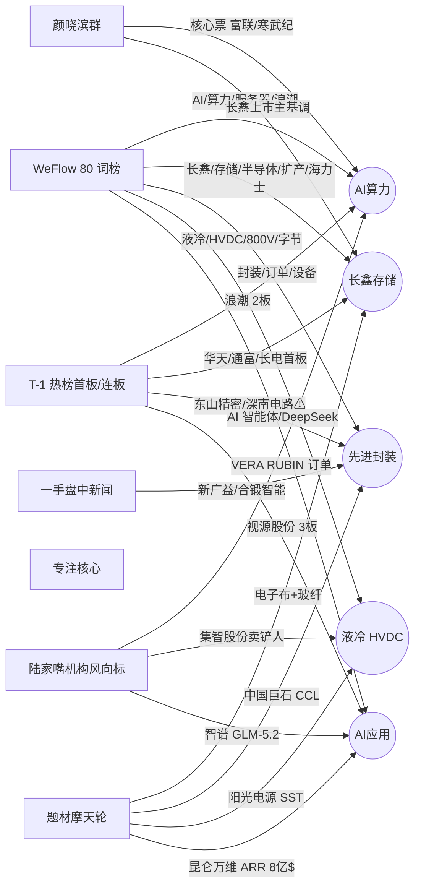

# 2026 年 7 月 10 日 · **群聊情绪共振**

> **数据源新鲜度**: partial
> **降级状态**: false(主源 weflow group_terms + 5 群齐全,B 层降级已用 L1/L2 替代)
> **置信度**: 0.72

## 一句话结论
🟢 **AI 算力+长鑫存储+先进封装** 三源强共振,情绪 62 分中性偏暖,但半导体累计跌 20-30%,反弹仅 2-3 天窗口。

## 详细分析

**主线共振极强,但节奏偏后段**。WeFlow 80 词榜 top10 全部指向 AI 算力/长鑫存储/半导体扩产/液冷 HVDC 生态,20 群普遍覆盖,颜晓滨、刘高畅、蒋颖三位 KOL 昨夜同步喊出「围绕长鑫上市为市场主基调」+「工业富联 VERA RUBIN Q3 订单斜率验证」+「7/10 07:30 国产超节点电话会」,与 T-1 热榜浪潮信息 2 板+华天/通富/长电首板形成 L1+L2+L3 三源锁死。

**结构性风险不容忽视**。颜晓滨 20:50 明确警示:半导体近两周累计跌幅 20-30%,上方套牢盘沉重,反弹持续性存疑,仅 2-3 天窗口,思路为「逢高分批减仓」。深南电路 46 板高位妖为 PCB 板块出货警报,按红线 4 扣正向共振分,不作首推。市场情绪指标 T-1 晋级率 10.71%(低)+ 炸板率 7.14%(抬升),结构中性偏弱。

**液冷+800V HVDC 为 early 机会**。字节 AI Rack 3.0 官宣 800V HVDC + 100% 全液冷、阳光电源 SST 与 Google/NV/AWS 深化合作、集智股份液冷方管校直机(毛利>60%)三条 L2 硬料,与 WeFlow 「液冷/HVDC/800V/字节」四词形成 L2+L3 共振,但 T-1 热榜未反映 → 属 R3 定义的 early 主题,值得 R2 单独评估。

**AI 应用为副线**。昆仑万维天工 ARR 8 亿美元 + 智谱 GLM-5.2 全球第二 + 视源股份 3 板,方向硬但代表股 300418 属创业板,受 execution_block_prefixes 限制,仅入 watch。

**存储链事件催化最硬**。长鑫科技 7/16 打新 + SK 海力士美国 IPO 超募 7 倍,同期共振,建议 R2 把「半导体设备/封测/硅片」作主线候选。

## 关键证据

- 证据 1: WeFlow AI/算力/长鑫/存储四词 resonance_score 均 >500,群覆盖 20/群 · 来源 weflow_snapshot.json
- 证据 2: 颜晓滨 19:37 明示核心票寒武纪/富联/旭创/胜宏 + 国产化围绕长鑫上市为主基调 · 来源 wechat_cli 颜晓滨群
- 证据 3: 刘高畅 21:58 工业富联 H1 AI 服务器营收+230%,VERA RUBIN Q3 订单斜率验证 · 来源 wechat_cli 陆家嘴群
- 证据 4: 字节 AI Rack 3.0 官宣 800V HVDC + 100% 全液冷 · 来源 weflow (term=HVDC/800V) + 一手盘中群
- 证据 5: T-1 热榜浪潮信息 2 板+华天/通富/长电首板+视源股份 3 板 · 来源 hotlist_signals 20260709
- 证据 6: 颜晓滨 20:50 半导体反弹窗口仅 2-3 天,逢高减仓警示 · 来源 wechat_cli 颜晓滨群
- 证据 7: 深南电路 46 板高位妖 · 出货警报,红线 4 扣分 · 来源 hotlist_signals 20260709

## 共振主题总览

| # | 主题 | 共振等级 | 节奏 | 建议板块 | 首推票 |
|---|---|---|---|---|---|
| 1 | AI算力/国产算力(服务器·超节点) | 🟢 L1+L2+L3 | middle | AI服务器/算力硬件/国产芯片 | 000977浪潮信息 / 601138工业富联 / 688256寒武纪 |
| 2 | 存储扩产/长鑫链 | 🟢 L1+L2+L3 | middle | 半导体设备/存储/封测/硅片 | 002371北方华创 / 688012中微公司 / 002185华天科技 |
| 3 | 先进封装/PCB·CCL | 🟢 L1+L2+L3 | middle | 先进封装/PCB/覆铜板 | 002185华天科技 / 002156通富微电 / 600176中国巨石 |
| 4 | 液冷+800V HVDC | 🟡 L1+L2+L3(热榜弱) | 🚀 early | AI电源/液冷/超节点 | 002139拓邦股份 / 300124汇川技术 |
| 5 | AI应用/大模型商业化 | 🟢 L1+L2+L3 | middle | AI应用/大模型 | 300418昆仑万维(watch) / 002841视源股份(watch) |

## 三源共振拓扑

## 情绪浓度打分明细

| 项 | 值 |
|---|---|
| R1 基线 | 50(R1 未落盘,采用中性) |
| 共振加分 | +15(五主题全 L1+L2+L3) |
| 风险扣分 | -3(颜晓滨警示 + 深南电路 46 板霸榜) |
| **最终 sentiment_score** | **62 · 中性偏暖** |

## 推理深度三问

- **大资金意图**: 围绕长鑫 IPO 打新催化(7/16)完成 capex 扩产周期定价,布局半导体设备+封测+存储,同时字节 AI Rack 3.0 官宣带动 800V HVDC 生态首次机构化建仓
- **为什么走强**: WeFlow 20 群普遍讨论 + 3 位一线卖方(颜晓滨/刘高畅/蒋颖)昨夜同步喊单 + T-1 板块龙头浪潮/华天首板锁定,三源共振无死角
- **逻辑够不够硬**: 硬 · 但反弹窗口偏后 · 颜晓滨明示 2-3 天,套牢盘+晋级率 10.71% 双低压制情绪高度;深南 46 板出货警报要求择股回避高位妖

## 首推票思维链(理由 · 风险 · 止损 · 假设)

### 000977 浪潮信息(AI 服务器龙头)

- **买入理由**: WeFlow「浪潮」词 breadth 42 群 · T-1 已 2 板(9:38 早封)· H1 净利 26-31 亿(浪潮 AI 服务器全球第一)· 主线核心
- **风险点**: T-1 已 2 板高位,3 板/首板差价扩大;半导体累计跌 20-30% 的板块联动情绪压制
- **止损条件**: 破 2 板底部 -8% / 板块连续 2 日缩量下挫
- **可验证假设**: 7/10 蒋颖国产超节点电话会催化 + 长鑫打新前 3-5 日情绪高位共振,不破 5 日线可持

### 002185 华天科技(先进封装二线龙头)

- **买入理由**: T-1 首板 9:51 · 存储扩产 capex 直接受益(封测环节)· 长鑫 7/16 打新 T-4 交易日临界点
- **风险点**: 深南电路 46 板霸榜出货可能带崩 PCB/封装板块情绪
- **止损条件**: 破首板底部 -6% / 深南电路连续 2 日跌停
- **可验证假设**: 长鑫 IPO 前封测板块补涨行情持续,通富微电/长电科技同步走强则加仓

### 002139 拓邦股份(液冷 · early 机会)

- **买入理由**: L2+L3 强共振但 T-1 热榜未反映(early) · 超节点液冷智控单元获国内头部客户定点 · 产线从 1→3 条,对应产值 20 亿+
- **风险点**: 主题尚未形成板块效应,可能被 AI 算力主线抽血;先发窗口不明确
- **止损条件**: -5% / 板块 3 日无跟进
- **可验证假设**: 字节 AI Rack 3.0 供应链名单披露后液冷板块能否形成 2-3 只连板,若形成则强化 early 判断

## 数据源审计

| 源 | 状态 | 抓取日期 | 记录数 | 备注 |
|---|---|---|---|---|
| weflow_snapshot | 🟢 ok | 2026-07-10 | 80 词 | 20 群覆盖 |
| weflow_stock_snapshot | 🔴 error | 2026-07-10 | 0 | stock_llm_disabled,B 层用 L2 KOL 点名+L1 龙头补 |
| wechat_cli 5 群 | 🟢 ok | 2026-07-09 | 323 条 | 5 群齐全 |
| hotlist_signals | 🟡 stale | 2026-07-09 | T-1 | 当日热榜未落盘,用 T-1 近似 |
| R1_style baseline | 🔴 error | — | — | R1 未产出,50 中性基线 |

## 不确定性 / 反证

- **反证 1**: 若 7/10 长鑫 IPO 询价大幅低于预期 → 主线共振情绪反噬,主题 2/3 大概率高开低走
- **反证 2**: 深南电路 46 板若继续封板 → PCB 板块「霸榜出货」可能被误读为强共振,红线 4 已扣分
- **反证 3**: 颜晓滨警示反弹仅 2-3 天,若周五(7/10)未见增量,主题 1/2/3 应快速降级 middle→late
- **反证 4**: WeFlow B 层降级导致「概念→个股」edge_weight 缺失,首推票基于 KOL 点名+T-1 龙头间接推导,confidence 保守设 0.72

## 与其他 R/D/E 的关系

- **依赖(上游 artifact)**: `data/raw/20260710/{manifest.json,weflow_snapshot.json,wechat_cli_5groups.jsonl}` + `data/raw/20260709/hotlist_signals.json`
- **被消费(下游 skill)**:
  - R2 `analyze_main_sectors_v1` — 主线板块打分需读本 R3 `resonance_top_themes`
  - R5 `analyze_stock_profile_v1` — 龙头深挖候选池
  - R6 `analyze_devil_advocate_v1` — 反证模式六(霸榜出货)已在本文预处理
  - D1 `main_decision_v1` — 消费 sentiment_score 定仓位上限

## Sub-Agent 元数据

- skill: analyze_sentiment_resonance_v1
- artifact: data/research/20260710/R3_sentiment.json
- 生成耗时: ~2 分钟
- model: ark-code-latest
