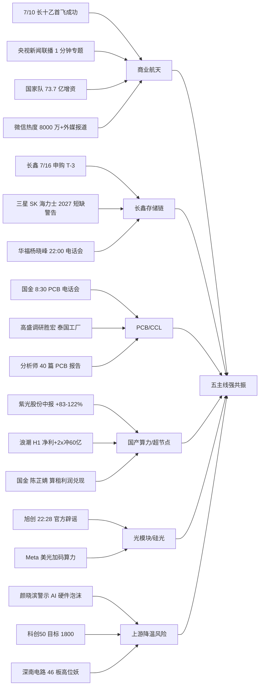

# 2026-07-13 · **群聊情绪共振**

> **数据源新鲜度**: partial(WeFlow B 层空 · 无当日热榜)
> **降级状态**: true(L3 不加分 · 上限 L1+L2)
> **置信度**: 0.62

## 一句话结论

**周末机构+游资在商业航天/长鑫存储/PCB/国产算力/光模块五主线强共振**,但 AI 硬件上游被行业老登派明确警示泡沫过大,风格切换概率上升,盘前须警惕高开高走式陷阱。

## 详细分析

**主线权重**: 商业航天(rank1 · early)是本轮**唯一新起主线**,7/10 长十乙首飞成功 + 央视新闻联播罕见 1 分钟专题 + 火箭卫星国家队合计 73.7 亿增资 + 微信热度指数飙超 8000 万 + 外资大摩发研报,四重独立源共振,是周末最硬的**事件驱动+政策+情绪**三重锚。缺陷是上一交易日板块内部无涨停梯队带动,需盘前竞价溢价 + 开盘 30min 龙头出现二次确认。

**存量主线**: 长鑫链(rank2)/PCB(rank3)/国产算力(rank4)/光模块(rank5) 均为**上周已在跑的中周期主线**,周末机构 KOL 连续通过硬时间锚(长鑫 7/16 申购 · 国金 PCB 8:30 电话会 · 旭创 8 点辟谣电话会 · 华福国产 AI 22:00 电话会)加码。硬业绩锚极多:紫光股份中报预增 83-122% · 浪潮 H1 净利预增超 2 倍冲 60 亿 · 深科达半导体 Q1 净利 +8.5x · 锐捷 Q2 利润加速释放。

**风险面**: 老登派颜晓滨群 19:52 明示"香农芯创等纯芯片分销被炒到千亿市值,AI 硬件泡沫肯定很大;科创50 大概率跌到 1800 前支撑",并结合上周深南电路 46 板高位妖已列反向观察 · 百亿基金经理内参《AI 行情进入地狱难度》—— 意味着周一半导体上游 + 深南电路等妖股大概率继续调整,资金外溢 → **航天/机器人/长鑫链**方向。

**KOL 阵营内部分歧**: 国金/华福/东北/开源 → 主线不变 · 阶段调整;万达信息十大股东.颜晓滨/百亿基金经理内参 → 上游降温 · 结构切换;广发策略刘晨明《不以物喜不以己悲 · 如何看待科技股调整》定性阶段调整偏中性 —— **不宜追高首推 · 优选低吸中军 + 事件驱动龙头**。

**风格切换研判**: 情绪浓度 60(中性偏暖 · 基线 50 + 共振 +15 - 风险 -5)。若上周五半导体上游深调在周一低开 → 老登(有色/化工/煤炭/银行等)可能被动补涨,但周末信号中**无老登派 KOL 集体喊多**,故本次切换概率有限,**主基调仍是科技主线内部结构性再平衡**(存储/PCB/航天 > 光模块 > 算力硬件龙头 > 半导体上游)。

## 关键证据

- **证据 1**: 长十乙首飞 + 火箭卫星国家队 73.7 亿增资 + 央视新闻联播 1 分钟专题 · 来源 游资情报群 @18:02 松 + 游资题材群 + 机构风向标群 @17:56 刘高畅(国金计算机)四群共振
- **证据 2**: 长鑫科技 7/16 申购(硬时间锚 -3 天) + 三星 SK 海力士警告 2027 严重短缺 + 华福杨晓峰 22:00 电话会"存储是 Agent 时代最稀缺板块" · 来源 行业分析师群 @21:16 秋生 + 机构风向标群 @22:00 杨晓峰
- **证据 3**: 国金刘高畅 8:30 独立 PCB 电话会 + 高盛调研胜宏 + 分析师连发 40 篇 PCB 报告 · 来源 机构风向标群 @13:21 刘高畅 + 公众号《傅里叶的猫》
- **证据 4**: 紫光股份中报预增 83-122% · 交换机 20-30%/服务器 +50%/超节点 2026 年 5 月推出 · 来源 游资情报群 @21:35 Tony
- **证据 5**: 中际旭创 8 点电话会官方辟谣 + 需求持续强势/物料顺畅/无大幅降价/硅光比例上行/客户扩展至 Neocloud · 来源 行业分析师群 @22:28 陈宗杰 + 游资情报群 @21:52 崔龙
- **反向证据**: 万达信息十大股东.颜晓滨 @19:52 明示 AI 硬件泡沫大 · 科创50 目标位 1800 · 百亿基金经理内参《AI 行情进入地狱难度》 · 上周深南电路 46 板高位妖列反向观察

## 五主线共振传导图

## 每主线思维链

### 主线 1: 商业航天(early · 首推)

- **大资金意图**: 事件驱动 + 政策定调 + 情绪三重锚,国家队 73.7 亿增资是**产业资本一级动作**,央视 1 分钟专题是**官方媒介定性**,机构 KOL 深夜集中发研报是**卖方主动构筑赛道叙事**;三方合力意味着"周期性主题级别拉抬"启动
- **为什么走强**: 位置(启动位 · 板块 30 日相对位置低位)+ 硬事件(全球首个海上网系回收工程化 · 中国航天里程碑)+ 情绪(外媒集体报道 · 微信指数 8000w+)+ 卖方(大摩海外/国金/华福/开源四家覆盖)
- **逻辑够不够硬**: 硬事件锚已发生(7/10 首飞) · 硬政策锚(2030 万星组网央视重申) · 硬资本锚(73.7 亿增资落地) —— 三个独立源共振;证伪路径 = 竞价溢价不足 3% 或开盘 30min 无涨停梯队 → 视为舆情已被上周提前反映,不追

**关注池首要标的思维链**:

**600118 中国卫星** (板块公认龙头 · 央企背景)

- **买入理由**: (1) 冲锋V点名首位 · 卫星总装央企 · 星座建设产业链最上游 (2) 30 日累计涨幅未超板块平均 · 位置未透支
- **风险点**: (1) 央企成分股 · 弹性弱于游资龙头 (2) 若板块龙头由 300065/002912 出线,资金分流
- **止损条件**: 5 日均线跌破且量能放大,或板块跌停家数 ≥ 2 则减仓
- **可验证假设**: 20260713 竞价溢价 ≥ 2% 且开盘 30min 内板块首板出现 → 假设成立(24h 内验证)

**300065 海兰信** (民企 · 海上平台标的 · 弹性首选)

- **买入理由**: (1) 冲锋V点名"火箭网系回收海上平台领航者号" · 主题最直接受益 (2) 民企游资偏好 · 若有涨停梯队将担任龙一
- **风险点**: (1) 若"领航者号"参股关系不实(参考上海证券报 002829 澄清案) · 存在辟谣风险 (2) 前期已有过涨幅积累
- **止损条件**: 竞价倒挂或开盘 15min 未封板即减半仓;当日无涨停则收盘卖出
- **可验证假设**: 竞价溢价 ≥ 5% 且开盘 15min 内触板 · 未触板则假设弱化

### 主线 2: 长鑫存储链(middle · 低吸)

- **大资金意图**: 长鑫 7/16 打新是硬时间锚 · 资金上周开始布局(参考 20260710 华天 002185/通富 002156/长电 600584 首板已启动) · 周末机构 KOL 二次拉响做多信号 · 意图在打新前抢先卡位
- **为什么走强**: 硬事件锚(申购 T-3) + 全球供需锚(三星 SK 海力士警告 2027 短缺 · DRAM/NAND 涨价延续) + 业绩锚(深科达 Q1 半导体 +8.5x)
- **逻辑够不够硬**: 三个硬锚齐备;证伪路径 = 若周一封测/存储上游低开超 5% 且无反包 → 假设中周期高点已到

### 主线 3: PCB/CCL(middle)

- **大资金意图**: 机构领跑者国金团队独立组织电话会 · 高盛调研胜宏泰国工厂 · 逻辑在于 AI 算力硬件确定性最强的产业链环节
- **为什么走强**: 位置(经历上周深调 · 中位) + 催化(涨价延续 · 高端 PCB 3 万一平米) + 卖方(国金 40 篇报告 · 高盛调研 · 东北 PCB 上游(5) 系列)
- **逻辑够不够硬**: 卖方深度足 · 业绩兑现路径清晰;证伪路径 = 胜宏科技(300476)若周一低开破 60 日均线则龙头预警

### 主线 4: 国产算力/超节点(middle_late)

- **大资金意图**: 机构定性"主线不变 · 阶段调整"(天风/广发) · 但游资已开始警示上游泡沫(百亿基金经理内参《地狱难度》 · 颜晓滨群) · 资金意图偏中报兑现博弈而非二次做高
- **为什么走强**: 硬业绩(紫光股份中报 +83-122%/浪潮 H1 净利 +2x) · 硬事件(智谱等国产模型 ARR 指数级增长)
- **逻辑够不够硬**: 业绩硬 · 但估值分歧大;证伪路径 = 若周一 000977 浪潮信息高开回落 3%+,视为业绩预期已充分反映

### 主线 5: 光模块/硅光(middle · 事件驱动)

- **大资金意图**: 旭创周日晚官方辟谣 + 电话会硬安排,意图消除做空信息优势 · 修复被压制的估值
- **为什么走强**: 事件驱动(辟谣 + 需求持续强势 + 硅光渗透)
- **逻辑够不够硬**: 单一事件驱动 · 需盘中确认;证伪路径 = 300308 中际旭创竞价溢价 < 2% 或开盘 30min 内跌破 5 日线,则辟谣未生效

## 情绪浓度分解

| 项 | 分值 | 依据 |
|---|:--:|---|
| R1 基线 | 50 | R1_style.json 未落盘 · 中性基线 |
| 共振加分 | +15 | 五主线 L1+L2 共振(每主线 +3) |
| 风险扣分 | -5 | 老登派 KOL 警示 AI 硬件泡沫 + 高位妖出货警报 |
| **综合** | **60** | 中性偏暖 · 主线内部结构性再平衡 |

## 不确定性 / 反证

- **反证 1**: WeFlow B 层空缺 · 意味着"股票→概念 edge_weight"缺失 · 无法通过量化路径交叉验证 KOL 语义,共振仅由 L2 文本判定,存在**主观偏差**
- **反证 2**: 无当日热榜(周一盘前) · 无法排除"周末情绪已被上周五盘中提前反映"的可能;若上周五五主线相关个股已批量涨停,则本次 md 结论 = 反向确认高点
- **反证 3**: KOL 阵营内部分歧非小(降温派 vs 主线不变派) · 若竞价科创50 低开 -1% 以下,风格切换概率抬升,航天/长鑫的 early_or_late 需重估
- **反证 4**: 商业航天板块 R6 需 pushback: **是否已被上周提前反映**?如是则 rank1 应下调至 rank3

## 与其他 R/D/E 的关系

- **依赖上游**: `data/raw/20260712/wechat_cli_5groups.jsonl` · `data/raw/20260712/wechat_official_20.jsonl` · `data/raw/20260712/news_major.jsonl` · `data/raw/20260712/weflow_snapshot.json`(降级)
- **被消费**: `analyze_main_sectors_v1`(R2 · 主线排序需交叉本 R3 主线) · `analyze_devil_advocate_v1`(R6 · 需 pushback 商业航天是否已充分反映 + 深南电路出货是否波及 PCB) · `main_decision_v1`(D1 · 情绪浓度 60 输入决定仓位上限)
- **平级**: R1(风格 · 尚未落盘) · R4(消息面 · 与 KOL 事件锚交叉) · R7(资金 · 需验证机构行为)

## Sub-Agent 元数据

- skill: analyze_sentiment_resonance_v1
- artifact: data/research/20260713/R3_sentiment.json
- 生成耗时: 单轮 fresh context · < 60s
- model: ark-code-latest
- degraded: true(WeFlow B 层空 · 无当日热榜)
- confidence: 0.62

## 数据源审计

| 源 | 日期 | 状态 | 备注 |
|---|---|:--:|---|
| wechat_cli_5groups | 2026-07-12 | 🟢 | 98 条 · 5 群齐全 · 群名匿名化 |
| wechat_official_20 | 2026-07-12 | 🟢 | 115 篇 · 23 账号全部 ok |
| news_major | 2026-07-12 | 🟢 | 800 条 |
| news_cls | 2026-07-12 | 🟡 | 2911 条但 title 全为 nan · 不可用 |
| weflow_snapshot | 2026-07-12 | 🔴 | terms=[] · group_keywords 全零(周末窗口) · L3 B 层不出结果 |
| weflow_stock_snapshot | 2026-07-12 | 🔴 | stock_llm_disabled |
| hotlist_current_day | 2026-07-13 | 🔴 | 周一盘前无当日热榜 |
| hotlist_prev_trading_day | 2026-07-10 | 🟡 | 相隔周末 3 天 · 仅作参照不加分 |
| mcp_health_all_green | 2026-07-12 | 🟢 | 全部 MCP ok · 但无盘中/热榜实时数据可用 |
