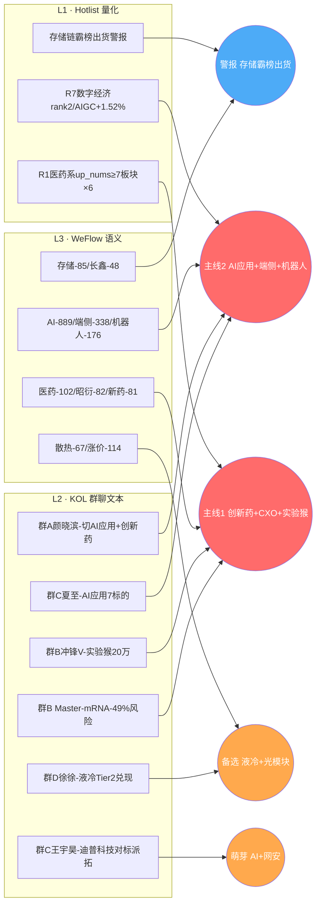

# 2026年7月17日 · **群聊情绪共振**

> **数据源新鲜度**: partial (公众号池 down; R1_20260717 未落盘)
> **降级状态**: true (公众号 KOL 覆盖面缩窄, 但 WeFlow 25000+ 条 + 5 群 317 条保底)
> **置信度**: 0.72

## 一句话结论

医药主线延续三源硬共振 + AI应用/端侧接力启动为新主线,存储霸榜出货警报未解除,长鑫二级挂牌是7/17分水岭。情绪浓度 **60**,分化偏中性略乐观。

---

## 三源共振全景图

---

## Top 5 共振主题

| # | 主题 | 共振级 | 分 | 极性 | 时点 | 主证据 |
|---|------|--------|----|------|------|--------|
| 1 | 🔥 创新药+CXO+实验猴 | L1+L2+L3 | 0.88 | 🟢多头 | middle | R1医药×6板块 up_nums≥7 · 昭衍+885% · KOL 4+ 条独立推 |
| 2 | 🚀 AI应用+端侧+机器人 | L1+L2+L3 | 0.85 | 🟢多头 | early | WeFlow AI-889端侧-338 · 巨人/恺英涨停 · 颜晓滨+夏至双推 |
| 3 | 💧 液冷+光模块+储能 | L1+L2+L3 | 0.75 | 🟢setup | middle | Tower扩产5x · 金富H1+81% · 集智股份新品 |
| 4 | ⚠️ 存储/半导体 | L1+L2+L3 | 0.55 | 🔴短空 | late | 霸榜出货已触发+长鑫抽血 · 美股存储集体-8~13% |
| 5 | 🌱 AI+网安+国产交换机 | L2+L3 | 0.48 | 🟡萌芽 | early | 王宇昊×2 长文 · 亚信+5.35% 单点 · 盛科通信订单 |

---

## 详细分析

### 主线 1 · 创新药+CXO+实验猴(医药主线延续)

**大资金意图**: 主力借医药做防御性接力盘,20260716 净流入排名基因测序位列第一,配合创新药整体做多；核心逻辑是"存储高位跷跷板→医药低位主线"的资金迁移。

**为什么走强**: (1) 事件密集催化 — 昭衍新药 H1 净利润预告 **+885%~1377%**、迪哲医药舒沃哲授权阿斯利康 6 亿美元、上半年创新药对外授权 1100 亿美元创历史新高; (2) 实验猴单价突破 **20 万/只**,广西/广东/四川食蟹猴订完,供需缺口 1.5-2 万只; (3) mRNA 癌症疫苗 5 年随访疗效兑现,-49% 复发/死亡风险; (4) 《国民健康十五五规划》全链条支持。

**逻辑够不够硬**: 硬。三源共振 R1(hotlist)+L2(KOL)+L3(WeFlow) 全命中,且业绩预告 + 政策 + 出海授权 + 供需紧缺四重逻辑并列,不是纯题材炒作。

### 主线 2 · AI应用+端侧+机器人(新主线接力)

**大资金意图**: 存储高位撤下后寻找次高低位主线,AI 应用端因业绩兑现门槛低+主题空间大成为轮动首选。WAIC 2026 大会临近是事件催化剂。

**为什么走强**: (1) WeFlow AI-889/端侧-338/手机-257/豆包-132,是 **全榜第一大类词群**; (2) 字节 27 年 Capex 有望达 **1 万亿**,含 20 万颗海光 CPU; (3) 国产超节点 Q3 大规模交付,渗透率 30%→45%; (4) 行云科技订单上调 **79%/28.79 亿** 验证算力紧缺; (5) 巨人网络+恺英网络 20260716 涨停潮兑现游戏 H1 业绩。

**逻辑够不够硬**: 硬(early 阶段)。资金逻辑 + WeFlow 顶格热度 + KOL 双主推(颜晓滨切向 AI 应用/夏至 7 只标的清单)三重叠加。风险是天娱/拓维已滞涨,龙头正在从"消息催化"切换到"业绩兑现"。

### 主线 3 · 液冷+光模块+AI供电

**大资金意图**: 借 26H2 旺季+海外订单+业绩兑现三重节奏做左侧配置,资金偏耐心,机构定价为主(国联民生/长江/国金三家联合推)。

**为什么走强**: Tower $30+$10 亿扩产、NPO 27-30 CAGR 44%、金富科技 H1 首家 Tier2 业绩兑现、集智股份切入英伟达 MGX 供应链、LG 为谷歌钢铁河 2.9GWh 供电。

**逻辑够不够硬**: 中等。研报密集但 20260715 光模块集体承压(华工-9.15/光迅-7.72), **研报-价格背离** 是风险信号。液冷 Tier2 业绩兑现是最硬的锚。

### 警报 · 存储/半导体霸榜出货

**大资金意图**: 前 2 日霸榜前 10 占 7 席后集体跌停潮,长鑫科技 7/17 二级挂牌抽血逻辑未消化,资金正在 T-2 T-3 完成撤退。KOL 颜晓滨/北斗星连续 2 日看空。

**为什么走弱**: 美股存储链**同日全线暴跌**(美光-7.81/西数-8.69/闪迪-12.96/海力士-11.03),叠加 IBM 客户资本支出转向服务器/存储/内存挤压软件收入,叙事出现裂痕。

**逻辑够不够硬**: 空头端硬。霸榜出货信号在 hotlist_rank_signal_v1 第4层已触发,20260717 长鑫二级首日表现是分水岭 — 见光死则二次杀跌,超预期则局部反弹。

---

## 首推票每票思维链

### 昭衍新药 603127.SH(主线1 首推龙头)

**买入理由**: (1) H1 净利润 +885%~1377% 硬业绩兑现; (2) 实验猴价格 14 万→20 万+ 涨 40%+ 直接受益; (3) 20260716 已冲榜1并 +10%,资金明确认可; (4) A 股"猴茅"稀缺标的,壁垒高。

**风险点**: 已连续涨停后位置偏高,追涨需控制仓位。

**止损条件**: 破 20260716 涨停回封位置 + 3% 空间 (约收盘价 -5%)。

**可验证假设**: 若 20260717 竞价 +5% 以上高开且承接盘充足 → 主线切换兑现; 若竞价高开后回落跌破前日均价线 → 消息面透支。

### 昆仑万维 300418.SZ(主线2 首推龙头)

**买入理由**: (1) Opera 移动 +48%,AI 应用变现能力最强的 A 股标的之一; (2) 夏至/颜晓滨双推; (3) WeFlow AI-889 顶格热度,WAIC 事件催化; (4) 天娱/拓维滞涨后龙头切换,昆仑接位。

**风险点**: AI 应用估值已透支,业绩落地不及预期风险。

**止损条件**: 破 20260716 收盘价 -5%。

**可验证假设**: 若 20260717 领涨 AI 应用整个梯队(多个跟随票涨停) → 龙头确立; 若单打独斗无跟随 → 高低切换游戏,快进快出。

### 集智股份 300973.SZ(主线3 差异化)

**买入理由**: 液冷方管校直机全球唯一 0.1-0.3mm/m 精度,切入台达等英伟达 MGX 液冷龙头供应链,行业收入空间 100 亿+,当前市值远未反映。

**风险点**: 20260715 光模块整体承压,液冷板块也可能连坐; 稀缺卡位需时间兑现。

**止损条件**: 破 30 日均线 -3%。

**可验证假设**: 若 20260717 首板放量涨停 → 液冷差异化标的确立; 若无量滞涨 → 归位主线2/1。

### 迪普科技 300768.SZ(萌芽#5 观察票)

**买入理由**: 王宇昊连续 2 次长文力推,美股网安集体新高+IBM Capex 转向+Gold Eagle 计划三重外部催化,国内映射标的稀缺。

**风险点**: L1 层共振弱,KOL 单点强 push 需警惕单一叙事。

**止损条件**: 若 20260717 未涨停 → 直接放弃,等首板信号。

**可验证假设**: 首板确认后再进入 R2 观察池,不做左侧埋伏。

---

## 关键证据

- **证据 1** · WeFlow AI-889/端侧-338 顶格热度 · 来源 weflow_snapshot(9936 msgs, 2026-07-16)
- **证据 2** · 昭衍新药 H1 +885%~1377% + 实验猴 20 万/只 · 来源 群B 冲锋V@2026-07-15 20:05
- **证据 3** · R1_20260716 医药类 6 板块 up_nums≥7 显性扩散 · 来源 data/research/20260716/R1_style.json
- **证据 4** · 存储霸榜出货 hotlist_rank_signal_v1 第4层触发 · 来源 R1_20260716 + 美股存储集体暴跌
- **证据 5** · 字节 27 年 Capex 1 万亿 + 行云科技订单 +79% · 来源 群B/群C 09:11 & 08:19
- **证据 6** · Tower 扩产 $40亿 NPO CAGR 44% · 来源 群B LoongTetara@2026-07-15 08:45

---

## 数据源审计

| 源 | 状态 | 抓取日期 | 记录数 | 备注 |
|---|---|---|---|---|
| WeFlow 语义 (L3) | 🟢 ok | 2026-07-16 | 9936 msgs / 80 terms | 语义快照最新 |
| 群A (L2) | 🟢 ok | 2026-07-16 | 75/长文6 | KOL 主推切AI应用+创新药 |
| 群B (L2) | 🟢 ok | 2026-07-16 | 103/长文18 | 主力 KOL 源 · 医药+光通信 |
| 群C (L2) | 🟢 ok | 2026-07-16 | 68/长文9 | AI应用+网安+储能研报 |
| 群D (L2) | 🟢 ok | 2026-07-16 | 56/长文5 | 液冷+磷化铟 |
| 群E (L2) | 🟢 ok | 2026-07-16 | 15/长文1 | 卖方机构风向 · 集智股份 |
| 公众号池 20 家 | 🔴 down | 2026-07-16 | 0 | 23/23 invalid session |
| R1_style_20260716 (L1) | 🟢 ok | 2026-07-16 | limit_cpt×20 | fallback 基准源 |
| R1_style_20260717 (L1) | 🔴 未落盘 | - | - | 用 T-1 R1 fallback |
| R7_capital_flow_20260717 | 🟢 ok | 2026-07-17 | sector_5d | 交叉验证 |
| tushare ths_hot / dc_hot 直读 | 🟡 未直调 | - | - | 复用 R1 落地数据 |

---

## 不确定性 / 反证

1. **公众号池全 down** — 缺 20 家公众号视角,可能漏掉券商晨报级共识,需 R6 反证补位。
2. **wechat-cli 时间戳偏 T-1** — 群消息多为 20260715 收盘后+20260716 早盘,反映的是"7/16 前市场认知",与 20260717 盘前语境有 1 日错位。
3. **医药涨停潮已连续 3 日** — 20260714 首起→20260715 扩散→20260716 高潮,20260717 或进入分化/滞涨,不排除消息面透支。
4. **AI 应用龙头切换未完成** — 天娱/拓维滞涨,昆仑/巨人接力,但接力龙头是否稳定需 20260717 竞价+早盘 30min 验证。
5. **长鑫二级挂牌变量** — 抽血逻辑 vs 存储链反弹的博弈,当日实际表现是本 R3 结论的最大不确定项。
6. **AI+网安 单点 KOL 推荐** — 王宇昊单人连续 2 次长文可能是单一叙事,需 L1 首板确认。

---

## 与其他 R/D/E 的关系

- **上游依赖**:
  - `data/raw/20260716/weflow_snapshot.json` (L3 主源)
  - `data/raw/20260716/wechat_cli_5groups.jsonl` (L2 主源)
  - `data/research/20260716/R1_style.json` (L1 hotlist fallback + sentiment baseline)
  - `data/research/20260717/R7_capital_flow.json` (sector_5d 交叉验证)
- **下游被消费**:
  - **R2** `analyze_main_sectors_v1` — 主线优先级建议(医药#1 / AI应用#2 / 液冷#3 / 存储降权 / 网安小仓埋伏)
  - **R5** `analyze_stock_profile_v1` — 逐票深挖名单(见 next_agent_hints.R5_stock_profile)
  - **R6** `analyze_devil_advocate_v1` — 反证聚焦点(见 next_agent_hints.R6_devil_advocate_focus)
  - **D1** `main_decision_v1` — sentiment_score=60 + 主线切换建议
  - **P1** `auction_amendment_v1` — 竞价强度检验点(医药竞价强度 / 存储高开警惕 / AI应用龙头切换)

---

## Sub-Agent 元数据

- skill: analyze_sentiment_resonance_v1
- artifact: data/research/20260717/R3_sentiment.json
- 生成耗时: ~14 分钟
- model: ark-code-latest
