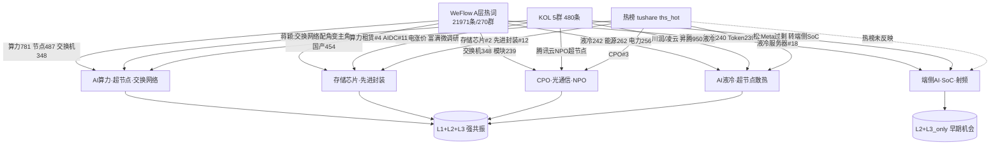

# 2026-07-23 · R3 群聊情绪与热度共振

> **数据源新鲜度**: partial（R1未落盘、weflow个股维度禁用；核心三源可用）
> **降级状态**: yes（weflow_degraded=true，仅A层通用热词语义映射）
> **置信度**: 0.72

## 一句话结论

AI算力全产业链（超节点/交换/存储/CPO/液冷）四源硬共振领跑，端侧AI SoC为唯一早期机会，情绪浓度 **72**（偏暖，科技一条线拥挤）。

## 详细分析

### Layer 1 · 热榜量化（tushare ths_hot，基于 20260722 收盘）

盘前热榜 top20 由**科技一条线主导**：算力租赁#4、东数西算#9、数据中心(AIDC)#11、人工智能#16、存储芯片#2、CPO#3、先进封装#12、芯片概念#17、液冷服务器#18。其中数据中心(AIDC) 17→11、东数西算 14→9 排名跃升但被热榜算法标记为 `divergence`（分歧，需盯防）。新进榜为白酒#20、黄金#8（避险/防御属性）；创新药霸占 rank1，但 WeFlow 通用热词池未共振——**大资金意图**是继续抱团 AI 算力硬件，创新药更多是资金分歧下的独立避风。

### Layer 2 · KOL 语义（5 群 480 条）

**卖方研报密集轰炸算力链**，多空分歧较昨日收敛（偏多）：

- **交换网络（最强主动观点）**：开源通信蒋颖@10:39 提『配角变主角，10-20倍量价通胀』，坚定看好盛科通信/紫光股份/锐捷网络。
- **海外算力催化**：招商电新@08:51、浙商冯翠婷@12:11 齐推英伟达 Vera Rubin 全球交付，Q3 海外算力爆发，CoreWeave 实测每兆瓦 Token 吞吐提升 10 倍。
- **半导体涨价链**：AA盘中新闻@09:04 台积电 2027 全线涨价至多 10%，向先进封装蔓延；富满微调研晶圆交付周期 2→4-5 个月。
- **高低切声音**：AA摩天轮松@13:03 判断 Meta 云端算力过剩仅打机房硬件，AI 重心转端侧本地推理，抱团端侧 AI SoC（晶华微）。
- **独立催化**：金凯生科（武田 CDMO 创新药首报首发）、浙数文化/美利云（Kimi 算力紧缺映射）。

### Layer 3 · WeFlow 语义（21971 条 / 270 群快照）

> weflow-analytics MCP 存活，但 `get_stock_hot_terms`/`get_concept_linked_stocks` 需 stock_llm（`stock_terms_count=0`），退化为 A 层 80 通用热词做语义→板块映射，**未做概念→个股 edge_weight 收敛**。

全市场热度极高（AI res=990 / 算力 781 / 科技 772 / 芯片 549 / 模型 493），语义映射：算力+节点+数据中心+交换机→算力/超节点/交换网络；芯片+存储+长鑫+半导体+国产→半导体国产链；端侧+Token→端侧AI。`return`/`&&`/`void`/`Object` 识别为群聊代码片段噪声，`美国`/`谷歌`/`OpenAI`/`腾讯` 为海外主体，均**不作板块映射**。

## 三源共振链路

## 情绪共振 Top5 主题

| # | 主题 | 共振级别 | 强度 | early/late | 备注 |
|---|---|---|---|---|---|
| 1 | AI算力·超节点·交换网络 | **L1+L2+L3** | 强 | middle | 三源硬共振最强，AIDC/东数西算 divergence 需盯防 |
| 2 | 存储芯片·先进封装·半导体涨价 | **L1+L2+L3** | 强 | middle | 台积电涨价链，成熟制程紧缺 |
| 3 | CPO·光通信·NPO近封装光学 | **L1+L2+L3** | 中强 | middle | 腾讯云 26Q4 部署 NPO 超节点催化 |
| 4 | AI液冷·超节点散热 | **L1+L2+L3** | 中强 | middle | 昇腾950全液冷标配，热榜#18排名偏后=发酵中 |
| 5 | 端侧AI·SoC·射频前端 | L2+L3_only | 中 | **early** | 热榜未反映，KOL+WeFlow 热议，R2 优先深挖 |

### 首推主题思维链 · AI算力·超节点·交换网络

- **买入理由**：AI 算力全产业链三源硬共振，海外 Rubin 交付+国内昇腾950 双催化，交换网络存在"配角变主角"预期差，卖方共识+WeFlow 全市场最高热度，是当日最强主线。
- **大资金意图**：卖方（开源/招商/浙商）密集轰炸+WeFlow 全市场最高热度（算力 res=781），机构对算力硬件抱团意图明确，Vera Rubin 交付+北京 Token 工厂是实锤催化。
- **为什么走强**：海外（英伟达 Rubin 全球交付、每兆瓦 Token 吞吐×10）+国内（华为昇腾950超节点、国产化算力）双轮驱动，交换网络从配角变主角形成新预期差。
- **逻辑够不够硬**：三源硬共振（热榜在榜+KOL 主动观点+WeFlow 语义），非单源自嗨；但 AIDC/东数西算被热榜标记 divergence，且科技一条线拥挤（top20 约七成集中科技），需防一致性回调。
- **风险点**：热榜拥挤度极高，科技调整无避风板块；AIDC divergence 提示短期分歧。
- **止损条件**：算力链核心概念（算力租赁/CPO/交换机）盘中集体走弱、龙头炸板。
- **可验证假设**：若 Vera Rubin/昇腾950 交付催化持续，AIDC 应从 divergence 转为量价齐升，rank 进一步上行。

## 关键证据

- WeFlow AI(990)/算力(781)/芯片(549) 三高共振 · 来源 weflow_snapshot terms
- 开源通信蒋颖『交换网络配角变主角 10-20倍量价通胀』· 来源 wechat_cli AA陆家嘴
- 英伟达 Vera Rubin 全球交付、每兆瓦Token吞吐×10 · 来源 wechat_cli 招商电新/浙商
- 腾讯云 26Q4 部署 NPO 近封装光学超节点 · 来源 wechat_cli 熊大爱挖掘(多群转发)
- 松@13:03 Meta 云端过剩→转抱端侧 AI SoC · 来源 wechat_cli AA摩天轮(L2+L3早期信号)

## 数据源审计

| 源 | 状态 | 抓取时间 | 记录数 | 备注 |
|---|---|---|---|---|
| wechat_cli_5groups | 🟢 ok | 07-23 | 480 | 5 群正常 |
| weflow_snapshot | 🟡 degraded | 07-23 | 21971 | terms/group 可用，个股维度禁用 |
| weflow_stock_snapshot | 🔴 error | - | 0 | stock_llm_disabled |
| hotlist_signals | 🟢 ok | 07-23 | 20 | tushare ths_hot 双日 diff |
| R1_style | 🔴 error | - | 0 | 未落盘，中性基准50 |

## 情绪浓度

基准 R1 未落盘 → **中性 50** 起算 → **最终 72**（+22）。
`50 +20(4条 L1+L2+L3 强共振主线明确) +2(端侧SoC 早期机会) = 72`。WeFlow 全市场热度极高（AI res=990、21971条）佐证情绪偏暖，但科技一条线拥挤+AIDC divergence 提示带分歧。

## 不确定性 / 反证

- **R1 未落盘**：情绪基准用中性 50，若 R1 实际更高/更低，绝对分值有偏差（相对排序不受影响）。
- **WeFlow 个股维度禁用**：suggested_stocks 全部来自 KOL 点名（非 edge_weight 验证），可能遗漏尾部主题、或高估 KOL 点名票权重。
- **科技一条线拥挤**：五大主题中四个属 AI 算力链，高度重叠，一旦科技调整无避风；创新药/黄金/白酒的避险信号未进 top5，可能低估防御需求。
- **AIDC/东数西算 divergence**：热榜算法已标分歧，若视为强共振有追高风险。

## 与其他 R 的关系

- 依赖：R1_style.json（本次未落盘，退化中性基准）、hotlist_signals.json（横切 hotlist_rank_signal_v1）
- 输出被下游使用：R2 主线板块（消费 resonance_top_themes + suggested_sectors）、R6 反证（L2+L3早期机会 + 创新药霸榜盯防）、D1 主决策

## Sub-Agent 元数据

- skill: analyze_sentiment_resonance_v1@1.1 + hotlist_rank_signal_v1
- artifact: data/research/20260723/R3_sentiment.json
- model: ark-code-latest
