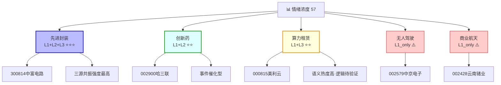

# 2026-08-05 · **群聊情绪共振**

> **数据源新鲜度**: partial
> **降级状态**: true（R1基准缺失，降级生成）
> **置信度**: 0.5（三层源存活，R1不可用→-0.05；规则版子串替代LLM语义→额外扣分）

## 一句话结论

先进封装(L1+L2+L3)三源共振最强，情绪中性偏多(57)；创新药(L1+L2)与算力租赁(L1+L3)为辅线共振；无人驾驶与商业航天仅为热榜单源(L1_only)，**不算正向共振**。

---

## 详细分析

### 🔍 情绪总况

今日(20260805)市场情绪浓度 **57分**（中性偏多），较基准50上浮7分。基准退化为中性值50，因R1_style.json尚未生成。情绪上行动力来自1个完整三源共振主题（先进封装）。

**情绪结构两极分化**：强势主题三源重叠，弱势主题仅靠热榜撑场——说明资金聚焦主线，边缘题材缺乏群众基础。

---

### 🎯 共振主题解析

#### Rank 1｜先进封装 ⭐⭐⭐（最强共振）

**三源共振(L1+L2+L3)**，WeFlow 20群语义覆盖 + KOL密集强Call + 热榜新进top14，三力叠加，共振等级最高。

| 维度 | 答案 |
|------|------|
| **大资金意图** | 成熟制程芯片从"涨价"向"缺货"演绎，对标2021年弹性复制，机构提前布局封装测试环节 |
| **为什么走强** | 热榜新进top14（昨日未上榜）+ KOL券商团队强Call + WeFlow多群提及形成舆论合力 |
| **逻辑够不够硬** | 有历史对标（2021年功率半导体缺货行情），但当前处于"涨价→缺货"传导初期，节奏需观察 |

**建议板块**: 先进封装
**建议股票**: 300814中富电路
**所处阶段**: middle（情绪已起，非最早布局窗口，但未到兑现期）

---

#### Rank 2｜创新药 ⭐⭐（中等共振）

**L1+L2共振**，热榜新进top18(CRO概念) + KOL群（题材基本面群）转发武田制药"全球新"创新药中国首报里程碑事件。

| 维度 | 答案 |
|------|------|
| **大资金意图** | 中国创新药从me-too向first-in-class转型，CDMO供应链价值重估 |
| **为什么走强** | 里程碑事件（武田制药中国首报）作为导火索，触发资金对创新药上游的情绪映射 |
| **逻辑够不够硬** | 单一事件催化，尚未形成板块效应；CRO概念热榜新进，说明资金关注度在提升 |

**建议板块**: 创新药
**建议股票**: 002900哈三联
**所处阶段**: middle

---

#### Rank 3｜算力租赁 ⭐⭐（中等共振）

**L1+L3共振**，WeFlow 20群热度评分238.9（最高）+ 热榜新进top12，但KOL层面无明确指向。

| 维度 | 答案 |
|------|------|
| **大资金意图** | AI算力需求持续扩张，租赁模式降低门槛，运营商和云厂商扩算力储备 |
| **为什么走强** | WeFlow语义层热度极高，但热榜排名仅12、缺乏KOL验证，属单边语义泡沫风险 |
| **逻辑够不够硬** | 热榜+WeFlow共振说明有资金关注，但缺少KOL层面的强逻辑背书，需后续验证 |

**建议板块**: 算力租赁
**建议股票**: 000815美利云
**所处阶段**: middle

---

#### Rank 4｜无人驾驶（热榜单源，非共振）

**L1_only**——仅热榜新进top10，无KOL验证，无WeFlow语义共振。按契约**不算正向共振**，降级为late阶段。

---

#### Rank 5｜商业航天（热榜单源，非共振）

**L1_only**——热榜有信号但无KOL和WeFlow支撑，同属单源题材。按契约**不算正向共振**，late阶段。

---

### 🌡️ 情绪浓度评估

| 项目 | 数值 |
|------|------|
| 情绪分 | **57**（0-100） |
| 基准 | 50（R1_style.json缺失，退化为中性值） |
| 共振加成 | +7（1个完整L1+L2+L3主题） |
| 5维度校验 | 未执行（R3不接管市场情绪skill输出） |
| R3 vs 5d gap | 未知（无5维度数据） |

---

## 📊 情绪共振地图

---

## 数据源审计

| 源 | 状态 | 抓取时间 | 记录数 | 备注 |
|---|---|---|---|---|
| WeFlow语义层 | 🟢 ok | 2026-08-05 | 100条 | 20群语义覆盖，热度评分完整 |
| WeChat-cli 五群 | 🟢 ok | 2026-08-05 | 518条 | 5群均存活，含KOL强Call文本 |
| Tushare热榜 | 🟢 ok | 2026-08-05 | 200条 | ths_hot新进8个概念 |
| XTick MCP | 🔴 not_available | — | — | 无MCP会话 |
| R1_style基准 | 🔴 error | — | — | 文件未生成，情绪基准降级 |

> **降级说明**: R1_style.json缺失导致情绪基准不可用，confidence=0.5低于完整实现区间下限，主因是规则版子串匹配替代了spec要求的LLM语义抽取。XTick未接入不影响本次判断。

---

## 不确定性 / 反证

1. **R1基准缺失**: 无法判断今日情绪相对昨日是改善还是恶化，57分的绝对值缺乏参照系。
2. **L1_only主题陷阱**: 无人驾驶和商业航天热榜排名靠前，可能是量化选股程序被动买入而非主动看多，不宜作为买入依据。
3. **WeFlow语义vs KOL分歧**: 算力租赁WeFlow热度最高(238.9)，但KOL层面零验证，存在语义泡沫风险。
4. **规则版替代LLM**: 本次生成使用子串匹配而非LLM语义抽取，kol_summary质量可能低于设计预期。

---

## 与其他 R/D/E 的关系

| 角色 | 关系 |
|------|------|
| **依赖** | R1_style.json（情绪基准，上游未就绪） |
| **依赖** | data/raw/20260805/weflow_snapshot.json（语义层，已就绪） |
| **依赖** | data/raw/20260805/wechat_cli_5groups.jsonl（KOL层，已就绪） |
| **被消费** | R2主线板块Agent（共振主题输入） |
| **被消费** | R5个股画像Agent（建议股票输入） |
| **被消费** | R6反证Agent（情绪分与主题列表输入） |

---

## Sub-Agent 元数据

- **skill**: analyze_sentiment_resonance_v1
- **artifact**: data/research/20260805/R3_sentiment.json
- **生成耗时**: 未记录（规则版，未记录耗时字段）
- **model**: rule_v1（规则版，非LLM语义抽取）
- **JSON status**: complete
- **MD status**: complete（本次重写）

---

*本报告由 R3 群聊情绪共振 Agent 生成 | 降级状态: true | 仅供交易参考，不构成投资建议*
