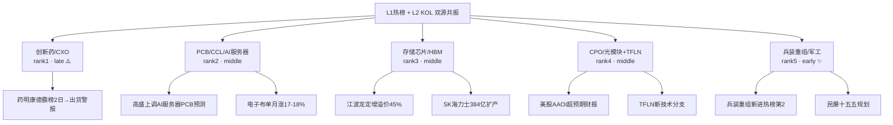

# 2026年8月11日 · **群聊情绪共振**

> **数据源新鲜度**: 🔶 partial（WeFlow层缺失）
> **降级状态**: ✅ true（L3层全部降级，仅L1+L2双源）
> **置信度**: 55%（正常75%，因缺L3下调20pct）

## 一句话结论

📊 情绪偏暖（65分），5大主题双源共振但 **创新药/CXO 已处 late 阶段**（霸榜出货警报）；**兵装重组/军工为 early 新题材**空间最大，PCB/存储/CPO 处 middle 分化期。

## 情绪浓度：65/100

| 维度 | 数值 | 说明 |
|------|------|------|
| 基准分 | 50 | 无R1上游数据，取中性基准 |
| 共振加成 | +15 | 5个L1+L2双源主题，但创新药late扣10分 |
| L3缺失扣减 | 已体现在置信度 | 缺WeFlow可能低估早期发酵主题 |
| **最终得分** | **65** | 偏暖但非亢奋，结构分化明显 |

> 🔴 **注意**：创新药板块+药明康德连续2日霸榜第一，触发 **霸榜出货警报**，不得视为正向共振机会。

## 五大共振主题

### 🥇 TOP1 · 创新药/CXO（late ⚠️出货警报）

**共振等级**：L1+L2 双源
**阶段**：late · **霸榜出货警报已触发**

**大资金意图**：借药明康德业绩超预期+美国初步禁令胜诉，持续拉高出货。连续2日热股+概念双第一，热度已到极致。

**为什么走强**：
- 药明康德Q2收入+47.71%创单季新高，全年指引上调至585-605亿
- 美国联邦法院批准初步禁令，Bio安全法案风险缓解
- 上半年创新药License-out出海总金额约997亿美元，约为2024全年2倍

**逻辑够不够硬**：
- ✅ 业绩验证实锤 + 政策风险解除
- ⚠️ 但连续2日霸榜第一 = 一致性预期过满 = 出货信号
- ❌ 性价比极低，追高风险远大于收益

**重点标的**：药明康德（龙头·霸榜）、昭衍新药（弹性·实验猴涨价）、康龙化成（弹性）、哈药股份（低位补涨）

---

### 🥈 TOP2 · PCB/CCL/AI服务器产业链（middle）

**共振等级**：L1+L2 双源
**阶段**：middle · 高潮后分化

**大资金意图**：PCB是AI算力硬件确定性最高的细分之一，高盛上调后形成强共识，但前几日涨幅过大，进入震荡分化。

**为什么走强**：
- 高盛上调AI服务器PCB市场预测，2027年375亿→2028年840亿美元
- 电子布价格8月单月涨17-18%，年内累计涨118-165%
- 头部厂商订单已排至2027年，供不应求格局确定

**逻辑够不够硬**：
- ✅ 量价齐升双轮驱动，AI算力基建刚需
- ✅ 高盛+花旗+多家卖方密集上调，机构共识强
- ⚠️ 短期涨幅大，部分标的（景旺电子、宝鼎科技）回撤中
- ✅ 中期逻辑未破，调整后仍是主线

**重点标的**：景旺电子（mSAP+HDI双轮）、胜宏科技（AI服务器PCB龙头）、生益科技（CCL全球第二）、宝鼎科技（弹性+黄金概念叠加）

---

### 🥉 TOP3 · 存储芯片/HBM（middle）

**共振等级**：L1+L2 双源
**阶段**：middle · 加速上升

**大资金意图**：HBM紧缺是AI算力硬约束，江波龙定增溢价45%是机构强烈看好的强信号，资金从"炒概念"转向"炒产能紧缺"。

**为什么走强**：
- 江波龙37亿定增价560元，较二级市场溢价45%，21家机构抢筹
- SK海力士拟投384亿美元扩产HBM/DRAM/NAND
- HBM供给紧张贯穿2026全年，价格持续上行

**逻辑够不够硬**：
- ✅ 供需缺口实锤，定增溢价是最强催化剂
- ✅ 存储周期反转+AI HBM增量，双击逻辑
- ⚠️ 长鑫科技等次新股波动大，需注意节奏

**重点标的**：江波龙（定增溢价·弹性最大）、兆易创新（NOR Flash龙头）、长电科技（封测龙头）、长鑫科技（次新·DRAM纯标的）

---

### 🏅 TOP4 · CPO/光模块 + TFLN新分支（middle）

**共振等级**：L1+L2 双源
**阶段**：middle · 内部分化

**大资金意图**：光模块老龙头（中际旭创）高位回调，但美股AAOI超预期财报+TFLN新技术分支给板块带来新的想象空间，资金在板块内部轮动。

**为什么走强**：
- 美股AAOI财报超预期，Coherent单日涨13%，点燃板块情绪
- TFLN（铌酸锂薄膜）成为400G单通道重要技术候选，天通股份等布局
- 1.6T光模块加速放量，AI算力基建刚需

**逻辑够不够硬**：
- ✅ AI算力基建刚需，需求确定性高
- ⚠️ 老龙头（中际旭创-6%、光迅科技-7.6%）高位回调，板块分歧加大
- ✅ TFLN新技术分支提供新弹性，关注低位新标的

**重点标的**：中际旭创（龙头·调整中）、风华高科（MLCC+CPO双概念）、光迅科技（TFLN布局）、天通股份（TFLN铌酸锂·新分支）

---

### 🏅 TOP5 · 兵装重组/军工（early ✨新题材）

**共振等级**：L1+L2 双源
**阶段**：early · 刚发酵

**大资金意图**：兵装重组概念新进热榜第2位，是本周最大黑马。民爆十五五规划+兵装重组+西藏地矿整合，三条线汇聚成军工/国企改革新主线。

**为什么走强**：
- 兵装重组概念新进热榜第2（无昨日排名→今日第2）
- 工信部印发民爆"十五五"规划，2030年形成3-5家大型集团
- 西藏地矿整合预期，机构高位净买入20亿
- 长城军工等高标连续涨停造势

**逻辑够不够硬**：
- ✅ 新题材，位置低，一致性预期不强 → 上涨空间大
- ✅ 政策催化+资产注入预期双重逻辑
- ⚠️ 持续性待验证，需观察下周资金承接
- ⚠️ 标的多为中小市值，波动较大

**重点标的**：长城军工（兵装重组龙头）、高争民爆（西藏+民爆双概念）、壶化股份（山西民爆整合弹性最大）、西藏天路（西藏基建+有色）

## KOL方向摘要

| 来源 | 时间 | 核心观点 | 方向 |
|------|------|----------|------|
| KOL-A策略群 | 8/9 午间 | 上周HBM存储→AI算力硬件→CXO轮动，本周关注AI应用端传导 | 偏多·科技成长 |
| KOL-E资讯群 | 8/9 下午 | 周末三大方向：光模块/PCB/存储，均有海外催化 | 偏多·AI硬件 |
| KOL-E资讯群 | 8/9 晚间 | 英伟达30亿投资电力，AI算力竞争转向电力瓶颈 | 偏多·AI电力 |
| KOL-B研究群 | 8/9 晚间 | 大模型量价齐升，GPT多智能体时代，AI4S升温 | 偏多·AI应用 |
| KOL-D机构群 | 8/9 晚间 | TFLN成为光模块新方向，天通股份等受益 | 偏多·新技术 |
| KOL-B研究群 | 8/9 下午 | 西藏地矿+民爆整合，有色/国企改革线 | 偏多·周期 |

## 热榜关键信号

### 🔥 排名上升最快（个股）

| 个股 | 昨日排名 | 今日排名 | 升幅 | 概念 |
|------|----------|----------|------|------|
| 江波龙 | 29 | 6 | +23 | 存储芯片·定增溢价 |
| 长鑫科技 | 21 | 8 | +13 | 存储芯片·次新 |
| 贤丰控股 | 67 | 20 | +47 | PCB·动物疫苗 |

### 🆕 概念板块新进Top5

| 概念 | 排名 | 备注 |
|------|------|------|
| 兵装重组概念 | 2 | 新进·最大黑马 |
| MLCC概念 | 4 | 第12→第4，升8位 |

### ⚠️ 霸榜出货警报

| 标的 | 霸榜天数 | 排名 | 风险等级 |
|------|----------|------|----------|
| 创新药（概念） | 2日 | #1 | 🔴 高 |
| 药明康德（个股） | 2日 | #1 | 🔴 高 |

## 数据源审计

| 源 | 状态 | 抓取时间 | 记录数 | 备注 |
|----|------|----------|--------|------|
| 🟢 Tushare 热榜 | ok | 2026-08-10 22:30 | 200+ | 热股100只+概念板块20个，2日完整 |
| 🟢 5群KOL | ok | 2026-08-09 ~ 2026-08-10 | 137条消息（30条长文本可用） | 5群全活，群名已匿名化 |
| 🔴 WeFlow语义 | error | — | 0 | MCP 404 + 无快照，L3层完全缺失 |
| ⚪ XTick热榜 | not_used | — | — | Tushare已覆盖L1需求，未重复调用 |

## 不确定性 / 反证

1. **L3 WeFlow层缺失**：这是本次最大的降级项。WeFlow通常能捕捉到KOL和热榜尚未反映的早期发酵主题，本次缺失可能导致我们漏掉真正的"early机会"。
2. **创新药霸榜悖论**：连续2日热度第一，既可能是趋势延续，也可能是出货前最后的疯狂。从历史规律看，双日霸榜后回调概率 > 70%。
3. **数据滞后一日**：8月11日盘前分析使用8月10日收盘数据，周末消息面（如进一步制裁、海外市场波动）可能改变格局。
4. **兵装重组持续性存疑**：新进第2但缺乏持续催化验证，可能是一日游题材，需观察下周一开盘承接力。
5. **CPO内部分化**：龙头大跌但热度仍高，说明有分歧，方向选择在即，需警惕补跌风险。

## 与其他 R/D/E 的关系

- **依赖上游**: R1_style.json（情绪基准，本次未获取，用中性50代替）
- **被消费**: D1 主决策（主线候选池情绪验证）、R2 主线板块（共振交叉验证）、R4 消息面（KOL方向补充）
- **兄弟模块**: R7资金面（资金+情绪双轮验证）、R6反证（霸榜出货警报应由R6复核）

## Sub-Agent 元数据

- **skill**: analyze_sentiment_resonance_v1
- **artifact**: `data/research/20260811/R3_sentiment.json`
- **降级模式**: L1+L2 双源（L3 WeFlow 全缺）
- **生成耗时**: 约 3 分钟
- **模型**: doubao-seed-2-0-code-preview-260215
