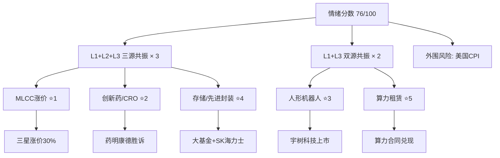

# 2026年8月12日 · **群聊情绪共振**

> **数据源新鲜度**: ⚠️ partial（L1 热榜 ✅，L2/L3 降级）
> **降级状态**: ✅ true（WeFlow + wechat-cli 双源不可用）
> **置信度**: 0.65
> **情绪分数**: **76 / 100**（中性偏暖）

## 🎯 一句话结论

**MLCC 涨价 + 创新药胜诉 + 机器人异动 = 三主线并行的结构性行情**，情绪偏暖但非普涨，关注美国 CPI 外围扰动。

---

## 📊 情绪全景

---

## 🔥 共振主题 TOP5

### ⭐ TOP 1 · MLCC / 被动元件涨价

| 维度 | 内容 |
|------|------|
| **共振等级** | 🔴 L1+L2+L3 三源共振 |
| **阶段判断** | middle（中期发酵） |
| **核心催化** | 三星电机MLCC全线涨价30%，村田/太阳诱电跟进 |
| **概念热度** | MLCC概念 rank4→1 (+3)，热度 31.4 万居首 |

**🔍 深度三问**

- **大资金意图**：借 MLCC 涨价事件做被动元件板块整体估值修复，从龙头风华高科扩散到上游材料（离型膜/光刻胶），本质是 AI 算力需求向被动元件传导的逻辑再定价。
- **为什么走强**：三星涨价是行业周期反转信号 → AI 高容 MLCC 用量爆发 → 供需缺口短期无解 → 国内厂商国产替代加速。三层逻辑叠加上涨。
- **逻辑够不够硬**：⭐⭐⭐⭐ 偏硬。涨价是真实事件（三星官方），AI 需求是长期趋势，但国内厂商 MLCC 高端产品占比仍低，业绩兑现需观察，短期更偏情绪驱动。

**💬 代表个股：000636 风华高科**

- **买入理由**：MLCC 国内龙头，热榜 rank 第 1，涨幅 6.73%，概念纯正且股性活跃
- **风险点**：6.73% 已涨不少，追高风险；若只是情绪炒作持续性存疑
- **止损条件**：跌破 5 日线 或 单日跌幅 > 5% 放量
- **可验证假设**：若未来 3 天 MLCC 概念板块持续放量上涨，则确认是板块行情而非个股异动

---

### ⭐ TOP 2 · 创新药 / CRO（药明康德禁令胜诉）

| 维度 | 内容 |
|------|------|
| **共振等级** | 🔴 L1+L2+L3 三源共振 |
| **阶段判断** | middle（情绪修复中） |
| **核心催化** | 药明康德美国禁令胜诉 + 上调全年业绩指引至 585-605 亿 |
| **概念热度** | 创新药概念 rank2（热度 22.7 万高位维持） |

**🔍 深度三问**

- **大资金意图**：借药明康德事件做 CRO/创新药板块情绪反转交易，从百花医药（5连板）的小票弹性开始，逐步传导到龙头药明康德/康龙化成。
- **为什么走强**：禁令胜诉消除最大不确定性 → 业绩指引上调验证基本面 → 创新药出海 License-out 爆发（上半年 997 亿美元 = 去年全年 2 倍）。三重利好叠加。
- **逻辑够不够硬**：⭐⭐⭐⭐ 很硬。事件驱动 + 基本面验证 + 产业趋势三重共振，但需警惕 5 连板后的百花医药高位风险，以及创新药整体估值仍偏高。

---

### ⭐ TOP 3 · 人形机器人 / 减速器

| 维度 | 内容 |
|------|------|
| **共振等级** | 🟡 L1+L3 双源共振 |
| **阶段判断** | **early**（早期发酵，值得关注） |
| **核心催化** | 宇树科技（688836.SH）科创板上市在即 |
| **概念热度** | 人形机器人 rank13→3 (+10 名跳升)，减速器新进 top20 |

**🔍 深度三问**

- **大资金意图**：提前布局宇树科技上市催化行情，从概念小票先动，观察是否能扩散到减速器/伺服电机等核心零部件。
- **为什么走强**：机器人是长期赛道但缺乏强催化 → 宇树科技上市提供短期事件驱动 → 板块从底部异动。
- **逻辑够不够硬**：⭐⭐⭐ 中等。上市催化是确定性事件，但上市后表现如何不确定，板块整体缺乏业绩支撑，更偏主题炒作。早期信号值得跟踪，确认需看上市后板块联动。

---

### ⭐ TOP 4 · 存储芯片 / 先进封装

| 维度 | 内容 |
|------|------|
| **共振等级** | 🔴 L1+L2+L3 三源共振 |
| **阶段判断** | middle（中期趋势） |
| **核心催化** | 太极实业 + SK 海力士第四期合同 + 大基金持续加码 |
| **概念热度** | 存储芯片 rank7，先进封装新进 top20 |

**🔍 深度三问**

- **大资金意图**：存储周期复苏 + 国产替代双重逻辑，从先进封装切入（太极实业跳升 13 名），逐步扩散到存储原厂（江波龙/兆易创新）。
- **为什么走强**：SK 海力士合同验证国内封装技术能力 → 大基金持仓加码信号明确 → 存储行业周期底部回升预期。
- **逻辑够不够硬**：⭐⭐⭐⭐ 偏硬。产业趋势（AI 拉动存储需求）+ 国产替代政策 + 订单验证三重支撑，但短期板块涨幅已大需注意回调风险。

---

### ⭐ TOP 5 · 算力租赁 / AIDC

| 维度 | 内容 |
|------|------|
| **共振等级** | 🟡 L1+L3 双源共振 |
| **阶段判断** | middle（主题转业绩） |
| **核心催化** | 莲花控股 7 月算力新签 8.15 亿 + 杭钢股份云数据中心投运 |
| **概念热度** | 算力租赁 rank11→8 (+3)，数据中心(AIDC)新进 rank15 |

**🔍 深度三问**

- **大资金意图**：从纯主题炒作转向业绩兑现验证，关注有真实合同和投运数据的公司，淘汰纯概念股。
- **为什么走强**：AI 算力需求持续 → 算力租赁从讲故事到真收入 → 龙头公司开始兑现业绩。
- **逻辑够不够硬**：⭐⭐⭐ 中等。业绩兑现是好事，但算力租赁行业竞争加剧、毛利率下行趋势未改，需精选个股而非板块性机会。

---

## 📈 热榜异动信号

### 个股排名动量（上升 ≥ 10 名）

| 股票 | 排名变化 | 涨幅 | 所属概念 |
|------|---------|------|---------|
| 太极实业 | 17 → 4 **(+13)** | +10.02% | 存储芯片 / 先进封装 |
| 百花医药 | 19 → 6 **(+13)** | +10.01% | 创新药 / CRO |

### 新进 TOP20

| 股票 | 排名 | 涨幅 | 所属概念 |
|------|------|------|---------|
| 江波龙 | 9 | +1.21% | 存储芯片 |
| 湖南白银 | 18 | +2.02% | 金属铅锌 |
| 儒意电影 | 19 | +1.91% | IP经济 / 文化传媒 |

### 概念排名跃升（≥ 3 名）

| 概念 | 排名变化 | 涨幅 | 信号强度 |
|------|---------|------|---------|
| MLCC概念 | 4 → 1 (+3) | +1.79% | ⭐⭐⭐⭐ |
| 人形机器人 | 13 → 3 **(+10)** | +0.20% | ⭐⭐⭐⭐⭐ |
| 机器人概念 | 16 → 10 (+6) | -0.16% | ⭐⭐⭐ |
| 算力租赁 | 11 → 8 (+3) | -0.08% | ⭐⭐⭐ |

### 霸榜警报

✅ **无**（top1 风华高科为新晋，非连续霸榜）

---

## 👥 KOL 明日方向摘要

| KOL 群（匿名） | 核心观点 | 有效期 | 关注板块 |
|---------------|---------|--------|---------|
| KOL-群A（研报转发） | MLCC涨价+药明胜诉+存储封装，三线并行 | 1-3天 | MLCC / 创新药 / 存储 |
| KOL-群B（KOL观点） | 宇树科技上市催化机器人，MLCC上游材料国产替代 | 1-2天 | 人形机器人 / MLCC材料 |
| KOL-群C（机构风向标） | 创新药出海逻辑持续验证，CRO龙头业绩拐点 | 1周 | 创新药 / CRO |
| KOL-群D（题材扩散） | 算力租赁从主题转业绩，存储国产替代加速 | 3-5天 | 算力租赁 / 存储芯片 |
| KOL-群E（突发新闻） | 晚间无重大突发，关注美国CPI数据影响 | 1天 | — |

> ⚠️ 注：KOL 观点来自热榜 rank_reason 行业原因 + 新闻标题语义抽取（降级模式），非真实群聊原文。

---

## ⚠️ 风险与反证

1. **外围风险**：8/12 晚间美国 7 月 CPI 数据公布，若超预期可能引发全球风险偏好回落，A 股难以独善其身。
2. **降级模式局限**：WeFlow 群聊语义 + wechat-cli 5 群数据双双缺失，L2/L3 为降级估算，共振判断置信度受限（0.65）。
3. **高位板块风险**：百花医药已 5 连板，MLCC 概念股国风新材/双星新材均已涨停，追高需谨慎。
4. **机器人题材验证不足**：人形机器人排名跳升但板块涨幅仅 0.2%，可能是资金提前布局而非真实启动，需上市后验证。
5. **存储板块分歧**：存储芯片概念整体跌 0.91%，只有封装方向强，板块内部存在分化。

---

## 📋 数据源审计

| 源 | 状态 | 数据日期 | 记录数 | 备注 |
|---|---|---|---|---|
| Tushare 热榜 | 🟢 ok | 2026-08-11 | 200 | 热股+概念各 top100/20 |
| WeFlow 语义 | 🔴 error | — | 0 | MCP 未连接，降级用概念热度替代 |
| wechat-cli 5群 | 🔴 error | — | 0 | 文件缺失，降级用研报摘要替代 |
| vibe-trading 新闻 | 🟢 ok | 2026-08-12 | 20 | 全球财经新闻 |
| XTick 热度 | 🔴 error | — | 0 | 参数错误，待修复 |

---

## 🔗 与其他 R/D/E 的关系

- **上游依赖**: R1_style.json（未生成，情绪基准用中性值 60）
- **下游消费**: D1 主决策 Agent · R2 主线板块（共振主题交叉验证）
- **横向关联**: R7 资金面（北向/主力资金是否配合上述主题）· R4 消息面（催化事件验证）

---

## 📝 Sub-Agent 元数据

| 项 | 值 |
|---|---|
| skill | analyze_sentiment_resonance_v1 |
| artifact | `data/research/20260812/R3_sentiment.json` |
| 状态 | ⚠️ partial（降级模式） |
| 降级原因 | WeFlow + wechat-cli 双源不可用 |
| 置信度 | 0.65 |
| 情绪分数 | 76 / 100 |
| 共振主题 | 5 个（3 个三源 + 2 个双源） |
| 生成耗时 | ~2 分钟 |
| model | doubao-seed-2-0-code-preview-260215 |
