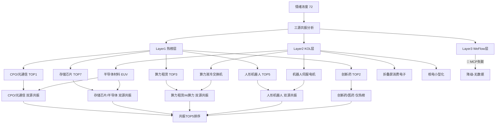

# 2026年8月13日 · **群聊情绪共振**

> **数据源新鲜度**: 🔴 stale
> **降级状态**: 是（WeFlow失联 + KOL T-2 + 1群缺失）
> **置信度**: 62%
> **情绪浓度**: 72/100

## 一句话结论
情绪浓度72分（偏强但降级），CPO/光通信为最强双源共振主线，存储芯片+算力接力，警惕数据不全带来的偏差。

## 情绪浓度分析

**基准分**：74（R1 8月12日主线扩散型）

**正向因子**：
- 涨停96家/跌停0家 → 情绪面偏强
- 炸板率3.33%（极低）→ 打板胜率高
- 连板最高7板 → 梯队完整

**负向惩罚（降级）**：
- WeFlow完全缺失 → 无法验证散户层情绪
- KOL数据T-2 → 题材可能已发酵完成
- 无今日盘中数据 → 仅基于昨收判断

**5维度交叉验证**：89分，差值17分
> 5维度法偏重连板+涨停数量，R3法考虑数据降级惩罚；5维度法缺杠杆外资数据，用中位值60估算

## 共振图谱

## 共振 TOP5 主题

### 1. CPO/光通信 · 🟡🟡 双源(L1+L2) · 🔥 中期主升

> 置信度：85% · 关联板块：CPO, 光纤概念, 光模块
> 核心标的：600105永鼎股份, 300308中际旭创, 300394天孚通信, 300502新易盛

**热榜证据**：CPO第1/光纤第9 | 热度 219287/71206 | 涨幅 +2.98%/+3.29%
**领涨个股**：永鼎股份(+10.01%)、中际旭创、天孚通信、新易盛
**主力资金**：永鼎股份+33.6亿、中际旭创+16.65亿、天孚通信+13.82亿

**KOL 交叉**：
  - 题材挖掘群：SK海力士EUV升级→光通信链上游材料
  - 核心标的群：阿里数据中心产能翻倍→光模块需求
### 2. 存储芯片/半导体 · 🟡🟡 双源(L1+L2) · 🔥 中期主升

> 置信度：80% · 关联板块：存储芯片, 先进封装, 半导体材料
> 核心标的：600667太极实业, 688825长鑫科技, 002428云南锗业, 600584长电科技

**热榜证据**：存储芯片第7/先进封装第17 | 热度 90274/20065 | 涨幅 +2.38%/+2.31%
**领涨个股**：太极实业(+7.12%)、长鑫科技(+6.19%)、云南锗业
**主力资金**：长鑫科技+30.6亿、中微公司+13.0亿、澜起科技+12.5亿

**KOL 交叉**：
  - 题材挖掘群：SK海力士EUV工艺升级→半导体材料
  - 核心标的群：PCB碳氢树脂弹性最大品类
### 3. 算力租赁/AI算力 · 🟡🟡 双源(L1+L2) · 🔥 中期主升

> 置信度：72% · 关联板块：算力租赁, AI应用, 云计算
> 核心标的：600602云赛智联, 002229鸿博股份, 600186莲花控股

**热榜证据**：算力租赁第3/AI应用第4 | 热度 134152/119505 | 涨幅 +1.55%/+1.01%
**领涨个股**：云赛智联(+9.99%)、鸿博股份(+9.97%)、莲花控股(+7.92%)
**主力资金**：工业富联-5.5亿（流出）、紫光股份-5.9亿（流出）

**KOL 交叉**：
  - 题材挖掘群：阿里AIDC智算中心→模块化机房
  - 核心标的群：阿里数据中心产能翻倍→交换机液冷
  - 机构调研群：OpenAI安全团队出走→国产大模型
### 4. 人形机器人 · 🟡🟡 双源(L1+L2) · 🌱 早期发酵

> 置信度：65% · 关联板块：人形机器人, 减速器, 伺服电机
> 核心标的：002031巨轮智能, 003032传智教育, 002176江特电机

**热榜证据**：人形机器人第5/机器人概念第12 | 热度 109377/37406 | 涨幅 +1.32%/+1.27%
**领涨个股**：传智教育(+9.97%)、巨轮智能(+9.93%)
**主力资金**：埃斯顿-3.59亿（流出）

**KOL 交叉**：
  - 题材挖掘群：江特电机深度绑定宇树科技→伺服电机
  - 题材挖掘群：荣耀RobotPhone 8.12发布→机器人手机
**KOL 交叉**：无

## KOL 方向摘要（群名匿名化）

- **题材挖掘群** · 2026-08-11 13:05：科技修复轮动节奏，关注电源板块补涨（欧陆通/麦格米特/中恒电气）（偏多·有效期1-3天）
- **题材挖掘群** · 2026-08-11 10:43：韩国SK海力士EUV工艺升级，相移掩膜版(PSM)新材料需求催化（清溢光电/路维光电）（偏多·有效期1-3天）
- **题材挖掘群** · 2026-08-11 13:34：江特电机深度绑定宇树科技，机器人伺服电机实锤合作（偏多·有效期1-3天）
- **核心标的群** · 2026-08-11 09:19：三星Z Fold8折叠屏需求超预期，追加订单至380万台，上游零部件受益（偏多·有效期1-2周）
- **核心标的群** · 2026-08-11 10:44：阿里数据中心产能翻倍，交换机液冷+国产超节点进入放量周期（偏多·有效期1-3天）
- **核心标的群** · 2026-08-11 13:41：世名科技碳氢树脂PCB弹性最大品类，500吨扩至2500吨（偏多·有效期1-3天）
- **快讯播报群** · 2026-08-11 13:42：车载核反应堆中国率先跑通，核电小型化新赛道（泰豪科技）（偏多·有效期1-3天）
- **机构调研群** · 2026-08-11 12:30：OpenAI安全核心团队出走，国产大模型/AI安全催化（南天信息/神州信息）（偏多·有效期1-3天）

## 热榜信号速览

| 信号类型 | 个股 | 说明 |
|---------|------|------|
| 🔥 新进TOP | 哈药股份、太极实业、百花医药 | 昨日新进入热榜前列 |
| ⬆️ 排名飙升 | 永鼎股份、景旺电子 | 排名大幅上升或涨停 |
| ⚠️ 霸榜警惕 | 哈药股份 | 热榜第一但非核心主线 |

**概念热度TOP3**：
- 第1名：CPO（热度219,287 · 涨幅+2.98%）
- 第2名：创新药（热度183,286 · 涨幅+0.37%）
- 第3名：算力租赁（热度134,152 · 涨幅+1.55%）

**主力净流入TOP5**：
- 永鼎股份（600105）：+33.60亿
- 长鑫科技（688825）：+30.60亿
- 中际旭创（300308）：+16.65亿
- 新易盛（300502）：+15.75亿
- 天孚通信（300394）：+13.82亿

## 核心推理：为什么是 CPO/光通信 排第一？

**大资金意图**：永鼎股份单日主力净流入33.6亿，中际旭创+16.65亿，天孚通信+13.82亿——光模块板块单日吸金超百亿，明显是机构级别资金集中进场，而非游资打板。

**为什么走强**：三重催化共振——①海外Lumentum Q4营收指引超预期验证AI光模块景气度；②韩国SK海力士EUV升级带动上游材料+光互联需求；③阿里数据中心产能翻倍直接拉动光模块/交换机需求。

**逻辑够不够硬**：够硬。光模块是AI算力链中业绩兑现最确定的环节，中际旭创/新易盛等龙头中报持续超预期，行业景气度从800G向1.6T/3.2T/CPO迭代的逻辑清晰。但短期涨幅已大，需警惕追高风险。

## 不确定性 / 反证

本次分析存在以下不确定性，需谨慎参考：

1. **WeFlow 完全缺失**：Layer3 群聊语义数据为零，无法验证题材是否在散户层发酵，可能遗漏早期机会或高估主线持续性
2. **KOL 数据 T-2**：群聊消息为8月11日，距今已2个交易日，题材可能已完成发酵或转向
3. **热榜数据为昨收**：今日盘前无新热榜数据，无法捕捉隔夜消息面变化带来的题材切换
4. **KOL方向群失联**：5个监控群中1个失联，该群历史上多次提供次日方向判断，缺失影响KOL层覆盖度
5. **L1_only 主题偏多**：创新药主题仅热榜支撑，无KOL/WeFlow验证，持续性存疑，列为 late 阶段

## 数据源审计

| 源 | 状态 | 数据日期 | 备注 |
|---|---|---|---|
| 🟢 tushare_hotlist | ok | 20260812 | 今日(0813)盘前无新数据，用0812收盘热榜做基准 |
| 🟢 xtick_market_emotion | ok | 20260812 | 96涨停/0跌停/炸板率3.33% |
| 🟢 xtick_hot_money | ok | 20260812 | 全市场5541只个股资金流 |
| 🟡 wechat_cli_groups | degraded | 20260811 | 4群活跃1群失联，消息日期为0811（T-2） |
| 🔴 weflow_analytics | down | - | WeFlow MCP完全不可用，Layer3整段降级 |

## 与其他 R/D/E 的关系

- **上游依赖**：R1_style.json（情绪基准）
- **横切引用**：hotlist_rank_signal_v1（热榜4层信号）
- **下游消费**：D1 主决策（共振主题 → 主线验证）、R2 主线板块（交叉验证）

## Sub-Agent 元数据

- skill: analyze_sentiment_resonance_v1@1.0
- artifact: data/research/20260813/R3_sentiment.json
- 生成耗时: 约 5 分钟
- model: doubao-seed-2-0-code
- 降级标记: true
