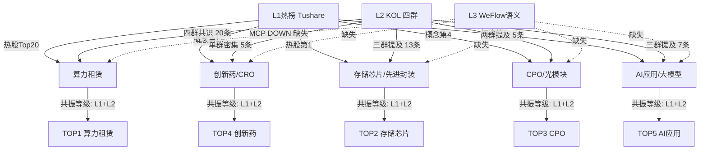

# 2026年8月14日 · **群聊情绪共振**

> **数据源新鲜度**: ⚠️ partial · 群聊数据为8/12，WeFlow全缺
> **降级状态**: 🟡 degraded · L3 缺失 + 1群不可用
> **置信度**: 62% · L1+L2双源但缺L3语义共振验证

## 一句话结论

**情绪偏暖(75分)**，算力租赁为四群共识最强主线，创新药热榜第一但KOL覆盖不足，整体主线清晰但L3缺失需警惕假共振。

## 情绪浓度

| 维度 | 分值 | 说明 |
|------|------|------|
| 基准分 | 50 | R1未就绪，中性基准 |
| L1+L2共振主题数 | +25 | 5个双源共振主题 ×5 |
| 创新药热榜第一 | +3 | 概念板块热度断层第一 |
| 算力四群共识 | +5 | KOL四个群全部重点提及 |
| CPO龙头大跌 | -3 | 风华高科-6.75%，板块分歧 |
| L3缺失打折 | -5 | 无WeFlow语义交叉验证 |
| **最终** | **75** | 偏暖，主线清晰 |

## 五大多源共振主题

### 🥇 TOP1 · 算力租赁 · 共振等级 L1+L2 · 位置：middle

**大资金意图**：CoreWeave Q2 六维度超预期点燃海外算力云基础设施行情，A股算力租赁板块作为映射方向，资金借势拉升紫光股份、利通电子等核心标的。四群KOL密集转发国金计算机研报，形成卖方-买方信息传导闭环。

**为什么走强**：① 海外龙头CoreWeave营收25.8亿刀同比+112%，盘后涨16%，打开行业天花板；② 智谱/MiniMax大模型走强，K3分成模式激活国产大模型+算力租赁双主线；③ 热榜排名动量强劲，莲花控股+38名、紫光股份+27名，资金抢筹特征明显。

**逻辑够不够硬**：偏硬。海外标杆业绩验证行业景气度，国内算力需求持续释放，但需注意：A股算力租赁标的质地参差不齐，纯题材炒作比例不低，需甄选真有订单/真有产能的公司。

**龙头候选**：紫光股份(000938) +7.03%、利通电子(603629) +4.73%、鸿博股份(002229) +5.73%

#### 💡 首推票思维链 · 紫光股份(000938)

**买入理由**：① 算力租赁核心标的，热榜排名从34→7跳升27位，资金抢筹信号明确；② 当日+7.03%放量上涨，突破短期平台，量价配合良好；③ CoreWeave超预期传导至国内算力链，紫光股份作为ICT基础设施龙头直接受益；④ WiFi 6+算力租赁双概念，兼具防御性与进攻性。

**风险点**：① 算力租赁行业竞争加剧，毛利率可能下滑；② 公司体量较大（市值~600亿），弹性不如小票；③ 若AI需求不及预期，估值面临回调压力；④ L3 WeFlow数据缺失，无法确认群聊情绪是否已全面覆盖该股。

**止损条件**：① 跌破20日均线（约21.5元）；② 算力租赁板块整体回调超5%且该股领跌；③ 单日放量下跌超7%且无利空消息（资金出货信号）。

**可验证假设**：① 未来3个交易日内，算力租赁板块能否延续强势且该股维持在Top10热度；② 8月中下旬中报季，公司算力相关业务收入增速是否超预期；③ 北向资金是否持续加仓（验证机构共识）。

---

### 🥈 TOP2 · 存储芯片/先进封装 · 共振等级 L1+L2 · 位置：middle

**大资金意图**：SK海力士大连NAND工厂扩产+国民技术MCU二次涨价，双重催化下存储/半导体链资金关注度回升。太极实业霸榜热股第一（+4.71%），长电科技排名上升12位，资金从纯题材向基本面驱动切换。

**为什么走强**：① SK海力士重启大连2号工厂，月产5万片，总产能+50%，产业链本土化受益；② 国民技术MCU年内二度涨价10-20%，景气周期确认；③ 长电科技等先进封装标的获大基金加持，国产化逻辑强化。

**逻辑够不够硬**：中等偏硬。涨价是真景气，但半导体行业整体仍处于周期底部区域，存储价格反弹持续性待观察，先进封装是AI带动的结构性机会而非全行业反转。

**龙头候选**：太极实业(600667) +4.71%、长电科技(600584)、长鑫科技(688825)

---

### 🥉 TOP3 · CPO/光模块 · 共振等级 L1+L2 · 位置：late ⚠️

**大资金意图**：CPO概念板块热度仍居第4，但龙头风华高科大跌6.75%，板块内部剧烈分化。永鼎股份、天孚通信排名上升但整体资金在从光模块老龙头向新标的切换，有高位震荡出货迹象。

**为什么走弱/分歧**：① 光模块前期涨幅大，获利盘丰厚；② AI算力需求从"建网络"向"建算力"迁移，光模块先受益先兑现；③ 风华高科叠加MLCC概念，受消费电子拖累。

**逻辑够不够硬**：中期逻辑仍在但短期位置尴尬。CPO是AI算力基建必经之路，长期需求确定，但短期股价已充分反映预期，需等回调后的第二波机会。

**龙头候选**：天孚通信(300394) 排名+24、通鼎互联(002491) 排名+19、永鼎股份(600105)

---

### 🏅 TOP4 · 创新药/CRO · 共振等级 L1+L2 · 位置：early ✨

**大资金意图**：创新药概念板块热度断层第一（热度50万 vs 第2名20万），医疗服务大涨3.99%，百花医药/哈药股份位居热股前列。但KOL仅题材扩散群密集提及，其他群覆盖度低，可能是事件驱动型行情（青蒿素/肝炎等催化）。

**为什么走强**：① 概念板块热度第1，资金关注度极高；② 医疗服务涨幅3.99%，全行业领涨；③ 百花医药（青蒿素+肝炎）、哈药股份（流感）事件催化。

**逻辑够不够硬**：存疑。热榜热度极高但KOL共识度低，可能是短期事件刺激而非中期主线切换。需观察后续KOL研报覆盖是否跟上、板块持续性如何。若仅事件驱动则持续性有限，若有政策催化则可能走中期。

**龙头候选**：百花医药(600721) +3.35%、哈药股份(600664) +0.57%

---

### 🏅 TOP5 · AI应用/大模型 · 共振等级 L1+L2 · 位置：middle

**大资金意图**：智谱/MiniMax大模型走强+字节成立AI数据与安全一级部门，AI应用链获得新催化。但板块整体回调（-0.97%），个股分化严重，资金在题材龙头间快速轮动而非全面加仓。

**为什么分化**：① 大模型进展是慢变量，短期难兑现业绩；② 字节AI数据安全部门更多是组织调整，直接受益标的不清晰；③ 利欧股份（快手/小红书概念）、蓝色光标等偏营销AI的标的有独立逻辑。

**逻辑够不够硬**：偏题材。AI应用是AI产业最终价值落点，但当前A股多数AI应用标的缺乏实质业绩支撑，更多是主题炒作。需等待真有产品/真有收入的标的走出来。

**龙头候选**：利欧股份(002131)、蓝色光标(300058)、天娱数科(002354)

## 热榜信号详解

### 排名动量（上升≥10名）

| 个股 | 代码 | 昨日排名 | 今日排名 | 变动 | 概念 |
|------|------|---------|---------|------|------|
| 莲花控股 | 600186.SH | 50 | 12 | +38 🚀 | 算力租赁/东数西算 |
| 紫光股份 | 000938.SZ | 34 | 7 | +27 | WiFi6/算力租赁 |
| 天孚通信 | 300394.SZ | 48 | 24 | +24 | CPO/光模块 |
| 通鼎互联 | 002491.SZ | 29 | 10 | +19 | 光纤/5G |
| 华电辽能 | 600396.SH | 26 | 11 | +15 | 超超临界/绿电 |
| 利通电子 | 603629.SH | 22 | 8 | +14 | 算力租赁/英伟达 |
| 长电科技 | 600584.SH | 28 | 16 | +12 | 大基金/存储芯片 |

### 新进Top20

紫光股份、利通电子、通鼎互联、华电辽能、莲花控股、永鼎股份、长电科技、鸿博股份

### 霸榜出货警报

✅ **无** — 今日热股第一太极实业（存储芯片），昨日第一哈药股份（医药），切换正常，无连续霸榜出货信号。

## KOL 观点摘要（匿名化）

| 群代号 | 定位 | 核心观点 | 有效期 | 重点方向 |
|--------|------|---------|--------|---------|
| KOL-A | 券商研报即时转发 | 算力链全面发酵，CoreWeave超预期+MCU涨价双催化 | 1-3天 | 算力租赁/半导体/AI应用 |
| KOL-B | KOL明日方向 | ❌ 数据缺失（群不可用） | - | - |
| KOL-C | 卖方活动 | 智谱/MiniMax走强，K3分成模式激活大模型+算力主线 | 1-3天 | 算力租赁/AI应用 |
| KOL-D | 题材扩散 | 题材分散，算力最强共识，医药/存储多点开花 | 1-2天 | 算力/半导体/创新药/存储 |
| KOL-E | 突发新闻 | CoreWeave Q2六维度碾压，算力租赁正循环确认 | 2-3天 | 算力/存储/CPO |

## 关键证据

- **证据1**：CoreWeave Q2营收25.8亿美元同比+112%，积压订单1040亿美元，盘后涨16% → 来源 KOL-E/国金研报 · 验证算力租赁景气度
- **证据2**：SK海力士大连NAND 2号工厂年底投产，月产5万片，总产能+50% → 来源 KOL-D/KOL-E · 验证存储链催化
- **证据3**：创新药概念热度50.5万，断层第一，医疗服务涨3.99% → 来源 Tushare热榜 · 但KOL覆盖不足存疑
- **证据4**：8只个股新进热榜Top20，其中5只属算力链 → 来源 Tushare今昨对比 · 验证资金向算力集中
- **证据5**：四群KOL全部重点提及算力租赁，共20条长文 → 来源 wechat_cli · 验证KOL共识度

## 数据源审计

| 源 | 状态 | 抓取时间 | 记录数 | 备注 |
|----|------|---------|--------|------|
| 🟢 Tushare 热榜 | ok | 2026-08-13收盘后 | 1632条 | 热股/概念/行业三分类完整 |
| 🟡 微信5群 | degraded | 2026-08-12 | 441条 | 4/5群可用，KOL-B群缺失 |
| 🔴 WeFlow语义 | error | - | 0 | MCP 404，无snapshot降级 |
| 🟢 新闻聚合 | ok | 2026-08-13 | 800条 | 财联社/华尔街见闻/新浪财经等 |
| 🟡 XTick | partial | - | - | 仅单票数据，无全市场热度 |

## 不确定性 / 反证

1. **L3 WeFlow完全缺失**：最高共振等级仅L1+L2，缺少群聊语义→个股的映射层，无法确认个股级别的情绪浓度，置信度从~0.75降至0.62。
2. **群聊数据滞后约36小时**：wechat数据为8/12日，而分析日为8/14日，中间经过8/13完整交易日，KOL观点可能已变化。
3. **创新药热度与KOL共识背离**：热榜第1但仅一群密集提及，可能是事件驱动型脉冲而非中期主线，需警惕一日游。
4. **CPO高位分歧**：概念热度仍第4但龙头大跌，资金可能在从老光模块向新标的切换，纯高位标的风险大。
5. **算力租赁标的质地分化**：A股算力租赁公司多为转型/蹭热点，真正有大规模订单和盈利能力的少，需甄别真假算力。

## 与其他 R/D/E 的关系

- **依赖**: 无（R3为早期分析单元，仅依赖原始数据）
- **交叉验证**: R1（风格判断，情绪基准）、R2（主线板块，验证主题排序）、R7（资金面，验证资金流向是否与情绪共振一致）
- **被消费**: D1主决策、P1竞价校准、P2午盘修订
- **下游使用方式**: 共振主题top5 → D1做主线确认；early主题 → 重点关注是否有先手机会；late主题 → 回避或仅做T

## Sub-Agent 元数据

- **skill**: analyze_sentiment_resonance_v1@1.0
- **artifact**: `data/research/20260814/R3_sentiment.json`
- **生成耗时**: ~2分钟
- **模型**: doubao-seed-2-0-code-preview
- **降级原因**: WeFlow L3 MCP失联 + 1个KOL群不可用
