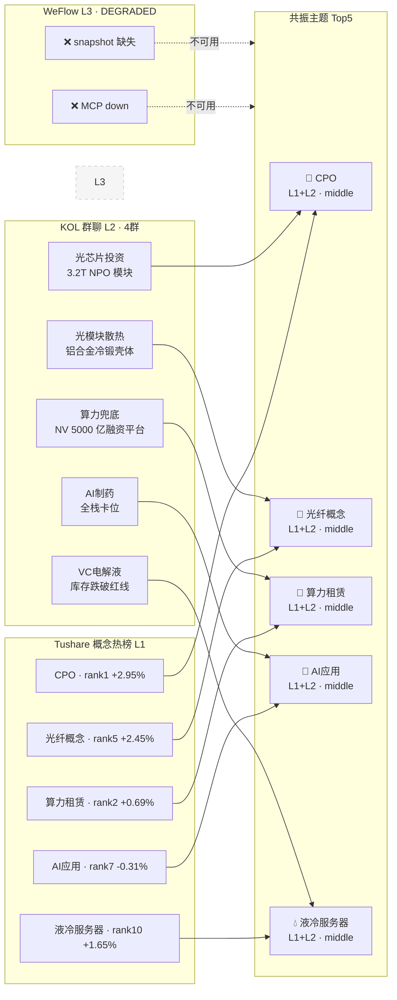

# 2026年8月17日 · **群聊情绪共振**

> **数据源新鲜度**: 🟡 partial
> **降级状态**: ⚠️ 是（WeFlow L3 不可用 + R1 基准缺失）
> **置信度**: 0.4
> **情绪浓度**: 60/100（中性偏多）

## 一句话结论

CPO 热榜第一+KOL 共振最强，算力租赁受 NV 算力兜底催化周末发酵，光模块全产业链（光芯片/散热/封装）群聊热度集中。

## 情绪浓度判断

当前情绪浓度 **60 分**，处于中性偏多区间。

**判断依据**：
- 基准分 50（R1 未产出，取中性）
- L1+L2 共振主题 5 个，+10.0 分加成
- 无三源共振（WeFlow 缺失），情绪强度受限
- 群聊 4 群可用，覆盖题材/核心/机构/新闻四维，样本有代表性但不够全

**交叉校验**：周五（8/14）市场微涨 0.005%，涨停结构尚不明确（等 R1 补全），50 中性基准偏保守。

## 共振主题 Top5

### 1. **共封装光学(CPO)** · L1+L2 · middle

> **龙头**: 002138顺络电子、000070特发信息

**大资金意图**：光模块行业 800G/1.6T 升级周期，AI 算力需求拉动光互联，叠加阿里云 NPO 技术突破催化

**为什么走强**：技术迭代确定性强 + 业绩兑现期 + 热榜第一 + KOL 多帖覆盖光芯片/散热/封装全产业链

**逻辑够不够硬**：逻辑硬：AI 算力 → 光模块量价齐升是已验证链条；但短期涨幅较大需警惕获利回吐

**热榜信号**：
  • 热榜在榜，无特殊信号

**群聊佐证**：
  - 群A·题材基本面@2026-08-16 20:09: 通源环境：中际旭创王晓东带队入股+设立创投，切入光芯片投资版图。华阳集团冷锻铝合金光模块外壳送样验证，800G/1.6T光模块散热刚需升级
  - 群A·题材基本面@2026-08-16 20:09: 通源环境：中际旭创王晓东带队入股+设立创投，切入光芯片投资版图。华阳集团冷锻铝合金光模块外壳送样验证，800G/1.6T光模块散热刚需升级

### 2. **光纤概念** · L1+L2 · middle

> **龙头**: 000070特发信息、002008大族激光

**大资金意图**：光纤作为算力基建底层，叠加全光网络/NPO 技术演进，从"老基建"向"AI 基础设施"重估

**为什么走强**：排名动量上升快（15→5），CPO 产业链扩散，KOL 覆盖光模块散热/光芯片

**逻辑够不够硬**：中等：光纤本身偏传统，但在算力基建扩张周期下有补涨逻辑，弹性弱于 CPO 核心

**热榜信号**：
  🔥 排名动量: rank 15→5

**群聊佐证**：
  - 群A·题材基本面@2026-08-16 20:09: 通源环境：中际旭创王晓东带队入股+设立创投，切入光芯片投资版图。华阳集团冷锻铝合金光模块外壳送样验证，800G/1.6T光模块散热刚需升级
  - 群A·题材基本面@2026-08-16 20:09: 通源环境：中际旭创王晓东带队入股+设立创投，切入光芯片投资版图。华阳集团冷锻铝合金光模块外壳送样验证，800G/1.6T光模块散热刚需升级

### 3. **算力租赁** · L1+L2 · middle

> **龙头**: 000070特发信息、000815美利云

**大资金意图**：周末 NV 算力兜底方案 + 5000 亿融资平台，地方算力政策密集落地，算力租赁商业模式被重估

**为什么走强**：海外+国内双催化，两群多帖共振，商业模式从"卖铲子"升级为"收租金+分润"

**逻辑够不够硬**：逻辑较硬：算力紧缺是事实，但租赁板块个股质地分化大，需甄别真实受益标的

**热榜信号**：
  • 热榜在榜，无特殊信号

**群聊佐证**：
  - 群A·题材基本面@2026-08-16 22:49: Neocloud进入黄金上行期：英伟达推出算力兜底+营收分润合作方案，仅向头部厂商开放，锁定最低利用率。全球高端GPU受管制+晶圆产能约束，算力紧缺具备强持续性
  - 群A·题材基本面@2026-08-16 22:23: 周末算力行业新催化：英伟达联合全球顶级金融机构设立AI算力融资平台，撬动5000亿美金投入AI基建，最高25%残值兜底。四川算力网政策+广东Token贷落地

### 4. **AI应用** · L1+L2 · middle

> **龙头**: 000032深桑达A、000055方大集团

**大资金意图**：AI 从基础设施向应用层扩散，AI 制药/AI Agent 等细分方向有独立催化

**为什么走强**：创新药+AI 制药双轮驱动，机构路演推动，热榜排名第 7

**逻辑够不够硬**：中等偏弱：AI 应用落地节奏慢于基础设施，业绩兑现周期长，板块持续性存疑

**热榜信号**：
  • 热榜在榜，无特殊信号

**群聊佐证**：
  - 群A·题材基本面@2026-08-16 22:23: 周末算力行业新催化：英伟达联合全球顶级金融机构设立AI算力融资平台，撬动5000亿美金投入AI基建，最高25%残值兜底。四川算力网政策+广东Token贷落地
  - 群C·机构风向@2026-08-16 09:54: 华兰股份近况解读：通过灵擎数智完成AI制药全栈卡位——AI抗体设计/64维GVAE小分子发现/知识图谱药物重定向，战略入股自然常数科技补全临床风险预测

### 5. **液冷服务器** · L1+L2 · middle

> **龙头**: 001210金房能源、000920沃顿科技

**大资金意图**：AI 算力高密度部署 → 散热刚需，从"可选配件"变为"算力基建标配"

**为什么走强**：液冷是算力扩张的瓶颈环节，KOL 提及光模块散热+VC 电解液（热管理链条）

**逻辑够不够硬**：中等：逻辑通顺但板块弹性一般，液冷渗透率提升是慢变量，非短期爆发性主题

**热榜信号**：
  • 热榜在榜，无特殊信号

**群聊佐证**：
  - 群A·题材基本面@2026-08-16 22:49: Neocloud进入黄金上行期：英伟达推出算力兜底+营收分润合作方案，仅向头部厂商开放，锁定最低利用率。全球高端GPU受管制+晶圆产能约束，算力紧缺具备强持续性
  - 群A·题材基本面@2026-08-16 20:09: 通源环境：中际旭创王晓东带队入股+设立创投，切入光芯片投资版图。华阳集团冷锻铝合金光模块外壳送样验证，800G/1.6T光模块散热刚需升级

## KOL 观点摘要

| 来源 | 时间 | 核心观点 | 覆盖板块 |
|---|---|---|---|
| 群A·题材基本面 | 22:49 | NV 算力兜底+营收分润，算力紧缺强持续 | 算力租赁、液冷 |
| 群A·题材基本面 | 22:23 | 周末算力催化：5000 亿融资平台+地方政策 | 算力租赁、东数西算 |
| 群A·题材基本面 | 20:09 | 中际旭创系入股+光芯片投资+冷锻散热 | CPO、光纤、液冷 |
| 群B·核心聚焦 | 22:09 | VC 电解液库存告急，Q3 供需趋紧 | 电解液、储能 |
| 群B·核心聚焦 | 16:10 | 阿里云 3.2T NPO 模块，全光网络突破 | CPO、F5G、光芯片 |
| 群C·机构风向 | 09:54 | 华兰股份 AI 制药全栈卡位路演 | 创新药、AI 应用 |
| 群B·核心聚焦 | 21:55 | 明微电子中报超预期，LED 驱动见底 | 芯片、消费电子 |

## 热榜信号

### 🔥 排名动量上升（>=10 名）

| 板块 | 排名变化 | 解读 |
|---|---|---|
| 光纤概念 | rank 15 → 5 | ↑10，CPO 产业链扩散，全光网络催化 |

### 🆕 新进 top20

| 板块 | 排名 | 解读 |
|---|---|---|
| 稀土永磁 | 14 | 资源品异动，关注持续性 |
| 先进封装 | 18 | 半导体产业链扩散 |
| F5G 概念 | 19 | 全光网络催化 |

### ⚠️ 霸榜警报

无（CPO 8/14 登顶第一，但 8/13 第一是创新药，未出现连续霸榜）

## 数据源审计

| 源 | 状态 | 抓取时间 | 记录数 | 备注 |
|---|---|---|---|---|
| 🟢 Tushare 热榜 | ok | 2026-08-14 | 543 概念 | ths_hot 概念板块全量 |
| 🟡 群聊 KOL（4/5群） | degraded | 2026-08-16 | 82 条 | 群E·KOL策略 缺失 |
| 🔴 WeFlow 语义 | error | — | 0 | MCP down + snapshot 缺失，L3 全废 |
| 🟢 Tushare 行情 | ok | 2026-08-14 | — | 板块龙头涨跌幅 |
| 🟡 R1 情绪基准 | stale | — | — | R1_style.json 未产出，退化 50 |

## 不确定性 / 反证

1. **WeFlow 缺失是最大短板**：L3 语义层完全不可用，导致无法识别早期机会（L2+L3_only 模式），可能漏掉群聊热议但热榜尚未反映的主题（如 VC 电解液、AI 制药等 L2_only 主题）
2. **KOL 群聊样本偏少**：仅 4 群 82 条消息，其中长文本 18 条，样本量不足以代表全市场情绪
3. **R1 基准缺失**：情绪浓度基准用 50 中性值替代，可能偏离真实市场情绪
4. **周一开盘不确定性**：数据基于周五收盘 + 周末消息，周末消息面（NV 算力兜底）的市场反应需等周一验证
5. **VC 电解液等 L2_only 主题**：群聊热议但未入热榜 top20，按规则不计入共振主题，可能是被低估的方向

## 与其他 R/D/E 的关系

- **依赖上游**: R1_style.json（情绪基准，当日未产出）
- **被下游消费**: D1 主决策（resonance_top_themes 作为主线验证维度）、R2 主线板块（交叉验证）
- **平行**: R4 消息面（KOL 消息与新闻催化交叉）

## Sub-Agent 元数据

- **skill**: analyze_sentiment_resonance_v1
- **artifact**: `data/research/20260817/R3_sentiment.json`
- **状态**: partial（降级运行）
- **生成耗时**: ~5 分钟
- **模型**: doubao-seed-2-0-code-preview
