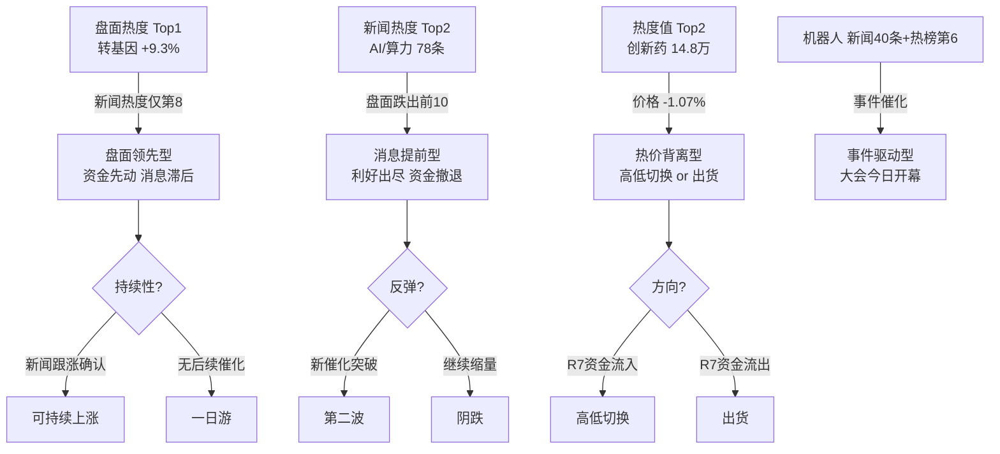

# 2026年8月19日 · **群聊情绪共振**

> **数据源新鲜度**: ⚠️ partial（L1=0818收盘, L2=新闻替代, L3=缺失）
> **降级状态**: 🔴 重度降级（3层中仅L1可用 + L2新闻替代）
> **置信度**: 0.40 / 1.0

## 一句话结论

**农业异军突起登顶热榜，消息面尚未跟上（盘面领先型）；AI/算力消息热但盘面退潮（利好出尽型）；机器人有事件催化（大会+上市）可关注；半导体高位分歧，美股昨夜重挫施压。情绪中性偏多（58分）。**

---

## 核心发现：三大量价背离

今日最突出的特征不是"共振"而是**背离**——盘面热度、新闻热度、价格走势三者之间出现了显著错位。

---

## Top 5 共振主题详解

### 🥇 农业/转基因 — 盘面绝对领先，资金先行

**大资金意图**：突袭农业板块，以转基因/粮食概念为突破口，可能驱动因素包括：华尔街研报催化 + 种业大会 + 农产品价格上涨预期。资金选择在科技线高位震荡时切入低位农业，典型高低切换。

**为什么走强**：
- 转基因 +9.30% 登顶概念热榜，热度 19.5 万
- 粮食概念 +6.52% 排名 3（从 17 位飙升，+14 名）
- 种植业与林业 +9.36% 登行业榜第 1（从 19 位飙升，+18 名）
- 8 个农业相关板块进入 top30（转基因/粮食/农业种植/玉米/猪肉/种植业/农产品加工/养殖业）

**逻辑够不够硬**：中等偏弱。催化来自华尔街研报+学术大会，缺乏实质性政策或产业拐点。农业板块长期资金关注度低，持续性存疑。但**盘面强度极高**（8个板块上榜+涨幅大+新入榜多），短线资金已形成合力。

**买入理由**：盘面强度第一，多板块联动，资金介入深，短线情绪未充分发酵仍有扩散空间
**风险点**：逻辑偏软（研报催化非产业拐点），历史上农业持续性差，外资/机构配置低
**止损条件**：转基因板块次日低开-2%且无修复，或龙头开板回封失败
**可验证假设**：若今明两日新闻端农业主题报道量翻倍（从15条→30条+），则确认消息面跟涨，可持续性增强

---

### 🥈 AI/算力 — 消息热盘面冷，利好出尽格局

**大资金意图**：算力租赁从 0817 热榜第 1 跌出 0818 前 10，资金已从算力硬件链撤退。新闻端仍在密集报道（联通算力投资+AI医药应用等），但资金不买账——典型的"消息掩护出货"。

**为什么新闻还热但盘面冷**：
- 新闻 78 条，热度排名第 2（同花顺/新浪财经/财联社/华尔街见闻全覆盖）
- 但算力租赁热度从 45512（0817第1）→ 跌出前 20（0818）
- AI 应用仅 +0.66%，排名第 14

**逻辑够不够硬**：逻辑仍在（AI产业趋势未变），但**交易层面已进入退潮期**。0816-0817 连续两日大涨后，0818 高位震荡滞涨，资金分歧加大。需要新的超预期催化才能启动第二波。

**买入理由**：长期逻辑仍在，短期超跌后可能有反弹
**风险点**：退潮趋势明确，美股 AI 股昨夜重挫（SK海力士/闪迪跌9%，Coherent跌12%），外盘压力大
**止损条件**：CPO板块跌破20日线，或中际旭创破位
**可验证假设**：若本周有超预期AI产业催化（如国内大模型重磅发布/海外大厂超预期capex），则可能第二波；否则继续退潮

---

### 🥉 机器人/人形机器人 — 事件催化窗口，今日开幕

**大资金意图**：世界机器人大会今日（8.19）开幕 + 宇树科技科创板今日上市，双重事件催化。资金提前布局（人形机器人排名从9→6），但涨幅温和（+0.49%），说明资金偏谨慎，边走边看。

**事件清单**：
- 2026世界机器人大会 8.19-8.25 北京开幕，参展企业 300+ 家（同比+36%），展品 2000+ 件
- 宇树科技今日登陆科创板，"A股人形机器人第一股"
- 小米电话会：机器人首秀定档，看好澎程放量

**逻辑够不够硬**：中等。事件催化明确且集中，但"买预期卖事实"是老规律。宇树科技上市日可能成为情绪高点。需观察大会是否有超预期产品/技术发布，以及宇树上市后的表现。

**买入理由**：事件催化集中，热榜排名上升中，机器人是今年少数有产业实质进展的方向
**风险点**：事件兑现日出货风险，科创板标的流动性风险
**止损条件**：大会首日无超预期内容且板块高开低走收阴线
**可验证假设**：若大会首日元帅级产品发布（如特斯拉Optimus量产进展/国产人形重大突破），则超预期可追；否则利好兑现

---

### 🏅 半导体/存储芯片 — 高位分歧，外盘施压

**大资金意图**：半导体仍是市场最大集群（top30占9席），但内部已分化。存储从第1跌至第4（热度降10%），但先进封装/电子化学品/玻璃基板等细分仍强。资金在半导体内部做轮动而非撤退。

**关键数据**：
- 半导体行业热度 20.9 万（行业第2，仅微涨+0.23%）
- 存储芯片概念热度 10.9 万（第4，+0.22%）→ 从0817的12.1万降10%
- 先进封装 13个细分板块中仍有涨5%+的
- 国家大基金持股仍在 top10（0817新入榜第6）

**外部风险**：昨夜美股科技股重挫——AI牛股集体大跌，SK海力士/闪迪跌9%，Coherent跌12%，Lumentum跌近10%。对今日 A 股半导体链开盘有直接压力。

**买入理由**：半导体仍是市场主线之一，细分轮动活跃，国家大基金持仓逻辑未变
**风险点**：美股重挫外盘压力大，存储热度退潮，整体高位分歧
**止损条件**：半导体板块指数跌破5日线且成交额萎缩
**可验证假设**：若今日低开高走且成交量放大，说明内资承接力强，主线地位稳固；若低开低走放量下跌，则确认阶段性见顶

---

### 🏅 创新药/医药 — 热价背离，方向待解

**大资金意图**：最诡异的一个——热度排名第 2（14.8 万）且热度值环比**暴涨**（从4.2万→14.8万），但价格反而下跌 -1.07%。两种可能：
1. **高低切换中的避风港**：资金从高位科技切向相对低位的医药避险
2. **利好兑现出货**：前期上涨后借热度高位派发

需 R7 资金面数据确认。

**逻辑够不够硬**：存疑。热度暴增但价格下跌，说明有大量换手但方向向下。AI+医药是长期方向但短期缺少催化。

**买入理由**：AI+医药长期逻辑，相对低位防御属性
**风险点**：热价背离是危险信号，可能是出货而非吸筹
**止损条件**：创新药指数跌破前期平台低点
**可验证假设**：若 R7 显示创新药主力资金净流入，则为高低切换（可逢低关注）；若净流出，则为出货（回避）

---

## 情绪浓度分析

| 维度 | 数值 | 说明 |
|------|------|------|
| 📊 sentiment_score | **58 / 100** | 中性偏多 |
| 📈 R1 基线 | 50 | R1未落盘，硬编码中性 |
| 🔥 L1 盘面 | +3 | 农业大涨但科技分化，整体偏多 |
| 📰 L2 新闻 | +5 | 800条新闻，资讯密度中等偏多 |
| 🔄 共振加成 | +0 | 无三源共振，最高双源 |
| 📉 外盘风险 | 未计入 | 美股科技股重挫，今日可能下修 |

**情绪结构**：不是全面牛市的沸腾，也不是恐慌的冰点，而是**结构分化**。资金从高位科技切向低位农业/医药，机器人有事件催化。整体情绪中性偏多但内部分化剧烈。

---

## 关键证据

- **证据 1**: 转基因 +9.3% 登顶概念热榜，热度 19.5 万，8 个农业板块入 top30 · 来源 Tushare ths_hot 0818收盘
- **证据 2**: AI/算力新闻 78 条排第 2，但算力租赁从热榜第 1 跌出前 20 · 来源 Tushare major_news + ths_hot
- **证据 3**: 世界机器人大会 8.19 开幕 + 宇树科技今日上市，双重催化 · 来源 Tushare major_news
- **证据 4**: 美股科技股昨夜重挫，SK海力士/闪迪跌 9% · 来源 Tushare major_news（华尔街见闻）
- **证据 5**: 创新药热度从 4.2 万暴涨至 14.8 万但价格跌 1.07% · 来源 Tushare ths_hot 0817 vs 0818

---

## 数据源审计

| 源 | 状态 | 抓取时间 | 记录数 | 备注 |
|---|---|---|---|---|
| 🔴 WeFlow 语义 | dead | — | 0 | MCP down + 无snapshot |
| 🔴 wechat-cli 5群 | error | — | 0 | 全群超时>60s |
| 🟢 Tushare 热榜 | ok | 08-19 07:30 | 80条 | 0818收盘baseline，概念+行业各20 |
| 🟢 Tushare 重大新闻 | ok | 08-19 07:32 | 800条 | 同花顺/新浪/财联社等，时段 0818 15:21 ~ 0819 04:36 |
| ⚪ XTick 热榜 | n/a | — | — | 无MCP会话 |
| ⚪ vibe-trading | n/a | — | — | 不可用 |

---

## 不确定性 / 反证

1. **降级严重，置信度仅 0.40**：L3 完全缺失、L2 用新闻替代 KOL 群聊（信息质量下降）、L1 是 T-1 baseline。结论仅供参考，需 R1/R2/R4/R7 交叉验证。

2. **农业的持续性存疑**：历史上农业板块多为一日游或短炒行情，缺乏机构配置。即使盘面强度高，也可能在 1-2 日内完成拉升出货。

3. **美股重挫的传导风险未计入情绪分**：sentiment_score 58 基于国内数据，未考虑昨夜美股科技股暴跌的外盘冲击。今日开盘可能直接下修情绪。

4. **新闻替代源的偏差**：Tushare 重大新闻偏向官方媒体/卖方研报，缺少群聊中真实的交易者情绪和小道消息。可能低估（或高估）某些主题的真实市场情绪。

5. **R1 基线缺失**：R1_style.json 未落盘，用 50 硬编码替代。若 R1 实际偏防御（如 <40），则当前 58 可能偏乐观。

---

## 与其他 R/D/E 的关系

- **依赖**: 无上游必需依赖（R1 可选作基线但非必需）
- **可选上游**: `R1_style.json`（情绪基线）、`R2_main_sectors.json`（主线交叉验证）、`R4_news_impact.json`（催化事件交叉）、`R7_capital_flow.json`（资金面验证）
- **被消费**: D1 主决策（情绪浓度 + 共振主题 → 仓位与方向）、R6 反证（背离信号 → 风险提示）、E1 复盘（情绪验证）

---

## Sub-Agent 元数据

- **skill**: analyze_sentiment_resonance_v1（降级模式：L1_baseline + L2_news_alt + L3_dead）
- **artifact**: `data/research/20260819/R3_sentiment.json`
- **生成耗时**: ~15 分钟
- **降级场景**: 场景A（L3死）+ 场景C（L1 baseline）+ 叠加L2退化（wechat-cli全超时→新闻替代）
- **confidence**: 0.65 - 0.05(L1 baseline) - 0.10(L2退化) - 0.05(L3死) - 0.05(R1缺) - 0.05(XTick缺) + 0.05(新闻数据充足回补) = **0.40**
