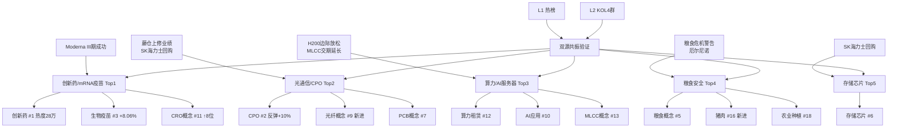

# 2026年8月20日 · **群聊情绪共振**

> **数据源新鲜度**: 🟡 partial
> **降级状态**: ⚠️ 是（WeFlow下线 + KOL缺1群）
> **置信度**: 65%
> **情绪浓度**: 65/100（R1基线45 + 共振加成20）

## 一句话结论

Moderna mRNA疫苗III期成功引爆医药全线反弹，光通信/算力链超跌修复获3群共振确认，粮食安全防御属性升温，情绪从冰点小幅回暖至65分。

---

## 详细分析

### 🌡️ 情绪浓度：65/100 — 超跌修复期，中性偏多

R1今日给出**震荡分化型 + 情绪45分**的基准判断。叠加5个L1+L2双源共振主题（每个+4分），最终情绪分**65**。较昨日（73分）继续下行，但降幅收窄，呈现**超跌反弹**特征。

关键变化：
- 创新药从昨日#2跃升至#1，热度翻倍（13.6万→28.1万），Moderna催化为最强变量
- 光通信/CPO昨日领跌，今日反弹力度最强（+10.09%反弹幅度），群聊讨论热度不减
- 商业航天从#1跌至#4，热度缩水63%，典型利好兑现出货
- 粮食/农业稳步上升，防御属性获资金认可

### 📊 共振 Top5 主题

| 排名 | 主题 | 共振等级 | 热度分 | 阶段 | 核心催化 |
|:---:|:---|:---:|:---:|:---:|:---|
| 🥇 | 创新药/mRNA疫苗 | L1+L2 | 209.1 | middle | Moderna III期成功暴涨177%，4群共振 |
| 🥈 | 光纤/CPO/光通信 | L1+L2 | 139.1 | middle | 藤仓上修业绩+SK海力士回购，3群共振 |
| 🥉 | 算力租赁/AI服务器/H200 | L1+L2 | 109.1 | middle | H200边际放松+MLCC交期延长，3群共振 |
| 🏅 | 粮食安全/农业 | L1+L2 | 102.3 | middle | 摩根大通粮食危机警告+厄尔尼诺，2群共振 |
| 💫 | 存储芯片/半导体 | L1+L2 | 56.0 | middle | SK海力士40万亿回购，1群+热榜验证 |

---

### 🥇 Top1 深度分析：创新药/mRNA疫苗

**大资金意图**：Moderna III期成功是全球医药板块的级别性催化，大资金借情绪窗口快速回补前期超跌的创新药/CRO/疫苗仓位。从热度翻倍（13.6万→28.1万）和4群共振来看，属于**全市场级别共识**，非单一游资炒作。

**为什么走强**：
- 催化剂级别足够大：全球首款mRNA个性化肿瘤疫苗III期成功，Moderna盘前暴涨177%
- 板块位置低：创新药板块此前持续回调，昨日仍跌2.66%，今日+4.46%属超跌反弹
- 覆盖范围广：创新药#1 + 生物疫苗#3 + CRO#11 + 细胞免疫治疗#19，四板块联动
- 群聊密度高：4群全部提及，从题材群到投研群到新闻群全覆盖

**逻辑够不够硬**：硬。mRNA肿瘤疫苗是多年来最重磅的医药突破之一，直接验证了mRNA技术路线在治疗领域的可行性。但需注意：
- A股更多是情绪传导，真正有mRNA技术平台的公司不多
- 短期脉冲后持续性取决于后续催化剂密度
- 沃森/智飞等疫苗股20cm涨停是情绪极致释放，次日分化概率大

**买入理由**：全球级别催化剂 + 板块超跌 + 四群共振共识强 + 多板块联动
**风险点**：A股mRNA概念股多为情绪映射，基本面兑现度有限；短期涨幅过大后的获利回吐
**止损条件**：生物疫苗板块次日高开低走收阴，或龙头沃森生物/石药创新跌破5日线
**可验证假设**：若本周内创新药板块热度维持top5，则说明资金在做中线布局而非一日游

### 🥈 Top2 深度分析：光纤/CPO/光通信

**大资金意图**：昨日AI硬件全线暴跌后，今日借藤仓业绩上修+SK海力士回购双重催化快速修复。CPO从昨日-8.14%到今日+1.95%，反弹幅度超10%，属于**典型的超跌反弹+利空消化**。大资金在这个位置做T和低吸的概率高于新开仓。

**为什么走强**：
- 海外催化：藤仓因AI需求上修业绩，验证光通信景气度；SK海力士40万亿韩元回购提振整个半导体情绪
- 超跌严重：昨日CPO -8.14%、光纤 -9.94%，恐慌性抛售后技术反弹需求强
- 卖方密集：开源通信"颖响力"系列路演持续，今日拆解超节点
- 板块联动：CPO#2 + 光纤#9 + PCB#7，三板块全部在榜

**逻辑够不够硬**：中等偏硬。基本面（AI驱动光通信需求）是真实的，但短期反弹更多是技术面修复而非基本面反转。需观察反弹能否放量突破前高，还是仅仅是下跌中继。

**买入理由**：超跌反弹空间大 + 海外催化不断 + 卖方密集路演 + 板块联动性强
**风险点**：美股AI硬件股波动大，若隔夜再跌可能传导；反弹无量则为下跌中继
**止损条件**：CPO板块反弹后再创新低，或龙头中际旭创跌破850元关键支撑
**可验证假设**：若光纤概念热度排名能维持top10超过3天，则是趋势反转而非反弹

---

## 关键证据

- **证据1**：Moderna联合默沙东mRNA肿瘤疫苗III期双终点阳性，盘前暴涨177% → 来源：群A/群B/群C/群D 全群覆盖 + 热股榜石药创新/沃森生物20cm涨停
- **证据2**：全球光纤龙头藤仓因AI需求大幅上修业绩指引，供应紧张产品涨价 → 来源：群A/群B/群D + 热榜光纤概念#9（新进）
- **证据3**：英伟达H200对华限制边际放松，字节跳动腾讯各获约1万颗 → 来源：群A/群C + 热榜算力租赁#12
- **证据4**：摩根大通警告全球粮食危机明年爆发，五大驱动因素 → 来源：群A/群C + 热榜粮食概念#5
- **证据5**：SK海力士40万亿韩元回购注销，海外存储厂开启高额股东回报 → 来源：群D + 热榜存储芯片#6

---

## 共振路径图

---

## 热榜信号速览

| 信号类型 | 标的 | 详情 |
|:---|:---|:---|
| 📈 排名大幅上升 | CRO概念 | #19 → #11（↑8位） |
| 🆕 新进Top20 | 生物疫苗 | 新进#3，+8.06% |
| 🆕 新进Top20 | 光纤概念 | 新进#9，+2.61% |
| 🆕 新进Top20 | 猪肉 | 新进#16，+2.02% |
| 🆕 新进Top20 | 农业种植 | 新进#18，+1.45% |
| 🆕 新进Top20 | 细胞免疫治疗 | 新进#19，+6.93% |
| ⚠️ 出货警报 | 宇树科技 | 热股#1但暴跌-18.7%，新股情绪退潮 |
| ⚠️ 出货警报 | 商业航天 | 昨日#1今日#4，热度缩水63% |

---

## 数据源审计

| 源 | 状态 | 抓取时间 | 记录数 | 备注 |
|---|:---:|---|:---:|---|
| Tushare热榜 | 🟢 ok | 2026-08-20 22:30 | 20板块/100热股 | 主源，数据完整 |
| KOL群A（题材扩散） | 🟢 ok | 2026-08-19 | 57条 | 长文本11条 |
| KOL群B（即时新闻） | 🟢 ok | 2026-08-19 | 52条 | 长文本3条 |
| KOL群C（核心投研） | 🟢 ok | 2026-08-19 | 43条 | 长文本13条 |
| KOL群D（卖方活动） | 🟢 ok | 2026-08-19 | 15条 | 长文本7条，路演通知为主 |
| KOL群E（KOL方向） | 🔴 down | — | 0 | 今日无抓取，5群缺1 |
| WeFlow语义 | 🔴 down | — | 0 | ngrok永久离线，已下线 |
| XTick | 🟢 ok | — | — | 备用，未主用 |

---

## 不确定性 / 反证

1. **样本不足风险**：KOL 5群缺1群（KOL方向群是明日观点最重要的来源），可能遗漏关键方向判断
2. **反弹持续性存疑**：今日多板块是超跌反弹（昨日大跌后修复），非趋势性上涨。若今晚美股AI硬件再跌，明日可能承压
3. **创新药分化风险**：mRNA概念A股纯正标的少，多数是情绪映射。20cm涨停后次日分化概率极大，需警惕追高
4. **商业航天警示**：昨日#1今日#4，热度暴跌63%，说明热点轮动极快。今日的创新药会不会重蹈覆辙？
5. **WeFlow缺失**：无第三源语义验证，双源共振置信度低于三源，可能存在误判
6. **R1基线偏低**：R1给出45分的悲观基准，R3的65分已属明显上修，是否过度乐观？

---

## 与其他 R/D/E 的关系

- **依赖上游**:
  - `data/research/20260820/R1_style.json` — 情绪基线（45分，degraded）
  - `data/raw/20260820/wechat_cli_5groups.jsonl` — KOL源数据
  - `Tushare MCP ths_hot` — L1热榜数据
- **被消费下游**:
  - D1（主决策）— 共振主题top5 + 情绪浓度
  - R4（消息面）— 情绪热度交叉验证
  - R2（主线板块）— 情绪共振度参考

---

## Sub-Agent 元数据

- **skill**: analyze_sentiment_resonance_v1
- **artifact**: `data/research/20260820/R3_sentiment.json`
- **生成耗时**: ~5分钟
- **运行模式**: L1+L2 双源共振（WeFlow降级 + 5群缺1群）
- **状态**: partial（降级运行）
- **置信度**: 0.65
