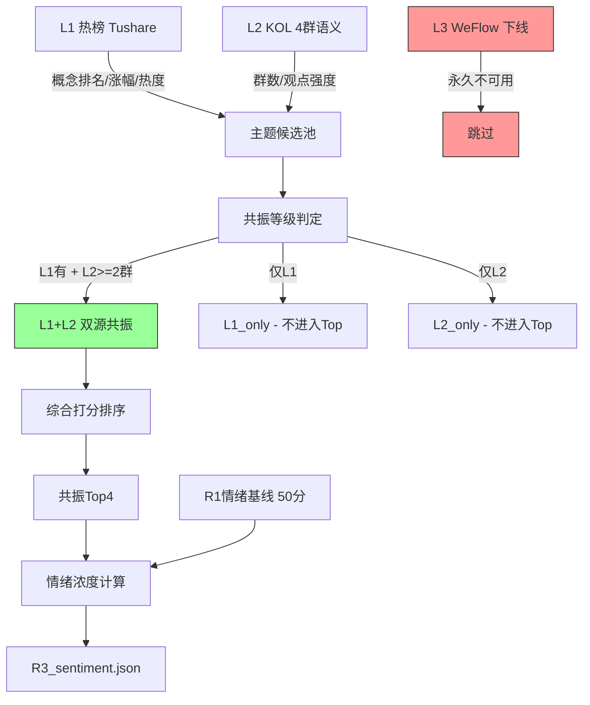

# 2026年8月21日 · **群聊情绪共振**

> **数据源新鲜度**: ⚠️ partial  
> **降级状态**: ⚠️ true  
> **置信度**: 0.62  
> **情绪浓度**: 62/100

## 一句话结论

mRNA肿瘤疫苗引爆创新药主线（L1+L2最强共振），光纤/算力/存储芯片跟涨，情绪从冰点修复至62分但仍偏弱。

---

## 情绪浓度

| 指标 | 数值 | 说明 |
|------|------|------|
| R1基线 | 50/100 | 主线扩散型，医药批量涨停但炸板率33%偏高 |
| 共振加成 | +12 | 4个L1+L2双源共振主题 × 3分/个 |
| **最终** | **62/100** | 超跌修复期，情绪底部回升但尚未转强 |

**情绪判断依据**：昨日创业板暴跌6.26%后今日技术性反弹，医药板块批量涨停（20cm+10cm共20+只）点燃情绪，但连板高度仅4板、炸板率约33%显示分歧加剧。4个L1+L2双源共振主题支撑情绪从R1基线50分上修至62分。

---

## 共振 Top4 主题

> 共 4 个 L1+L2 双源共振主题（WeFlow下线后最高等级），按综合得分排序

### 🥇 #1 mRNA肿瘤疫苗 / 创新药（120.9分 · L1+L2 · early）

**催化事件**：Moderna与默沙东mRNA个性化癌症疫苗III期顶线数据大获全胜，Moderna单日暴涨176%

| 维度 | 详情 |
|------|------|
| L1热榜 | 创新药 rank1（+1），生物疫苗 rank3（新进），CRO概念 rank11（+8），细胞免疫治疗 rank19（新进） |
| L2 KOL | 4群共振（群A/B/C/D全部提及） |
| 涨幅 | 生物疫苗+8.06%，细胞免疫治疗+6.93%，CRO概念+5.37% |
| 热度 | 创新药 280,942（断层第一） |

**💡 大资金意图**：大资金抢筹医药上游（CXO/CDMO/原料），走"卖水人"确定性路线，而非赌单一管线药企。Moderna III期成功是产业里程碑，资金选择上游龙头规避个股研发风险。

**💡 为什么走强**：全球首个III期阳性的个体化mRNA肿瘤疗法，证明mRNA技术路线从传染病正式跨越到肿瘤精准治疗领域，产业价值重估空间巨大。A股相关标的普涨，20cm涨停批量出现。

**💡 逻辑够不够硬**：硬。有III期临床数据支撑，非纯概念炒作。产业链上游（CXO/CDMO/原料）受益确定性最高。但需注意：A股多数mRNA标的仍处于临床早期，短期涨幅过大后可能分化。

**🎯 核心标的**：

| 类型 | 标的 | 逻辑 |
|------|------|------|
| 上游原料 | 诚志股份 | D-核糖全球主要厂商，mRNA最源头原料 |
| CXO/CDMO | 凯莱英、药明康德、博腾股份 | 核酸CDMO核心标的，LNP封装平台 |
| 疫苗龙头 | 沃森生物、智飞生物、康希诺 | mRNA技术平台布局 |
| 创新药 | 石药创新、恒瑞医药 | mRNA肿瘤疫苗管线推进 |

---

### 🥈 #2 光纤 / CPO / 光通信（85.0分 · L1+L2 · middle）

**催化事件**：藤仓上修业绩指引+AI需求验证光纤光缆周期，MPO无源光互联持续强通胀

| 维度 | 详情 |
|------|------|
| L1热榜 | CPO rank2（+1），光纤概念 rank9（新进） |
| L2 KOL | 3群共振（群A/C/D） |
| 涨幅 | 光纤概念+2.61%，CPO+1.95% |
| 热度 | CPO 130,221.5 |

**💡 大资金意图**：机构资金配置光通信龙头（中际旭创/亨通光电），偏好业绩确定性强的大盘股。MPO/Senko三兄弟是机构强推方向，长芯博创上修关联交易额度验证需求上行。

**💡 为什么走强**：AI算力需求爆发→光模块/光纤/MPO全产业链受益，海外龙头（藤仓）业绩验证行业景气度。昨日大跌后今日反弹，资金回流AI硬件。

**💡 逻辑够不够硬**：较硬。有业绩支撑和行业数据验证，但前期涨幅已较大，位置不低，追高需谨慎。重点关注MPO升级和Senko三兄弟的差异化机会。

**🎯 核心标的**：

| 类型 | 标的 | 逻辑 |
|------|------|------|
| CPO龙头 | 中际旭创、太辰光、天孚通信 | 光模块核心标的 |
| 光纤光缆 | 亨通光电、中天科技、长飞光纤 | 光纤量价齐升 |
| MPO/连接器 | 通鼎互联、胜蓝股份 | MPO升级+超节点铜互联 |

---

### 🥉 #3 算力租赁 / H200 / AI服务器（68.5分 · L1+L2 · middle）

**催化事件**：H200对华限制边际放松，字节腾讯各获约1万颗，50万颗库存待交付

| 维度 | 详情 |
|------|------|
| L1热榜 | 算力租赁 rank12（-2），AI应用 rank10（+3） |
| L2 KOL | 3群共振（群A/B/C） |
| 涨幅 | AI应用+1.47%，算力租赁+0.84% |
| 热度 | 算力租赁 29,441 |

**💡 大资金意图**：资金博弈政策放松预期，偏好有实际算力交付能力的IDC/服务器厂商。金山云财报验证AI云业务高增长（+82%），MaaS增长12倍，显示算力需求真实存在。

**💡 为什么走强**：H200放松是重大政策边际变化，国内AI训练算力瓶颈有望缓解，产业链估值修复。DeepSeek提价验证国产大模型需求旺盛。

**💡 逻辑够不够硬**：中等。政策消息驱动，实际交付量和节奏仍有不确定性。算力需求是长期趋势，但短期反弹性质偏博弈。

**🎯 核心标的**：

| 类型 | 标的 | 逻辑 |
|------|------|------|
| IDC/算力 | 数据港、利通电子 | 算力租赁运营商 |
| 服务器 | 浪潮信息、工业富联 | AI服务器制造 |
| 网络设备 | 紫光股份 | 交换机/算力基础设施 |

---

### 🏅 #4 存储芯片 / 半导体（60.2分 · L1+L2 · middle）

**催化事件**：SK海力士40万亿韩元回购+海外存储回购分红潮，半导体超跌反弹

| 维度 | 详情 |
|------|------|
| L1热榜 | 存储芯片 rank6（-1），PCB概念 rank7（+2），MLCC rank13（-2） |
| L2 KOL | 2群共振（群B/C） |
| 涨幅 | PCB概念+0.73%，存储芯片+0.25% |
| 热度 | 存储芯片 45,168 |

**💡 大资金意图**：资金博弈超跌反弹，偏好有业绩支撑的龙头（长电科技/兆易创新）。海外存储大厂回购彰显管理层信心，但国内标的仍需观察需求拐点。

**💡 为什么走强**：海外存储大厂回购分红潮+国内半导体自主替代逻辑，前期超跌后估值修复。芯源微订单上修+高端Track量产验证提供个股催化。

**💡 逻辑够不够硬**：中等。回购是财务操作而非需求回暖，行业基本面尚未出现明确拐点，需警惕反弹后再次下探。

**🎯 核心标的**：

| 类型 | 标的 | 逻辑 |
|------|------|------|
| 存储龙头 | 长鑫科技、兆易创新 | DRAM/NAND国产替代 |
| 封测 | 长电科技、通富微电 | 先进封装 |
| 设备 | 芯源微 | Track设备订单上修 |

---

## L2_only 观察主题（不进入共振Top）

> 单源（仅KOL提及，热榜无对应概念板块），仅供观察，不做正向共振

| 主题 | KOL群数 | 核心逻辑 | 关注级别 |
|------|---------|----------|----------|
| 黑神话IP/文旅 | 2群 | 黑神话钟馗实机首曝，国庆长假催化 | ⚠️ 观察 |
| 磷化铟/化合物半导体 | 2群 | 浙江自然进军磷化铟，市场需求旺盛 | ⚠️ 观察 |
| 黄金/贵金属 | 1群 | 避险情绪+美元走弱预期 | ⚪ 低 |
| eSIM/折叠屏 | 1群 | 苹果折叠屏标配eSIM | ⚪ 低 |
| 粮食安全/农业 | 1群 | 摩根大通粮食危机警告 | ⚪ 低 |

---

## 热榜信号

### 📈 新进Top20（7个）

| 概念板块 | 今日排名 | 今日涨幅 | 备注 |
|----------|---------:|---------:|------|
| 生物疫苗 | 3 | +8.06% | mRNA催化，医药主线 |
| 光纤概念 | 9 | +2.61% | AI光通信反弹 |
| 猪肉 | 16 | +2.02% | 农业/防御 |
| ST板块 | 17 | +1.73% | 超跌反弹 |
| 农业种植 | 18 | +1.45% | 粮食安全 |
| 细胞免疫治疗 | 19 | +6.93% | mRNA肿瘤治疗延伸 |
| 数字货币 | 20 | +1.57% | 消息驱动 |

### 📊 排名大幅变动

- **无排名上升≥10位的板块**：昨日暴跌后今日普涨，排名格局变化不大
- 医药相关板块（生物疫苗/细胞免疫治疗）集体新进，显示资金集中涌入医药

### ⚠️ 霸榜出货警报

- **无**：创新药今日rank1，但昨日rank2，不构成"霸榜≥2日top1"出货警报

---

## 数据源审计

| 源 | 状态 | 抓取时间 | 记录数 | 备注 |
|---|---|---|---|---|
| 🟢 Tushare 同花顺概念热榜 | ok | 2026-08-20 22:30 | 20个概念 | 今日+昨日对比完整 |
| 🟢 Tushare 东方财富人气榜 | ok | 2026-08-20 22:30 | 100只个股 | A股市场人气榜 |
| 🟡 微信KOL群（4/5群） | partial | 2026-08-21 07:15 | 496条 | 群E缺失，4群可用 |
| 🔴 WeFlow | error | — | 0 | 永久下线（ngrok隧道失效） |
| 🔴 XTick 板块热度 | error | — | 0 | 参数错误.symbol=all |
| 🟢 R1风格基线 | ok | 2026-08-21 07:16 | 1份 | 主线扩散型，情绪50分 |

---

## 不确定性 / 反证

1. **KOL数据源不完整**：群E（KOL方向群）缺失，可能遗漏重要的明日方向判断，共振主题覆盖度存在盲区
2. **热榜数据滞后**：热榜数据为昨日（0820）收盘后快照，今日（0821）开盘前可能已有新变化
3. **WeFlow缺失影响**：WeFlow永久下线导致失去群聊语义共振层，L2仅靠4个微信群，样本量有限
4. **情绪修复持续性存疑**：昨日暴跌后今日反弹属于技术性修复，创业板下跌趋势未有效扭转
5. **医药板块分歧风险**：批量涨停后次日分歧概率大，若龙头开板不及预期可能带动炸板率飙升
6. **存储/算力反弹性质**：更多是超跌反弹而非趋势反转，需警惕冲高回落

---

## 与其他 R/D/E 的关系

- **上游依赖**: R1_style.json（情绪基线）、manifest.json（数据源健康度）
- **平行协同**: R2主线板块（共振主题可交叉验证）、R4消息面（催化事件互补）、R7资金面（资金流向验证）
- **被消费**: D1主决策（情绪浓度+共振主题作为决策输入）、D2/E1（情绪周期跟踪）

---

## Sub-Agent 元数据

- **skill**: analyze_sentiment_resonance_v1
- **artifact**: data/research/20260821/R3_sentiment.json
- **生成耗时**: ~5 分钟
- **模式**: L1+L2 双源共振（WeFlow L3 永久下线）
- **降级**: 是（4项降级原因）
- **model**: doubao-seed-2-0-code-preview-260215

---

## 附录：共振打分逻辑

