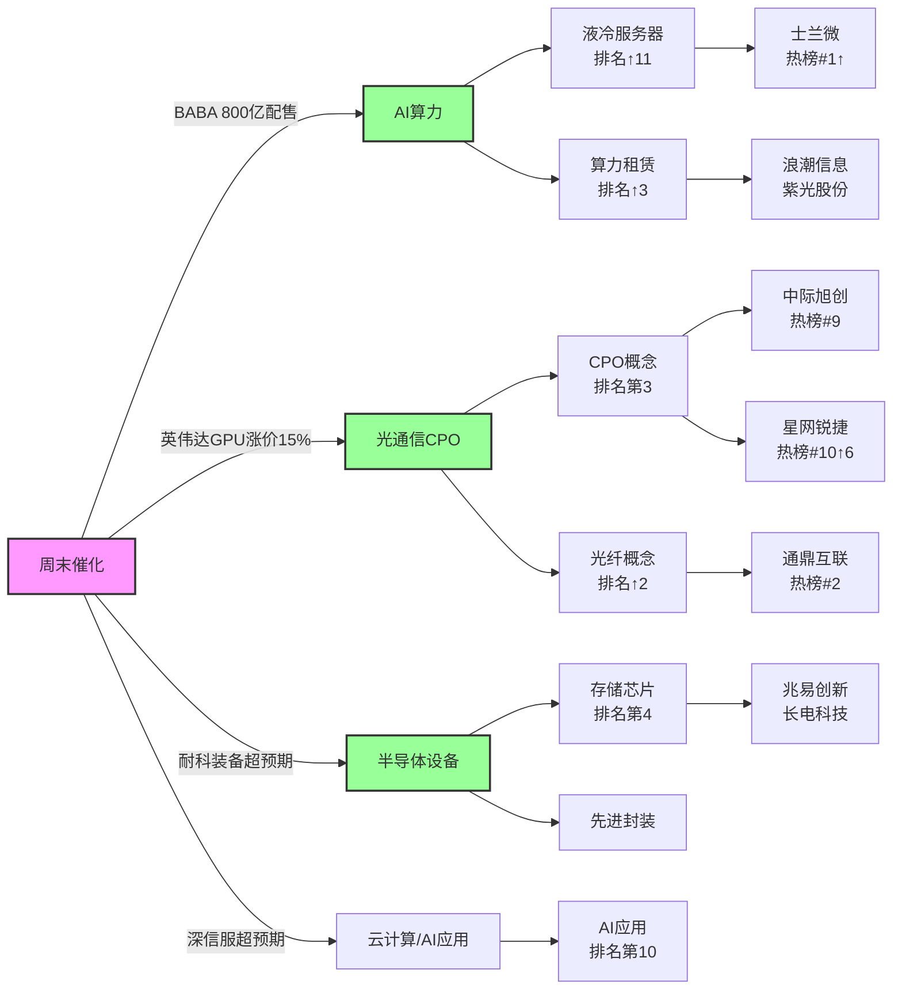

# 2026年8月24日（周一） · **群聊情绪共振**

> **数据源新鲜度**: partial ⚠️
> **降级状态**: true ⚠️（WeFlow下线 + 颜晓滨群缺失）
> **置信度**: 0.65
> **情绪浓度**: 59/100（R1基线56 + 共振加成6 - 出货警报3）

## 一句话结论

**AI算力+光通信+半导体芯片三主线L1+L2双源共振，情绪中性偏强（59），创新药霸榜出货拉响警报。**

## 情绪浓度拆解

| 维度 | 分值 | 说明 |
|---|---|---|
| R1基线 | 56 | 主线扩散型，中性偏强 |
| L1+L2共振加成 | +6 | 3个双源共振主题（各+2） |
| 霸榜出货扣减 | -3 | 创新药连续2日霸榜top1且跌3.71% |
| **最终情绪** | **59** | 中性偏强，非亢奋 |

> 📊 **解读**：59 分意味着市场有主线、有赚钱效应，但绝非疯狂。AI 算力链是周末最密集的催化方向，但创新药的霸榜出货提醒我们要警惕高位板块的风险。

## 共振主题 Top 3（L1+L2 双源验证）

### 1、🤖 AI算力（L1+L2 · middle）

**共振等级**：L1+L2（热榜 + KOL 双源验证）

**大资金意图**：大资金周末集中抢筹AI算力基础设施，BABA 800亿配售+英伟达GPU涨价+深信服超预期三重催化共振，方向明确但需警惕高开过多

**为什么走强**：1）产业级催化密集：BABA全栈AI投入、英伟达涨价验证需求刚性；2）业绩验证：深信服云业务+58.6%占比首超55%；3）卖方密集推票，周末4场AI相关会议

**逻辑够不够硬**：逻辑硬，有业绩+产业双验证。但需要注意：深信服是个股超预期不是行业β，BABA配售是港股事件对A股映射有限。真正的硬逻辑是英伟达GPU涨价——这是全球算力需求的最直接信号。

**热榜证据**：
- 📈 算力租赁：排名 #6，+3 (9→6)，热度+128%
- 📈 液冷服务器：排名 #8，+11 (19→8)，热度+172%
- 📈 存储芯片：排名 #4，持平 (4→4)，热度+64%
- 📈 AI应用：排名 #10，-2 (8→10)，热度+52%
- 📈 东数西算(算力)：排名 #11，N/A，热度+49%
- 🔥 代表个股：士兰微(SiC/AI电源), 诺德股份(AI铜箔), 飞龙股份(液冷), 英维克(液冷)

**KOL证据**：
- 💬 深信服：云计算&AI基础设施收入+58.6%占比55%，业绩大超预期（2群同时转发）
- 💬 阿里巴巴800亿港元配售100%投向全栈AI建设
- 💬 周末4场卖方会议聚焦AI：大模型+算力网+英伟达+深信服
- 💬 英伟达GPU涨价15%+投资AI云基础设施

**建议关注板块**：算力租赁, 液冷服务器, AI应用, 云计算

**首推标的**：300454 深信服

**买入理由**：1）中报超预期，云计算+AI基础设施成第一增长引擎，收入占比55.34%；2）超融合市占率双第一，VMware替代空间大；3）AI安全平台放量，毛利率78.52%高位；4）单Q2净利润同比+1245%，业绩拐点明确

**风险点**：1）估值不便宜，超预期后可能一步到位；2）AI安全业务基数小，对利润贡献有限；3）周五已有反应，周一高开过多有回落风险

**止损条件**：跌破20日均线或单日跌幅超8%放量阴线（需结合实际买入价，止损幅度-5~-10%）

**可验证假设**：如果周一深信服高开不超过5%且半小时内承接有力（量比>2），则上涨可持续；若高开>8%且快速回落，则为利好兑现

---

### 2、💡 光通信CPO（L1+L2 · middle）

**共振等级**：L1+L2（热榜 + KOL 双源验证）

**大资金意图**：光通信是AI算力链最确定的卖铲人方向，大资金从CPO向光纤/交换机扩散，星网锐捷/通鼎互联涨停验证扩散有效性

**为什么走强**：1）北美光通信龙头Lumentum/Coherent财报验证1.6T需求强劲；2）CPO/NPO 2026下半年加速落地；3）光纤/交换机板块低位补涨，估值有安全边际

**逻辑够不够硬**：逻辑中等偏硬。光模块需求有财报验证是真的，但A股CPO板块已炒了多轮，很多标的估值不低。真正有预期差的是低位的光纤/交换机（通鼎互联、星网锐捷），而非高位的光模块龙头。

**热榜证据**：
- 📈 共封装光学(CPO)：排名 #3，持平 (3→3)，热度+45%
- 📈 光纤概念：排名 #14，+2 (16→14)，热度+71%
- 📈 PCB概念：排名 #5，持平 (5→5)，热度+68%
- 🔥 代表个股：通鼎互联(光纤, rank2), 星网锐捷(WiFi6/F5G, rank10↑6), 中际旭创(CPO, rank9), 长飞光纤, 亨通光电

**KOL证据**：
- 💬 开源通信蒋颖团队周一早7:30通信观点更新
- 💬 北美光通信龙头Lumentum/Coherent财报显示1.6T光模块需求强劲
- 💬 CPO/NPO新型光互连2026下半年加速落地
- 💬 星网锐捷半年报+75%，数据中心交换机业务大幅增长

**建议关注板块**：共封装光学(CPO), 光纤概念, F5G概念, PCB概念

**首推标的**：002396 星网锐捷

**买入理由**：1）数据中心交换机业务大幅增长，半年报净利+75.86%；2）51.2T CPO交换机商用方案发布，卡位下一代；3）福建省国资委背景，安全边际较高；4）位置相对中际旭创等龙头更低

**风险点**：1）交换机行业竞争激烈，毛利率有压力；2）CPO业务收入占比尚低，更多是预期；3）已涨停突破，追高需控制仓位

**止损条件**：跌破30元整数关口（约-10%）或放量长上影线

**可验证假设**：如果周一光通信板块整体走强且星网锐捷能连板，则CPO扩散行情确认；若只有它一只独走，则为个股行情

---

### 3、🔬 半导体芯片（L1+L2 · middle）

**共振等级**：L1+L2（热榜 + KOL 双源验证）

**大资金意图**：半导体从设备到材料到设计全面活跃，士兰微登顶热榜第一显示资金偏好功率/模拟等有业绩的方向，而非纯题材

**为什么走强**：1）AI算力需求传导至上游芯片/存储/封装；2）半年报验证：耐科装备半导体收入+145%、诺德股份AI铜箔+830%；3）士兰微SiC车规认证+AI电源批量出货

**逻辑够不够硬**：逻辑偏硬但杂。半导体是个大筐，什么都往里装。真正有景气度的是：AI相关的存储/先进封装/高端PCB铜箔、以及车规功率半导体。设计类/设备类要看个股，不能一概而论。

**热榜证据**：
- 📈 存储芯片：排名 #4，持平，热度+64%
- 📈 芯片概念：排名 #9，+2 (11→9)，热度+95%
- 📈 PCB概念：排名 #5，N/A，热度+68%
- 🔥 代表个股：士兰微(SiC, rank1↑3), 旭光电子(光刻机/第三代半导体, 涨停), 中瓷电子(CPO封装, 涨停), 耐科装备(半导体设备)

**KOL证据**：
- 💬 耐科装备半年报大超预期：半导体收入+145.5%，在手订单7-8亿
- 💬 士兰微SiC车规认证+AI电源批量出货
- 💬 诺德股份AI服务器高端PCB铜箔出货占比+830%

**建议关注板块**：存储芯片, 芯片概念, 先进封装, 第三代半导体

**首推标的**：600460 士兰微

**买入理由**：1）热榜登顶，人气第一，SiC+AI电源双催化；2）车规ASIL D认证通过，打开成长空间；3）II代SiC-MOSFET应用于AI算力中心电源并大批量出货；4）IDM模式，具备成本和产能优势

**风险点**：1）周五已涨停，周一溢价过高；2）半导体板块轮动快，持续性存疑；3）大盘情绪若走弱，高位票首当其冲

**止损条件**：跌破32元（约-10%）或热榜排名跌出前10

**可验证假设**：如果士兰微周一能连板且半导体板块有5只以上涨停，则主线地位确认；若冲高回落，则为一日游

---

## 共振传导图谱（Mermaid）

## 出货警报 ⚠️

| 板块/个股 | 排名 | 连霸天数 | 价格表现 | 风险等级 |
|---|---|---|---|---|
| 创新药（概念） | #1 | 2日 | -3.71% | 🔴 高 |
| 哈药股份（热股） | #7 | - | -10.02% 跌停 | 🔴 高 |
| 百合花（热股） | - | - | -10% 跌停 | 🟡 中 |

> 💀 **霸榜出货模式识别**：创新药连续2日霸榜概念热榜第一，但当日板块下跌3.71%，哈药股份跌停。典型的"情绪最嗨时出货"模式。按照R3红线4，创新药不进入正向共振主题，反而作为风险信号提示。

## KOL 方向摘要（4群）

| 来源（匿名化） | 时间 | 核心观点 | 关注方向 |
|---|---|---|---|
| 机构风向群 | 20:30 | 周末密集推荐AI算力方向，聚焦国产大模型「牛来」+ 算力网模算协同机遇... | AI应用、算力租赁、大模型 |
| 机构风向群 | 21:30 | 海外AI密集催化：英伟达GPU涨价15%+投资AI云基础设施，关注算力链传导机会... | CPO、算力租赁、光模块 |
| 机构风向群 | 21:00 | 深信服中报超预期：企服五年衰退终结，FDE与人效提升，云计算&AI基础设施成主引擎... | 云计算、AI应用、网络安全 |
| 机构风向群 | 07:30 | 通信行业观点更新，预计光通信/算力网有新催化... | 光通信、CPO、算力网 |
| 题材基本面群 | 15:57 | 阿里巴巴800亿港元闪电配售，100%投向全栈AI建设，利好AI算力基础设施链... | AI算力、云计算、大数据 |
| 题材基本面群 | 21:12 | 深信服业绩大超预期：云计算&AI基础设施收入+58.6%占比55%，AI红利加速兑现... | 云计算、AI服务器、超融合 |
| 一手新闻群 | 21:48 | 锂电中游材料涨价在即：头部电池厂9月排产140GWh+环比+8.5%，隔膜/铜箔/负极供不应求... | 锂电池、隔膜、铜箔 |
| 一手新闻群 | 23:45 | 耐科装备半年报大超预期：半导体收入+145.5%，在手订单7-8亿Q3大规模上量... | 半导体设备、先进封装、芯片 |

> 📝 **注**：原5群中颜晓滨核心群自2026-08-10起数据缺失，KOL方向判断少一个核心源，置信度从0.75降至0.65。

## 数据源审计

| 源 | 状态 | 抓取时间 | 记录数 | 备注 |
|---|---|---|---|---|
| Tushare热榜（概念+热股） | 🟢 ok | 2026-08-23 22:30 | 120条 | 两日diff完整 |
| WeChat群聊（4群） | 🟡 partial | 2026-08-24 00:03 | 75条 | 颜晓滨群缺失 |
| WeFlow语义分析 | 🔴 error | - | 0 | 2026-08-19永久下线 |
| R1情绪基线 | 🟢 ok | 2026-08-24 07:30 | 1份 | 主线扩散型，56分 |

## 不确定性 / 反证

1. **KOL样本偏差**：4个群中机构群占2个，天然偏向AI/科技方向，可能高估了科技线的情绪浓度。
2. **周末效应**：周末消息面密集但成交量是检验真伪的唯一标准。周一如果量能跟不上，所有周末催化都可能变成"利好兑现"。
3. **创新药出货的扩散风险**：创新药是前期主线之一，如果它的出货引发高位板块普跌，AI算力也可能被拖累。
4. **贵金属的反向信号**：黄金连续霸榜第2且上涨，可能意味着部分资金在避险，这与"风险偏好上升"的情绪判断矛盾。

## 与其他 R/D/E 的关系

- **上游依赖**：R1_style.json（情绪基线）
- **同级交叉**：R2（主线板块，验证AI算力/光通信是否为R2主线）、R4（消息面，催化事件交叉验证）、R7（资金面，验证大资金是否真的在买）
- **下游消费**：D1（主决策，情绪浓度影响仓位上限）、P1（竞价校准）

## Sub-Agent 元数据

- **skill**: analyze_sentiment_resonance_v1
- **artifact**: data/research/20260824/R3_sentiment.json
- **生成耗时**: 约 8 分钟（含 Tushare MCP 调用 + KOL 语义分析）
- **降级状态**: 是（WeFlow下线 + 颜晓滨群缺失）
- **最高共振等级**: L1+L2（WeFlow下线后最高等级）
