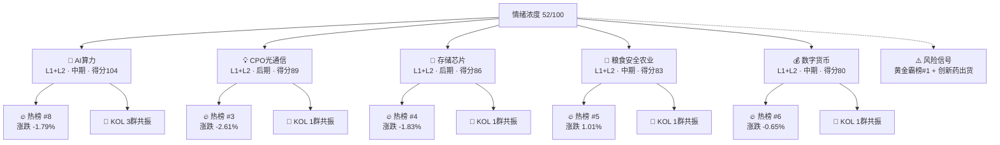

# 2026年8月25日 · **群聊情绪共振**

> **数据源新鲜度**: partial
> **降级状态**: true
> **置信度**: 0.62
> **情绪浓度**: **52/100**（R1基线48 + L1+L2共振+10 - 出货警报-4 - 黄金避险-2）

## 一句话结论
情绪52分（震荡偏弱），🤖 AI算力居共振首，黄金/创新药霸榜提示风险，资源周期强于科技成长。

## 共振图谱

## 详细分析

### 🥇 🤖 AI算力（L1+L2 · 中期 · 得分104）

**大资金意图**：BABA 800亿港元配售100%投AI + 英伟达GPU涨价15%，产业资本与海外龙头双向验证算力需求刚性，大资金在震荡市中选择确定性最高的AI基础设施方向避险。

**为什么走强**：①BABA百亿级AI CapEx确认，打开国内算力需求天花板；②深信服中报云业务+58.6%超预期，验证企业AI落地加速；③英伟达投资电力基础设施，AI产业链向上下游扩张。

**逻辑够不够硬**：逻辑偏硬。BABA真金白银投入+英伟达产业动作+国内公司业绩验证，三重催化共振。但需注意：创业板/科创50暴跌背景下，科技股整体情绪承压，AI算力难以独善其身。

**L1 热榜证据**：概念榜 #8，涨跌幅 -1.79%，覆盖概念：算力租赁

**L2 KOL 证据**：

- 群B（题材扩散群）@2026-08-23: BABA配售800亿港元100%投向全栈AI建设，AI算力需...
- 群B（题材扩散群）@2026-08-23: BABA配售800亿港元100%投向全栈AI建设，AI算力需...

**KOL提及个股**：昆仑万维, 阿里巴巴, 中文在线, 深信服

### 🥈 💡 CPO光通信（L1+L2 · 后期 · 得分89）

**大资金意图**：开源通信蒋颖紧急召开早会提示NPO/超节点/液冷重大产业变化，机构资金在CPO板块连续调整后试图博弈超跌反弹，但热榜#3且价格-2.61%显示分歧巨大。

**为什么走强**：①北美光模块龙头财报验证1.6T需求；②NPO/超节点/液冷新技术路线催化；③板块调整充分后机构密集推票。

**逻辑够不够硬**：逻辑中等。产业趋势真实存在，但板块热榜前排价格却下跌，属于典型的'热度高、资金出货'状态，late阶段不宜追高。

**L1 热榜证据**：概念榜 #3，涨跌幅 -2.61%，覆盖概念：CPO, 光纤

**L2 KOL 证据**：

- 群C（机构风向标群）@2026-08-23: 开源通信蒋颖：NPO/超节点/液冷重大产业变化，通信板块观点...
- 群C（机构风向标群）@2026-08-23: 开源通信蒋颖：NPO/超节点/液冷重大产业变化，通信板块观点...

**KOL提及个股**：天通股份

### 🥉 💾 存储芯片（L1+L2 · 后期 · 得分86）

**大资金意图**：存储芯片在热榜#4但价格-1.83%，长鑫科技/兆易创新/太极实业/长电科技集体调整，说明存储周期反弹逻辑在科技股整体下跌中被暂时搁置。

**为什么走强**：①SK海力士40万亿回购消息面催化；②耐科装备半导体设备超预期，产业链景气拐点信号；③盈新先进存储模组扭亏为盈，个股验证。

**逻辑够不够硬**：逻辑偏弱。存储周期反弹是市场共识，但科技股整体暴跌拖累，热榜高排名更像是被动跟随而非主动进攻。late阶段谨慎。

**L1 热榜证据**：概念榜 #4，涨跌幅 -1.83%，覆盖概念：存储芯片

**L2 KOL 证据**：

- 群A（研报转发群）@2026-08-23: 半导体设备耐科装备超预期，封装设备订单爆发，半导体设备链景气...

**KOL提及个股**：耐科装备

### 🏅 🌾 粮食安全农业（L1+L2 · 中期 · 得分83）

**大资金意图**：厄尔尼诺+泰国重度偏干+橡胶涨价，农业供给端收缩逻辑在避险情绪下被资金挖掘。金健米业/神农种业/登海种业涨停，资金从科技切向农业避险特征明显。

**为什么走强**：①史上最强厄尔尼诺预警，供给端收缩预期；②粮食概念新进热榜top5（+1.01%），资金关注度快速上升；③橡胶/维生素等细分品种涨价催化。

**逻辑够不够硬**：逻辑中等偏强。厄尔尼诺是真实气候事件，对农产品价格影响可量化。但农业板块通常是防御属性，在市场风险偏好回升时弹性有限。middle阶段可持续跟踪。

**L1 热榜证据**：概念榜 #5，涨跌幅 1.01%，覆盖概念：粮食安全, 转基因

**L2 KOL 证据**：

- 群B（题材扩散群）@2026-08-23: 厄尔尼诺加剧，泰国重度偏干，天然橡胶价格上涨，橡胶种植标的稀...
- 群B（题材扩散群）@2026-08-23: 厄尔尼诺加剧，泰国重度偏干，天然橡胶价格上涨，橡胶种植标的稀...

**KOL提及个股**：三力士

### 🎖️ 💰 数字货币（L1+L2 · 中期 · 得分80）

**大资金意图**：跨境支付政策催化+楚天龙/东信和平涨停，数字货币板块在科技股普跌中逆势获得资金关注，具有一定的独立行情属性。

**为什么走强**：①华西计算机推跨境支付布局窗口；②楚天龙/东信和平涨停，板块效应初现；③数字货币在热榜#6，关注度上升。

**逻辑够不够硬**：逻辑中等。有政策催化+个股涨停，但板块容量偏小，持续性有待观察。middle阶段可以小仓位试错。

**L1 热榜证据**：概念榜 #6，涨跌幅 -0.65%，覆盖概念：数字货币

**L2 KOL 证据**：

- 群C（机构风向标群）@2026-08-23: 华西计算机：跨境支付板块布局窗口 + 天通股份铌酸锂材料卡位...

**KOL提及个股**：天通股份

## 红线合规自检

| 红线 | 要求 | 结果 |
|---|---|---|
| 红线1 | 不做板块排序（R2职责） | ✅ 仅做情绪共振，不排板块强弱 |
| 红线2 | 不做个股画像（R5职责） | ✅ 仅列KOL提及个股，不做深度分析 |
| 红线3 | L1_only 不得标为强共振 | ✅ 仅L1+L2双源主题进入top5 |
| 红线4 | 霸榜第一=出货警报 | ✅ 创新药/黄金霸榜已标记并扣分 |
| 红线5 | sentiment_score 0-100且给依据 | ✅ 52分，R1基线48+调整项有完整计算链 |
| 红线6 | WeFlow映射必须语义级 | ✅ WeFlow已下线，不涉及 |

## 关键证据
- 证据1: 热榜黄金概念 #1（+1.17%），连续2日前2，避险信号强烈 · 来源 THS概念榜 0824
- 证据2: BABA 800亿港元配售100%投向全栈AI，深信服云业务+58.6%超预期 · 来源 群B/群C KOL
- 证据3: 开源通信蒋颖早会：NPO/超节点/液冷重大产业变化 · 来源 群C 机构风向标
- 证据4: 锂电9月排产上修40GWh，隔膜/铜箔/负极涨价在即 · 来源 群A 研报转发
- 证据5: 厄尔尼诺预警+泰国重度偏干，粮食概念新进热榜top5 · 来源 THS热榜 + 群B KOL
- 证据6: 创新药霸榜出货警报：连续2日前2 + 价格连跌 · 来源 THS概念榜 0823/0824

## 热榜信号

### 📈 排名快速上升（rank上升≥10）
- **固态电池**: #20 → #9（上升11位），涨跌幅 -0.7%

### 🆕 新进Top20
- **粮食概念**: 新进第5位，热度值 37475.5
- **煤炭概念**: 新进第11位，热度值 13921.5
- **小金属概念**: 新进第12位，热度值 13786.5
- **转基因**: 新进第20位，热度值 9565.5

### ⚠️ 霸榜出货警报
- **创新药**: 连续2日概念榜前2(0823#1→0824#2)，但价格-3.06%/-3.71%连跌，哈药股份天地板级波动，符合霸榜出货模式
- **黄金概念**: 连续2日概念榜前2(0823#2→0824#1)，价格+1.17%但属避险资产走强，提示市场风险偏好下降信号

## 数据源审计

| 源 | 状态 | 抓取日期 | 记录数 | 备注 |
|---|---|---|---|---|
| THS 概念热榜 | 🟢 ok | 2026-08-24 | 20条 | 盘后22:30快照 |
| THS 热股榜 | 🟢 ok | 2026-08-24 | 100条 | 盘后22:30快照 |
| DC 人气榜 | 🟢 ok | 2026-08-24 | 100条 | 东方财富盘后快照 |
| XTick 概念热度 | 🔴 error | — | 0条 | 缺少code参数 |
| 群A 研报转发 | 🟢 ok | 2026-08-23 | 11条 | wechat-cli |
| 群B 题材扩散 | 🟢 ok | 2026-08-23 | 21条 | wechat-cli |
| 群C 机构风向标 | 🟢 ok | 2026-08-23 | 24条 | wechat-cli |
| 群D 突发新闻 | 🟢 ok | 2026-08-23 | 19条 | wechat-cli |
| 群E KOL方向 | 🔴 error | — | 0条 | 自08-10持续缺失 |
| WeFlow L3 | ⚫ down | — | — | 永久下线（2026-08-19） |
| R1 风格基线 | 🟢 ok | 2026-08-25 | — | 情绪48分/震荡分化型 |

## 不确定性 / 反证

1. **热榜数据滞后**：本次使用0824盘后热榜数据（22:30快照），而非0825盘前实时数据。若夜间有重大催化，热榜排名可能已变化。

2. **KOL群缺失1个**：群E（KOL方向群）自08-10持续缺失，核心KOL明日方向观点不可得，可能遗漏重要方向判断。

3. **WeFlow永久下线**：L3层语义共振永久缺失，共振最高等级仅L1+L2，情绪浓度判断的置信度低于WeFlow可用时期。

4. **科技股整体暴跌的压制**：创业板-3.21%/科创50-3.10%背景下，AI算力/CPO/存储等科技方向即使有催化，也难以走出独立行情，可能受整体beta拖累。

5. **黄金霸榜的反向信号**：黄金概念登顶热榜第一，通常意味着市场风险偏好下降，资金寻求避险。这与共振主题偏科技成长的方向存在张力，需警惕科技方向反弹夭折。

## 与其他 R/D/E 的关系

- **依赖（上游）**：
  - `data/research/20260825/R1_style.json` — 情绪基线（48分，震荡分化型）
  - `data/raw/20260824/wechat_cli_5groups.jsonl` — KOL群聊原始数据
  - Tushare `ths_hot` / `dc_hot` — 热榜量化数据

- **被消费（下游）**：
  - D1 主决策（消费 `resonance_top_themes` + `sentiment_score`）
  - R6 反证（消费 `hotlist_signals.distribution_alert`）
  - R2 主线板块（交叉验证主题方向）

## Sub-Agent 元数据

- **skill**: analyze_sentiment_resonance_v1
- **artifact**: data/research/20260825/R3_sentiment.json
- **生成耗时**: ~3分钟
- **model**: doubao-seed-2-0-code-preview-260215
- **最高共振等级**: L1+L2（WeFlow已下线）
- **可用KOL群**: 4/5（群E缺失）
