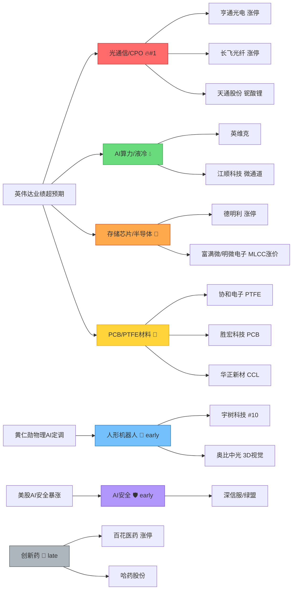

# 2026年8月28日 · **群聊情绪共振**

> **数据源新鲜度**: ⚠️ partial
> **降级状态**: ✅ 降级运行（WeFlow下线 + 缺1KOL群）
> **置信度**: 0.70

## 一句话结论

情绪浓度 **87.6/100（高位偏强）**，L1+L2双源共振4条主线全部指向 **AI硬件产业链**（光通信→存储→PCB材料→液冷），英伟达业绩超预期是核心驱动。

---

## 详细分析

### 📊 情绪浓度：87.6/100（R1基线78.6 + 共振加成9.0）

| 因子 | 数值 | 说明 |
|------|------|------|
| R1 情绪基线 | 78.6 | R1风格判断市场情绪偏强 |
| L1+L2共振主题 × 2 | +8.0 | 4条双源共振主线 |
| L2 early潜在线索 × 0.5 | +1.0 | 人形机器人 + AI安全 |
| 霸榜出货警报 | -0 | 无连续2日霸榜第一 |
| **最终** | **87.6** | **高位偏强，科技主线集中** |

**解读**：情绪处于高位区间，但不是极致亢奋（没有霸榜出货警报）。主线高度集中在AI硬件链条，从光模块→存储→PCB材料→液冷，形成完整的英伟达产业链传导。

### 🏆 L1+L2 双源共振 Top 4

#### 🥇 光通信/CPO（middle，76.3分）

**大资金意图**：英伟达业绩超预期验证1.6T/3.2T光模块需求，机构大举加仓光通信全产业链，从光模块龙头向光纤/MPO/薄膜铌酸锂等上游扩散。

**为什么走强**：
- 开源通信首席强Call "NPO、光纤光缆、MPO&FAU" 全产业链机会
- 英伟达业绩全面超预期，光互联需求确定性最高
- 薄膜铌酸锂FCC制裁风险低，国产替代逻辑强化
- 热榜CPO #3→#1（热度+243%），光纤热度+194%

**逻辑够不够硬**：硬。光通信是AI算力的"高速公路"，需求确定性最强，产业链从光模块到上游材料全面开花，机构+游资+量化三方共振。

**核心标的**：亨通光电（涨停#1）、长飞光纤（涨停#7）、通鼎互联（#2）、杭电股份（涨停#4）、天通股份（薄膜铌酸锂）

---

#### 🥈 存储芯片/半导体（early_middle，62.7分）

**大资金意图**：存储周期反转 + MLCC涨价 + 成熟制程紧缺，三重逻辑叠加，资金从光模块向半导体扩散。

**为什么走强**：
- 三星电机Q4 MLCC涨价25-30%，产业正式进入上升周期
- 8寸成熟制程产能被AI算力虹吸，功率器件从涨价到缺货
- 存储芯片概念排名 #8→#3（+5），MLCC #19→#10（+9）
- 国家大基金持股概念新进top15

**逻辑够不够硬**：较硬。MLCC涨价是明确的产业信号，存储周期反转已有预期但尚未充分定价，8寸产能紧张是AI算力的边际增量。风险在于部分标的已有一定涨幅。

**核心标的**：德明利（涨停#20）、富满微、明微电子、兴森科技、文一科技

---

#### 🥉 PCB/PTFE/CCL电子材料（early_middle，59.3分）

**大资金意图**：NV Rubin新路线带火PTFE材料，ABF产能拍卖说明供需极紧张，资金在挖掘AI硬件的"卖铲人"——上游电子材料。

**为什么走强**：
- PTFE极低介电损耗，有望进入Rubin Ultra Kyber正交背板
- ABF产能靠竞价拍卖，极度缺货，二线厂商议价权提升
- PCB概念排名 #7→#4（+3，热度+364%）
- 华正新材高频CCL送测英伟达，昇腾950一供

**逻辑够不够硬**：中硬。材料逻辑偏主题性，需要后续订单/业绩验证。但PTFE新路线如果确认，空间确实大。当前位置偏early，适合跟踪验证。

**核心标的**：协和电子（PTFE加工）、胜宏科技（PCB）、华正新材（CCL）、壹石通（硅微粉）、莲花控股（ABF）

---

#### 🏅 AI算力/液冷（middle，51.7分）

**大资金意图**：AI算力需求持续爆发，液冷从可选变必选，微通道新技术路线带来增量机会。

**为什么走强**：
- NV Rubin系列功率提升，传统液冷方案难以满足，微通道成新方向
- 江顺科技微通道液冷已向头部服务器厂商送样
- 中国移动33.5亿华为昇腾AI超节点大单落地
- 液冷服务器热度+200%，云计算新进top10

**逻辑够不够硬**：中硬。液冷是老主线，但微通道新路线带来新的增量标的。算力租赁方向标的较多但质地参差不齐，需要精选。

**核心标的**：英维克（#16）、远东股份（#15）、江顺科技、澄天伟业、盈峰环境

---

### 🔍 L2_only 潜在线索（early，密切关注）

| 主题 | 阶段 | 关注触发条件 |
|------|------|-------------|
| 人形机器人/物理AI | early | 人形机器人概念重回top15 或 宇树科技进入热股top5 |
| AI安全/网络安全 | early | 网络安全概念进入top15 或 深信服/绿盟科技进入热股top20 |

> ⚠️ 这两个主题KOL讨论热度很高（3群以上），但热榜尚未反映，属于**预期差机会**。如果后续热榜排名快速上升，可能从early进入early_middle，值得提前布局观察。

### ⚠️ L1_only 晚期警示

| 主题 | 热榜排名 | 警示原因 |
|------|---------|---------|
| 创新药 | #2 | 热榜高位但KOL 0群讨论，前期mRNA催化余温，缺乏新催化 |
| 黄金概念 | #11 | 热度大幅回落（#2→#11），仅深中华A个股妖股行情 |

---

## 关键证据

- **证据1**: 英伟达业绩全面超预期 → 开源通信首席强Call光互联全产业链 → CPO概念热度+243%登顶 · 来源 群C·机构风向标群 + Tushare热榜
- **证据2**: 三星电机Q4 MLCC涨价25-30% + 8寸成熟制程产能紧缺 → 存储芯片排名+5、MLCC排名+9 · 来源 群D·题材挖掘群 + 群E·核心主线群 + Tushare热榜
- **证据3**: NV Rubin PTFE新路线 + ABF产能拍卖 → PCB概念热度+364% · 来源 群D·题材挖掘群 + 群E·核心主线群 + Tushare热榜
- **证据4**: 黄仁勋定调物理AI拐点 + Optimus爬产加速 → 人形机器人热榜尚未反映（预期差）· 来源 群E·核心主线群 + 群D·题材挖掘群
- **证据5**: 美股Okta+19%/CrowdStrike+10% AI安全超预期 → A股AI安全尚未发酵 · 来源 群A·研报快讯群 + 群D·题材挖掘群 + 群E·核心主线群

---

## 共振传导图

---

## 数据源审计

| 源 | 状态 | 抓取时间 | 记录数 | 备注 |
|---|---|---|---|---|
| Tushare THS热榜 | 🟢 ok | 2026-08-27 22:30 | 503条 | 概念20+热股100+其他品类，两日数据完整 |
| KOL群聊（4/5群） | 🟡 degraded | 2026-08-27 全天 | 415条 | 群B（KOL方向群）自08-10持续缺失 |
| WeFlow语义 | 🔴 down | — | 0 | 已于2026-08-19永久下线 |
| R1情绪基线 | 🟢 ok | 2026-08-28 07:30 | 1 | sentiment_score=78.6 |
| XTick热榜 | ⚪ 未用 | — | — | Tushare数据已满足L1需求，未额外调用 |

---

## 不确定性 / 反证

1. **主线过于集中风险**：Top 4全部指向AI硬件产业链，如果英伟达链条出现回调，可能产生共振式下跌，缺乏对冲板块。
2. **材料逻辑验证风险**：PTFE/ABF/硅微粉等材料逻辑偏主题性，需要后续订单/业绩验证，当前位置可能透支预期。
3. **KOL缺群影响**：颜晓滨核心群自08-10持续缺失，可能遗漏某些主线方向的判断。
4. **情绪高位警觉**：87.6的情绪分已属高位，历史上90+往往对应短期顶部区域，需要警惕情绪反转。
5. **创新药暗线**：创新药虽然KOL讨论少，但热榜仍在#2位置，如果后续有新催化可能重新成为主线。

---

## 与其他 R/D/E 的关系

- **依赖上游**:
  - `data/research/20260828/R1_style.json` — 情绪基线
  - `data/raw/20260828/wechat_cli_5groups.jsonl` — KOL原始数据
  - `data/raw/20260828/manifest.json` — 数据源健康度
- **被消费下游**:
  - D1 主决策 — 共振主题作为主线候选池输入
  - R2 主线板块 — 情绪浓度 + 共振主题交叉验证
  - R4 消息面 — KOL方向与消息面催化交叉

---

## Sub-Agent 元数据

- **skill**: analyze_sentiment_resonance_v1
- **artifact**: `data/research/20260828/R3_sentiment.json`
- **生成耗时**: 约3分钟
- **模式**: L1+L2 双源共振（WeFlow已下线）
- **降级**: 是（WeFlow永久下线 + 缺1KOL群 + 未用XTick）
- **红线检查**: ✅ 6/6 全部通过
