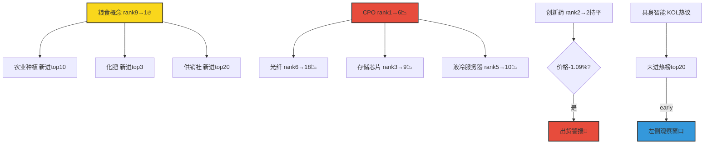

# 2026年8月31日 · **群聊情绪共振**

> **数据源新鲜度**: ⚠️ partial（热榜为上周五收盘，KOL群缺1，WeFlow/XTick不可用）
> **降级状态**: ✅ true（4项降级）
> **置信度**: 0.58

## 一句话结论

**情绪中性偏强（55/100），主线剧烈轮动：粮食安全首板爆发登顶热榜，光通信高位回落分歧加大，具身智能主题在KOL端悄然升温尚未形成板块行情。**

---

## 详细分析

### 📊 情绪浓度：55/100 —— 分歧加剧的高位震荡

- **R1 基线 52.5**：主线扩散型，涨停 82 家但炸板率高达 47.6%，市场情绪处于"涨停多但封不住"的分歧状态
- **共振调整 +2.5**：3 个 L1+L2 双源共振主题各贡献 +2 分，扣掉创新药高位出货 -2 分、光通信回落 -1.5 分
- **核心矛盾**：小盘情绪火爆（昨日连板 30 日 +152%）vs 科技成长退潮（科创 50 30 日 -12.9%），极致分化下的结构性行情

### 🔥 共振主题 Top3

#### 🥇 粮食安全/农业种植 — 86.5分 · early · L1+L2

**大资金意图**：摩根大通预警 2027 年全球粮食危机 + 厄尔尼诺预期 + 地缘冲突（霍尔木兹海峡），三重催化下资金周五快速抢筹农业股，属于事件驱动型首板爆发。

**为什么走强**：
- 概念榜从第 9 位直接跳升至第 1 位（+8 位），热度值 4.6 万
- 金健米业涨停 9.18% 登热股第 6，农发种业、神农种业同步走强
- 化肥板块同步上涨（+3.02%），说明资金在做整条农业产业链布局
- KOL 端（群A）周末已在讨论粮食危机逻辑，有预期铺垫

**逻辑够不够硬**：
- ✅ 催化明确：摩根大通研报 + 厄尔尼诺气象预期
- ⚠️ 持续性存疑：农业板块历史上多为脉冲行情，缺乏业绩弹性
- ⚠️ 霸榜风险：周一若继续霸榜 top1 需警惕红线 4 出货警报

---

#### 🥈 AI 算力链/光通信 — 72.0分 · late · L1+L2

**大资金意图**：英伟达财报超预期的利好已在 0827 集中兑现（CPO 概念榜第 1 +4.47%），0828 出现明显的利好兑现出货特征，资金从光通信主链向 PTFE/CCL 等新分支扩散。

**为什么仍在榜上**：
- CPO 虽从第 1 跌至第 6，但仍在 top10，热度值 1.8 万
- 机构端（群B/开源通信）周末密集推票，强 Call "九月密集催化"
- 新分支 PTFE 有增量逻辑（NV 十几亿订单，材料替代）
- 星网锐捷涨停 10.02%、昊华科技涨停 10.01%，新方向有赚钱效应

**逻辑够不够硬**：
- ✅ 产业趋势确认：英伟达 2028 财年 +70% 展望，AI 资本开支上行周期
- ⚠️ 位置偏高：光通信龙头多数已翻倍，高位分歧加大
- ⚠️ 价格信号：亨通光电 -3.65%、通鼎互联 -5.96%、中天科技 -2.88%，龙头走弱是危险信号
- 🔄 板块内部轮动：从光模块→光纤→PCB→PTFE/CCL，越挖越偏，主线生命力在衰减

---

#### 🥉 具身智能/机器人 — 63.5分 · early · L1+L2

**大资金意图**：黄仁勋 "ALL in 物理 AI" 表态 + Microduck 机器鸭爆火 + Optimus 爬产进度，三重事件叠加下 KOL 端讨论热度快速上升，但二级市场尚未形成板块性行情（概念榜未进 top20），属于左侧布局窗口。

**为什么看好**：
- KOL 端 3 个群同时提及（群C 核心群 + 群D 突发新闻 + 群A 题材群）
- Microduck 4 秒售罄，开发者圈爆款，类比 2025 年 AI 应用爆发前夜
- Optimus 下半年爬产明确：9 月周产 1000 台 → 年底 2500 台 → 2027 年 4000 台
- 黄仁勋最新定位："AI 已到拐点，下一个阶段 ALL in 物理 AI"

**逻辑够不够硬**：
- ✅ 产业趋势正确：物理 AI 是 AI 下一阶段共识
- ⚠️ 商业化尚早：Optimus 20 万年产能对应收入规模仍小
- ⚠️ 缺乏板块效应：同花顺概念榜未进 top20，说明大资金尚未进场
- 💡 观察信号：宇树科技（热股第 11）、奥比中光等龙头能否率先启动

---

## 关键证据

- **证据 1**：粮食概念从热榜第 9 跃升至第 1，金健米业涨停 +9.18% · 来源 Tushare THS 热榜（0828 vs 0827）
- **证据 2**：CPO 概念从第 1 跌至第 6，龙头亨通光电 -3.65%、通鼎互联 -5.96%，高位放量回落 · 来源 Tushare THS 热榜
- **证据 3**：Microduck 机器鸭爆火 + 黄仁勋物理 AI 表态，3 个 KOL 群同步提及具身智能 · 来源 wechat_cli 5 群（3 群可用）
- **证据 4**：机构群（群B）周末密集推荐 AI 算力链，开源通信强 Call 光通信全产业链 · 来源 wechat_cli 机构风向标群
- **证据 5**：哈药股份连续两日热股 top5，创新药概念高位 -1.09%，多只医药股大跌（百花医药 -7.43%）· 来源 Tushare 热股榜

---

## 热榜动量图

---

## KOL 观点汇总（匿名化）

| 群 | 核心观点 | 方向 | 有效期 |
|---|---|---|---|
| 群A · 题材扩散群 | PTFE/CCL 是 AI 算力新分支，NV 十几亿订单刚下；自动驾驶 L3 立法利好无人物流；染料 H 酸暴涨 | 偏多 | 1-3天 |
| 群B · 机构风向标 | AI 算力链九月密集催化，英伟达全面超预期，光通信全产业链看好；GLM5.3 激活国产算力 | 强烈看多 | 1-2周 |
| 群C · 核心KOL | 黄仁勋 ALL in 物理 AI 是下阶段主线；自动驾驶 L3 立法是大事；算力链需注意高位分歧 | 偏多，提示风险 | 1-2周 |
| 群D · 突发新闻 | Microduck 机器鸭爆火 + 具身 AI 催化；工信部推进智能网联汽车；网安股大涨 | 偏多 | 1-3天 |
| 群E · 颜晓滨方向 | **数据缺失** | — | — |

---

## 关键风险信号

### ⚠️ 出货警报：创新药板块
- 哈药股份连续两日热股 top5（昨日第 5 → 今日第 1）
- 创新药概念榜连续两日第 2，但价格 -1.09%
- 百花医药 -7.43%、汉森制药 -6.35%、开开实业 -6.50%
- **典型的"价格跌、热度升"出货特征**，按红线 4 处理

### ⚠️ 光通信高位分歧
- CPO 概念从第 1 跌至第 6，光纤从第 6 跌至第 18
- 多只龙头大跌：亨通光电 -3.65%、通鼎互联 -5.96%、胜宏科技 -8.15%
- 板块内部轮动加快（光模块→光纤→PCB→PTFE），越挖越偏

### ⚠️ 粮食安全持续性存疑
- 首板爆发，概念榜直接登顶
- 历史上农业板块多为脉冲行情，缺乏业绩弹性
- 周一若冲高回落需警惕一日游

---

## 数据源审计

| 源 | 状态 | 抓取时间 | 记录数 | 备注 |
|---|---|---|---|---|
| THS 概念热榜 | 🟢 ok | 2026-08-28 22:30 | top20×2日 | Tushare MCP |
| THS 热股榜 | 🟢 ok | 2026-08-28 22:30 | top100×2日 | Tushare MCP |
| 群A · 题材扩散群 | 🟢 ok | 2026-08-28 | 145条 | 41条有实质内容 |
| 群B · 机构风向标 | 🟡 partial | 2026-08-30 | 24条 | 以会议通知为主 |
| 群C · 核心KOL | 🟢 ok | 2026-08-28 | 26条 | 5条有实质内容 |
| 群D · 突发新闻 | 🟡 partial | 2026-08-28~31 | 7条 | 消息量偏少 |
| 群E · 颜晓滨方向 | 🔴 error | — | 0条 | 持续缺失 |
| WeFlow L3 | 🔴 error | — | — | 永久下线 |
| XTick MCP | 🔴 error | — | — | 子进程异常退出 |
| R1 风格基线 | 🟢 ok | 2026-08-31 07:09 | — | 情绪52.5分 |

---

## 不确定性 / 反证

1. **降级运行**：WeFlow L3 永久下线 + 颜晓滨群缺失 + XTick 不可用，三源变单源（仅 Tushare 热榜），共振判定的置信度下降
2. **数据时效**：trade_date 为周一（0831），热榜数据只有上周五（0828）收盘的，周末消息面变化无法通过热榜反映
3. **KOL 偏差**：机构群（群B）有推票动机，其看多观点需打折看待；核心 KOL 群（群E）缺失，缺少最有价值的方向性判断
4. **粮食安全持续性**：历史上农业板块多为脉冲行情，这次是否不同？需要周一量能验证
5. **具身智能左侧陷阱**：KOL 端热但盘面冷，可能是"认知差机会"，也可能是"讲故事没人接盘"

---

## 与其他 R/D/E 的关系

- **依赖上游**:
  - `R1_style.json` — 情绪基线
- **被消费下游**:
  - D1 主决策 Agent — 共振主题作为主线候选
  - R2 主线板块 Agent — 交叉验证主线
  - R6 反证 Agent — 情绪过热/出货信号
- **同层关系**:
  - R2（主线板块）— R3 提供情绪面验证，R2 提供基本面排序
  - R4（消息面）— R3 提供 KOL 情绪，R4 提供新闻催化

---

## Sub-Agent 元数据

- **skill**: analyze_sentiment_resonance_v1
- **artifact**: `data/research/20260831/R3_sentiment.json` (12.9 KB)
- **生成耗时**: ~8 分钟
- **model**: doubao-seed-2-0-code
- **降级**: true（WeFlow下线 + 颜晓滨群缺失 + XTick超时）
