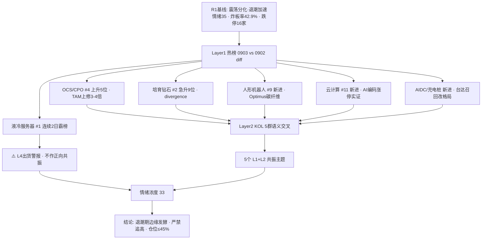

# 2026年9月4日 · **群聊情绪共振**

> **数据源新鲜度**: 🟢 ok
> **降级状态**: ✅ 否（WeFlow 永久下线为既定状态 · XTick 本轮未调用）
> **置信度**: 0.65

## 一句话结论
情绪 33（退潮期），液冷霸榜 2 日出货警报压顶，仅 OCS/培育钻石/机器人/AI编码/AIDC 五主题 L1+L2 边缘共振，无主线，严禁追高。

## 详细分析

**📉 情绪总况：退潮加速、题材脉冲化。** R1 基线给出 35（震荡分化型退潮加速期：涨停 44 家收缩、炸板率 42.9% 近翻倍、跌停 16 家翻倍、连板 5 板孤军无 3 板）。R3 双源交叉后下调至 **33**——热榜与 KOL 均未提供任何强势放量主线，只有"新进 top20"级别的边缘发酵，属退潮期的题材脉冲而非主线进攻。

**🔥 Layer1 热榜：新进 5 方向，但最大主题触发出货警报。** 0903 vs 0902 概念榜 diff：新进 top20 有人形机器人(#9)、云计算(#11)、无人驾驶(#12)、充电桩(#14)、数据中心 AIDC(#15)；掉榜 兵装重组(#2!)、军民融合、农业、新股次新。⚠️ **液冷服务器连续 2 日霸榜 #1 → L4 出货警报**（红线：霸榜第一永远是反向），尽管它是全场 KOL 提及密度最高的主题。

**🗣️ Layer2 KOL：情绪强度与谨慎度剧烈分层。** 题材群/核心资讯群转发密度极高（AI军工、OCS、华为 Mate90 韬芯片、司美格鲁肽延缓衰老、特斯拉 Optimus 碳纤维骨架、谷歌 CDU 订单翻倍、台达电源召回），但 KOL 主群整体谨慎（"不好做呀慢慢来价值投资"、"科技第二波仍在调整"），机构风向标群则把子弹集中押在液冷（开源通信强推英维克 + 全产业链）。

**🎯 共振结构：5 个 L1+L2 主题，均为"边缘发酵"而非"主线走强"。** OCS/CPO（#4，TAM 上修 3-4 倍）逻辑最硬；培育钻石/金刚石散热（#2 但急升 9 位=情绪透支）；人形机器人（#9 新进 + Optimus 碳纤维）；AI编码（云计算 #11 新进 + 新炬/金现代涨停实证）；AIDC 电源（#15/#14 新进 + 台达召回改写供应格局）。**液冷因霸榜出货警报被剔除出正向共振**，转入高危反证清单。

**🧮 情绪浓度 33 = R1 35 + 共振 +6 − 液冷出货 −5 − 炸板率 −3。** 与 5 维度加权法 score_5d≈33 一致（差 <15，无 gap 警示）。对 D1 的含义：退潮期仓位上限维持 45% 以内，5 个主题仅作观察池，不可作为进攻主线；液冷方向严禁追高，等回调企稳再看分支。

## 情绪传导图

## 双源共振主题（top5）

### #1 OCS 光交换 / CPO ［L1+L2 · middle］
- **热榜**: CPO #4（9→4 上升 5 位）、光纤 #20 · **KOL**: 4 条（科研兔 ×2 / 国金通信 / 特发信息 senko 代工）
- **建议板块**: 共封装光学(CPO) · OCS 光交换 · 光纤概念
- **候选**: 000070 特发信息 · 301486 致尚科技 · 300308 中际旭创 · 300394 天孚通信
- **大资金意图**: 英伟达 Feyman 架构全线标配 OCS + 谷歌 TPU 6D 升级，光交换从谷歌单一链扩为英伟达/OpenAI/谷歌四类场景，TAM 上修 3-4 倍；机构（国金通信）定性"有望奔新高"。主力押注不受 AI capex/FCC 影响的稀缺增量，对手盘是仍抱旧光模块逻辑的资金。
- **为什么走强**: 位置=OCS 为科技边际变化最大细分（0828 异动→0903 发酵）；催化=德意志银行大会 Lumentum CEO 确认超级大客户 + 国金研报；筹码=特发信息（切 senko 代工）、致尚科技（senko 核心供应商）承接题材资金。
- **逻辑够不够硬**: ≥3 独立源（热榜 + KOL + 机构研报）+ 硬产业锚（Feyman 全线标配 + TAM 量化上修）→ 硬；证伪路径=Feyman 量产推迟或谷歌 6D 方案变更则 TAM 上修落空。

### #2 培育钻石 / 金刚石散热 ［L1+L2 · middle］
- **热榜**: 培育钻石 #2（11→2 急升 9 位，主力净流入 +18.25 亿但排名与资金背离=divergence）· **KOL**: 3 条（DARPA 金刚石冷却芯片）
- **建议板块**: 培育钻石 · 金刚石散热 · 半导体材料
- **候选**: 600172 黄河旋风 · 300179 四方达 · 688028 沃尔德 · 300316 晶盛机电
- **大资金意图**: AI 芯片功耗破 4000W，散热向金刚石（热导率 800-2200W/mk）演进，DARPA 给国防级芯片合同验证需求；资金炒"0→1"材料替代。
- **为什么走强**: 位置=急升 9 位（超买速度过快）；催化=Northrop Grumman 赢 DARPA 700 万美元合同 + 金刚石涨价；筹码=黄河旋风人气榜 #1（+7.93% 未涨停=情绪票）、四方达 +7.28%。
- **逻辑够不够硬**: 3 源（热榜 + KOL + 人气榜）+ 硬技术锚（热导率物性 + DARPA 合同）；但排名急升=情绪透支，净流入与排名背离，证伪=若仅培育钻石旧题材借壳而无实单则回落。

### #3 人形机器人 / 具身智能 ［L1+L2 · early］
- **热榜**: 人形机器人 #9（新进 top20）· **KOL**: 3 条（Atlas 世界模型 / Optimus 碳纤维骨架减重 33%）
- **建议板块**: 人形机器人 · 具身智能 · 碳纤维
- **候选**: 002031 巨轮智能 · 600288 大恒科技 · 300699 光威复材 · 688295 中复神鹰
- **大资金意图**: Optimus 碳纤维骨架减重（降本信号）+ World Labs Atlas（数据训练痛点破解）双催化，押注具身智能商业化前夜。
- **为什么走强**: 位置=新进 top20 低位启动；催化=特斯拉材料升级 + 李飞飞发布 Atlas；筹码=巨轮智能人气榜 #35（+6.55%）、新股 920906（机器人+无人驾驶）。
- **逻辑够不够硬**: 2-3 源（热榜 + KOL）；硬锚=特斯拉量产进展（硬事件）；证伪=骨架减重非整机量产里程碑，若无整机催化则题材脉冲。

### #4 AI 应用 / AI 编码 ［L1+L2 · middle］
- **热榜**: 云计算 #11（新进）、AI 应用 #5（位平）、AI 视频 #18 · **KOL**: 4 条（Snowflake CoCo / 新炬、金现代涨停 / 立方控股 30cm）
- **建议板块**: AI 应用 · 云计算 · AI 编码(AI+软件)
- **候选**: 605398 新炬网络 · 300830 金现代 · 688258 卓易信息
- **大资金意图**: Snowflake CoCo AI 编码代理 Q2 超预期（9100 账户 +2000），海外 AI 应用开始业绩兑现，押注 AI 硬件→软件补涨切换。
- **为什么走强**: 位置=云计算新进 top11；催化=Snowflake 财报 + A 股新炬/金现代涨停实证；筹码=立方控股 30cm（北交所人气）。
- **逻辑够不够硬**: 2-3 源（热榜 + KOL 含涨停实证）+ 硬业绩锚（Snowflake）；但 AI 应用在榜已久位平非新启动，0903 当日 -0.87% 阴跌，若继续阴跌则补涨逻辑证伪。

### #5 AI 电源 / AIDC 基建 ［L1+L2 · early］
- **热榜**: 数据中心 AIDC #15（新进）、充电桩 #14（新进）、算力租赁 #13 · **KOL**: 3 条（台达召回 / 泰嘉昇腾电源 / Rubin PSU）
- **建议板块**: AI 电源 · 数据中心(AIDC) · 算力租赁
- **候选**: 002851 麦格米特 · 002484 江海股份 · 002843 泰嘉股份
- **大资金意图**: 台达 18.3KW PSU 烧毁召回，NV 移除 NCC 电容，AI 电源供应格局改写，国内厂商承接份额转移；押注电源国产替代 + Rubin 放量双逻辑。
- **为什么走强**: 位置=AIDC/充电桩双双新进；催化=台达召回（硬供应链事件）+ Rubin PSU 白皮书 2.0；筹码=麦格米特人气榜 #95（+7.25%）。
- **逻辑够不够硬**: 2 源（热榜 + KOL）；硬锚=台达召回 + Rubin 放量时间表；证伪=NV 改用 TDK 后格局未按预期转移或召回影响有限则证伪。

### 🧠 首推代表票思维链 · 特发信息 000070（OCS 卡位）
- **买入理由**: 1) 产业逻辑：子公司光网科技切入 senko（CPO PIC 底座确定方）获代工订单，直接卡位 OCS/CPO 核心增量环节；2) 数据/事件锚：题材群 14:22/14:35 双条确认"底座已确定 senko、公头互插测试反馈不错"，题材群重点点名。
- **风险点**: 1) 短期：OCS 主题已发酵多日（0828 异动），光博会利好兑现易高开回落；2) 中期反证：若 senko 代工仅样品/小批量未放量，业绩贡献有限，纯题材属性。
- **止损条件**: 买入价 -7% 或跌破 20 日线（先到者触发，符合 D1 止损 -5~-10% 硬区间）。
- **可验证假设**: 24-72h 内 OCS 概念在榜维持前 5 且特发量能持续放大 → 逻辑成立；若光博会后 OCS 转弱或特发缩量阴跌 → 证伪离场。

## 关键证据
- 证据 1: 液冷服务器概念热榜连续 2 日 #1（0902/0903）→ L4 出货警报 · 来源 tushare.ths_hot
- 证据 2: 新进 top20 5 方向：人形机器人 #9 / 云计算 #11 / 无人驾驶 #12 / 充电桩 #14 / AIDC #15 · 来源 tushare.ths_hot 两日 diff
- 证据 3: KOL 主群谨慎（"不好做呀慢慢来价值投资""科技第二波在调整"）vs 题材群高密度脉冲（液冷 10+ 条 / OCS / 司美格鲁肽）· 来源 wechat_cli_5groups
- 证据 4: 机构风向标群集中押注液冷（开源通信强推英维克+全产业链、国联民生集智股份）· 来源 机构风向标群
- 证据 5: 涨停实证：新炬网络/金现代（AI 编码）涨停、德展健康（GLP-1）涨停、集泰股份 4 板（硅油液冷）· 来源 一手盘中新闻群 + dc_hot

## 数据源审计
| 源 | 日期 | 状态 | 备注 |
|---|---|:--:|---|
| tushare.ths_hot | 2026-09-03 | 🟢 | 概念板块 top20 · 两日 diff(0902/0903) |
| tushare.dc_hot | 2026-09-03 | 🟢 | A股人气榜 top100 |
| wechat_cli_5groups | 2026-09-03 | 🟢 | 330 条 · 5 群(匿名) |
| R1_style.json | 2026-09-04 | 🟢 | 情绪基线 35 · complete |
| weflow-analytics | 2026-08-19 | 🔴 | 永久下线(既定状态，不计入新鲜度) |
| xtick MCP | - | ⚪ | 未调用(热榜主源 Tushare 完整) |

## 不确定性 / 反证
- **液冷是最大盲点**：全场最强情绪面（KOL 10+ 条 + 机构主推）偏偏触发霸榜 2 日出货警报。若主力借情绪出货，明日题材群脉冲票（硅油液冷/晨光新材套利、集泰 4 板高位）最易炸板，切勿因"大家都在说"而追高。
- **培育钻石排名急升 + 资金背离**：11→2 仅用一天且净流入 +18.25 亿与排名背离（divergence），黄河旋风人气榜 #1 单日 +7.93% 未涨停，情绪票属性重。
- **外盘单源风险**：R1 指出美股 9/3 收盘缺失，特斯拉 Cybercab 大涨 7% 仅群消息单源（00:29）；无人驾驶 #12 新进 + Cybercab 为 L1+L2 但证据偏弱，未进 top5，需行情源确认。
- **退潮期脉冲规律**：炸板率 42.9% 近翻倍，题材首日脉冲次日炸板率历史上显著偏高，5 个共振主题多为"新进 top20"级别，主升概率低。

## 与其他 R/D/E 的关系
- 依赖: R1_style.json（情绪基线 35）· data/research/20260904/hotlist_signals.json（热榜 4 层信号）· data/raw/20260904/wechat_cli_5groups.jsonl（5 群 330 条）
- 被消费: D1（main_decision_v1 · 情绪浓度 + 共振主题）· R2（主线共振/叙事维度）· R4（消息面交叉验证）· R6（反证 · 液冷 L4 出货 + L1_only 单源）

## Sub-Agent 元数据
- skill: analyze_sentiment_resonance_v1
- artifact: data/research/20260904/R3_sentiment.json
- 生成耗时: 720 秒
- model: deepseek-v4-flash-260425
