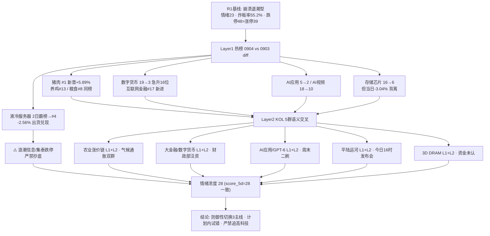

# 2026年9月7日 · **群聊情绪共振**

> **数据源新鲜度**: 🟢 ok
> **降级状态**: ✅ 否（WeFlow 永久下线为既定状态 · XTick 本轮未调用）
> **置信度**: 0.65

## 一句话结论
情绪 28（崩溃退潮中防御切换）：农业涨价链新晋 #1 + 大金融注资 + AI 应用三主线获双源共振，液冷出货兑现，严禁追高科技反抽。

## 详细分析

**📉 情绪总况：崩溃退潮边缘，但防御性切换带来结构性赚钱效应。** R1 基线给出 **23**（崩溃退潮型：跌停 48 家 > 涨停 39 家、炸板率 55.2%、连板 5 板孤军无 3/4 板断层、科技 ETF 30 日深调 -12%~-15%）。R3 双源交叉后上调至 **28**——不是情绪反转，而是**资金在退潮里找到三条防御性出口**：农业涨价链、大金融注资、AI 应用，全部获得 L1 热榜 + L2 KOL 双确认。

**🔥 Layer1 热榜（0904 收盘 vs 0903）：农业链霸榜、科技链崩。** 猪肉新晋概念榜 #1（+5.89%）、养鸡 #13（+4.57%）、粮食 #8（+1.83%）三概念同榜，dc 人气榜农业涨停潮 10+ 只（新希望/罗牛山/亚盛集团/敦煌种业/新五丰/天邦食品）。⚠️ **液冷服务器 2 日霸榜出货警报兑现**：0904 跌至 #4 且 -2.56%，浪潮信息跌停 -9.99%、集泰 -9.99%、英维克 -6.69%——昨日最强情绪面成为今日最大亏钱源，验证"霸榜第一永远是反向"红线。

**🗣️ Layer2 KOL（5 群语义抽取）：主题高度聚焦，散户谨慎。** 一手群 mike 直给"大金融系统性重估窗口"（保险/券商/互金标的一串）+ 散户群东吴非银保险注资深度（人保 150 亿/国寿 350 亿/太平 70 亿+工行农行定增），数字货币概念 19→3 急升 16 位形成动量闭环；题材群/核心群厄尔尼诺气候通胀（鸡蛋 6.4 元/斤、FAO 食品价格 2022 以来最高）精准预判了猪肉霸榜；机构群 GPT-6 ASTRA 二刷 + RUBIN 链 + 华为韬定律支撑 AI 应用。唯一反向：散户投研群"下周还会继续往下吗→应该下"。

**🎯 共振结构：5 个 L1+L2 主题，3 强 2 弱。** 农业涨价链（#1 登顶+涨停潮）与 KOL 气候通胀逻辑严丝合缝；大金融/数字货币（周末财政注资硬催化，最纯粹的今日首日发酵事件）；AI 应用/AI 短剧/GPT-6（天娱数科人气王 + 华福国金周末会议）。平陆运河（今日 16 时通航发布会=明确时间锚）与 3D DRAM（消息强但当日 -3.04% 资金未认）为事件驱动弱共振。

**🧮 情绪浓度 28 = R1 23 + 共振 +9 − 液冷出货 −3 − KOL 看空 −1。** 与 5 维度加权法 score_5d≈28 完全一致（差 0 <15，无 gap 警示）。对 D1 的含义：仓位上限维持 R1 建议 35% 以内，农业/大金融/AI 应用三条线作当日主线候选，但整体仍在崩溃退潮边缘——**计划内试错可做，进攻加仓不动**。

## 情绪传导图

## 双源共振主题（top5）

### #1 农业涨价链（猪肉/养鸡/粮食/种业）［L1+L2 · middle］
- **热榜**: 猪肉 #1（新晋+5.89%）、养鸡 #13（新进+4.57%）、粮食 #8 · **KOL**: 4 条（厄尔尼诺气候通胀/鸡蛋 6.4 元/FAO 食品价格 2022 以来最高）
- **建议板块**: 猪肉 · 养鸡 · 粮食概念 · 种业
- **候选**: 000876 新希望 · 002714 牧原股份 · 600354 敦煌种业 · 600108 亚盛集团
- **大资金意图**: 超强厄尔尼诺 + 全球食品通胀（FAO 价格指数创 2022 以来新高）触发农业涨价预期，资金在科技退潮期寻找有硬价格锚的防御进攻方向；猪肉/养殖是现金流确定的涨价链，对手盘是仍抱科技反弹的资金。
- **为什么走强**: 位置=猪肉单日登顶 #1（新晋，量价齐升）；催化=气候通胀事件 + 猪肉期货/现货联动；筹码=dc 人气榜农业涨停潮 10+ 只（新希望/罗牛山/敦煌种业等），板块效应强。
- **逻辑够不够硬**: ≥3 独立源（热榜三概念 + KOL 双群 + dc 涨停潮）+ 硬价格锚（鸡蛋/FAO 指数）→ 硬；证伪路径=若厄尔尼诺仅情绪脉冲、猪肉现货价格不跟涨，首日登顶后 0907 高开兑现概率高（watch 级出货风险）。

### #2 大金融/保险注资+数字货币 ［L1+L2 · early］
- **热榜**: 数字货币 #3（19→3 急升 16 位）、互联网金融 #17（新进）· **KOL**: 3 条（东吴非银保险注资 + mike 大金融重估 + 华西跨境支付）
- **建议板块**: 数字货币 · 互联网金融 · 保险 · 证券
- **候选**: 003040 楚天龙 · 002104 恒宝股份 · 300468 四方精创 · 300059 东方财富
- **大资金意图**: 财政部 9/6 向人保/国寿/太平注资 + 工行/农行定增，财政资金直接强化金融体系资产负债表，大金融从防守资产切换为政策驱动进攻资产；机构（东吴/mike）押注保险→券商→互金传导链，对手盘是仍按低估值防守逻辑持有大金融的资金。
- **为什么走强**: 位置=数字货币急升 16 位（全场最强动量）+ 互金新进；催化=周末财政部注资公告（9/6）+ AI 跨境支付规则提速（华西）；筹码=楚天龙涨停 #2、恒宝 +7.66%、四方精创 +14.58%、翠微涨停。
- **逻辑够不够硬**: ≥3 独立源（热榜动量 + KOL 三群 + dc 涨停实证）+ 硬政策锚（财政部真金白银注资+定增公告）→ 硬；证伪路径=注资是资本补充非股价催化、险企高开低走，或互金纯情绪票炸板。

### #3 AI 应用 / AI 短剧 / GPT-6 ［L1+L2 · middle］
- **热榜**: AI 应用 #2（5→2）、AI 视频 #10（18→10）· **KOL**: 5 条（AI 短剧爆发 + GPT-6 ASTRA 二刷 + RUBIN 链）
- **建议板块**: AI 应用 · AI 视频 · AI 短剧 · 算力(RUBIN 链)
- **候选**: 002354 天娱数科 · 300058 蓝色光标 · 301171 易点天下 · 300364 中文在线
- **大资金意图**: GPT-6 ASTRA（Computer Use/长程任务）+ AI 短剧商业化（年薪百万缺人）把 AI 叙事从硬件转向应用兑现，华福/国金周末密集会议验证机构热度；资金押注 AI 应用补涨切换，对手盘是深套在 AI 硬件（芯片/CPO）的资金。
- **为什么走强**: 位置=AI 应用连续在榜且 5→2 走强；催化=GPT-6 周末二刷 + 短剧人才荒新闻；筹码=天娱数科人气榜 #1（+8.75% 未涨停）、易点天下 +11.12%、蓝色光标 +5.91%。
- **逻辑够不够硬**: 2-3 源（热榜 + KOL 机构群 + dc 人气）+ 事件锚（GPT-6 ASTRA）→ 中等偏硬；证伪路径=GPT-6 概念 9/7 无法带动涨停梯队，仅天娱数科孤军则题材脉冲。

### #4 平陆运河通航事件（西部陆海新通道）［L1+L2 · early］
- **热榜**: 海峡两岸 #14（新进 proxy，平潭发展涨停）· **KOL**: 4 条（三群提及 + 今日 16 时发布会预告）
- **建议板块**: 平陆运河 · 西部陆海新通道 · 广西港口/物流 · 基建
- **候选**: 000592 平潭发展 · 000582 北部湾港 · 600368 五洲交通
- **大资金意图**: 世纪工程平陆运河 9/7 盘后 16 时通航新闻发布会=明确时间锚，广西开放新引擎事件驱动，资金提前 1 日布局港口/物流/基建；对手盘是此前未关注西部陆海新通道的资金。
- **为什么走强**: 位置=海峡两岸新进 #14（proxy）+ 平潭发展涨停 #3；催化=今日 16 时重磅发布会（硬时间锚）；筹码=平潭发展涨停、海峡创新 +16.01%。
- **逻辑够不够硬**: 2 源（热榜 proxy + KOL 三群）+ 硬时间锚（今日发布会）→ 中等；证伪路径=发布会兑现即出货（"利好出尽"），或运河标的分散无龙头，脉冲一日游。

### #5 存储芯片 / 3D DRAM（北方华创突破）［L1+L2 · early · 弱共振］
- **热榜**: 存储芯片 #6（16→6 急升 10 位但当日 -3.04%）· **KOL**: 3 条（北方华创 3D DRAM 刻蚀突破 + 中泰韬定律）
- **建议板块**: 存储芯片 · 半导体设备 · 先进存储
- **候选**: 002371 北方华创 · 603986 兆易创新 · 688825 长鑫科技
- **大资金意图**: 北方华创两步循环刻蚀工艺助长鑫绕过 EUV 封锁推进 3D DRAM 自主量产，国产存储突围叙事；但科技仍在 30 日深调失血期，资金观望为主，对手盘是海外存储映射 + A 股退潮双压。
- **为什么走强**: 位置=关注度升（16→6）但价格跌（-3.04%）=消息面脉冲未获资金确认；催化=IEEE 论文重大突破 + 长鑫量产预期；筹码=长鑫科技 #29、兆易创新 #72 均收跌。
- **逻辑够不够硬**: 2 源（热榜动量 + KOL）+ 硬技术锚（论文/产线进展）→ 硬逻辑但软盘面；证伪路径=若 9/7 存储/半导体板块无涨停带队，此主题仅消息面异动，退潮期不接飞刀。

### 🧠 首推代表票思维链 · 恒宝股份 002104（数字货币/大金融弹性）
- **买入理由**: 1) 产业逻辑：数字货币+金融支付双属性，直接受益财政部注资大金融重估 + AI 跨境支付提速（华西计算机点名）；2) 数据/事件锚：0904 人气榜 #12（+7.66%）未涨停，上方空间未透支；数字货币概念 19→3 急升 16 位为全场最强动量，恒宝是板块核心标的之一。
- **风险点**: 1) 短期：0904 已 +7.66%，若 0907 高开 >5% 追入则安全垫薄，互金情绪票炸板率高；2) 中期反证：财政注资是资本补充、不直接增厚业绩，若市场解读为"利好出尽"则大金融整体回落。
- **止损条件**: 买入价 -7% 或跌破 5 日线（先到者触发，符合 D1 止损 -5~-10% 硬区间）。
- **可验证假设**: 24-72h 内数字货币/互金概念在榜维持前 5 且楚天龙/四方精创同步走强（板块效应确认）→ 逻辑成立；若 9/7 大金融高开低走或恒宝缩量阴跌 → 证伪离场。

## 关键证据
- 证据 1: 猪肉概念单日登顶 #1（+5.89%）+ 养鸡 #13 + 粮食 #8，农业三概念同榜 · 来源 tushare.ths_hot 两日 diff
- 证据 2: 液冷服务器 2 日霸榜出货警报兑现：0904 跌至 #4（-2.56%），浪潮信息/集泰股份跌停、英维克 -6.69% · 来源 tushare.ths_hot + dc_hot
- 证据 3: 财政部 9/6 注资人保 150 亿/国寿 350 亿/太平 70 亿 + 工行 1000 亿/农行 1600 亿定增，数字货币 19→3 急升 16 位 · 来源 散户群(东吴非银) + 一手群(mike) + tushare.ths_hot
- 证据 4: 厄尔尼诺气候通胀（鸡蛋 6.4 元/斤、FAO 食品价格 2022 以来最高）+ dc 农业涨停潮 10+ 只 · 来源 题材群/核心群 + dc_hot
- 证据 5: 平陆运河 9/7 盘后 16 时通航发布会（硬时间锚）+ GPT-6 ASTRA 周末二刷（华福/国金）· 来源 一手群/题材群/核心群 + 机构群

## 数据源审计
| 源 | 日期 | 状态 | 备注 |
|---|---|:--:|---|
| tushare.ths_hot | 2026-09-04 | 🟢 | 概念板块 top20 · 两日 diff(0904/0903) |
| tushare.dc_hot | 2026-09-04 | 🟢 | A股人气榜 top100 |
| wechat_cli_5groups | 2026-09-06 | 🟢 | 71 条 · 5 群(匿名) |
| R1_style.json | 2026-09-07 | 🟢 | 情绪基线 23 · 崩溃退潮型 · complete |
| weflow-analytics | 2026-08-19 | 🔴 | 永久下线(既定状态，不计入新鲜度) |
| xtick MCP | - | ⚪ | 未调用(热榜主源 Tushare 完整) |

## 不确定性 / 反证
- **猪肉是新霸榜 watch 不是安全信号**：0904 单日登顶 #1 未满 2 日，若 0907 再霸榜则升为出货警报；农业涨停潮 10+ 只高度拥挤，首日登顶次日高开兑现是常见路径，追涨需防炸板。
- **大金融"注资利好出尽"风险**：财政部注资是资本补充，不直接增厚 EPS，若 9/7 高开低走则数字货币/互金情绪票（楚天龙已涨停、恒宝+7.66%）接力难度大。
- **3D DRAM 是"消息硬、盘面软"的典型**：存储 16→6 排名急升但 0904 当日 -3.04%，科技 30 日深调 -12%~-15% 仍在失血，退潮期不接科技反抽飞刀。
- **情绪 28 仍是低位**：score_5d 与 R3 一致（=28）但绝对值在低位区，跌停 48>涨停 39、炸板率 55.2%，任何追高都面临次日低开，属"防御性试错"而非"进攻加仓"窗口。

## 与其他 R/D/E 的关系
- 依赖: R1_style.json（情绪基线 23）· data/research/20260907/hotlist_signals.json（热榜 4 层信号）· data/raw/20260907/wechat_cli_5groups.jsonl（5 群 71 条）
- 被消费: D1（main_decision_v1 · 情绪浓度 + 共振主题）· R2（主线共振/叙事维度）· R4（消息面交叉验证）· R6（反证 · 液冷出货兑现 + 猪肉新霸榜 watch）

## Sub-Agent 元数据
- skill: analyze_sentiment_resonance_v1
- artifact: data/research/20260907/R3_sentiment.json
- 生成耗时: 240 秒
- model: deepseek-v4-flash-260425
