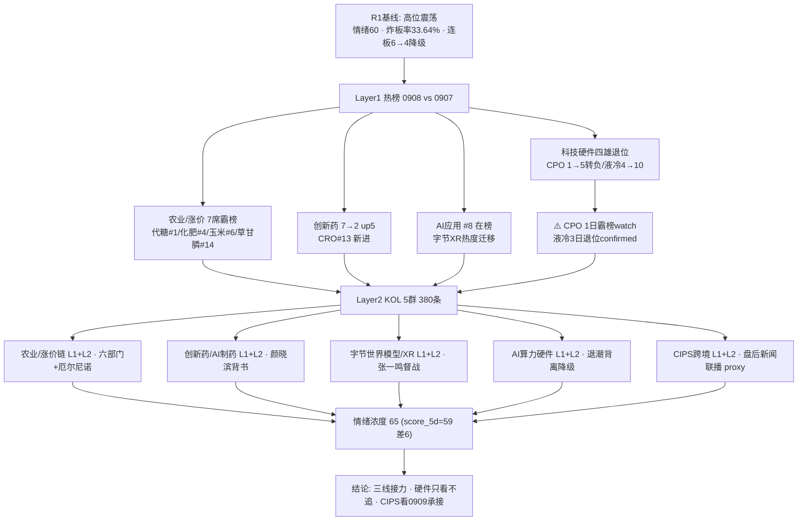

# 2026年9月8日 · **群聊情绪共振**

> **数据源新鲜度**: 🟢 ok
> **降级状态**: ✅ 否（WeFlow 永久下线为既定状态 · 双源 L1+L2 全活）
> **置信度**: 0.75

## 一句话结论
情绪 65（高位震荡中主线切换）：农业 7 席霸榜 + 创新药/字节世界模型双接棒获双源共振，AI 硬件（CPO/液冷）退潮出货，盘后 CIPS 人民币跨境支付新催化。

## 详细分析

**📊 情绪总况：高位震荡（R1=60），双源共振上修至 65。** R1 基线给出 **60**（主线扩散型偏震荡：涨停 73/跌停 0/炸板率 33.64% 翻倍、连板 6→4 降级、科技 30 日深调、情绪周期重算=高位震荡 conf 0.75）。R3 双源（L1 热榜 0908 当日 + L2 KOL 5 群 380 条）交叉后上修至 **65**——不是情绪反转，而是**资金在科技退潮里找到三条接力出口**：农业/涨价链（热榜 7 席）、创新药（#2 升 5 位）、字节世界模型/XR（KOL 爆量），全部获得 L1+L2 双确认；同时 AI 硬件链退潮被单独扣分。

**🔥 Layer1 热榜（0908 当日 vs 0907）：农业霸榜、科技硬件四雄集体退位。** 代糖概念新晋 #1（+5.18%）、化肥 #4（+4.26%）、玉米 #6（+4.42%）、草甘膦 #14（+4.94%）——农业/涨价系 **7 席**霸榜 top20，是 0908 最拥挤主线。⚠️ **科技硬件退潮确认**：CPO 0907 #1 → 0908 #5 且转负 -0.6%（1 日霸榜后回落 = watch 级出货）、液冷 0907 #4 → 0908 #10（0902/0903 曾霸榜，连续 3 日退位 = confirmed 出货）、PCB 2→7、存储 5→11——与 R1"科技降温、资金切周期/地产"完全同向。创新药 7→2 升 5 位、CRO #13 新进是当日最大上行动量。

**🗣️ Layer2 KOL（5 群 live 380 条，盘中+盘后）：三个接棒主题密集发酵。** ①字节世界模型/PICO-XR：*ST Sheng 早报+晚报连发（力盛体育 VR 赛事/视涯科技 MicroOLED/佳创视讯）、华福计算机（张一鸣督战 World Model/思看科技）、东吴计算机世界模型深度——3 群以上独立提及，当日最强新催化；②农业涨价链：散户群转发六部门乡村振兴发文（涉农企业上市融资）+ A股 0 跌停农业爆发、题材群燕麦（西麦食品）/番茄（中基健康）、一手群 WFP 厄尔尼诺超强确认 + 泰国食糖减产 17% + 国泰海通晨光生物研报；③创新药/AI制药：核心群一品红/中源协和/睿智医药 + 颜晓滨"AI应用和创新药大有机会"背书。唯一反向：散户"果然这附近比较分歧，横盘一下午"（震荡分歧定性），颜晓滨"半导体光存储仅有反弹没有反转，警惕抄底被套"。

**🎯 共振结构：5 个 L1+L2 主题，3 强 2 特。** 农业/涨价链（7 席霸榜 + 政策/气候双硬锚）、创新药（#2 up5 + CRO 新进 + 颜晓滨背书）、字节世界模型/XR（KOL 爆量 + AI应用 #8 在榜）为三强；AI 算力硬件链为"热榜退潮 + 机构强推"背离（降级只观察）、CIPS 为盘后新闻联播级事件（proxy 弱支撑，利好 0909 发酵）——二者进 top5 末位但均标 caution/downgrade。

**🧮 情绪浓度 65 = R1 60 + 共振 +5 − 硬件退潮 −2 − 散户分歧 −1。** 5 维度加权法 score_5d≈59（涨停强度 18.5 + 跌停压制 20 + 连板结构 10 + 炸板率截断 0 + 杠杆外资缺 10），差 6 < 15 无 gap 警示。对 D1 的含义：仓位上限维持 R1 建议 55%，主线候选=农业/创新药/字节XR 三条线做多，AI 硬件链只观察不追高，CIPS 看 0909 高开承接再定。

## 情绪传导图

## 双源共振主题（top5）

### #1 农业/粮食/涨价链 ［L1+L2 · middle］
- **热榜**: 代糖#1（新进+5.18%）、粮食#3（3日连榜+3.47%）、化肥#4（新进+4.26%）、玉米#6（新进+4.42%）、农业种植#9（15→9 up6）、草甘膦#14（新进+4.94%）、猪肉#12 — **7 席霸榜**
- **KOL**: 7+ 条（散户群乡村振兴 0跌停农业、一手群厄尔尼诺超强/泰国食糖-17%、题材群燕麦/番茄、国泰海通晨光生物）
- **建议板块**: 农业种植 · 粮食概念 · 化肥 · 代糖 · 食糖
- **候选**: 600127 金健米业 · 600108 亚盛集团 · 600354 敦煌种业 · 002956 西麦食品 · 300138 晨光生物
- **大资金意图**: 超强厄尔尼诺（WFP 全球 4900 万人粮食不安全）+ 六部门乡村振兴发文（支持涉农企业上市融资）+ 泰国食糖减产 17%——资金在科技退潮期涌向有政策锚+气候硬事件的涨价链，从养殖（猪肉）扩散到种植（玉米/燕麦/番茄）、化肥、代糖、食糖全链条。
- **为什么走强**: 位置=热榜 7 席霸榜（新晋代糖 #1、多概念新进 top20）；催化=政策（乡村振兴）+ 气候（厄尔尼诺超强）+ 涨价（食糖/化肥/草甘膦）三重硬锚；筹码=猪肉/粮食已连续 3 日在榜，从首日单点扩散为全链集群，板块效应最强。
- **逻辑够不够硬**: ≥4 独立源（热榜 7 概念 + KOL 多群 + 政策公告 + WFP/泰国减产国际事件）+ 双硬锚（政策+气候）→ 硬；证伪路径=若厄尔尼诺仅情绪脉冲、代糖 #1 次日兑现（单日登顶 watch），农业链高开回落则需降级为事件一日游。

### #2 创新药 / AI制药 ［L1+L2 · middle］
- **热榜**: 创新药 #2（7→2 升 5 位，当日+1.31%）、CRO #13（新进+2.55%）
- **KOL**: 5 条（一品红 AI制药+AR882、中源协和脐带干细胞、睿智医药 AI制药、诺和诺德口服司美 CDMO 蓝晓、颜晓滨"创新药大有机会"）
- **建议板块**: 创新药 · CRO · AI制药 · CDMO
- **候选**: 300723 一品红 · 300149 睿智医药 · 600645 中源协和
- **大资金意图**: 创新药是当日热榜唯一强势上行的大板块（7→2 up5），AI 制药新叙事（一品红 GPCR AI 算法+AR882 痛风新药、睿智医药）为板块注入"降本提效"远期期权，叠加诺和诺德口服司美国内生产 CDMO 放量预期，资金从纯题材转向"硬催化+新技术"双驱动。
- **为什么走强**: 位置=创新药热榜 #2 升 5 位 + CRO 新进；催化=AI制药管线落地 + 诺和诺德 CDMO 备货 + 颜晓滨（高权重 KOL）明确背书；筹码=板块连续在榜 3 日（0904 #7→0907 #7→0908 #2），量价配合上行。
- **逻辑够不够硬**: ≥3 独立源（热榜双概念 + KOL 多群 + 颜晓滨背书）+ 硬事件锚（AR882 Ⅲ期顶线阳性/诺和诺德生产落地）→ 硬；证伪路径=若 AI 制药纯情绪脉冲（无新增管线兑现）、创新药次日高开低走则题材降温。

### #3 字节世界模型 / PICO-XR / AI应用 ［L1+L2 · early］
- **热榜**: AI应用 #8（6→8 微降但连续在榜）
- **KOL**: 7+ 条（*ST Sheng 早报+晚报力盛体育/视涯科技/佳创视讯、华福张一鸣督战 World Model 思看科技、东吴世界模型深度、天娱数科 VR 直播、五方光电）
- **建议板块**: AI应用 · XR · 字节链 · MicroOLED · 3D视觉
- **候选**: 002858 力盛体育 · 688781 视涯科技 ⚠️ · 300264 佳创视讯 · 002962 五方光电 · 002354 天娱数科
- **大资金意图**: 字节开发实时空间视频生成模型（Bloomberg 报道·张一鸣亲自督战·最快下月发布），把叙事从"生成视频"推向"生成世界"——资金抢筹 XR 终端（PICO）+ 显示（视涯 MicroOLED）+ 内容（力盛 VR 赛事/佳创）+ 数据入口（思看 3D 扫描）整条链，是当日 KOL 密度最高的新催化。
- **为什么走强**: 位置=AI应用 #8 在榜托底（上一波 AI 应用已发酵）；催化=字节世界模型硬时间锚（下月发布）+ 张一鸣督战（最高权重背书）；筹码=3 群以上独立提及 + 盘中盘后持续（早报→晚报），题材热度单向放大。
- **逻辑够不够硬**: ≥3 独立源（KOL 三群 + AI应用在榜）+ 硬事件锚（字节世界模型下月发布）→ 硬但偏预期驱动（产品未落地）；证伪路径=若下月发布推迟/预期落空、或 XR 标的缺乏涨停梯队（只有力盛/天娱单点），则题材脉冲后回落。688781 视涯科技为科创板，已标 ⚠️ risk_flag。

### #4 AI 算力硬件链（光模块/CPO/液冷/存储）退潮分歧 ［L1+L2 · late · 降级观察］
- **热榜**: CPO 1→5（-0.6% 转负）、PCB 2→7、液冷 4→10、存储 5→11、光纤 12→15；AIDC/算力租赁/芯片概念跌出 top20
- **KOL**: 6+ 条机构强推（开源"光超节点液冷三重奏"×4、华福 GPT-6 存储、东吴液冷/世界模型、电子纱/ABF 涨价、富满微明微电子）
- **建议板块**: 光模块 · CPO · 液冷服务器 · 存储芯片 · PCB · 硅电容
- **候选**: 300308 中际旭创 · 002384 东山精密 · 600183 生益科技（⚠️ 只观察不追高）
- **大资金意图**: 机构逻辑未变（开源/华福/东吴仍密集推票），但盘面资金已切向农业/医药——热榜四雄集体跌出前 10 且转负（CPO 1 日霸榜 watch、液冷 3 日退位 confirmed），属典型"逻辑硬但盘面退潮"的高位分歧期。
- **为什么走强**: 位置=高位（CPO/液冷曾霸榜多日，30 日深调中反弹后再度回落）；催化=机构研报仍在（三重奏/存储需求）但无新增硬事件；筹码=资金/成交 proxy 转负，最活跃资金开始分化（走弱原因=热榜退潮优先于研报）。
- **逻辑够不够硬**: 机构 4+ 源仍硬，但 **L4 出货警报优先**——按红线"霸榜第一永远反向"，CPO 1 日霸榜后转负 + 液冷 3 日退位即出货确认，热榜退潮信号权重高于机构研报；证伪路径=若 0909 科技硬件带量反包（资金回流）则退潮误判，否则只观察不接飞刀。移交 R6 反证。

### #5 CIPS / 人民币跨境支付 ［L1+L2(proxy) · early · 事件驱动］
- **热榜**: 数字货币 #20（13→20 回落但仍在榜，当日-0.01%）
- **KOL**: 5+ 条盘后爆量（CIPS 11 家外资机构签约·新闻联播、星展新加坡直连、74 家全球银行站台、香港稳定币线下支付）
- **建议板块**: 数字货币 · 跨境支付 · CIPS · 金融科技
- **候选**: 003040 楚天龙 · 002537 海联金汇 · 300468 四方精创
- **大资金意图**: 盘后 21:54 新闻联播级硬事件——CIPS 跨境支付系统 11 家外资机构签约 + 星展新加坡直连，人民币结算国际化从"政策叙事"走向"落地实锤"，资金明日（0909）大概率映射数字货币/跨境支付板块。
- **为什么走强**: 位置=数字货币热榜仍在 #20（proxy 弱支撑，0908 排名回落）；催化=新闻联播 + 投洽会 74 家全球银行（硬时间锚 0908 晚间）；筹码=尚未在盘面发酵（0908 收盘数据未反映盘后事件），属"隔日映射"早期。
- **逻辑够不够硬**: 2 源（盘后 KOL 密集 + 数字货币在榜 proxy）+ 硬事件锚（新闻联播级签约）→ 中等偏硬但 **L1 为 proxy 且排名回落**，按 proxy+early 低分进末位；证伪路径=若 0909 数字货币/跨境支付高开低走（利好出尽）或 11 家签约被解读为已有预期，则一日游。

### 🧠 首推代表票思维链 · 晨光生物 300138（农业/植物提取涨价弹性）
- **买入理由**: 1) 产业逻辑：辣椒红/辣椒精/叶黄素产销全球第一，厄尔尼诺→辣椒/万寿菊/棉花减产→原料端涨价预期，植物提取出口龙头享量价齐升（国泰海通农业最新研报看 50%+ 空间）；2) 数据/事件锚：KOL 一手群点名"唯一正宗没涨的农业"+ 题材群厄尔尼诺燕麦逻辑同链条共振，农业热榜 7 席霸榜 = 全市场最强拥挤主线，晨光属板块内低位未透支标的。
- **风险点**: 1) 短期：农业已发酵 3 日，若 0909 农业高开兑现则跟风票回落（代糖 #1 单日 watch 亦提示登顶兑现风险）；2) 中期反证：若厄尔尼诺仅情绪脉冲、辣椒红/叶黄素现货价格不跟涨，涨价逻辑证伪则 50%+ 空间预期落空。
- **止损条件**: 买入价 -7% 或跌破 5 日线（先到者触发，符合 D1 止损 -5~-10% 硬区间）；农业热榜掉出前 5 或板块炸板率 >35% 即减半仓。
- **可验证假设**: 24-72h 内农业/粮食概念在榜维持前 5 且金健米业/西麦食品/中基健康同步走强（板块效应确认）→ 逻辑成立；若晨光缩量阴跌或辣椒红现货价持平 → 证伪离场。

## 关键证据
- 证据 1: 农业/涨价系热榜 7 席霸榜（代糖#1/化肥#4/玉米#6/草甘膦#14 新进 + 粮食#3 连榜 + 农业种植#9 up6 + 猪肉#12）· 来源 tushare.ths_hot 0908 当日 vs 0907
- 证据 2: 科技硬件四雄集体退位转负：CPO 1→5（-0.6%）、液冷 4→10、PCB 2→7、存储 5→11，AIDC/算力租赁/芯片跌出 top20 · 来源 tushare.ths_hot
- 证据 3: 创新药 7→2 升 5 位 + CRO#13 新进，当日最大上行动量 · 来源 tushare.ths_hot + dc_hot（楚天龙人气#10 +8.66%）
- 证据 4: 字节世界模型（Bloomberg·张一鸣督战·最快下月发布）+ 六部门乡村振兴 + 厄尔尼诺超强 + CIPS 11 家外资签约（新闻联播 21:54）· 来源 KOL 5 群 live 380 条
- 证据 5: XTick emotion 0908 = 涨停74/跌停0/炸板37/连板4，与 R1（73/0/37/4）一致，交叉验证通过 · 来源 xtick.market_emotion

## 数据源审计
| 源 | 日期 | 状态 | 备注 |
|---|---|:--:|---|
| tushare.ths_hot | 2026-09-08 | 🟢 | 概念板块 top20 · 当日 22:30 提取（非 T-1 复用） |
| tushare.dc_hot | 2026-09-08 | 🟢 | A股人气榜 top100 |
| tushare.moneyflow_cnt_ths | 2026-09-07 | 🟢 | 概念资金流：芯片+711/CPO+523/AIDC+459 亿 |
| xtick.market_emotion | 2026-09-08 | 🟢 | 涨停74/跌停0/炸板37/连板4 |
| wechat_cli_5groups | 2026-09-08 | 🟢 | 380 条 · 5 群(匿名) · 盘中+盘后 live |
| R1_style.json | 2026-09-08 | 🟢 | 情绪基线 60 · 主线扩散型偏震荡 · complete |
| weflow-analytics | 2026-08-19 | 🔴 | 永久下线（既定状态，不计入新鲜度） |

状态图例: 🟢 ok · 🟡 partial/stale · 🔴 error/down（本表无 🟡 命中源）

## 不确定性 / 反证
- **代糖 #1 是新晋 watch 不是安全信号**：0908 单日登顶 #1 未满 2 日，若 0909 再霸榜则升为出货警报；农业 7 席霸榜高度拥挤，首日登顶次日高开兑现是常见路径，追涨需防炸板（菜粕/尿素这类涨价补涨分支尤其）。
- **AI 硬件"逻辑硬 vs 盘面退潮"背离**：开源/华福/东吴机构研报仍在强推（三重奏/存储/电子纱），但 CPO 1 日霸榜转负 + 液冷 3 日退位 confirmed 出货——盘面退潮信号优先，不接科技反抽飞刀（呼应颜晓滨"仅有反弹没有反转"）。
- **字节世界模型/XR 是预期驱动**：硬事件锚（张一鸣督战/下月发布）但产品未落地，若发布推迟或涨停梯队不足则题材脉冲；视涯科技 688 为科创板波动大。
- **CIPS 是 proxy 弱共振**：数字货币热榜排名回落（13→20），盘后 11 家签约利好 0909 发酵但 L1 支撑弱，若高开低走则一日游——按事件驱动早段对待，不重仓。
- **score_5d=59 与 R3=65 差 6 说明**：5 维度法偏重连板结构（4 板高度低）与炸板率截断，R3 双源共振给农业/创新药硬加分，两者口径不同但方向一致（高位震荡、可做控仓）。

## 与其他 R/D/E 的关系
- 依赖: R1_style.json（情绪基线 60·complete）· data/research/20260908/hotlist_signals.json（R3 主写·热榜 4 层信号）· data/raw/20260908/wechat_cli_5groups.jsonl + live 380 条（5 群 KOL）· xtick.market_emotion（0908 交叉验证）
- 被消费: D1（main_decision_v1 · 情绪浓度 65 + 共振 top5 + 仓位上限 55% 透传）· R2（主线共振/叙事维度）· R4（消息面交叉）· R6（反证 · CPO 1日霸榜 watch + 液冷 confirmed + AI硬件退潮背离）

## Sub-Agent 元数据
- skill: analyze_sentiment_resonance_v1
- artifact: data/research/20260908/R3_sentiment.json
- 生成耗时: 385 秒
- model: deepseek-v4-flash-260425
