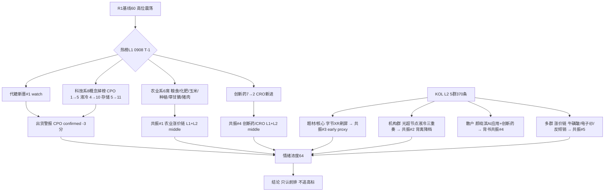

# 2026-09-09 · **群聊情绪共振**

> **数据源新鲜度**: partial
> **降级状态**: yes（WeFlow 永久下线 · L1 用 T-1 baseline）
> **置信度**: 0.70

## 一句话结论
情绪 64（高位震荡）：农业/涨价/创新药三线霸榜接棒科技，机构群仍死磕 AI 算力——盘面退潮与机构热度背离，0909 只认前排不追高标。

## 详细分析

**热榜已换庄：农业系 6 席霸榜，科技系 8 概念集体掉榜。** T-1(0908) 同花顺概念热榜里，粮食#3、化肥#4、玉米#6、农业种植#9、草甘膦#14、猪肉#12 占据半壁江山，代糖概念新晋登顶 #1；而数据中心(AIDC)、算力租赁、人形机器人、芯片、AI视频、机器人、商业航天 8 个科技概念全部跌出 top20，CPO 从 #1 跌到 #5、液冷 4→10、存储 5→11——这与 R1 的"科技降温、政策/涨价接棒"判断完全同向，且科技霸榜出货警报进入第 2 日确认（与 0904 液冷霸榜出货同族）。

**KOL 双峰：散户/题材在讲农业涨价，机构在讲 AI 算力。** 5 群 370 条消息里，散户投研群颜晓滨明确"AI应用和创新药大有机会"、转发六部门乡村振兴涉农上市；题材群/核心群被字节世界模型+PICO XR 链刷屏（视涯/力盛/佳创/天娱/五方光电，*ST Sheng 主推+多人转发），另有厄尔尼诺农业（西麦食品/中基健康）、牛磺酸涨价、成熟制程重估（富满微/明微电子）、二氯二氢硅反倾销。机构风向标群则密集挂电话会：开源通信"光、超节点、液冷"三重奏一天 3 次、华福 GPT-6 存储需求、东吴液冷深度、国泰海通半导体洁净室——机构热度与盘面科技退潮形成鲜明背离，是 0909 最重要的观察点。

**共振 top5 全部 L1+L2 双源成立，但等级有差。** 农业/粮食是唯一六席热榜+KOL 独立多群的正向硬共振（middle）；创新药/CRO 是 L1 唯一排名上行方向（创新药 7→2、CRO 新进 #13，middle）；字节 XR 链是 KOL 密度最高但 L1 无直接概念（用 AI应用#8 proxy，early）；AI 算力链机构刷屏最狠但 L1 全线下跌，消息面脉冲未获资金确认（middle 降档）；涨价链多品种共振（early_to_middle）。

**情绪浓度 64 = R1 60 + 共振 8 - 出货 3 - 分歧 1。** 五维法 score_5d=59，差 5 分不触发 gap 警示。R1 已把情绪周期重算为高位震荡（炸板率 33.64% 翻倍、连板 6→4），R3 共振上调保持克制——农业/创新药是真增量，科技链退潮在压制温度。0909 若炸板率再破 35%，候选数砍半。

## 关键证据
- 证据 1: 0908 热榜农业系 6 席（粮食#3/化肥#4/玉米#6/农业种植#9/草甘膦#14/猪肉#12）· 来源 tushare.ths_hot
- 证据 2: 科技 8 概念掉榜 + CPO 1→5/液冷 4→10/存储 5→11 · 来源 tushare.ths_hot 双日 diff
- 证据 3: 颜晓滨"AI应用和创新药大有机会""半导体光存储仅有反弹没有反转" · 来源 散户投研群
- 证据 4: 字节世界模型/PICO XR 链 6+ 条（视涯/力盛/佳创/天娱/五方）· 来源 题材基本面群+核心资讯群
- 证据 5: 开源通信"光超节点液冷"三重奏一天 3 次 + 华福 GPT-6 存储 · 来源 机构风向标群
- 证据 6: WFP 确认超强厄尔尼诺 → 燕麦/番茄涨价预期 · 来源 一手盘中新闻群+题材基本面群
- 证据 7: XTick 情绪 0908 涨停 74/跌停 0/炸板 37/最高 4 板，与 R1 完全一致 · 来源 xtick.market_emotion

## 共振主题三问（top5）

### ① 农业/粮食涨价链（L1+L2 · middle）
- **大资金意图**: 超强厄尔尼诺（WFP 官方确认）+ 六部门乡村振兴涉农上市政策双落地，资金在"确定性涨价+政策催化"里找避险进攻两相宜的方向，对手盘是前期拥挤的科技高标。
- **为什么走强**: 位置低（农业已沉寂多日）+ 催化硬（厄尔尼诺持续发酵、政策新发）+ 筹码干净（热榜 6 席显示资金刚进场未拥挤），三维共振。
- **逻辑够不够硬**: 硬。3 个独立源（热榜 6 席 + WFP 新闻 + 涉农政策）同向；硬事件锚=厄尔尼诺持续性与 9/16 平陆运河通航；证伪路径=厄尔尼诺证伪/农业连板断板。首推西麦食品（燕麦全产业链龙头，涨价直接传导）。

### ② AI算力硬件链（L1+L2 · middle 降档）
- **大资金意图**: 机构电话会密集（开源×3/华福×2/东吴/国泰海通），卖方仍把 AI 算力当主线配置，但盘面资金已在撤出。
- **为什么走强**: 位置=超买回落（30日科技深调-5~-7%）、催化=GPT-6 Astra 存储需求/硅电容 2027 需求 200 亿、筹码=热榜排名全线下滑——机构热度 vs 资金退潮背离。
- **逻辑够不够硬**: 产业逻辑硬但盘面不认。消息面脉冲未获资金确认，按 0907 纪律"排名升/价格跌背离不加成"，本主题加成降档；若 0909 科技继续阴跌，该主题只观察不进攻。

### ③ 字节世界模型/PICO XR 链（L1+L2 proxy · early）
- **大资金意图**: 字节用世界模型重做 PICO，赌"AI 生成世界+XR 终端+内容场景"新闭环，先手资金在 10 月模型发布前布局。
- **为什么走强**: 位置=低位预期驱动、催化=字节世界模型最快 10 月发布（硬时间锚）+ 视涯 MicroOLED 国产替代、筹码=纯预期无热榜确认（AI应用#8 proxy）。
- **逻辑够不够硬**: 逻辑新、想象空间大，但 L1 无直接概念、全是 KOL 单边强推（*ST Sheng 一人主推+转发），属 1.5 源强度；视涯"双屏 3000 元 vs 索尼 700 美元"降本逻辑是最大亮点，但需 PICO 新品供应链验证才可证真。

### ④ 创新药/CRO（L1+L2 · middle）
- **大资金意图**: 颜晓滨 6 月底就点的方向，AI 制药（一品红/睿智）+ 司美 CDMO（蓝晓）+ 干细胞（中源协和）多点催化，机构在低位医药里找确定性成长。
- **为什么走强**: 位置=30日医药 ETF 仅 +3.52% 低位、催化=AR882 Ⅲ期阳性/司美国内生产确定、筹码=L1 创新药 7→2 升 5 位是热榜唯一上行方向。
- **逻辑够不够硬**: 硬。创新药#2+CRO 新进 #13 的 L1 上行 + 颜晓滨背书 + 多个独立催化，双源正向硬共振；证伪路径=医药无跟风涨停潮/AR882 数据低于预期。

### ⑤ 涨价链（牛磺酸/电子纱/成熟制程/反倾销）（L1+L2 · early_to_middle）
- **大资金意图**: 涨价是最硬的业绩逻辑，资金在牛磺酸（4→5 美金）、电子纱、成熟制程（富满微/明微）里找 Q3 报表弹性。
- **为什么走强**: 位置=多数品种未充分定价、催化=牛磺酸今日报价上调/二氯二氢硅反倾销初裁/H酸断货、筹码=L1 化肥草甘膦铜黄金新进在榜。
- **逻辑够不够硬**: 涨价链条多但单品种容量小、确定性参差；牛磺酸（永安/圣元）和成熟制程（富满微/明微）最硬，H酸/氩气偏游资脉冲。证伪路径=反倾销税率落地低于预期/涨价证伪。

## 首推票思维链（西麦食品 · 农业链龙头候选）

- **买入理由**: ① A 股燕麦全产业链唯一龙头，澳洲海外基地+国内张北/呼伦贝尔多产地，厄尔尼诺直接受益；② 散户/题材/一手三群独立提及（燕麦涨价预期+WFP 厄尔尼诺确认），热榜农业系 6 席背书板块效应。
- **风险点**: ① 厄尔尼诺若证伪或燕麦涨幅不及预期，题材直接熄火；② 农业板块已涨 1 日（"0跌停爆发"），追高存在隔日接力分歧风险。
- **止损条件**: 买入价 -7% 硬止损（高位震荡周期止损距从严），或跌破 5 日线不收回即走；若农业链整体断板，板块止损优先于个股止损。
- **可验证假设**: 24-72h 内观察燕麦/粮食概念是否继续在热榜前 10、西麦食品是否放量突破 9/8 高点；若热榜农业系退至 3 席以下或西麦破位，假设证伪即出。

## 数据源审计

| 源 | 日期 | 状态 | 备注 |
|---|---|:--:|---|
| tushare.ths_hot | 2026-09-08 | 🟡 | 20 条 · T-1 baseline（当日盘前未生成） |
| xtick.market_emotion | 2026-09-08 | 🟢 | 涨停74/跌停0/炸板37/最高4板 |
| wechat_cli_5groups | 2026-09-08 | 🟢 | 370 条 · 5 焦点群（匿名） |
| R1_style.json | 2026-09-09 | 🟢 | sentiment_score=60 · complete |
| weflow-analytics | 2026-08-19 起 | 🔴 | DOWN · ngrok 404 永久下线 |

## 不确定性 / 反证
- 最大不确定性是"机构 vs 盘面背离"的收口方向：机构群 AI 算力刷屏但热榜科技 8 概念掉榜，若 0909 科技反弹则背离修复、若继续阴跌则机构情绪滞后于盘面——此点直接影响 AI 算力主题的后续共振等级。
- 字节 XR 链是 KOL 单边强推（1.5 源强度），未获 L1 直接概念确认，存在"题材过热但无资金承接"的风险。
- R1 已警告炸板率 33.64% 逼近 35% 警戒线，若 0909 炸板率破 35%，情绪=震荡/主跌，本报告候选全部砍半。
- 无 WeFlow（永久下线）无公众号源，KOL 覆盖仅限 5 群，存在信息盲区。

## 与其他 R/D/E 的关系
- 依赖: `data/research/20260909/R1_style.json`（sentiment_score=60 基准）、`data/raw/20260909/wechat_cli_5groups.jsonl`（KOL）、tushare.ths_hot/xtick（热榜交叉）
- 输出被下游使用: D1（canghai-plan 情绪浓度/主题共振）、R6（反证——CPO 霸榜出货确认移交）、E1（复盘）

## Sub-Agent 元数据
- skill: analyze_sentiment_resonance_v1
- artifact: data/research/20260909/R3_sentiment.json + data/research/20260909/hotlist_signals.json
- 生成耗时: 约 480 秒
- model: deepseek-v4-flash-260425
