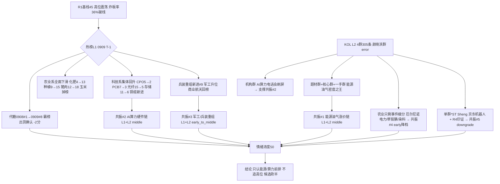

# 2026-09-10 · **群聊情绪共振**

> **数据源新鲜度**: partial
> **降级状态**: yes（WeFlow 永久下线 · L1 用 T-1 baseline · 颜晓滨群 error）
> **置信度**: 0.65

## 一句话结论
情绪 50（高位震荡）：能源油气涨价链 KOL 密度爆表+R4 双重印证，AI 算力热榜资金双回流但涨停未跟，农业退潮、代糖出货——只认能源/算力前排，其余观望。

## 详细分析

**热榜换庄进入第 2 轮：科技系集体回升，农业系集体下滑。** T-1(0909) 同花顺概念热榜里，科技链排名集体上行——CPO 5→2、PCB 7→3、光纤 15→5（升 10 位，rank_momentum_up）、存储 11→6、铜缆高速连接新进 #14、液冷仍在榜；同时兵装重组新进 #9、商业航天新进 #17、煤炭/核电新进 #19/#20。农业系则全面退坡：粮食 3→4、化肥 4→13、农业种植 9→15、猪肉 12→18，玉米/草甘膦/金属铜直接掉榜——0909 R3 首推的农业涨价链正在退潮，符合 R1"主线收缩"判断。⚠️ 霸榜第 2 日确认：代糖 0908#1(+5.18%) → 0909#8(+1.56%) 高位滑落 7 位；培育钻石新晋 #1(17→1) 未满 2 日 watch 级。

**KOL 三峰：能源涨价链密度之王，AI 算力机构深挖，农业只剩事件细分。** 4 群 305 条里，题材群「松」一人刷屏沥青 30+ 条（委内瑞拉断供重质原油→沥青期现破 5200 新高/库存 5 年低/单吨利润 1100-1200 元，国创高新 3 倍 PE），*ST Sheng 油运晚报（BCTI 单日 +7.45%/近周 +23.42%，招商轮船涨停→盛航剪刀差 129 个百分点），核心群「风中追风」美伊互射油轮+卡塔尔 LNG 停运+欧洲天然气 5 年新高+氦气告急——能源地缘是三群独立发声的最强主线。机构风向标群全天挂 AI 算力电话会（开源通信"光超节点液冷"三重奏+0910 早 7:30 光纤光缆拆解、国金 RUBIN 链、华福 GPT-6 存储、广发策略），题材群深挖 TSV 硅通孔（晶方/强力新材/同兴达）、载体铜箔 mSAP（方邦）、OCS（君逸数码）、硅电容、金刚石散热（沃尔德）。农业只剩厄尔尼诺水火电力（晋控/华电辽能/闽东）、草铵膦（利尔化学）、染料（海翔）、卤米松断货（津药/华邦）的事件细分，无板块级共识。

**共振 top5：能源油气链 + AI 算力硬件链是双源硬共振，军工/农业/京东机器人为次级。** 能源油气涨价链（KOL 4 群密度之王 + R4 top_event[0] 美伊冲突油价破百 + top_event[2] 沥青破 5200 双重同向）与 AI 算力硬件链（L1 热榜集体回升 + DC 资金 5G/通信/PCB/光通信大额净流入 + R4 存储四重共振）并列前二。但 ⚠️ AI 算力存在"资金先进、涨停未跟"分歧：R1 涨停维度科技已从强板块消失（limit_cpt 20→4）、0909 收盘涨幅弱（+0.49~1.87%）、存储净流出 -57 亿——热榜/资金维度 vs 涨停维度不同步，需盘中验证涨停承接，不作主攻。军工/兵装重组（L1 兵装新进+军工升位+R4 地缘同向）、农业（L1 全面下滑→降档 early）、京东机器人（单群+R4 印证，末位 downgrade_risk）。

**情绪浓度 50 = R1 45 + 共振 8 - 出货 3。** R1 已将情绪周期重算为高位震荡（炸板率 36% 破 35% 纪律线、广度转负 0.49、溢价中位 -0.60% 转负、主线代理 20→4 骤降），R3 共振上调保持克制——能源油气是真增量，农业退潮+代糖出货在压制温度。score_5d=52（五维法），差 2 分不触发 gap。0910 若炸板率再破 40%，情绪=主跌，候选砍半、仓位上限再降。

## 关键证据
- 证据 1: 0909 热榜科技链集体回升（CPO 5→2/PCB 7→3/光纤 15→5/存储 11→6/铜缆新进 #14）· 来源 tushare.ths_hot 双日 diff
- 证据 2: 0909 热榜农业系全面下滑（化肥 4→13/农业种植 9→15/猪肉 12→18，玉米/草甘膦/金属铜掉榜）· 来源 tushare.ths_hot 双日 diff
- 证据 3: 代糖 0908#1(+5.18%)→0909#8(+1.56%) 霸榜出货第 2 日确认 · 来源 tushare.ths_hot 双日 diff
- 证据 4: 「松」沥青刷屏 30+ 条（国创高新/宝利国际/华锦股份，委内瑞拉断供→期现破 5200/库存 5 年低/吨利润 1100-1200 元）· 来源 题材基本面群（匿名）
- 证据 5: 美伊互射油轮+卡塔尔 LNG 不可抗力+欧洲天然气 5 年新高+氦气告急 · 来源 核心资讯群（匿名）
- 证据 6: 开源通信"光、超节点、液冷"三重奏 + 0910 早 7:30 光纤光缆深度拆解 + 华福 GPT-6 存储 · 来源 机构风向标群（匿名）
- 证据 7: DC 概念资金流 0909——5G +126 亿/通信技术 +123 亿/PCB +98 亿/光通信 +87 亿净流入，存储 -57 亿净流出 · 来源 tushare.moneyflow_ind_dc
- 证据 8: XTick 情绪 0909 涨停 49/跌停 7/炸板 27/最高 5 板，与 R1 limit_list 一致 · 来源 xtick.market_emotion
- 证据 9: R4 top_event[0] 美伊冲突油价破百（布油 101.21/+3.36%·上期所原油夜盘+7%）+ top_event[2] 沥青破 5200 + top_event[5] 京东物理 AI 300 万台机器人 · 来源 data/research/20260910/R4_news.json

## 共振主题三问（top5）

### ① 能源油气涨价链（L1+L2 · middle）
- **大资金意图**: 地缘供给冲击（美伊互射油轮、委内瑞拉断供、卡塔尔 LNG 不可抗力）叠加 9-11 月沥青旺季刚需，资金在"实物短缺+价格新高+吨利润修复"里找确定性的涨价业绩，对手盘是前 2 日拥挤的农业/科技高标。
- **为什么走强**: 位置=沥青/油运已发酵 2-3 日但 A 股映射仍未充分（盛航股价同比 -6.4% vs 指数 +122.8% 剪刀差）、催化=油价破百+油轮互射新增量（比 3 月 1 日严重）+沥青夜盘 +2.43%、筹码=热榜煤炭/核电新进显示资金刚入场。
- **逻辑够不够硬**: 硬。3 个独立源（KOL 4 群密度之王 + R4 双 top_event + 热榜能源侧新进）同向；硬事件锚=美伊冲突持续性与 9-11 月旺季；证伪路径=停火/断供缓解/沥青现货回落。首推国创高新（70 万吨产能 3 倍 PE）、宝利国际（100 万吨 3 倍 PE）、盛航股份（油运补涨预期差）。

### ② AI算力硬件链（L1+L2 · middle）
- **大资金意图**: 机构把 AI 算力当主线配置（开源/国金/华福/广发电话会密集），DC 资金 5G/通信/PCB/光通信大额净流入 87-126 亿——配置盘先进场，等涨停确认。
- **为什么走强**: 位置=热榜回升但 0909 收盘涨幅弱（+0.49~1.87%）+存储净流出 -57 亿，属"资金先进、涨停未跟"的低位试错；催化=SK 海力士新高/摩根大通超配/RUBIN 链/GPT-6 存储需求；筹码=热榜 6 概念回升但涨停维度科技已从强板块消失（R1 limit_cpt 20→4）。
- **逻辑够不够硬**: 产业逻辑硬（存储四重共振：SK 海力士/摩根大通/佰维 +3200%/长鑫 +2244%）但盘面涨停维度未确认——热榜/资金 vs 涨停背离，按纪律"资金未确认不加成"，本主题加成降档，若 0910 科技仍无涨停承接只观察不进攻。证伪路径=热榜排名再次回落/资金转为净流出。

### ③ 军工/兵装重组（L1+L2 · early_to_middle）
- **大资金意图**: 十五五装备需求释放+军贸爆发（国睿关联销售额 +72%）+持仓比例 2.38% 绝对底部，机构在低位军工里布局 2027 基本面改善。
- **为什么走强**: 位置=配置比例创 2020Q3 新低（绝对低位）、催化=兵装重组新进热榜 #9+地缘冲突（R4 军工同向）、筹码=L1 军工 18→12 升位+商业航天回榜。
- **逻辑够不够硬**: 中上。L1 新进+升位 + 东财积极看多 + R4 地缘同向三源印证；但 KOL 单条研报转发（P-vor 东财），缺多群独立发声，属弱 L2。证伪路径=十五五规划落地不及预期/重组落地慢。

### ④ 农业/粮食涨价（L1+L2 · early 降档）
- **大资金意图**: 厄尔尼诺秋冬季峰值+草铵膦/染料/卤米松涨价，资金从农业板块退向事件细分，找确定性涨价但放弃板块性进攻。
- **为什么走强**: 位置=农业 L1 排名全面下滑（退潮中）、催化=厄尔尼诺水火电力（晋控/华电辽能/闽东）+草铵膦报价跳涨至 6 万+染料活性艳蓝 25→30 万，事件驱动强；筹码=热榜农业系只剩 4 席且排名下行。
- **逻辑够不够硬**: 事件硬（涨价/断货真实）但板块退潮，仅剩细分催化，不作主攻方向；卤米松 30→800 元断货国产替代（津药/华邦）是独立的强事件。证伪路径=厄尔尼诺证伪/涨价品种回落。

### ⑤ 京东机器人/末端配送（L1+L2 · early · downgrade_risk）
- **大资金意图**: 京东物理 AI 加速计划（300 万台末端配送机器人+京东×摩尔线程十万卡国产算力+地平线征程 6P 定点），单群强推+R4 top_event 独立印证，赌量产链条兑现。
- **为什么走强**: 位置=纯预期驱动（L1 无直接机器人概念）、催化=R4 京东物理 AI 六项全球第一+北京十五五算力机器人双引擎、筹码=单票新时达（京东绑定+量产能力+运动控制三层）。
- **逻辑够不够硬**: 中。R4 独立印证成立（场景D 跨源印证可进末位），但单群单票标的集中度低，带 downgrade_risk；新时达"现成产能+现成客户+现成技术"是亮点，需京东采购订单落地验证。证伪路径=京东机器人采购未批量落地。

## 首推票思维链（国创高新 · 能源油气链龙头候选）

- **买入理由**: ① 沥青年产能 70 万吨以上，按吨利润 1100-1200 元年化毛利 7.7-8 亿，当前市值约 26 亿仅 3 倍 PE——涨价业绩直接传导且估值极低；② 委内瑞拉重质原油断供是硬供给逻辑（山东地炼 90% 依赖委油、镇海/华北石化停产沥青、短期无法缓解），9-11 月需求旺季价格继续攀升概率大，题材群「松」全天 30+ 条强推 + 一手群盘中快讯同步，4 群中 3 群独立提及。
- **风险点**: ① 沥青已涨 1-2 日（0909 国创高新涨停），追高存在隔日接力分歧风险，高位震荡周期接力赔率下降；② 若美伊冲突缓解/委内瑞拉恢复对华出口，供给逻辑证伪，吨利润回落，3 倍 PE 低估值可能变成价值陷阱。
- **止损条件**: 买入价 -7% 硬止损（高位震荡周期止损距从严），或跌破 5 日线不收回即走；若沥青期货夜盘转跌/现货回落，逻辑证伪优先于个股止损。
- **可验证假设**: 24-72h 内观察沥青期货主力是否站稳 5200 上方、国创高新是否高开承接不炸板；若沥青期货破位或个股断板回封失败，假设证伪即出。

## 数据源审计

| 源 | 日期 | 状态 | 备注 |
|---|---|:--:|---|
| tushare.ths_hot | 2026-09-09 | 🟡 | 20 条 · T-1 baseline（当日盘前未生成） |
| tushare.moneyflow_ind_dc | 2026-09-09 | 🟢 | 504 条 · 概念资金流 |
| xtick.market_emotion | 2026-09-09 | 🟢 | 涨停49/跌停7/炸板27/最高5板 · 与 R1 一致 |
| wechat_cli_5groups | 2026-09-09 | 🟡 | 305 条 · 5 焦点群（匿名）· 颜晓滨群 error 4/5 群 |
| R1_style.json | 2026-09-10 | 🟢 | sentiment_score=45 · complete · 高位震荡 |
| R4_news.json | 2026-09-10 | 🟢 | top_events 6 条 · 完整 |
| weflow-analytics | 2026-08-19 起 | 🔴 | DOWN · ngrok 404 永久下线 |

## 不确定性 / 反证
- 最大不确定性是"AI 算力资金先进 vs 涨停未跟"的收口方向：热榜回升+DC 大额净流入是左侧信号，但 R1 涨停维度科技已消失、存储净流出 -57 亿——若 0910 科技仍无涨停承接，则资金可能只是抄底配置而非主线启动，AI 算力主题需降级观察。
- 能源油气链是 KOL 单边刷屏（松一人 30+ 条）叠加 R4 新闻印证，KOL 密度可能高估了市场承接力——需盘中验证国创高新/招商轮船的封单与跟风。
- 颜晓滨群 error（核心 KOL 方向缺失）是当日最大信息缺口，情绪温度判断依赖量化指标+其余 4 群，置信度 0.65（较 0909 的 0.70 降）。
- R1 已警告炸板率 36% 破 35% 纪律线，若 0910 炸板率破 40%，情绪=主跌，本报告候选全部砍半、仓位上限降档。

## 与其他 R/D/E 的关系
- 依赖: `data/research/20260910/R1_style.json`（sentiment_score=45 基准）、`data/research/20260910/R4_news.json`（top_event 跨源印证）、`data/raw/20260910/wechat_cli_5groups.jsonl`（KOL）、tushare.ths_hot/moneyflow_ind_dc/xtick（热榜交叉）
- 输出被下游使用: D1（canghai-plan 情绪浓度/主题共振）、R2（主线候选热度维透传）、R6（反证——代糖霸榜出货确认移交）、E1（复盘）

## Sub-Agent 元数据
- skill: analyze_sentiment_resonance_v1
- artifact: data/research/20260910/R3_sentiment.json + data/research/20260910/hotlist_signals.json
- 生成耗时: 约 480 秒
- model: deepseek-v4-flash-260425
