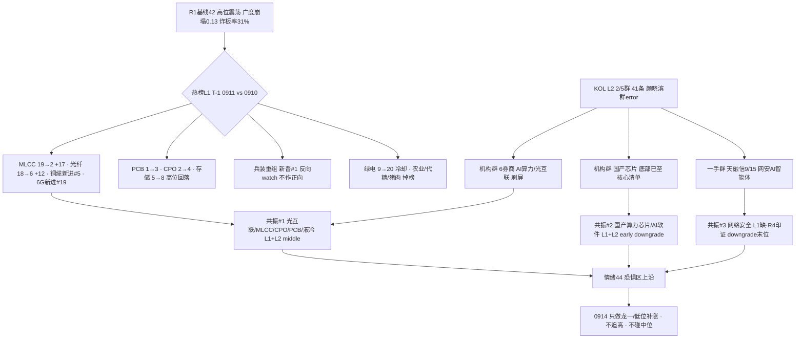

# 2026-09-14 · **群聊情绪共振**

> **数据源新鲜度**: partial
> **降级状态**: yes（WeFlow 永久下线 · L1 用 T-1 baseline · KOL 2/5 群）
> **置信度**: 0.55

## 一句话结论
情绪 44（高位震荡·恐惧区上沿）：光互联/MLCC 热榜资金双升 + 6 券商研报共振是唯一硬主线，国产芯片有叙事无资金、网安 9/15 事件待验证——高位分歧期只做龙一与低位补涨，兵装重组新晋#1 作反向 watch。

## 详细分析

**热榜换庄第 3 轮：科技链内部大分化——元件/材料升、主科技微降、军工系冲顶。** T-1(0911) 同花顺概念热榜 vs T-2(0910)：MLCC 19→2（+17 位，全场最强）、光纤 18→6（+12）、铜缆高速连接新进 #5、6G 新进 #19——元件/材料/光互联细分在升；而 PCB 1→3、CPO 2→4、存储 5→8 高位回落但仍占榜 top8，液冷 #13 在榜。绿色电力 9→20 冷却、中船系/代糖/猪肉 掉榜、农业系持续退坡（粮食 4→9、农业种植 15→18）。⚠️ 兵装重组概念 0911 新晋 #1（0909#9 → 0910 掉出 top20 → 0911 冲顶），按红线"霸榜第一永作反向"标首日 watch——无 KOL、无资金、无事件确认，若 0914 续霸榜即升级出货警报，**不作正向共振**。

**KOL 只有 2/5 群：机构群 100% 卖方 AI 算力叙事、一手群网安事件，核心三群全缺。** 机构风向标群 32 条全是卖方刷屏：开源通信（光博会总结"供不应求、更高速率更高密度光互联"+ 明日 7:30 通信观点更新）、华西（NPO 落地与 OCS 升温）、太平洋（高速率光模块与 CPO 产业化提速）、华创吴鸣远（"AI 产业生命周期远未结束，Token 12x 年化，底部已至"+ 国产芯片/代工/Agent 核心资产清单）、国联民生小吕说 AI（超节点/液冷/存算一体 + 昇腾寒武纪 + 星环科技 + 智谱配股）、国金刘高畅（硅谷调研"算力强结构主线"）——**6 家券商独立共振，无防御转向**。但策略端广发刘晨明公开讨论"牛市成交最多萎缩到什么程度/反弹是否一定依赖放量"——回调怀疑期，机构叙事与盘面温度（广度 0.13、溢价中位 -1.90%）明显背离。一手盘中新闻群 9 条：天融信 9/15 网安周发布 AI 智能体安全新品、蒸馏事件→信息安全核查、广西旅游"十五五"规划。颜晓滨群 error、题材群/核心群 timeout——昨日油运/沥青/军工的题材 KOL 今日全部缺席。

**共振 top3：光互联/元件是唯一三证主线，国产芯片叙事与资金背离，网安事件末位待验证。** 主题一（AI 算力硬件链）L1（MLCC/光纤/铜缆/6G 升）+ L2（6 券商）+ R7 资金（5G +44.88 亿/光通信 +43.37 亿/被动元件 +33.69 亿/通信设备 +47.41 亿；5 日 5G 469 亿/通信技术 466 亿/光通信 339 亿/CPO 274 亿持续净入）+ R4（E003-E005 三事件 positive high）四证共振。但 ⚠️ 兑现迹象并存：光纤热榜升 12 位而主力净流出 -17.2 亿、PCB/通信涨停股机构兑现（超声电子 -2.04 亿/逸豪新材 -2.25 亿，0911 龙虎榜诱多命中 29/63=46%）、R4 超声电子/金安国纪澄清英伟达传闻、半导体解禁洪峰（沐曦占流通盘 75%·下周 476.93 亿）——**高位分歧/兑现初期，只做最强龙一与低位补涨**。主题二（国产算力芯片/AI 软件）卖方强叙事（华创"底部已至"+ 国联民生昇腾寒武纪）vs 主力大幅流出（国产芯片 -124.47 亿/存储 -110.3 亿/人工智能 -98.36 亿 top3 流出）——有叙事无资金，downgrade_risk，若 0914 资金不回即证伪。主题三（网络安全）L2（一手群 2 独立发言人）+ R4 E007 positive high 跨源印证进末位，时间锚 9/15，事件驱动型。

**情绪浓度 44 = R1 42 + 共振 4 - 兑现 2。** R1 已把情绪周期定为高位震荡（conf 0.75，方向偏主跌），R3 共振上调保持克制：光互联/MLCC 是真实增量（资金 5 日持续 + 6 券商共振），但 PCB/通信涨停端机构兑现 + 兵装新晋 #1 出货压力 + 广发"回调怀疑期"在压制温度。score_5d（R1 五维）= 42，差 2 分不触发 gap。0914 若炸板率破 40% 或跌停继续放大 → 情绪=主跌，候选砍半、仓位上限降至 0.20-0.30。

### 推理深度三问（top 分析对象：光互联/MLCC 主线）
- **大资金意图**: 主力在 0911 普跌日逆势净流入通信/光模块/被动元件（5G +44.88 亿、光通信 +43.37 亿、被动元件 +33.69 亿），5 日维度 5G/通信技术/光通信/CPO 持续净入——"广度崩塌中抱团最硬产业逻辑"的典型动作：弃芯片/存储（-110~-124 亿流出）、抱光互联/元件（供不应求 + 涨价 + NPO/OCS 新技术周期）。对手盘是 0911 高位接 PCB/通信涨停的散户与被兑现的机构（龙虎榜诱多 46%）。
- **为什么走强**: 位置——光互联/MLCC 处主线中段（30 日通信 ETF +15.98% 全市场最强，但科技 ETF 整体深调，内部冷热分化极致）；催化——光博会总结"供不应求"（硬产业验证）+ NPO 落地/OCS 升温（华西）+ 空芯光纤破纪录（长飞）+ 中报预增 1196%（源杰），硬事件密集；筹码——MLCC 热榜 +17 位 + 被动元件主力 +33.69 亿 + 游资机构 PCB 链 3 日多次上榜（金安国纪 11 次/崇达 7 次/嘉立创 7 次）三线同向。
- **逻辑够不够硬**: 硬。独立源 ≥4（L1 热榜 + L2 6 券商 + R7 资金 5 日 + R4 三事件），硬业绩锚（源杰/联讯中报预增 8-13 倍）+ 硬产业验证（光博会供不应求、空芯光纤破纪录）至少两项。证伪路径：①PCB/通信涨停端机构兑现扩大（超声电子式诱多扩散）；②半导体解禁洪峰 476 亿压制风险偏好；③广度崩塌下"有叙事无赚钱效应"继续恶化、涨停承接持续弱——三者任一触发即降档。

### 首推票思维链：新易盛（300502）
- **买入理由**: ① R4 光模块首推——1.6T/800G 主力产品 + NPO 2027 批量，光互联"更高速率更高密度"叙事的最纯正标的；② 板块三证共振（热榜+资金+研报）下的龙一，R7 光通信模块 5 日净入 339 亿为其直接资金背景。
- **风险点**: ① 高位分歧期机构兑现模式——0911 龙虎榜诱多命中 46%，若光模块涨停股出现超声电子式机构净卖须即刻离场；② R1 广度崩塌（涨跌比 0.13）+ 溢价中位 -1.90%，板块内高低切可能从光模块切向低位补涨。
- **止损条件**: 破 5 日线或当日分时跌破开盘价且 30 分钟不收回（超短标准）；板块端——若 0914 光通信模块主力转净流出或炸板率破 40%，无条件清仓。
- **可验证假设**: 0914 光通信模块/5G 概念主力净流入保持为正（观测量：moneyflow_ind_dc 净额 > 0）且新易盛量能 ≥ 5 日均量、收盘站稳前高——24-72h 内证真则主线延续；若光通信模块转净流出而新易盛缩量滞涨 → 证伪，兑现确认。

## 关键证据
- 证据 1: MLCC 热榜 19→2（+17 位）· 来源 tushare.ths_hot 0911 vs 0910
- 证据 2: 0911 主力净流入 5G +44.88 亿 / 光通信 +43.37 亿 / 被动元件 +33.69 亿 · 来源 R7(moneyflow_ind_dc)
- 证据 3: 6 券商独立共振（开源/华西/太平洋/华创/国联民生/国金）· 来源 机构风向标群(匿名) wechat_cli
- 证据 4: R4 E003-E005 光模块/光互联/算力基建 positive high · 来源 R4_news.json
- 证据 5: 0911 龙虎榜诱多命中 29/63 = 46%（超声电子 -2.04 亿 / 逸豪新材 -2.25 亿）· 来源 R7 lhb_bull_trap
- 证据 6: 国产芯片 -124.47 亿 / 存储 -110.3 亿 top 流出 vs 华创"底部已至" · 来源 R7 + 机构风向标群(匿名)
- 证据 7: 兵装重组 新晋 #1（0909#9 → 0910 掉榜 → 0911 冲顶）· 来源 tushare.ths_hot
- 证据 8: 天融信 9/15 网安周 AI 智能体新品 + R4 E007 positive high · 来源 一手盘中新闻群(匿名) + R4

## 数据源审计
| 源 | 日期 | 状态 | 备注 |
|---|---|---|---|
| tushare.ths_hot | 2026-09-11 | 🟢 | 20 概念 · T-1 baseline(场景C) |
| tushare.moneyflow_ind_dc | 2026-09-11 | 🟢 | 504 概念资金流 |
| wechat_cli_5groups | 2026-09-14 | 🟡 | 41 条 · 5 焦点群(匿名) 2/5 ok |
| R1_style.json | 2026-09-14 | 🟢 | 情绪基线 42 · complete |
| R4_news.json | 2026-09-14 | 🟢 | 8 硬事件 · 跨源印证 |
| R7_capital_flow.json | 2026-09-14 | 🟢 | 主力/游资/诱多 · 跨源印证 |
| hotlist_signals.json | 2026-09-14 | 🟢 | R3 主写 · 0911 baseline |
| xtick MCP | 2026-09-14 | 🔴 | timeout>45s · tushare SDK 直连替代 |
| weflow-analytics | 2026-09-14 | 🔴 | ngrok 404 · 2026-08-19 起永久下线 |

## 不确定性 / 反证
1. **KOL 覆盖度历史最低**: 2/5 群（颜晓滨群 error + 题材/核心群 timeout）——昨日油运/沥青/军工 KOL 全缺席，主题覆盖有系统性漏检风险；"共振 top3 仅 3 个"部分反映群数不足而非市场真的只有 3 条线。
2. **L1 是 T-1 baseline**: 0911 热榜反映上周五收盘状态，0914 盘前无当日热榜；若周一盘面高开切换（中东油价大涨驱动油气、央行超级周压制科技），本共振排序可能失效——R7 资金面（0911 收盘）同此局限。
3. **兑现信号与共振并存**: PCB/通信涨停端机构兑现 46% 诱多 + 兵装重组新晋 #1，都可能说明 0911 已是科技硬件链"资金先进、涨停未跟"的兑现初期；若 0914 光通信主力转流出，主题一将快速降档。
4. **R4 强事件不在 R3 共振层**: 中东地缘油价大涨（R4 E002）与央行超级周（R4 E001）都是高权重事件，但 R3 双源无共振（热榜/KOL 均无）——不并入 top5 不代表不重要，D1 须按 R4 事件催化单独处理。

## 与其他 R/D/E 的关系
- 依赖: R1_style.json(情绪基线 42) · R4_news.json(E003-E007 跨源印证) · R7_capital_flow.json(主力/游资/诱多印证) · hotlist_signals.json(自写 · L1)
- 输出被消费: D1(canghai-plan 情绪温度/共振主线) · R6(devil_advocate 霸榜/兑现反证) · E1(复盘对照)

## Sub-Agent 元数据
- skill: analyze_sentiment_resonance_v1
- artifact: data/research/20260914/R3_sentiment.json
- 生成耗时: 约 20 分钟
- model: deepseek-v4-flash-ga-260731
