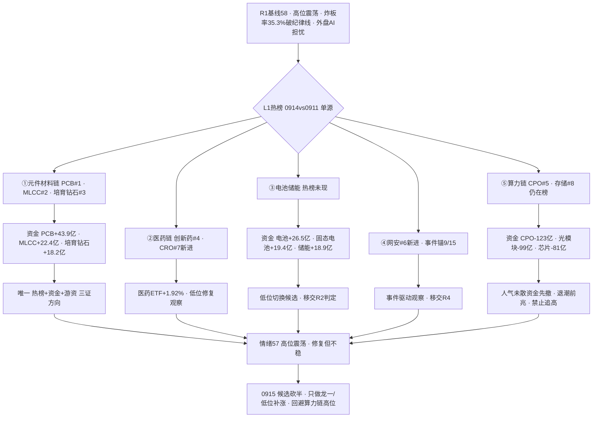

# 2026-09-15 · **群聊情绪共振**

> **数据源新鲜度**: partial
> **降级状态**: yes（L1-Only 降级日 — KOL 5群全灭 0条 · WeFlow 永久下线 · 无任何舆论共振源）
> **置信度**: 0.36

## 一句话结论
情绪 57（高位震荡·修复但不稳）：KOL 定性全缺失，量化三源指向唯一硬方向——元件材料链（PCB/MLCC/培育钻石），算力硬件链热榜在榜但资金大幅流出=退潮前兆，0915 候选砍半只做龙一。

## 详细分析

**今日是 L1-Only 降级日：情绪温度失去所有定性源。** 5 个焦点群全部抓取失败（1 群找不到聊天对象 + 4 群 timeout），`wechat_cli_5groups.jsonl` 零字节；WeFlow 自 08-19 永久下线。按红线 4，**单源（仅 L1）不得进入共振主题**——本日 `resonance_top_themes` 为空，热榜/人气信号只作 L1 透传参考，不冒充舆论共振。情绪判断退化为"量化三源 + R1 基线 + 新闻侧替代"。

**热榜换庄第 4 轮：元件材料升、算力硬件降、医药/网安新进。** L1（0914 收盘热榜 vs 0911）——PCB 新晋 #1（昨日 #3，⚠️ 按红线霸榜第一永作反向，标 medium 出货 watch）、MLCC #2、培育钻石 14→3（+11 位，概念主力净流入 +18.2 亿）、创新药 #4、CRO 新进 #7、网络安全新进 #6、先进封装新进 #19、机器人概念新进 #17；兵装重组 1→20 深度冷却、铜缆/黄金/6G/绿电掉榜。人气管道（东财+同花顺双平台）top7：超声电子/风华高科/黄河旋风/国芳集团/山子高科/中京电子/莲花控股——元件链霸屏人气榜，与热榜同向。

**量化三源交叉后只有一个硬方向：元件材料涨价链。** 热榜（PCB#1/MLCC#2/培育钻石#3）+ 主力资金（R7：PCB +43.85 亿全市场第一、MLCC +22.41 亿、培育钻石 +18.18 亿、新材料 +43.55 亿）+ 游资席位（紫阳东路净买 +6.69 亿，超声电子/中京电子/双星新材/科翔/黄河旋风 5 票全在元件链）——**热榜+资金+游资三证同向**，是 0914 全市场最一致的资金指向。反面：算力硬件链 CPO #5、存储 #8 仍在热榜，但主力大幅流出（CPO -123.49 亿全市场流出第一、光通信模块 -98.95 亿、国产芯片 -80.82 亿、数据中心 -72.51 亿、5G -70.45 亿）——**人气未散、资金先撤的典型退潮前兆**，叠加外盘 AI 开发放缓担忧（费半 -6%、纳指期货 -1.7%），0915 算力硬件链禁止追高。

**情绪浓度 57 = R1 基线 58 - 1（PCB 新晋 #1 出货 watch）。** 共振上调为 0——L1-Only 不可作正向共振，宁可低估不可虚高。R1 已定性高位震荡（conf 0.69）：广度大幅修复（涨跌比 1.41、溢价中位 +3.12%）但高标崩（非 ST 三板以上 -9.99%）、炸板率 35.3% 破 35% 纪律线、外盘美债破 5% + 美联储议息压制——"修复但不稳"。北向 5 日连净买（0914 +23.85 亿，5 日均 +25.31 亿）是唯一外部托底。score_5d 校验（R1 五维 48）差 9 < 15，不触发 gap。**交易含义与 R1 一致：候选砍半，只做元件材料链龙一/低位补涨，不碰算力链高位，PCB #1 不追。**

### 推理深度三问（top 分析对象：元件材料涨价链 PCB/MLCC/培育钻石）
- **大资金意图**: 0914 普涨修复日，主力没有回到 8 月最热的算力硬件（CPO/光模块/芯片），而是逆势重仓元件/材料/电池——PCB +43.85 亿、新材料 +43.55 亿、MLCC +22.41 亿、培育钻石 +18.18 亿、固态电池 +19.41 亿。这是典型的"高位科技切低位材料"再配置：算力链 30 日涨幅巨大（昨日非 ST 三板以上 30 日 +240%）、外盘 AI 担忧发酵，机构选择有涨价业绩锚（MLCC/存储涨价、培育钻石供给收缩）且筹码位置低的材料链。对手盘是仍在热榜高位接 CPO/光模块的散户与兑现中的机构（CPO -123 亿就是他们的卖单）。
- **为什么走强**: 位置——元件材料链处主线中低位（30 日 PCB/MLCC 修复但未过热，培育钻石刚启动）；催化——MLCC 涨价 + 存储涨价四重共振（R4 E006）+ 培育钻石人气榜霸榜（黄河旋风 115 天在榜、单日 +78 位）；筹码——热榜 + 人气榜 + 游资席位（紫阳东路 5 票全中）三线同向，是 0914 全市场唯一"量化三源共振"的方向。
- **逻辑够不够硬**: 中偏硬。独立源 3 个（热榜 tushare + 人气 dc/ths 双平台 + R7 资金），硬业绩锚部分成立（MLCC/存储涨价是产业事实），但缺 KOL/研报定性验证（今日全缺失）。证伪路径：①PCB 新晋 #1 若 0915 续霸榜且主力转净流出 → 升级 hard 出货警报（今日 medium）；②炸板率继续破 40% → 情绪转主跌，材料链低位也挡不住系统性退潮；③外盘 AI 担忧演化为全球科技杀估值 → 元件链作为科技属性同样承压。

### 首推票思维链：黄河旋风（600172 · L1 观察首票 — R3 不选股，仅人气/资金锚，进 R2/R5/D1 前须复核）
- **买入理由**: ① 培育钻石人气龙头——东财人气 #2、同花顺热股 #5、双平台 avg 3.5，单日 surge +78 位且 115 天持续在榜（长期人气票，符合"人气=潜力核心"）；② 紫阳东路游资席位净买（同席位还买超声电子/中京电子/双星新材——元件材料链整组配置动作），板块主力净流入 +18.18 亿作资金背景。
- **风险点**: ① 9/14 已涨停（+9.98%），属人气高位票，若 0915 高开低走即情绪兑现；② 培育钻石属题材弹性非硬业绩主线，无 KOL/研报验证，R6 反证可能以"人气透支"否决；③ 大盘高位震荡+炸板率破纪律线，超短环境恶化。
- **止损条件**: 破 5 日线清仓；或 0915 分时跌破开盘价且 30 分钟不收回即走（超短标准）；板块端——培育钻石概念主力若转净流出，无条件离场。
- **可验证假设**: 0915 培育钻石概念主力净流入保持为正（观测量：moneyflow_ind_dc 净额 > 0）且黄河旋风量能 ≥ 5 日均量、收盘不破前日涨停价——24-72h 证真则材料链主线延续；若概念转净流出而股价缩量滞涨 → 证伪，人气兑现确认。

## 关键证据
- 证据 1: 热榜 PCB #1（新晋）· MLCC #2 · 培育钻石 14→3 · 兵装重组 1→20 冷却 · 来源 tushare.ths_hot 0914 vs 0911
- 证据 2: 主力资金 PCB +43.85 亿全市场第一 · MLCC +22.41 亿 · 培育钻石 +18.18 亿 · 来源 R7(moneyflow_ind_dc)
- 证据 3: 算力硬件主力大幅流出 CPO -123.49 亿第一 · 光模块 -98.95 亿 · 芯片 -80.82 亿 · 来源 R7
- 证据 4: 双平台人气 top7 超声电子/风华高科/黄河旋风/国芳集团/山子高科/中京电子/莲花控股 · 来源 attention_signals(dc+ths)
- 证据 5: 人气 surge 莲花控股 +91 · 黄河旋风 +78 · 宏昌电子 +51 · 来源 attention_signals
- 证据 6: 游资紫阳东路净买 +6.69 亿（超声电子/中京电子/双星新材/科翔/黄河旋风）· 量化基金 +7.96 亿 · 来源 R7 hot_money
- 证据 7: 北向 0914 +23.85 亿 · 5 日均 +25.31 亿 · 来源 R7 northbound
- 证据 8: R1 情绪基线 58（高位震荡 conf0.69 · 炸板率 35.3% 破纪律线 · 外盘 AI 担忧）· 来源 R1_style.json
- 证据 9: KOL 5 群全灭 0 条（1 群找不到聊天对象 + 4 群 timeout）· 来源 wechat_cli_5groups.jsonl + manifest

## 数据源审计
| 源 | 日期 | 状态 | 备注 |
|---|---|---|---|
| tushare.ths_hot + moneyflow_ind_dc | 2026-09-14 | 🟢 | 20 概念 · SDK 直连 · 0914 收盘 |
| attention_signals.json | 2026-09-14 | 🟢 | dc 人气/飙升 + ths 热股/概念 4 管道 |
| R1_style.json | 2026-09-15 | 🟡 | 情绪基线 58 · complete 但内部 degraded(KOL全灭·外盘数据缺口) |
| R7_capital_flow.json | 2026-09-14 | 🟢 | 主力/北向/游资席位 · 跨源印证 |
| R4_news.json | 2026-09-15 | 🟢 | 8 硬事件 · 新闻侧替代信号 |
| wechat_cli_5groups | 2026-09-15 | 🔴 | 0 条 · 5 焦点群(匿名)全灭 |
| xtick MCP | 2026-09-15 | 🔴 | timeout>45s · HTTP 直连降级失败 |
| weflow-analytics | 2026-09-15 | 🔴 | ngrok 404 · 08-19 起永久下线 |

## 不确定性 / 反证
1. **定性源 100% 缺失是本日最大缺陷**: KOL 5 群全灭 + WeFlow 下线 → 今日所有"主题判断"只有量化证据，没有舆论/情绪交叉验证。量化三源可能集体误读（例如培育钻石只是游资单日行为而非趋势）。confidence 0.36 即为此买单——D1 引用本文件时须按低置信处理。
2. **L1 是 0914 收盘快照**: 热榜/人气/资金全部是昨日收盘状态；0915 盘前外盘 AI 大跌（费半 -6%）可能开盘直接改写资金格局，若高开低走则今日全部观察排序失效。
3. **PCB 新晋 #1 是双刃剑**: 按红线霸榜第一永作反向——它既是元件链三证的正面证据，也是潜在的出货警报（medium）。0915 若续霸榜 + 主力转流出，须立即升级 hard 出货并移交 R6。
4. **电池/储能方向证据最弱**: 资金流入（+26.5/+19.4/+18.9 亿）但热榜未现、人气零星——可能是低位切换早期也可能是假启动，未进 R3 观察前三的依据即证据不足，移交 R2 判定。

## 与其他 R/D/E 的关系
- 依赖: R1_style.json(情绪基线 58 · 高位震荡) · R7_capital_flow.json(主力/北向/游资印证) · R4_news.json(新闻侧替代信号) · attention_signals.json(人气底座) · hotlist_signals.json(自写 · L1 · 0914 vs 0911)
- 输出被消费: D1(canghai-plan 情绪温度/低置信警告) · R2(主线板块 热度维) · R6(devil_advocate PCB#1 出货反证) · E1(复盘对照)

## Sub-Agent 元数据
- skill: analyze_sentiment_resonance_v1
- artifact: data/research/20260915/R3_sentiment.json
- 生成耗时: 约 15 分钟
- model: deepseek-v4-flash-ga-260731
