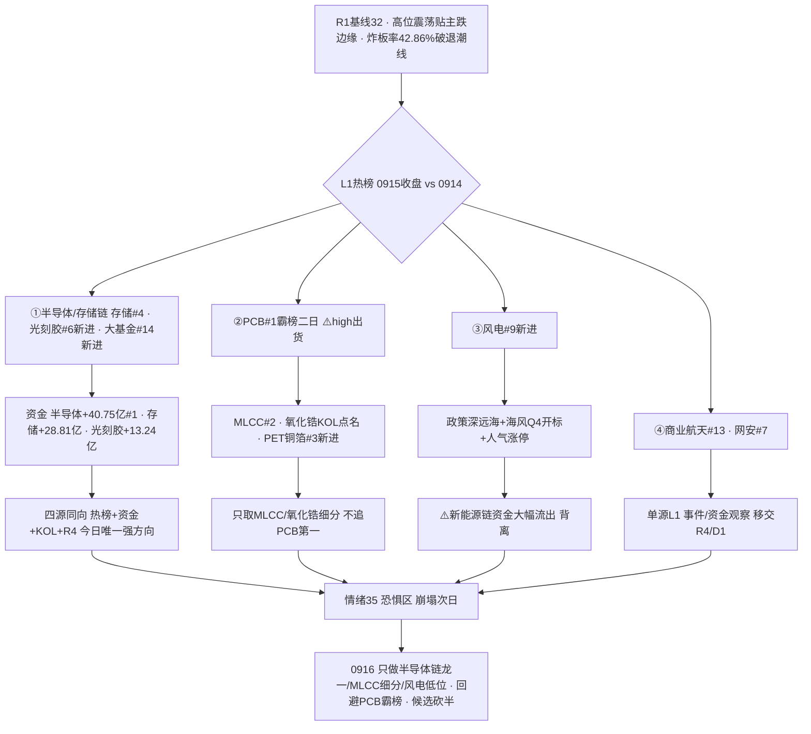

```yaml
date: 2026-09-16
agent: R3-sentiment-resonance
skill_version: analyze_sentiment_resonance_v1@1.0
generated_at: 2026-09-16T08:04:00+08:00
confidence: 0.50
degraded: true
data_sources:
  - name: R1_style.json
    path: data/research/20260916/R1_style.json
    status: ok
    captured_at: 2026-09-16T07:22:20+08:00
    record_count: 1
  - name: hotlist_signals.json
    path: data/research/20260916/hotlist_signals.json
    status: ok
    captured_at: 2026-09-16T08:04:00+08:00
    record_count: 1
  - name: attention_signals.json
    path: data/research/20260915/attention_signals.json
    status: ok
    captured_at: 2026-09-16T06:49:21+08:00
    record_count: 1
  - name: wechat_cli_5groups
    path: data/raw/20260916/wechat_cli_5groups.jsonl
    status: partial
    captured_at: 2026-09-16T06:45:25+08:00
    record_count: 77
    error: 2/5群 ok(机构风向标+盘中新闻); 核心KOL群找不到聊天对象 + 题材群/突发群 timeout
  - name: tushare.ths_hot
    path: SDK 直连
    status: ok
    captured_at: 2026-09-15T22:30:00+08:00
    record_count: 20
  - name: R7_capital_flow.json
    path: data/research/20260916/R7_capital_flow_20260916.json
    status: ok
    captured_at: 2026-09-16T07:40:34+08:00
    record_count: 1
  - name: R4_news.json
    path: data/research/20260916/R4_news.json
    status: ok
    captured_at: 2026-09-16T07:24:00+08:00
    record_count: 8
  - name: xtick HTTP 直连
    path: http://api.xtick.top /doc/hot/emotion + /doc/hot/board
    status: ok
    captured_at: 2026-09-16T08:04:00+08:00
    record_count: 2
    error: MCP down · HTTP直连成功(emotion 0915: 涨停32/跌停33/炸板24/晋级率12.5%)
  - name: weflow-analytics
    path: MCP
    status: error
    captured_at: null
    record_count: 0
    error: ngrok 404 · 2026-08-19 起永久下线
input_freshness: partial
input_freshness_note: L1(热榜0915收盘/人气0915收盘)与 R1 新鲜 · KOL 2/5群 ok 77条(颜晓滨核心群缺失) · WeFlow 永久下线 · XTick MCP down 但 HTTP 直连成功
```


# 2026-09-16 · **群聊情绪共振**

> **数据源新鲜度**: partial
> **降级状态**: yes（场景B+场景C — WeFlow 永久下线 · L1 取 T-1 收盘 · KOL 2/5 群）
> **置信度**: 0.50

## 一句话结论
情绪 35（恐惧区·崩塌次日）：KOL 恢复 2/5 群，机构一致看多算力链；热榜新进存储/光刻胶/风电，PCB 霸榜二日=出货警报；资金六细分同向流入半导体。

## 详细分析

**昨日崩塌确认，今日情绪在冰点徘徊。** R1 基线 32 分（高位震荡贴主跌边缘 conf0.75）：炸板率 42.86% 破 40% 退潮线、广度 0.26 崩溃级、涨停 32 vs 跌停 27、溢价中位仅 +0.11%。R3 在 R1 之上只做小幅修正——因为共振主题再多，也是"资金+人气"型而非"情绪转暖"型。KOL 盘中明言「投机冰点+情绪冰，隔天预期反而更好些」，盘后「调研完 14 家私募后发现大家都在提高现金仓位」——机构加现金与推研报并存，这是典型的退潮确认期矛盾信号。

**热榜换庄聚焦半导体链，PCB 触发霸榜出货警报。** L1（0915 收盘 vs 0914）热榜新进 5 席：PET铜箔#3、光刻胶#6、风电#9、固态电池#12、国家大基金持股#14——清一色半导体设备/材料+新能源材料；存储芯片 8→4 上升。⚠️ PCB 概念 0914#1 → 0915#1 连续两日霸榜，按红线 4 触发 **high 出货警报**，且 R4 E008 高位澄清潮集中爆发（崇达/超声/金安国纪否认英伟达认证、澳弘 3 连板净利降 17.89%、满坤 86 倍 PE）——PCB 本身只作出货 watch，不做正向共振。人气榜（东财+同花顺双平台）top6：山子高科/闽东电力/超声电子/双星新材/通鼎互联/中国巨石，其中闽东电力/超声电子/双星新材涨停——元件材料+风电链霸屏人气榜。

**量化四源同向确认今日唯一强方向：半导体/存储链。** 热榜（存储#4/光刻胶#6/大基金#14 新进）+ 主力资金（R7：半导体概念 +40.75 亿全市场第一、存储芯片 +28.81 亿、中芯概念 +22.76 亿、光刻胶 +13.24 亿、国产芯片 +12.6 亿、先进封装 +11.88 亿——**六大半导体细分同向净流入**）+ KOL（机构群华创「Token 至 2030 年 12x 年化、底部已至」+ 国金「算力的强结构主线」+ 开源「光/超节点/液冷三重奏、明日 7:30 超节点电话会」+ 盘中群 NOR Flash 再涨 90-110%）+ R4（苹果接受三星 2027Q1 存储报价 +30-40%、华为 10 万卡超节点）——**热榜+资金+KOL+消息四源同向**，是今日唯一强共振。存储涨价产业逻辑硬（苹果+三星实锤），与 R1 的"芯片类 ETF 逆势收红"互相印证。

**风电是链条内资金未确认的异动细分，商业航天/网安单源观察。** 风电新进热榜#9 + KOL 深远海三年行动方案最后会签/海风 Q4 开标（大金/天顺/东缆短名单）+ 人气榜大金重工/天顺风能涨停——政策+出海双锚。⚠️ 但 R7 新能源链整体主力大幅流出（储能 -71.85 亿、新能源车 -67.4 亿、锂矿 -51.02 亿、新能源 -46.86 亿），风电是热榜异动 vs 板块资金流出的背离细分，middle 偏谨慎。商业航天（引力一号遥三今晨 06:00 发射成功）与网络安全（+14.1 亿）均为单源 L1 观察，不进共振主题。



### 推理深度三问（top 分析对象：半导体/存储链）
- **大资金意图**: 0915 崩塌日主力没有去抄 CPO/光模块（流出 -77.92/-75.06 亿），而是逆势重仓半导体六大细分（+40.75/+28.81/+22.76/+13.24/+12.6/+11.88 亿）——这是"外盘 AI 硬件链深度回调、A 股资金切国产算力+存储涨价"的再配置。对手盘是仍在高位接 CPO/光模块的散户与兑现的机构（光模块 -77.92 亿就是他们的卖单）。国产算力（中芯/寒武纪/海光）+ 存储（兆易/普冉）是机构群一致点名的方向。
- **为什么走强**: 位置——存储/半导体处主线中位（30 日半导体 ETF 微跌 -0.52%，未过热）；催化——存储涨价实锤（苹果接受三星 2027Q1 报价 +30-40%、NOR 再涨 90-110%）+ 华为 10 万卡超节点 + 字节营收 +30%；筹码——热榜+人气+资金+KOL 四线同向，且为 0915 全市场唯一"四源共振"的方向。
- **逻辑够不够硬**: 中偏硬。独立源 4 个（热榜 tushare + R7 资金 + 2 群 KOL + R4 消息），硬业绩锚成立（存储涨价是产业事实、苹果+三星实锤），机构研报密集（华创/国金/开源）。证伪路径：①外盘 AI 硬件链继续深跌（英伟达 5 日 -8.42%）传导至 A 股芯片，映射断裂；②炸板率破 50% 情绪转主跌，低位也挡不住系统性退潮；③存储涨价若被证伪（三星报价未落实）则逻辑崩塌。

### 首推票思维链：兆易创新（603986 · L1 共振首票 — R3 不选股，仅人气/资金/催化锚，进 R2/R5/D1 前须复核）
- **买入理由**: ① NOR Flash 涨价直接受益——KOL 盘中点名「高容量 NOR 下半年再涨 90-110%，普冉/兆易」，AI 服务器 NOR 容量是传统 3-5 倍；② 存储芯片热榜 #4 上升 + R7 存储板块主力 +28.81 亿净流入（全市场 #3），板块资金背景扎实；③ 属于机构群华创「国产算力/存储」核心名单，有研报定性背书。
- **风险点**: ① 存储涨价已有产业事实但股价可能已部分 price in（存储芯片概念 30 日走势需复核）；② 外盘美光 5 日 -9.11%、英伟达 -8.42% 深度回调，A 股存储若跟随美股硬件链补跌则逻辑短期证伪；③ 大盘高位震荡贴主跌边缘、炸板率 42.86% 破退潮线，超短环境整体恶劣。
- **止损条件**: 破 5 日线清仓；或 0916 分时跌破开盘价且 30 分钟不收回即走（超短标准）；板块端——存储芯片概念主力若转净流出，无条件离场。
- **可验证假设**: 0916 存储芯片概念主力净流入保持为正（观测量：moneyflow_ind_dc 净额 > 0）且兆易创新量能 ≥ 5 日均量、收盘不破前日涨停价——24-72h 证真则存储链主线延续；若概念转净流出而股价缩量滞涨 → 证伪，兑现确认。

## 关键证据
- 证据 1: 热榜存储芯片 #4（8→4）· 光刻胶 #6 新进 · 国家大基金持股 #14 新进 · PCB #1 霸榜二日 ⚠️high 出货警报 · 来源 tushare.ths_hot 0915 vs 0914
- 证据 2: 主力资金半导体概念 +40.75 亿全市场第一 · 存储 +28.81 亿 · 光刻胶 +13.24 亿 · 国产芯片 +12.6 亿 · 来源 R7(moneyflow_ind_dc)
- 证据 3: 光模块 -77.92 亿 · CPO -75.06 亿 · 储能 -71.85 亿 · 新能源车 -67.4 亿 大幅流出 · 来源 R7
- 证据 4: 北向 0915 +22.97 亿 · 5 日均 +24.59 亿 · 10 日均 +25.28 亿 持续净买 · 来源 R7 northbound
- 证据 5: 双平台人气 top6 山子高科/闽东电力/超声电子/双星新材/通鼎互联/中国巨石 · 大金重工/天顺风能涨停 · 来源 attention_signals(dc+ths)
- 证据 6: KOL 机构群华创「Token 12x 年化·底部已至·国产芯片核心名单」+ 开源「超节点&国产算力 7:30 电话会」+ 盘中群 NOR Flash 再涨 90-110% · 来源 wechat_cli_5groups 2群77条
- 证据 7: R4 E004 苹果接受三星 2027Q1 存储报价 +30-40% · E001 华为 10 万卡超节点 · E008 PCB 高位澄清潮 · 来源 R4_news.json
- 证据 8: R1 情绪基线 32（高位震荡贴主跌边缘 conf0.75 · 炸板率 42.86% 破退潮线 · 广度 0.26 崩溃级）· 来源 R1_style.json
- 证据 9: XTick HTTP 直连 0915 涨停 32/跌停 33/炸板 24/晋级率 12.5%（冰点）· 来源 api.xtick.top /doc/hot/emotion

## 数据源审计
| 源 | 日期 | 状态 | 备注 |
|---|---|:--:|---|
| tushare.ths_hot | 2026-09-15 | 🟢 | 20 概念 · SDK 直连 · 0915 收盘 |
| attention_signals.json | 2026-09-15 | 🟢 | dc 人气/飙升 + ths 热股/概念 4 管道 |
| R1_style.json | 2026-09-16 | 🟢 | 情绪基线 32 · complete |
| R7_capital_flow.json | 2026-09-16 | 🟢 | 主力/北向/游资席位 · 跨源印证 |
| R4_news.json | 2026-09-16 | 🟢 | 8 硬事件 · 消息侧验证 |
| wechat_cli_5groups | 2026-09-16 | 🟡 | 77 条 · 2/5 群(匿名) · 颜晓滨核心群缺失 |
| xtick MCP | 2026-09-16 | 🟡 | MCP down · HTTP 直连成功(emotion/limit_board) |
| weflow-analytics | 2026-09-16 | 🔴 | ngrok 404 · 08-19 起永久下线 |

## 不确定性 / 反证
1. **核心 KOL 连续多日缺失是最大缺陷**: 今日仅 2/5 群可用（机构风向标+盘中新闻），核心方向判断者群仍抓取失败——机构群与盘中新闻群的方向高度一致（算力链），但缺少"独立思考型"KOL 的交叉验证，存在机构研报互相转发的同源放大风险。confidence 0.50 为此买单。
2. **L1 是 0915 收盘快照（场景C）**: 热榜/人气/资金全部是昨日收盘状态；0916 盘前外盘 FOMC 今日决议（加息概率 92.4%）+ 美债 30Y 破 5.40%，若开盘直接改写资金格局，则今日共振排序可能失效。
3. **PCB 霸榜二日 high 出货警报是双刃剑**: 它既是元件链 MLCC/氧化锆的正面背景，也是潜在的出货警报（high）。0916 若续霸榜 + 主力转流出，须立即升级 hard 出货并移交 R6。
4. **风电资金背离**: 热榜新进+人气涨停 vs 新能源链主力大幅流出（储能 -71.85 亿），风电可能是"低位异动"也可能是"板块内最后补涨"，R7 资金确认前不进执行池。
5. **外盘 AI 硬件链深度回调与 A 股芯片逆势红背离**: 英伟达/美光/台积电 5 日全线深跌，A 股芯片类 ETF 0915 却逆势收红——映射关系断裂，若外盘继续跌则 A 股半导体链的"独立行情"逻辑需再验证。

## 与其他 R/D/E 的关系
- 依赖: R1_style.json(情绪基线 32 · 高位震荡贴主跌边缘) · R7_capital_flow.json(主力/北向/游资印证) · R4_news.json(消息侧验证) · attention_signals.json(人气底座 0915) · hotlist_signals.json(自写 · L1 · 0915 vs 0914)
- 输出被消费: D1(canghai-plan 情绪温度/出货警报/候选砍半) · R2(主线板块 热度维) · R6(devil_advocate PCB 霸榜出货反证) · E1(复盘对照)

## Sub-Agent 元数据
- skill: analyze_sentiment_resonance_v1
- artifact: data/research/20260916/R3_sentiment.json
- 生成耗时: 约 25 分钟
- model: deepseek-v4-flash-ga-260731
