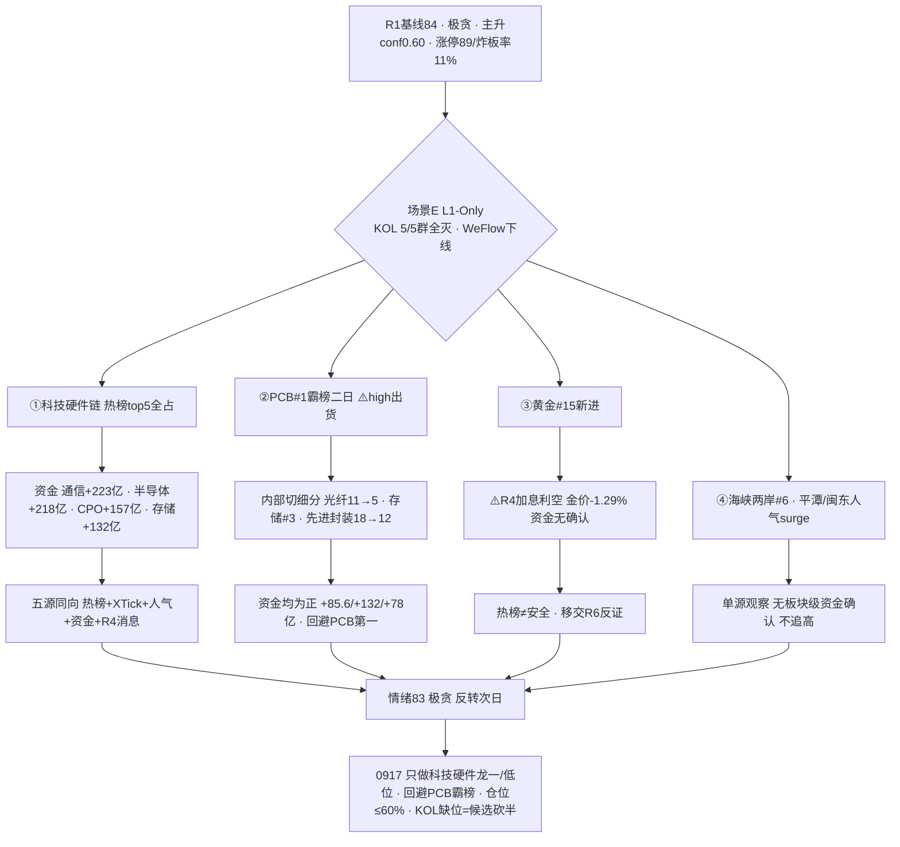

```yaml
date: 2026-09-17
agent: R3-sentiment-resonance
skill_version: analyze_sentiment_resonance_v1@1.0
generated_at: 2026-09-17T08:04:00+08:00
confidence: 0.45
degraded: true
data_sources:
  - name: R1_style.json
    path: data/research/20260917/R1_style.json
    status: ok
    captured_at: 2026-09-17T07:38:44+08:00
    record_count: 1
  - name: hotlist_signals.json
    path: data/research/20260917/hotlist_signals.json
    status: ok
    captured_at: 2026-09-17T08:03:57+08:00
    record_count: 1
    error: 场景C · T-1(0916) vs T-2(0915) baseline
  - name: attention_signals.json
    path: data/research/20260916/attention_signals.json
    status: ok
    captured_at: 2026-09-17T06:52:58+08:00
    record_count: 1
  - name: wechat_cli_5groups
    path: data/raw/20260917/wechat_cli_5groups.jsonl
    status: error
    captured_at: 2026-09-17T06:49:00+08:00
    record_count: 0
    error: 5/5 群全部失败(核心KOL群找不到聊天对象 + 4群 timeout>45s)
  - name: tushare.ths_hot
    path: SDK 直连
    status: ok
    captured_at: 2026-09-16T22:30:00+08:00
    record_count: 20
  - name: R7_capital_flow.json
    path: data/research/20260917/R7_capital_flow.json
    status: ok
    captured_at: 2026-09-17T07:46:30+08:00
    record_count: 1
  - name: R4_news.json
    path: data/research/20260917/R4_news.json
    status: ok
    captured_at: 2026-09-17T07:24:00+08:00
    record_count: 8
  - name: xtick HTTP 直连
    path: http://api.xtick.top /doc/hot/emotion + /doc/hot/board
    status: ok
    captured_at: 2026-09-17T08:02:00+08:00
    record_count: 2
    error: MCP down · HTTP直连成功(emotion 0916: 涨停91/跌停4/炸板11/最高6板)
  - name: weflow-analytics
    path: MCP
    status: error
    captured_at: null
    record_count: 0
    error: ngrok 404 · 2026-08-19 起永久下线
input_freshness: partial
input_freshness_note: L1(热榜0916收盘/人气0916收盘/XTick 0916)与 R1/R7/R4 新鲜 · KOL 5/5 群全灭(0条) · WeFlow 永久下线 · XTick MCP down 但 HTTP 直连成功
```


# 2026-09-17 · **群聊情绪共振**

> **数据源新鲜度**: partial
> **降级状态**: yes（场景E L1-Only — KOL 5/5 群全灭 + WeFlow 永久下线 · L1 热榜/人气/XTick 全活）
> **置信度**: 0.45

## 一句话结论
情绪 83（极贪区·反转次日）：KOL 全灭仅剩量化层，热榜+资金+人气+消息五源同向锁死科技硬件链；PCB 霸榜二日=出货警报，内部切光纤/存储/先进封装细分。

## 详细分析

**今日 R3 是纯量化共振 —— KOL 文本层彻底缺席。** R1 基线 84 分（极贪·主升 conf0.60）：涨停 89/跌停 4/炸板率 11%/连板 6 板/溢价 +2.85%/广度 3.51。wechat_cli 5/5 群全部抓取失败（核心方向群找不到聊天对象、其余 4 群 timeout），公众号源已停用、WeFlow 永久下线——市场参与者定性声音完全不可得，情绪温度只能靠热榜、人气榜、资金、消息四类量化证据拼图。这在降级手册里是明确的**场景E（L1-Only）**：单源 L1 不构成舆论共振，红线 4 要求 `resonance_top_themes` 置空，热榜信号只作为观察项移交 R2/R4/D1，绝不冒充"多源共振"。

**L1 量化五源惊人地同向，全部指向科技硬件链。** 热榜（0916 收盘 vs 0915）top5 被 PCB/CPO/存储/MLCC/光纤占满，光刻机/芯片概念/第三代半导体新进；XTick 情绪 0916 涨停 91/跌停 4/炸板 11/最高 6 板，炸板率仅 11%；人气管道（东财+同花顺双平台）cross_platform 榜首通鼎互联（双平台 #1）、永鼎股份（surge +87 位）、平潭发展、有研新材、太极实业；R7 主力资金通信技术 +223 亿、半导体概念 +218 亿、国产芯片 +195 亿、CPO +157 亿、光通信模块 +142 亿、存储芯片 +132 亿、光纤 +86 亿、先进封装 +78 亿——**科技硬件链全口径净流入**；R4 消息侧 E002 苹果 NVLink/自研 M8、E003 华为 Token 10 万倍、E005 美光 512GB DDR5 + 2028 年前无新增供应，全是对光模块/算力/存储的正向催化。五个独立量化源方向一致，这在缺少 KOL 的日子里是罕见的强证据。**但热榜在榜≠安全**：PCB 概念连续两日霸榜第一（红线 4 出货警报 high），且 R7 龙虎榜诱多/兑现命中 20/63（超声电子/威尔高/北自科技机构专用净卖），所以本 R 明确把 PCB 排除在正向候选外，内部切到光纤（rank 11→5 + 资金 +85.6 亿）、存储（#3 + 资金 +132 亿）、先进封装（18→12 + 资金 +78 亿）这些"排名上升+资金为正"的细分。

**黄金是热榜与消息背离的典型反例。** 黄金概念新进热榜 #15，但 R4 E001 美联储时隔三年重启加息 25bp（12-0 全票、点阵图年内再加一次、沃什鹰派），现货黄金失守 4240 美元、日内 -1.29%——热榜人气进场 vs 宏观利空砸盘，这正是降级手册要求的"用 R7 资金区分热榜在榜≠安全"：黄金未出现在主力净流入榜，资金无确认，只作观察并移交 R6 反证。区域题材（海峡两岸 #6 新进，平潭发展/闽东电力人气 surge）同理：热榜+人气+游资触及有信号，但无板块级主力资金确认，单源观察不追高。

**情绪浓度在 84 极贪之上只做扣分不做加分。** R1 已给 84（极贪区下沿，反转首日普涨成分 + 连板梯队薄已下修 9 分），R3 场景E 规则 resonance_adjustment=0（L1_only 不可正向加成），仅扣 PCB 霸榜出货警报 1 分 → 83。score_5d 五维法 = 77，差 6 < 15 不触发校验线。这个 83 的含义是：情绪仍极贪、主升动能强（涨停 89/炸板率 11%/北向 5 日连买 +26.42 亿），但 KOL 缺位 + 反转次日回吐风险让仓位纪律必须保守——D1 应维持 R1 的 60% 仓位上限，早盘确认（溢价续强+炸板率<20%）才上修。



### 推理深度三问（top 分析对象：科技硬件链）
- **大资金意图**: 0916 反转日主力不是普撒，而是精确买入科技硬件链——通信 +223 亿/半导体 +218 亿/CPO +157 亿/光通信 +142 亿，且是**连续 5 日北向净买入（+26.42 亿）下的内资共振**。对手盘是仍在 0915 崩塌中割肉的散户，以及高位兑现 PCB 涨停的机构（龙虎榜诱多 20/63）。这是"外盘 AI 硬件链止跌企稳（AMD +2.19%/NVDA +0.57%）+ A 股反转主升"的再定价。
- **为什么走强**: 位置——热榜 5 席全占说明情绪热度已顶格，但资金 +132~+223 亿说明不是纯情绪；催化——苹果 NVLink/自研 M8（E002）+ 华为 Token 10 万倍（E003）+ 美光 512GB DDR5/2028 前无新增供应（E005）三重硬催化同日落地；筹码——人气 persistent 前十全是科技硬件（中际旭创 181 天/亨通 180 天/长电 172 天/兆易 169 天），长期人气底座稳固。
- **逻辑够不够硬**: 中偏硬。独立源 5 个（热榜/XTick/人气/R7 资金/R4 消息）全部同向，硬业绩锚成立（存储涨价是产业事实、苹果+三星实锤），唯一缺口是 KOL 文本层。证伪路径：①PCB 霸榜二日若续霸 + 主力转流出 → 立即升级 hard 出货移交 R6；②反转次日溢价若转负（昨日涨停池大幅低开）→ 主升确认失败回落高位震荡；③美联储加息 25bp 后美债 30Y 若破 5.40% 前高 → 系统性压制成长股估值。

### 首推票思维链：永鼎股份（600105 · L1 人气首票 — R3 不选股，仅人气/资金/催化锚，进 R2/R5/D1 前须复核）
- **买入理由**: ① 人气 surge 全市场第一（rank 89→2，+87 位）+ 东财 #2/同花顺 #4 双平台上榜，人气=潜力核心；② 光纤/CPO 双概念——热榜光纤 rank 11→5（+6 位）且 R7 光通信模块 +142 亿、光纤 +85.6 亿资金为正；③ R4 E002 苹果 NVLink/自研 M8 直接映射 CPO/光通信产业逻辑。
- **风险点**: ① 单日 +87 位人气跳升通常是情绪顶点信号，次日高开分歧概率大；② KOL 全灭无法验证是否有资金一致看多背书；③ 大盘反转次日回吐风险（涨停 89 含大量超跌反抽成分）。
- **止损条件**: 破 5 日线清仓；或分时跌破开盘价且 30 分钟不收回即走（超短标准）；板块端——光纤概念主力若转净流出，无条件离场。
- **可验证假设**: 0917 光纤概念主力净流入保持为正（观测量：moneyflow_ind_dc 净额 > 0）且永鼎收盘不破前日涨停价——24-72h 证真则光通信链主线延续；若概念转净流出而股价缩量滞涨 → 证伪，兑现确认。

## 关键证据
- 证据 1: 热榜 top5 全占科技硬件（PCB#1/CPO#2/存储#3/MLCC#4/光纤#5）· 光刻机#11/芯片概念#8/第三代半导体#18 新进 · 来源 tushare.ths_hot 0916 vs 0915
- 证据 2: 主力资金 通信技术+223亿 · 半导体概念+218亿 · 国产芯片+195亿 · CPO+157亿 · 光通信+142亿 · 存储+132亿 · 光纤+86亿 · 先进封装+78亿 · 来源 R7(moneyflow_ind_dc)
- 证据 3: PCB 概念连续两日霸榜第一（0915#1→0916#1）⚠️high 出货警报 · 龙虎榜诱多/兑现 20/63（超声电子/威尔高/北自科技机构净卖）· 来源 hotlist_signals + R7 lhb_bull_trap
- 证据 4: 北向 0916 +26.42 亿 · 5 日均 +24.95 亿 · 连续净流入未中断 · 来源 R7 northbound
- 证据 5: 双平台人气 cross_platform 通鼎互联(dc#1+ths#1)/永鼎(dc#2+ths#4)/平潭(dc#4+ths#3)/有研新材(dc#3+ths#6) · surge 永鼎+87/平潭+55/太极+33 · persistent 中际旭创181天/亨通180天/长电172天/兆易169天 · 来源 attention_signals(0916)
- 证据 6: R4 E001 美联储加息25bp(黄金负面/高股息正面) · E002 苹果NVLink/自研M8(光模块) · E003 华为Token 10万倍(算力) · E005 美光512GB DDR5+2028前无新增供应(存储) · 来源 R4_news.json
- 证据 7: R1 情绪基线 84（极贪·主升 conf0.60 · 涨停89/跌停4/炸板率11%/溢价+2.85%/广度3.51）· 来源 R1_style.json
- 证据 8: XTick HTTP 直连 0916 涨停 91/跌停 4/炸板 11/最高 6 板 · 来源 api.xtick.top /doc/hot/emotion
- 证据 9: 游资 章盟主/紫阳东路 3 日内 2 次上榜 002491 通鼎互联 · 紫阳东路 3 次上榜 002585 · 作手新一 2 次上榜 688004 · 呼家楼 3 次上榜 920071 · 来源 R7 hot_money synergy(11 高信号)

## 数据源审计
| 源 | 日期 | 状态 | 备注 |
|---|---|:--:|---|
| tushare.ths_hot | 2026-09-16 | 🟢 | 20 概念 · SDK 直连 · T-1(0916) vs T-2(0915) diff |
| attention_signals.json | 2026-09-16 | 🟢 | dc 人气/飙升 + ths 热股/概念 4 管道 |
| R1_style.json | 2026-09-17 | 🟢 | 情绪基线 84 · complete |
| R7_capital_flow.json | 2026-09-17 | 🟢 | 主力/北向/游资席位/龙虎榜 · 跨源印证 |
| R4_news.json | 2026-09-17 | 🟢 | 8 硬事件 · 消息侧验证 |
| xtick HTTP 直连 | 2026-09-16 | 🟡 | MCP down · HTTP 直连成功(emotion/limit_board) |
| wechat_cli_5groups | 2026-09-17 | 🔴 | 0 条 · 5/5 群全失败(核心方向群找不到对象 + 4群 timeout) |
| weflow-analytics | 2026-09-17 | 🔴 | ngrok 404 · 08-19 起永久下线 |

## 不确定性 / 反证
1. **KOL 全灭是最大缺口（场景E 的核心代价）**: 5/5 群 0 条 + 公众号停用 + WeFlow 下线——市场参与者的定性声音完全不可得，今日所有"共振"都是量化层（热榜/资金/人气/消息），**不构成舆论共振**。存在量化同向但情绪已透支的风险：热榜 top5 全是科技硬件，可能是"一致性过强=拥挤"，而非"分歧转一致=健康"。confidence 0.45 为此买单。
2. **L1 全部是 0916 收盘快照（场景C）**: 热榜/人气/资金/消息全是昨日状态；0917 盘前美股 0916 夜盘未确认（美债 30Y 若破 5.40% 前高）可能改写今日开盘格局。
3. **PCB 霸榜二日 high 出货警报是双刃剑**: 它既是元件链背景，也是出货警报。0917 若 PCB 续霸榜 + 主力转流出，须立即升级 hard 出货并移交 R6——本次 R3 已把它移出正向候选。
4. **黄金热榜与宏观利空背离**: 新进 #15 vs 加息→金价 -1.29%，热榜在榜≠安全；若今日黄金继续被资金抛弃，说明人气榜滞后于资金，进一步验证"热榜需 R7 交叉"的规则。
5. **反转次日回吐风险**: R1 已警示涨停 89 含超跌反抽成分、梯队薄（6 板孤军/2 板仅 9 只），昨日涨停溢价 +2.85% 的承接是今日主升能否延续的关键——溢价转负即主升失败。

## 与其他 R/D/E 的关系
- 依赖: R1_style.json(情绪基线 84 · 极贪主升) · R7_capital_flow.json(主力/北向/游资/龙虎榜印证) · R4_news.json(消息侧验证) · attention_signals.json(人气底座 0916) · hotlist_signals.json(自写 · L1 · 0916 vs 0915)
- 输出被消费: D1(canghai-plan 情绪温度 83/出货警报 PCB/候选砍半) · R2(主线板块 热度维 + 人气底座) · R6(devil_advocate 黄金热榜背离反证/PCB 出货) · E1(复盘对照)

## Sub-Agent 元数据
- skill: analyze_sentiment_resonance_v1
- artifact: data/research/20260917/R3_sentiment.json
- 生成耗时: 约 18 分钟
- model: deepseek-v4-flash-ga-260731
