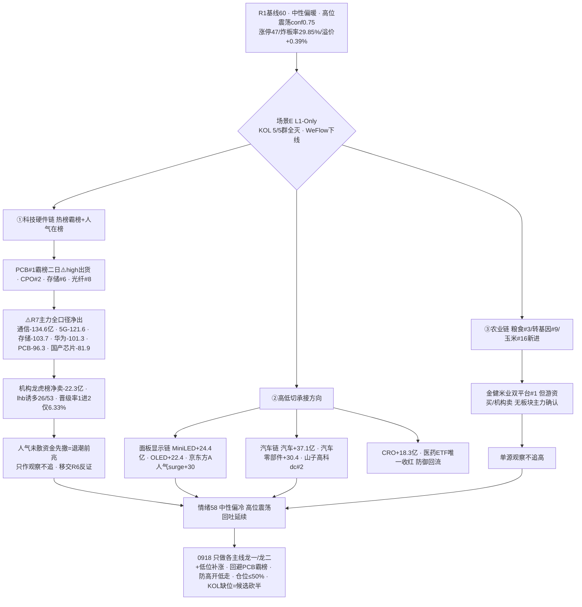

```yaml
date: 2026-09-18
agent: R3-sentiment-resonance
skill_version: analyze_sentiment_resonance_v1@1.0
generated_at: 2026-09-18T09:05:00+08:00
confidence: 0.45
degraded: true
data_sources:
  - name: R1_style.json
    path: data/research/20260918/R1_style.json
    status: ok
    captured_at: 2026-09-18T08:25:14+08:00
    record_count: 1
    error: status=complete · sentiment_score=60 · degraded=true(KOL缺位)
  - name: tushare.ths_hot
    path: SDK 直连
    status: ok
    captured_at: 2026-09-17T22:30:00+08:00
    record_count: 20
    error: T-1(0917) vs T-2(0916) baseline diff
  - name: attention_signals.json
    path: data/research/20260917/attention_signals.json
    status: ok
    captured_at: 2026-09-18T06:56:52+08:00
    record_count: 1
    error: 多平台人气管道 0917 收盘
  - name: xtick HTTP 直连
    path: http://api.xtick.top /doc/hot/emotion + /doc/hot/board
    status: ok
    captured_at: 2026-09-18T08:58:00+08:00
    record_count: 2
    error: MCP down · HTTP直连成功(emotion 0917: 涨停49/跌停2/炸板21/最高5板)
  - name: R7_capital_flow.json
    path: data/research/20260918/R7_capital_flow.json
    status: ok
    captured_at: 2026-09-18T08:25:42+08:00
    record_count: 1
  - name: R4_news.json
    path: data/research/20260918/R4_news.json
    status: ok
    captured_at: 2026-09-18T08:38:00+08:00
    record_count: 8
  - name: wechat_cli_5groups
    path: data/raw/20260918/wechat_cli_5groups.jsonl
    status: error
    captured_at: 2026-09-18T06:50:00+08:00
    record_count: 0
    error: 5/5 群全部失败(核心KOL群找不到聊天对象 + 4群 timeout>45s)
  - name: weflow-analytics
    path: MCP
    status: error
    captured_at: null
    record_count: 0
    error: ngrok 404 · 2026-08-19 起永久下线
input_freshness: partial
input_freshness_note: L1(热榜0917收盘/人气0917收盘/XTick 0917)与 R1/R7/R4 新鲜 · KOL 5/5 群全灭(0条) · WeFlow 永久下线 · XTick MCP down 但 HTTP 直连成功
```


# 2026-09-18 · **群聊情绪共振**

> **数据源新鲜度**: partial
> **降级状态**: yes（场景E L1-Only — KOL 5/5 群全灭 + WeFlow 永久下线 · L1 热榜/人气/XTick 全活）
> **置信度**: 0.45

## 一句话结论
情绪 58（中性偏冷·高位震荡回吐延续）：KOL 全灭仅剩量化层，科技硬件链热榜霸榜+人气在榜+消息正面但主力资金全口径净出 → 人气未散资金先撤=退潮前兆；资金已切面板显示/汽车/CRO。

## 详细分析

**今日 R3 连续第二日处于纯量化模式 —— KOL 文本层彻底缺席。** R1 基线 60 分（中性偏暖·高位震荡 conf0.75）：涨停 47（较 0916 的 89 腰斩）/跌停 1/炸板率 29.85%（破 25% 分歧线未破 35% 纪律线）/连板 5 板/昨日涨停溢价 +0.39%（从 +2.85% 熄火）/广度 0.91（转负）/8 大宽基全绿。wechat_cli 5/5 群全部抓取失败（核心方向群找不到聊天对象、其余 4 群 timeout），公众号源已停用、WeFlow 永久下线——市场参与者定性声音完全不可得。这是降级手册明确的**场景E（L1-Only）**：单源 L1 不构成舆论共振，红线 4 要求 `resonance_top_themes` 置空，热榜/人气信号只作为观察项移交 R2/R4/D1。

**今日最核心的信号不是共振，而是背离 —— 科技硬件链"人气未散、资金先撤"。** 热榜 0917 收盘 top2 仍是 PCB/CPO、存储#6/光纤#8 在榜，人气 persistent top10 全为科技硬件（中际旭创 182 天/亨通光电 181/长电科技 173/中天科技 171/兆易创新 170），R4 消息面仍是正面催化（华为昇腾 960 提前至 2027Q1 + NPO 光引擎、SK 海力士/美光大涨存储景气）——**但 R7 主力资金全口径净出**：通信技术 -134.6 亿/5G 概念 -121.6 亿/存储芯片 -103.7 亿/华为概念 -101.3 亿/PCB -96.3 亿/国产芯片 -81.9 亿，行业电子 -126.7 亿/元件 -81 亿/印制电路板 -63 亿/半导体 -47.6 亿；龙虎榜机构专用席位全场净卖 -22.3 亿，lhb 诱多/兑现模式命中 26/53（49%）。热榜内部也在全面回退：MLCC 4→12、光刻胶 7→13、液冷 9→14、存储 3→6、芯片 8→11、光纤 5→8——六个名次带同步下滑。这个组合与 20260915 算力链退潮前兆完全同构：**热榜在榜 ≠ 安全，人气底座还在但主力已先撤。**

**资金真实去向是高低切：面板显示链 + 汽车链 + CRO。** 概念主力净入前列被面板链占领：MiniLED +24.4 亿/显示技术 +23.1 亿/MicroLED +22.9 亿/OLED +22.4 亿/电子纸 +20.1 亿/裸眼 3D +20 亿/智慧灯杆 +19.6 亿，行业面板 +23.1 亿、光学光电子 +20.2 亿；汽车链行业前三：汽车 +37.1 亿/汽车零部件 +30.4 亿/底盘与发动机系统 +18.1 亿；医药防御回流：CRO +18.3 亿/医药生物 +15.8 亿（医药 ETF 0917 唯一收红 +0.81%）。人气侧同步验证：京东方 A surge 34→4（+30 位，双平台 #4）、山子高科 dc#2、金健米业双平台 #1。农业链（粮食#3/转基因#9/玉米#16 三席同新进热榜 + 金健米业人气榜首）是纯情绪/游资题材——游资量化在买、机构在卖（金健米业机构专用净卖 -2978 万），无板块级主力资金确认，单源观察不追高。

**情绪浓度在 60 之上只做扣分不做加分。** R1 已给 60（高位震荡回吐日，四维 66/五维 54 折中），R3 场景E 规则 resonance_adjustment=0（L1_only 不可正向加成），扣 PCB 霸榜二日出货警报 1 分，再扣科技硬件人气/资金背离退潮前兆 1 分 → 58。score_5d 五维法 = 54，差 4 < 15 不触发校验线。这个 58 的含义：情绪中性偏冷、打板接力熄火（XTick 晋级率 1 进 2 仅 6.33%，0916 为 36%），高位震荡期落袋为安/控仓；隔夜美股半导体暴涨（英特尔 +7.67%/AMD +6.36%/美光 +5.50%，纳指 +1.69%）是唯一正向变量，但 A 股自身回吐是主要矛盾——**0918 若科技硬件因隔夜外盘高开，防高开低走（回吐日高开最危险）**，D1 应维持 R1 的 50% 仓位上限，早盘溢价转正+炸板率 <25% 才上修 60%。



### 推理深度三问（top 分析对象：科技硬件链退潮前兆）
- **大资金意图**: 0917 主力不是普跌，而是**定向从科技硬件链撤出**——通信 -134.6 亿/存储 -103.7 亿/PCB -96.3 亿是精确的板块级派发，且机构专用席位全场净卖 -22.3 亿。对手盘是仍在热榜和人气榜上的人气型散户（persistent 前十全是科技硬件）。这是反转日（0916）大涨后的获利兑现：**0916 买入的人正是 0917 卖出的人**，筹码从主力手里转移到散户手里，退潮前兆成立。
- **为什么走强**(此处为反向推理 · 为什么走弱): 位置——热榜霸榜二日（PCB）+ 人气 persistent 182 天已到拥挤末端；催化——消息面仍正面（昇腾 960/NPO 光引擎/存储涨价），但**利好不涨反被砸**说明消息已 price-in；筹码——龙虎榜机构净卖 + 诱多模式 26/53，高位放量涨停的票（世嘉科技/金石亚药）全部机构兑现。
- **逻辑够不够硬**: 背离证据足够硬：热榜（L1）+ 人气（attention）+ 资金（R7）三独立量化源指向同一背离，唯一缺口是 KOL 文本层无法确认散户情绪。证伪路径：①0918 若科技硬件主力转为净流入 + 早盘溢价转正 → 退潮前兆证伪，只是 0917 单日洗盘；②若 PCB 续霸榜且龙虎榜机构转净买 → 出货警报解除；③若炸板率盘中破 35% → 情绪转主跌，科技硬件从观察转回避。

### 首推票思维链：京东方 A（000725 · 面板显示链资金+人气双证锚 — R3 不选股，仅人气/资金/催化锚，进 R2/R5/D1 前须复核）
- **买入理由**: ① 人气 surge 全市场前列（rank 34→4，+30 位）+ 东财 #4/同花顺 #4 双平台上榜 + persistent 166 天长期人气底座，人气=潜力核心；② 面板显示链是 0917 主力资金真实去向——MiniLED +24.4 亿/显示技术 +23.1 亿/OLED +22.4 亿/行业面板 +23.1 亿，京东方 A 是面板链绝对中军；③ R1 风格聚类显示 0917 防御/温和簇唯一收红，高位震荡期资金切低位大票有承接。
- **风险点**: ① 无 R4 消息催化（纯资金/人气驱动，缺硬事件锚）；② 面板链 30 日 ETF 累计仍深跌（新能源/光伏系），若只是单日超跌反弹则持续性存疑；③ KOL 全灭无法验证是否有资金一致看多背书。
- **止损条件**: 破 5 日线清仓；或分时跌破开盘价且 30 分钟不收回即走；板块端——面板行业主力若转净流出（moneyflow_ind_dc 净额转负），无条件离场。
- **可验证假设**: 0918 面板行业主力净流入保持为正（观测量：moneyflow_ind_dc 面板行业净额 > 0）且京东方 A 收盘站稳 0917 高点——24-72h 证真则高低切承接成立；若面板资金转净出而京东方缩量滞涨 → 证伪，退回观察。

## 关键证据
- 证据 1: 热榜 0917 vs 0916：PCB#1 连续两日霸榜（high 出货警报）· 科技硬件 6 个名次带同步下滑（MLCC 4→12/光刻胶 7→13/液冷 9→14/存储 3→6/芯片 8→11/光纤 5→8）· 农业（粮食#3/转基因#9/玉米#16）/医药（CRO#4/创新药 10→5）/机器人（人形#7/机器人概念#17）新进 · 来源 tushare.ths_hot
- 证据 2: 主力资金背离：通信技术-134.64亿 · 5G-121.6亿 · 存储芯片-103.65亿 · 华为概念-101.26亿 · PCB-96.34亿 · 国产芯片-81.91亿 全口径净出 · 来源 R7(moneyflow_ind_dc)
- 证据 3: 资金真实去向：面板 MiniLED+24.44亿/显示技术+23.06亿/OLED+22.36亿/行业面板+23.09亿 · 汽车+37.08亿/汽车零部件+30.4亿 · CRO+18.31亿/医药生物+15.76亿 · 来源 R7(moneyflow_ind_dc)
- 证据 4: 龙虎榜机构专用席位全场净卖 -22.3 亿 · lhb 诱多/兑现 26/53（沐曦股份机构净卖 -2.14 亿/西陇科学 -2666 万）· 来源 R7 top_inst/top_list
- 证据 5: 人气 persistent top10 全为科技硬件（中际旭创182天/亨通181/长电173/中天171/兆易170）但 surge 全在切换方向（京东方A+30/金健米业+48/万向德农+45/中国巨石+18）· 来源 attention_signals(0917)
- 证据 6: XTick HTTP 直连 0917 涨停 49/跌停 2/炸板 21/最高 5 板 · 晋级率 1 进 2 仅 6.33%（0916 为 36%）——打板接力熄火 · 来源 api.xtick.top /doc/hot/emotion
- 证据 7: R4 E001 华为昇腾960提前2027Q1+NPO光引擎 · E002 SK海力士+5%/美光+5.11% 存储景气 · E005 商业航天3天4连捷 · E007 特斯拉Cybercab Robotaxi · 来源 R4_news.json
- 证据 8: R1 情绪基线 60（高位震荡 conf0.75 · 涨停47/炸板率29.85%/溢价+0.39%/广度0.91 · 8大宽基全绿）· 隔夜美股半导体暴涨（英特尔+7.67%/AMD+6.36%/美光+5.50%）· 来源 R1_style.json + news
- 证据 9: 北向 0917 +25.99 亿连续净流入（5日均25.67亿）——外资配置盘未撤，内资游资在撤 · 来源 R7 northbound

## 数据源审计
| 源 | 日期 | 状态 | 备注 |
|---|---|:--:|---|
| tushare.ths_hot | 2026-09-17 | 🟢 | 20 概念 · SDK 直连 · T-1(0917) vs T-2(0916) diff |
| attention_signals.json | 2026-09-17 | 🟢 | dc 人气/飙升 + ths 热股/概念 4 管道 · 今日 06:56 生成 |
| R1_style.json | 2026-09-18 | 🟢 | 情绪基线 60 · complete · degraded(KOL缺位) |
| R7_capital_flow.json | 2026-09-18 | 🟢 | 主力/北向/游资席位/龙虎榜 · 跨源印证 |
| R4_news.json | 2026-09-18 | 🟢 | 8 硬事件 · 消息侧验证 |
| xtick HTTP 直连 | 2026-09-17 | 🟡 | MCP down · HTTP 直连成功(emotion/limit_board) |
| wechat_cli_5groups | 2026-09-18 | 🔴 | 0 条 · 5/5 群全失败(核心方向群找不到对象 + 4群 timeout) |
| weflow-analytics | 2026-09-18 | 🔴 | ngrok 404 · 08-19 起永久下线 |

## 不确定性 / 反证
1. **KOL 全灭是最大缺口（场景E 的核心代价）**: 5/5 群 0 条 + 公众号停用 + WeFlow 下线——市场参与者的定性声音完全不可得，今日所有"共振"都是量化层（热榜/资金/人气/消息），**不构成舆论共振**。confidence 0.45 为此买单。
2. **"退潮前兆"判定依赖单日资金**: 通信/存储/PCB 的净出是 0917 单日快照。若 0918 科技硬件因隔夜美股半导体暴涨而资金回流（英伟达芯片销量翻倍/昇腾 960 提前是硬催化），退潮前兆证伪，反变成回吐日后的洗盘低吸机会——需 0918 盘中资金流实时确认。
3. **L1 全部是 0917 收盘快照（场景C）**: 热榜/人气/资金/消息全是昨日状态；隔夜美股大涨（纳指+1.69%）可能改写今日开盘格局，高开低走与高开修复两种剧本并存。
4. **面板/汽车链资金净入但缺消息催化**: MiniLED/OLED +24 亿级净入 vs R4 无对应硬事件，可能是高低切的承接而非新主线启动——若 0918 资金转出则只是单日腾挪。
5. **农业链是分歧盘**: 金健米业双平台人气榜首 + 量化基金 3 日 3 次上榜 vs 机构专用净卖 -2978 万 + 无板块级主力资金确认——游资题材一日游概率高，不追高。
6. **高位震荡阶段纪律**: 炸板率 29.85% 已破 25% 分歧线，候选数砍半；若盘中破 35% 纪律线 → 情绪=主跌，只保留最强龙一。

## 与其他 R/D/E 的关系
- 依赖: R1_style.json(情绪基线 60 · 高位震荡) · R7_capital_flow.json(主力/北向/游资/龙虎榜印证) · R4_news.json(消息侧验证) · attention_signals.json(人气底座 0917) · tushare.ths_hot + xtick HTTP(自写 L1 · 0917 vs 0916)
- 输出被消费: D1(canghai-plan 情绪温度 58/退潮前兆观察/高低切方向/候选砍半) · R2(主线板块 热度维 + 人气底座) · R6(devil_advocate 科技硬件资金背离反证/PCB 霸榜出货) · E1(复盘对照)

## Sub-Agent 元数据
- skill: analyze_sentiment_resonance_v1
- artifact: data/research/20260918/R3_sentiment.json
- 生成耗时: 约 15 分钟
- model: deepseek-v4-flash-ga-260731
