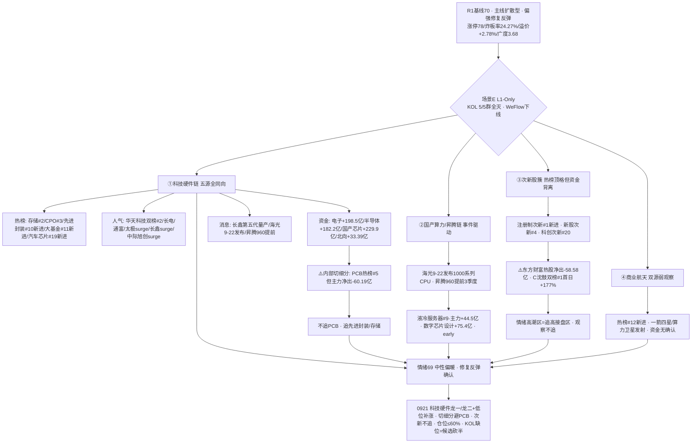

```yaml
date: 2026-09-21
agent: R3-sentiment-resonance
skill_version: analyze_sentiment_resonance_v1@1.0
generated_at: 2026-09-21T08:15:00+08:00
confidence: 0.45
degraded: true
data_sources:
  - name: R1_style.json
    path: data/research/20260921/R1_style.json
    status: ok
    captured_at: 2026-09-21T07:48:52+08:00
    record_count: 1
    error: status=complete · sentiment_score=70 · 主线扩散型 · degraded=true(KOL缺位)
  - name: tushare.ths_hot
    path: SDK 直连
    status: ok
    captured_at: 2026-09-18T22:30:00+08:00
    record_count: 20
    error: 场景C · T-1(0918) vs T-2(0917) baseline diff · 盘前0921当日无数据
  - name: attention_signals.json
    path: data/research/20260918/attention_signals.json
    status: ok
    captured_at: 2026-09-21T06:56:16+08:00
    record_count: 1
    error: 多平台人气管道 0918 收盘 (今日06:56 生成)
  - name: xtick HTTP 直连
    path: http://api.xtick.top /doc/hot/emotion + /doc/hot/board
    status: ok
    captured_at: 2026-09-21T08:12:00+08:00
    record_count: 2
    error: MCP down · HTTP直连成功(emotion 0918: 涨停79/跌停1/炸板26/最高4板)
  - name: R7_capital_flow.json
    path: data/research/20260921/R7_capital_flow.json
    status: ok
    captured_at: 2026-09-21T07:57:00+08:00
    record_count: 1
    error: 资金面 0918 收盘 · resolved=20260918
  - name: R4_news.json
    path: data/research/20260921/R4_news.json
    status: ok
    captured_at: 2026-09-21T07:57:00+08:00
    record_count: 8
    error: 8 大硬事件 · 0921 晨
  - name: wechat_cli_5groups
    path: data/raw/20260921/wechat_cli_5groups.jsonl
    status: error
    captured_at: 2026-09-21T06:50:00+08:00
    record_count: 0
    error: 5/5 群全失败(timeout>45s) · 0条消息
  - name: weflow-analytics
    path: MCP
    status: error
    captured_at: null
    record_count: 0
    error: ngrok 404 · 2026-08-19 起永久下线
input_freshness: partial
input_freshness_note: L1(热榜0918收盘/人气0918收盘/XTick 0918)与 R1/R7/R4 新鲜 · KOL 5/5 群全灭(0条) · WeFlow 永久下线 · XTick MCP down 但 HTTP 直连成功
```


# 2026-09-21 · **群聊情绪共振**

> **数据源新鲜度**: partial
> **降级状态**: yes（场景E L1-Only — KOL 5/5 群全灭 + WeFlow 永久下线 · L1 热榜/人气/XTick 全活 + R7 资金 + R4 消息 五源量化共振）
> **置信度**: 0.45

## 一句话结论
情绪 69（中性偏暖·修复反弹确认）：0918 强修复普涨（涨停78/炸板率24.27%回落25%下方/溢价+2.78%/广度3.68）延续到 0921 盘前；五源全同向指向**科技硬件链（存储/半导体/CPO/先进封装）**，但 PCB 热榜在榜+主力净出=板块内部切细分，次新股簇热榜顶格但资金背离=追高接盘区。

## 详细分析

**今日 R3 连续第三日处于纯量化模式——KOL 文本层彻底缺席。** wechat_cli 5/5 群全部抓取失败（timeout>45s，0 条），公众号源已停用、WeFlow 永久下线——市场参与者定性声音完全不可得，这是降级手册明确的**场景E（L1-Only）**。但本次与 0917/0918 不同的是：**L1 量化层五个独立源（热榜/人气/资金/消息/情绪）全部新鲜可用**，且方向高度一致，这给了 R3 一个比前两日更可靠的量化共振底座。红线 4 依然生效：`resonance_top_themes` 置空，五源共振信号放 `l1_only_top_observations` 移交 R2/R4/D1，**不构成舆论共振**。

**今日最强信号：科技硬件链五源全同向，且板块内部在切细分。** R1 基线 70 分（主线扩散型·偏强修复反弹）：0918 收盘涨停 78（较 0917 的 47 扩张 66%）/跌停 0/炸板率 24.27%（从 29.85% 回落至 25% 分歧线下方）/连板 4 板（梯队无断层）/昨日涨停溢价 +2.78%（从 +0.39% 大幅回升逼近 +3% 强线）/广度 3.68（从 0.91 大幅转强）/8 大宽基全线大涨（科创 50 +2.89%/创业板 +2.25%）。热榜 0918 收盘：存储芯片#2/CPO#3/芯片概念#8/液冷服务器#9/先进封装#10（新进）/国家大基金持股#11（新进）/汽车芯片#19（新进）——科技硬件细分霸榜中上区且多为新进；人气 cross_platform 合力：华天科技双榜#2/长电科技/通富微电/太极实业（surge 28→8）/长鑫科技（surge 74→25）/中际旭创（surge 90→46）；资金行业主力净入：电子 +198.5 亿/半导体 +182.2 亿/数字芯片设计 +75.4 亿/通信网络设备 +67.5 亿，北向 +33.39 亿连续 5 日净流入；消息面长鑫科技第五代工艺量产 + 海光 9/22 发布 1000 系列 CPU + 华为昇腾 960 提前发布三连击。**但 PCB 是最大背离点：热榜仍 #5 在榜，主力却净出 -60.19 亿（印制电路板行业 -41.2 亿）**——这与 0917 的"人气未散资金先撤"同构，说明 PCB 老主线在退潮，资金切向先进封装/存储等细分。

**次新股簇是今日最危险的顶格热度。** 注册制次新股#1（新进榜首）、新股与次新股#4（新进）、科创次新股#20（新进）——三只次新簇同时新进 top20，且 C沈鼓（上市首日 +177.74%）双平台人气榜#1。但 R7 显示**东方财富热股主力净出 -58.58 亿**——热榜顶格 ≠ 资金确认，这是典型"情绪高潮区"特征：热度到了、资金在撤、追高即接盘。按红线，注册制次新股是"新进第一"而非连续霸榜二日，不触发 L4 hard alert，但作为反向观察必须移交 R6。商业航天（热榜#12 新进 + 一箭四星/算力卫星发射事件）只有双源（热榜+消息），资金无确认，按"热榜在榜≠安全"规则只作弱观察。

**情绪浓度在 R1 的 70 之上只做扣分不做加分。** 场景E 规则 resonance_adjustment=0（L1_only 不可正向加成），扣 PCB 热榜在榜 vs 主力净出的资金背离 1 分 → 69。score_5d 五维法 = 60（涨停强度 19.75 + 跌停压制 19.6 + 连板结构 10 + 炸板健康度 0.31 + 杠杆外资 10），差 9 < 15 不触发校验线。这个 69 的含义：情绪中性偏暖、修复反弹已确认（XTick 0918 涨停 79/炸板率 24.49%/晋级率 1 进 2 从 6.33% 回升至 20%），但连板高度仅 4 板未突破、情绪周期 high_chop conf0.49 与主升 0.48 临界并列——**修复反弹日不追高、只做龙一/龙二与低位补涨**，D1 维持 R1 的 60% 仓位上限；早盘溢价 >+3% 且炸板率 <20% 才上修 65-70%；炸板率破 25% 或高标补跌则降档 40-50%。



### 推理深度三问（top 分析对象：科技硬件链五源共振）
- **大资金意图**: 0918 主力不是普涨撒胡椒面，而是**定向加注科技硬件**——行业电子 +198.5 亿/半导体 +182.2 亿/数字芯片设计 +75.4 亿是精确的板块级流入，北向连续 5 日净流入（0914 起 23.85→33.39 亿递增）印证外资配置盘同向。对手盘是仍在 PCB 高位的人气型散户——PCB 热榜 #5 在榜但主力净出 -60.19 亿，正是从旧主线腾挪到新细分的换仓。**大资金在 0918 普涨里完成了一次板块内部高低切（PCB→先进封装/存储），而不是离场。**
- **为什么走强**: 位置——先进封装/存储/半导体 ETF 30 日累计仍深跌后修复（半导体 ETF 30 日 +4.57% 但 0918 单日 +4.00% 强反弹），处于修复中段而非拥挤末端；催化——硬事件三连（长鑫第五代工艺量产 + 海光 9/22 发布 + 昇腾 960 提前），不是纯情绪；筹码——机构专用席位 0918 净买 +13.19 亿（0917 为 -22.3 亿，**机构由卖转买是决定性反转信号**），人气 surge 全在科技硬件（太极/长鑫/中际旭创）。
- **逻辑够不够硬**: 共振证据足够硬——热榜（L1）+ 人气（attention）+ 资金（R7）+ 消息（R4）+ 情绪（XTick）五独立源同向，且有硬事件锚（长鑫量产/海光发布/昇腾 960）与硬资金锚（机构转净买+北向连5日）。**最薄弱点是高位震荡临界（conf0.49 vs 主升 0.48）**：若 0921 早盘溢价转弱或炸板率破 25%，修复反弹可能夭折。证伪路径：①PCB 主力持续净出但先进封装/存储资金也转负 → 科技硬件整体退潮而非内部切换；②若 0921 高开低走（回吐日高开最危险）且机构席位转回净卖 → 五源共振证伪，只作观察。

### 首推票思维链：华天科技（002185 · 先进封装+存储人气双证锚 — R3 不选股，仅人气/资金/催化锚，进 R2/R5/D1 前须复核）
- **买入理由**: ① 人气全市场最前排——东财 #2/同花顺 #2 双平台合力 + 长期人气底座，人气=潜力核心；② 先进封装是科技硬件内部切细分的最强承接方向（热榜先进封装 #10 新进 + 国家大基金 #11 新进），华天科技是先进封装绝对中军；③ R7 半导体行业 +182.2 亿/电子 +198.5 亿主力净入 + 机构席位由卖转买 +13.19 亿，资金面三重正向确认。
- **风险点**: ① 0918 已涨停（+10.01%），0921 若高开追进盈亏比收窄——高位震荡期涨停次日追高是纪律禁区，必须等回踩/弱转强确认；② 无 R4 直接点名催化（长鑫量产是行业层面非华天个体），催化偏间接受益；③ KOL 全灭无法验证资金一致看多的舆论背书。
- **止损条件**: 破 5 日线清仓；或分时跌破 0918 涨停价一半（约 17 元一线）且 30 分钟不收回即走；板块端——半导体行业主力若转净流出（moneyflow_ind_dc 净额转负），无条件离场。
- **可验证假设**: 0921 半导体行业主力净流入保持为正（观测量：moneyflow_ind_dc 半导体行业净额 > 0）且华天科技早盘竞价溢价 ≤+3%（避免追高无溢价）——24-72h 证真则先进封装承接成立；若半导体资金转净出或华天竞价高开 >+5% 无承接 → 证伪，降级观察。

## 关键证据
- 证据 1: 热榜 0918 vs 0917：科技硬件细分霸榜中上区——存储芯片#2/CPO#3/芯片#8/液冷#9，先进封装#10/国家大基金#11/汽车芯片#19 新进 top20；注册制次新股#1/新股次新#4/科创次新#20 三只次新簇新进；机器人概念（人形#7/机器人#17）掉出 top20；粮食概念 3→16 冷却（-13 名） · 来源 tushare.ths_hot
- 证据 2: 主力资金行业净入：电子+198.54亿/半导体+182.2亿/数字芯片设计+75.35亿/通信网络设备+67.53亿；概念国产芯片+229.91亿；**PCB -60.19亿/印制电路板行业-41.17亿 净出** · 来源 R7(moneyflow_ind_dc)
- 证据 3: 机构专用席位 0918 净买 +13.19 亿（0917 为 -22.3 亿，由卖转买反转）· 深股通专用席位净买 103 亿级 · 来源 R7 hot_money
- 证据 4: 北向 0918 +33.39 亿，连续 5 日净流入（23.85/22.97/26.42/25.99/33.39 递增）· 来源 R7 northbound
- 证据 5: 人气 cross_platform 合力：华天科技双榜#2/长电/通富/太极实业/中际旭创/亨通/永鼎/中天；surge 跳升：太极实业 28→8/长鑫科技 74→25/中际旭创 90→46 · 来源 attention_signals(0918)
- 证据 6: XTick HTTP 直连 0918 涨停 79/跌停 1/炸板 26/最高 4 板/炸板率 24.49%；晋级率 1 进 2=20%（0917 为 6.33% 回升）/2 进 3=40%/3 进 4=66.67% · 来源 api.xtick.top /doc/hot/emotion
- 证据 7: R4 硬事件：E002 长鑫科技第五代工艺量产+LPDDR5X+拟进军NAND（存储国产化·high）· E003 海光 9/22 发布 1000 系列 CPU（high）· E006 华为昇腾960提前+灵衢昇腾950集群（high）· E005 一箭四星/算力卫星（商业航天·high）· E001 美债破5%+日央行加息（宏观负面） · 来源 R4_news.json
- 证据 8: R1 情绪基线 70（主线扩散型·偏强修复反弹：涨停78/跌停0/炸板率24.27%/溢价+2.78%/广度3.68/8宽基全红/主线代理6→20）· 情绪周期 high_chop conf0.49 临界主升 0.48 · 来源 R1_style.json
- 证据 9: 东方财富热股主力净出 -58.58 亿（次新簇热度顶格 vs 资金撤）· 来源 R7 main_force

## 数据源审计
| 源 | 日期 | 状态 | 备注 |
|---|---|:--:|---|
| tushare.ths_hot | 2026-09-18 | 🟢 | 20 概念 · SDK 直连 · 场景C T-1(0918) vs T-2(0917) diff |
| attention_signals.json | 2026-09-18 | 🟢 | dc 人气/飙升 + ths 热股/概念 4 管道 · 今日 06:56 生成 |
| R1_style.json | 2026-09-21 | 🟢 | 情绪基线 70 · 主线扩散型 · complete |
| R7_capital_flow.json | 2026-09-21 | 🟢 | 主力/北向/游资席位/龙虎榜 · 跨源印证 |
| R4_news.json | 2026-09-21 | 🟢 | 8 硬事件 · 消息侧验证 |
| xtick HTTP 直连 | 2026-09-18 | 🟡 | MCP down · HTTP 直连成功(emotion/limit_board) |
| wechat_cli_5groups | 2026-09-21 | 🔴 | 0 条 · 5/5 群全失败(timeout>45s) |
| weflow-analytics | 2026-09-21 | 🔴 | ngrok 404 · 08-19 起永久下线 |

## 不确定性 / 反证
1. **KOL 全灭是最大缺口（场景E 的核心代价）**: 5/5 群 0 条 + 公众号停用 + WeFlow 下线——市场参与者定性声音不可得，今日"五源共振"全是量化层，**不构成舆论共振**。confidence 0.45 为此买单。
2. **"五源全同向"依赖 0918 单日快照**: 热榜/人气/资金/消息全是 0918 收盘状态。0921 是周一新开盘，隔夜外盘有变数（原油大涨布伦特破百+中东供应风险拖累美股期货回落，而 0918 美股周五半导体走强 AMD/美光 5 日领跑）——方向可能被开盘改写，需早盘实时确认。
3. **PCB 背离是双刃剑**: "PCB 退潮→先进封装/存储接棒"是当前推断；若 0921 先进封装/存储主力也转负，则不是内部切换而是科技硬件整体退潮（像 0917 那样全口径净出）——这是五源共振最大证伪路径。
4. **次新簇热榜顶格 + 资金背离**: 注册制次新#1/C沈鼓首日 +177% 是情绪高潮特征，但东方财富热股净出 -58.58 亿说明聪明钱已撤；若 0921 次新炸板潮，亏钱效应会反扑拖累全市场情绪。
5. **高位震荡临界（conf0.49 vs 主升 0.48）**: 修复反弹确认但高度未突破 5 板、溢价 +2.78% 未达 +3% 强线——若 0921 早盘溢价转弱或炸板率破 25%，阶段降档震荡分化，仓位降至 40-50%。
6. **高位震荡阶段纪律**: 炸板率 24.27% 虽回落 25% 下方但未远离，候选数维持砍半纪律；若盘中破 35% 纪律线 → 情绪=主跌，只保留最强龙一。

## 与其他 R/D/E 的关系
- 依赖: R1_style.json(情绪基线 70 · 主线扩散型 · 高位震荡临界) · R7_capital_flow.json(主力/北向/游资/龙虎榜印证) · R4_news.json(消息侧验证) · attention_signals.json(人气底座 0918) · tushare.ths_hot + xtick HTTP(自写 L1 · 0918 vs 0917)
- 输出被消费: D1(canghai-plan 情绪温度 69/科技硬件五源共振/PCB切细分/次新顶格背离/候选砍半) · R2(主线板块 热度维 + 人气底座 + 科技硬件细分方向) · R6(devil_advocate 科技硬件五源共振反证/PCB资金背离/次新顶格出货) · E1(复盘对照)

## Sub-Agent 元数据
- skill: analyze_sentiment_resonance_v1
- artifact: data/research/20260921/R3_sentiment.json
- 生成耗时: 约 10 分钟
- model: deepseek-v4-flash-ga-260731
