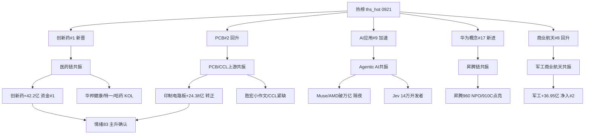

# 2026-09-22 · **群聊情绪共振**

> **数据源新鲜度**: partial(核心双源 L1+L2 全 fresh · weflow 永久下线)
> **降级状态**: 是(WeFlow 下线后最高共振等级=L1+L2, 本日已达 5 主题)
> **置信度**: 0.65

## 一句话结论

主升延续、情绪 82→83：医药链接棒登顶(热榜第一+资金第一+KOL 出海/流感三源全向)，Agentic AI 与昇腾链事件发酵，**半导体链资金背离是当日最大裂缝**。

## 情绪温度与周期

R1 给出主升确认(conf 0.85)：涨停 103 / 炸板率 19.53%(20% 分歧线下方) / 溢价 +3.23%(破 +3% 强线) / 高度 5 板。R3 双源共振后情绪 82 → 83，进入极贪区间上沿。KOL 仓位信号(八成仓/满仓干)与量化主升互相印证，但 XTick 情绪显示 1进2 晋级率仅 19.4% —— **低位接力偏弱、高度集中在 3 进 4 的 100%**，主升是"高位赚钱、低位温吞"的结构。

| 情绪指标 | 数值 | 信号 |
|---|---|---|
| R1 情绪浓度 | 82 | 极贪上沿(80-100 下沿) |
| R3 共振后 | 83 | +2 五主题共振 -1 半导体背离 |
| 五维法校验 | 70 | 差 13<15 不触发校验线, 接近临界 |
| 涨停/跌停/炸板 | 105/2/26 | 炸板率 19.8% < 20% 健康 |
| 连板高度 | 5 板 | 1进2 晋级率 19.4%(低位弱) |
| 北向 | +28.39 亿(5 日连净入) | 33.39→28.39 幅度趋缓 |

## 双源共振五主题

| 排名 | 主题 | 共振等级 | 阶段 | 一句话定性 |
|---|---|---|---|---|
| 1 | 医药链(创新药/流感/CRO/中药) | L1+L2 | middle | 热榜第一+资金第一+KOL 出海/流感, 最强共振 |
| 2 | Agentic AI/决策AI(Jev+Muse) | L1+L2 | early | 隔夜美股强映射, 事件发酵初期 |
| 3 | 国产算力/昇腾链(NPO/910C/万卡) | L1+L2 | middle | 事件密集+光通信资金确认, 硬件强于芯片 |
| 4 | PCB/CCL 上游(电子布/铜箔/钻针) | L1+L2 | middle | 资金转正(+27.37 亿反转), 胜宏小作文催化 |
| 5 | 军工/商业航天 | L1+L2 | middle | 军工资金 +36.95 亿(净入#2), 个股底座弱 |

### 主题1 · 医药链 —— 当日最强共振

热榜上创新药 6→1 新晋榜首(+4.27%)，CRO#5、合成生物#10、细胞免疫治疗#14 全部新进 top20 —— 医药系**霸榜前部**。资金侧同向确认：创新药概念 +42.2 亿(概念净入#1)、医药生物行业 +67.42 亿(行业净入#1)、流感 +28.56 亿、中药 +28.89 亿。KOL 三方向齐发：核心群点名华邦健康(美国财政部放行中国创新药 License·CDMO 弹性)、题材群 5 次刷屏特一药业(流感季)、哈药股份以 surge 98→4 拿下全市场单日最大人气跳升。**三源全向 = 当日最强共振**。

- **大资金意图**: 美国财政部将生物医药新规审查收窄至病原体/可武器化技术，创新药出海 License 风险边际缓和 → 机构借政策预期差回补超跌医药(医药 ETF 30 日仅 +4.05%，位置低)；对手盘是前期的防御盘和观望资金。
- **为什么走强**: 位置(医药为 0921 新启动轮动补涨线, 非高位) + 催化(出海政策边际缓和+流感季 240 亿市场) + 筹码(哈药人气单日跳升 94 位, 百花医药龙虎榜 5 日净买 +2.28 亿) 三维共振。
- **逻辑够不够硬**: 三个独立源(热榜/资金/KOL)+ 一个硬政策锚(美国财政部 License 放行) —— 够硬但存疑点在**持续性**：R1 明确标注医药/地产是轮动补涨，若 0922 医药簇无承接、热榜排名回落，主线宽度将从 20 收缩。证伪路径：创新药跌出热榜前 5 + 医药生物资金转净出。

### 主题2 · Agentic AI/决策AI —— 隔夜新变量

美股 0921 夜盘 Agentic AI 行情重估：Meta Muse 登顶美区 App 免费榜、AMD 市值破万亿、英特尔 +12%、费半 +4.3%。叠加 Jev 决策模型 36 小时 14 万开发者内测、华创计算机当晚开电话会 —— 题材群/核心群/机构群三群齐刷。热榜侧 AI 应用 15→9(+6 名)为当日最大排名加速，人工智能#15 新进。

- **大资金意图**: 美股资金从"GPU 算力"重估到"Agent 任务调度+推理芯片"(CPU 先行)，A 股资金同步寻找决策层 AI 落地标的；对手盘是上一轮 AI 应用套牢盘。
- **为什么走强**: 位置(事件 9/15 发布, 发酵初期) + 催化(隔夜 Muse/AMD 硬映射) + 筹码(华胜天成人气 dc#19+ths#15, 远东股份 surge 69→17)。
- **逻辑够不够硬**: 硬事件锚充分(海外产品爆发是客观数据)，但 A 股决策 AI 标的多为**概念映射**、缺业绩锚；且资金面仅通信/光模块确认(通信设备 +25.99 亿)，半导体链反向流出 —— 分歧中的事件驱动，只做竞价自然走强的弱转强。

### 主题3 · 昇腾链 —— 事件密度最高

昇腾 960 超节点(全球首个 NPO, Hi-ONE 光引擎 7.2T)发布 + 数据港×昇腾 910C 超节点 9/20 点亮 + 华孚时尚阿克苏万卡集群 —— 核心群一天 3 条硬事件。华为概念新进热榜#17。资金侧光通信模块 +32.56 亿、通信设备 +25.99 亿，但华为海思 -26.36 亿、国产芯片 -42.02 亿 —— **链内分裂：光/液冷/IDC 强, 芯片设计弱**。

- **大资金意图**: 华为算力生态从"发布会叙事"进入"超节点点亮"的落地验证期，资金买的是可交付的 IDC/光互联，而非还在流片的芯片；对手盘是前期昇腾主题获利盘。
- **为什么走强**: 位置(事件落地 1-3 日, 非启动早期) + 催化(910C 点亮是硬时间锚) + 筹码(数据港/华孚时尚人气在榜)。
- **逻辑够不够硬**: 硬件事件(超节点点亮)是真实现场，比叙事硬一档；但昇腾链已反复交易数周，middle 阶段需防利好兑现 —— 只做硬件端龙一低吸，不追芯片设计。

### 主题4 · PCB/CCL 上游 —— 资金转正的关键边际

PCB 热榜 5→2 排名回升，资金 0921 大幅转正(印制电路板行业 +24.38 亿，对比前一日 -60 亿净出是**反转**)。核心群东北计算机推 CCL 上游(电子布/铜箔 26Q4-27 全面紧缺、散单 10 月再涨价)、温州宏丰 PCB 钻针(全球唯二)；投研主群流传胜宏科技小作文(北美客户正交背板订单)当日大涨。**做上游(电子布/铜箔/钻针), 不碰存储/封装** —— 存储芯片资金 -40.26 亿、先进封装 -42.78 亿仍在流出。

- **大资金意图**: 0921 资金从芯片链(半导体 -54.87 亿)切向 PCB 上游(印制电路板 +24.38 亿)是"同一 AI 叙事内的再定价"——市场不再为芯片设计付费，转为给紧缺材料(电子布/铜箔/钻针)付费；对手盘是前期 PCB 退潮的获利盘与存储/封装的套牢盘。
- **为什么走强**: 位置(PCB 热榜 5→2 回升，非高位) + 催化(CCL 上游 26Q4-27 紧缺预期 + 散单 10 月涨价 + 胜宏小作文) + 筹码(中材科技 surge 59→7 + 龙虎榜 5 日净买 +5.55 亿)。
- **逻辑够不够硬**: 涨价/紧缺是产业硬逻辑(电子布/铜箔供需缺口)，资金转正是硬数据(前日 -60 亿 → +24.38 亿)，胜宏小作文是情绪催化但**未经公告验证** —— 逻辑硬但处在板块分化区(存储/封装仍流出)，只做上游不碰存储封装。

### 主题5 · 军工/商业航天 —— 资金实但人气弱

军工 +36.95 亿为 0921 概念净入#2，商业航天热榜 12→8 回升(+23.34 亿)，KOL 侧有华如科技军事仿真(特朗普太空军制服事件)。但 attention 无军工个股进人气前排 —— **资金与事件强、个股底座弱**，主升段作补涨观察，不追高。

- **大资金意图**: 军工资金 +36.95 亿(0921 净入#2)是防御+地缘属性下的避险资金回补，叠加商业航天发射事件预期；对手盘是前期军工套牢盘与题材兑现盘。
- **为什么走强**: 位置(军工 ETF 30 日 +6.28% 中位) + 催化(商业航天热榜 12→8 回升 + 特朗普太空军制服事件) + 筹码(attention 无前排人气个股，底座弱)。
- **逻辑够不够硬**: 资金(军工 +36.95 亿/商业航天 +23.34 亿)与热榜双源成立，但缺硬事件锚(无卫星发射/订单公告级催化)且个股人气弱 —— 逻辑中等，作补涨观察不追高。

## 首推票思维链 · 百花医药(600721)

医药链龙二(龙一为创新药热榜第一本身)，CRO+国资重组双属性，人气与资金双证。

- **买入理由**: ①政策锚 —— 美国财政部审查收窄至病原体等敏感技术，CRO/BD 出海 License 恢复是直接受益；②资金锚 —— 东财人气#9+同花顺热股#12 双榜在列，龙虎榜 5 日净买 +2.28 亿；③结构锚 —— 控股股东变更为金华国资，CRO 一体化+MAH 商业化。
- **风险点**: ①医药为轮动补涨线(0921 新启动), 若 0922 医药簇无承接则主线宽度收缩、龙头溢价消失；②CRO 概念 0918 曾掉出热榜 top20, 反复进出说明共识不深；③情绪 82-83 极贪上沿, 炸板率破 25% 或 5 板高标断板则全局降档。
- **止损条件**: 买入价 -7% 硬止损; 0922 若创新药跌出热榜前 5 或医药生物资金转净出, 当日离场(逻辑证伪即出)。
- **可验证假设**: 0922 医药簇涨停家数 ≥8 且创新药保持热榜前 3 → 主线接力成立, 可持有至次日; 若热榜创新药跌出前 5 + 医药资金净出 → 补涨证伪, 隔日走。

## 观察清单(L1_only / L2_only · 不入共振)

| 观察项 | 状态 | 处置 |
|---|---|---|
| 华字辈/中美降税纺织(会晤 9/24) | 情绪+事件, 资金无确认 | 观察不追, 移交 R6 |
| 次新股簇(注册制次新 #1→掉榜) | 退潮确认 | 不做; 中塑 0922 上市不参与 |
| 地产链(万科A/我爱我家) | 人气强, 热榜无条目+资金间接 | 只做地产龙一低吸 |
| 粮食/猪肉(金健米业人气顶格) | 热榜冷却+人气残留 | 出货窗口不是买点 |
| 人形机器人(华昌达/智元 9/24) | L2+R4, 无热榜无资金 | T+2 催化观察 |

## 关键证据

- 证据 1: ths_hot 概念榜 0921: 创新药 #1 新晋(+4.27%)、CRO#5/合成生物#10/细胞免疫#14 新进 · 来源 tushare MCP(0921 vs 0918 diff)
- 证据 2: 创新药概念 +42.2 亿(概念净入#1)、医药生物行业 +67.42 亿(行业净入#1) · 来源 R7 资金面 0921
- 证据 3: 半导体概念 -54.87 亿 / 先进封装 -42.78 亿 / 存储 -40.26 亿, 而 PCB +27.37 亿转正 · 来源 R7 资金面 0921
- 证据 4: KOL 三方向: 华邦健康 CDMO 出海、特一药业流感(5 次刷屏)、Jev/华宇软件、数据港 910C 点亮 · 来源 5 群 591 条
- 证据 5: 哈药股份人气 surge 98→4(全市场最大跳升) · 来源 attention_signals 0921 收盘
- 证据 6: XTick emotion 0921: 涨停 105/跌停 2/炸板 26/最高 5 板/1进2 19.4% · 来源 XTick MCP

## 数据源审计

| 源 | 日期 | 状态 | 备注 |
|---|---|:--:|---|
| R1_style.json | 2026-09-22 | 🟢 | 情绪基线 82 · 主升 conf0.85 |
| wechat_cli_5groups | 2026-09-21 | 🟢 | 591 条 · 5 焦点群(匿名) |
| tushare ths_hot | 2026-09-21 | 🟢 | 20 条 · 场景C 双日 diff |
| attention_signals | 2026-09-21 | 🟢 | 1777 只 persistent · 32 surge |
| R7_capital_flow | 2026-09-21 | 🟢 | 北向 +28.39 亿 · 概念/行业资金流 |
| R4_news | 2026-09-22 | 🟢 | top_events 8 条 |
| xtick_emotion | 2026-09-21 | 🟢 | MCP 直连成功 |
| weflow_analytics | - | 🔴 | ngrok 离线 · 永久下线 |
| manifest/mcp_health | 2026-09-22 | 🟢 | global_severity=2 |

## 不确定性 / 反证

1. **半导体链背离是最硬的反证面**：热榜仍在(存储#6/先进封装#7/芯片#12)但资金 -40~-55 亿流出 —— 热榜在榜≠安全，先进封装 #7 排名回升但资金 -42.78 亿是教科书式 divergence。若 0922 半导体链跌停潮, 情绪 83 将快速回摆至 70 档。
2. 情绪 82-83 已入极贪区间，R1 警示：早盘炸板率破 25% 或 5 板高标断板/天地板 → 主升证伪、仓位降 50%。低位晋级率 19.4% 偏弱，主升结构是"高位赚钱、低位温吞"，一旦高标断板无补位。
3. 医药为轮动补涨(0921 新启动)，持续性未经 0922 承接验证 —— 单日爆发≠主线；创新药热榜第一的"新晋第一"属性按红线不做霸榜出货假设，但也防"一日游"。
4. 美联储 10 月加息概率 56.5%、10Y 美债 5% 附近 —— 若美元/美债再上行压制外资风险偏好，北向 5 日连净入(33.39→28.39 趋缓)可能中断。
5. KOL 仓位高企(八成仓/满仓干)是双刃剑：一致乐观时若主线分歧, 反成踩踏源。

## 与其他 R/D/E 的关系

- 依赖: data/research/20260922/R1_style.json(情绪基线 82) · data/research/20260922/R7_capital_flow_20260922.json(资金交叉) · data/research/20260922/R4_news.json(消息交叉) · data/research/20260921/attention_signals.json(人气底座) · data/raw/20260922/wechat_cli_5groups.jsonl(KOL) · data/raw/20260922/manifest.json(健康度)
- 输出被下游使用: R2 主线板块(热度维 + distribution_alert 透传) · R6 反证(霸榜第一反向论证) · D1 主决策(情绪浓度 + 共振主题候选) · E1 复盘

## Sub-Agent 元数据

- skill: analyze_sentiment_resonance_v1
- artifact: data/research/20260922/R3_sentiment.json + data/research/20260922/hotlist_signals.json
- 生成耗时: 约 12 分钟
- model: deepseek-v4-flash-ga-260731
