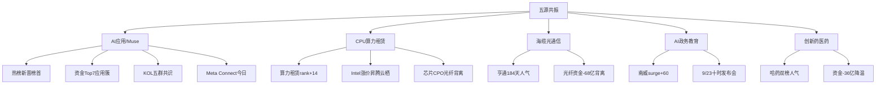

# 2026-09-23 · **群聊情绪共振**

> **数据源新鲜度**: ok
> **降级状态**: true（WeFlow 永久下线 · R1 degraded_flag）
> **置信度**: 0.62
> **情绪浓度**: 71/100（R1 基线 70 + 共振 2 − 背离 1）

## 一句话结论

AI 叙事内部资金再定价——芯片/CPO/光纤 高位流出，AI 应用/传媒/算力租赁 接棒；0923 主线 = **AI 应用（Muse 引爆）+ CPU/算力租赁**，五群共识度极高，但情绪处主升临界，只做资金正向细分。

## 详细分析

**第一层 · 资金在说什么（L1 热榜 + R7 资金）**。0922 收盘热榜榜首易主：AI应用 9→1 新晋第一（3 日 15→1），AI智能体、AI视频、小红书概念同日新进 top20，算力租赁 19→5 排名 +14。R7 资金流给出了更锋利的答案——**0922 资金净流入 Top10 全部是 AI 应用/传媒/数字内容簇**（百度概念 +34.6 亿、互联网服务 +33.3 亿、ChatGPT +30.4 亿、AI智能体 +30.0 亿、AI应用 +28.3 亿），而净流出侧全是芯片/光通信/5G（半导体 −74 亿、CPO −74 亿、光纤 −68 亿、通信技术 −126 亿）。这不是普涨，是**同一 AI 叙事内的结构切换：硬件（芯片/CPO/PCB）→ 应用/租赁/智能体**。北向 5 日连净入（0922 +29.1 亿）托底整体风险偏好。

**第二层 · 群里在喊什么（L2 KOL 五群）**。五群 574 条消息的方向高度收敛于一条主线：**Meta Muse AI Agent**。颜晓滨"崩溃式上涨见证历史、AI 刹车解除、大盘冲击 4000 点"，五群同时转发"Muse 引爆、CPU 先行、推理芯片是第二主线"，国金/华泰/天风三家卖方密集输出 CPU 涨价逻辑（Intel 年内第四次涨价、Muse 每用户 2 核 8GB+100GB 云资源），国联民生把 Muse 与云栖大会（最强国产芯片/10 万亿参数/20GW 数据中心）绑定，华菱线缆海缆红包双群刷屏，AI+政务/教育强国（9/23 10 时国新办发布会）两群提及。**共识度之高为近月罕见，但情绪偏热与盘面广度恶化（0.78）存在张力**——喊满仓的人可能也在观望。

**第三层 · 共振主题怎么排（L1+L2 双源）**。① **AI应用/Muse**（热榜#1+资金 Top7+五群共识+R4 今日 Meta Connect 9/23-24 事件）= 五源全向最强，middle（发酵中续催化）；② **CPU/算力租赁/昇腾**（算力租赁 rank+14 资金正向+Intel 涨价/云栖/DeepSeek 昇腾）= middle，但只做资金正向细分，芯片/CPO/光纤不碰；③ **海缆/光通信**（亨通 184 天持久人气+华菱红包）= middle 但**光纤 −68 亿流出是硬伤**，竞价资金不转正则降级；④ **AI+政务/教育强国**（南威 surge+60、旋极 +20% 涨停、9/23 10 时发布会事件）= early，事件兑现须防见光死；⑤ **创新药**（热榜#2+哈药双榜）= middle 但资金 −36 亿、哈药 2 日涨停高位，R1 判轮动补涨，只做低位细分。

**第四层 · 情绪浓度怎么算**。R1 基线 70（连板情绪型临界：涨停 63 收缩 39%、炸板率 22.22% 回临界带、溢价 +2.60% 破强线、广度 0.78 恶化、高度 6 板首次突破）→ 五主题 L1+L2 共振 +2 → 算力硬件/创新药热榜在榜 vs 资金流出（板块内背离）−1 = **71**。五维法校验 61，差 10 < 15 不触发校验线；情绪真实强度在 61-71 之间，主升临界不追高、不恋战。

## 关键证据

- 证据 1: AI应用 9→1 新晋热榜榜首，概念资金 +27 亿 · 来源 ths_hot + moneyflow_cnt_ths 0922
- 证据 2: R7 资金净流入 Top10 全为 AI应用/传媒簇（百度概念 +34.6 亿居首），净流出为芯片/光通信（半导体 −74 亿/光纤 −68 亿）· 来源 R7_capital_flow
- 证据 3: 五群 KOL 共识 Meta Muse（颜晓滨"崩溃式上涨"/CPU先行/国金 Intel 涨价/华泰 CPU 重估/国联民生 Muse+云栖）· 来源 wechat_cli_5groups 574 条
- 证据 4: R4 top_events 8 条全 high 正面（Muse 登顶+Meta Connect 9/23-24、Intel CPU 涨价、云栖大会、DeepSeek 昇腾、存储涨价、中美缓和）· 来源 R4_news
- 证据 5: 南威软件 surge 76→16（单日 +60 位最大跳升）、旋极信息 first_entry +20% 涨停、亨通光电 persistent 184 天 · 来源 attention_signals 0922
- 证据 6: 北向 5 日连净入（0922 +29.1 亿），机构专用席位净卖 −5.13 亿 · 来源 R7 hot_money/northbound

## 数据源审计

| 源 | 状态 | 抓取时间 | 记录数 | 备注 |
|---|---|---|---|---|
| 同花顺热榜（概念板块） | 🟢 | 2026-09-22 22:30 | 20 | T-1 baseline（场景C），0918 三日校验 |
| 东财人气榜（A股） | 🟢 | 2026-09-22 22:30 | 100 | 个股人气三日 diff |
| 概念资金流 THS | 🟢 | 2026-09-22 19:00 | 387 | 应用簇流入/芯片链流出 |
| KOL 五群 | 🟢 | 2026-09-23 06:45 | 574 | 5/5 群全可用（核心群 68/题材群 165/机构群 8/盘中群 167/专注核心 166） |
| 多平台人气管道 | 🟢 | 2026-09-22 收盘 | 1782 | persistent/surge/cross_platform |
| R1 风格基线 | 🟡 | 2026-09-23 07:10 | — | complete（degraded_flag·美股0922夜盘缺失）· score 70 |
| R7 资金面 | 🟢 | 2026-09-23 07:13 | — | complete · 北向 +29.1 亿 |
| R4 消息面 | 🟢 | 2026-09-23 07:13 | 8 事件 | 全 high 正面 |
| WeFlow | 🔴 | — | — | 永久下线 2026-08-19 |

## 不确定性 / 反证

1. **算力硬件链背离是最核心风险**：芯片概念（−278 亿）、CPO（−194 亿）、PCB（−108 亿）、光纤（−68 亿）热榜在榜但资金大幅流出——"热榜在榜≠安全"，若 0923 AI 应用接棒不及预期（竞价无溢价、炸板率破 25%），主线内部无承接，市场可能从聚焦上涨直接转普跌（R1 警示）。
2. **KOL 情绪偏热 vs 盘面广度恶化**：颜晓滨"满仓搞了/冲击 4000 点" vs 全市场涨跌比 0.78 跌多涨少——喊多的人自己可能在观望；0923 若高开低走就是利好兑现信号。
3. **海缆/创新药是"人气在榜但资金先撤"形态**（20260915 教训：人气未散资金先撤 = 退潮前兆），两主题均需竞价资金转正确认，否则降级观察。
4. **6 板高标（算力基建簇 8 天 6 板）与高位接力获利盘（非 ST 三板以上 30 日 +229%）极端丰厚**：一旦断板/天地板，高位链上端断裂回撤剧烈。
5. **美股 0922 夜盘未知**（tushare 仅到 0921 美东周一），隔夜方向是 0923 的未知数；A50 夜盘 +0.33% 略偏多。

## 与其他 R/D/E 的关系

- 依赖: `R1_style.json`（情绪基线 70）· `attention_signals.json`（人气底座）· `R7_capital_flow.json`（资金背离判定）· `R4_news.json`（事件催化）· `hotlist_signals.json`（R3 内联生成）
- 被消费: D1（canghai-plan 情绪浓度/共振主题输入）· R6（反证：哈药高位/海缆背离/算力硬件背离移交）· E1（复盘对照）

## 共振图谱

## 首推票思维链（南威软件 603636 · AI+政务/传媒数字要素）

**买入理由**: 单日人气 surge 76→16（+60 位，全市场最大跳升）+ 5 天上榜新贵；沪股通专用席位净买 7.59 亿大名单在列；政务软件 + 财税数字化 + AI+政务 三重标签，今日 10 时国新办教育强国发布会是直接事件窗口；主板标的（无 20cm/无 688 前缀）符合仓位纪律。**大资金意图**: 资金从算力硬件高位撤出后，选择互联网服务（+33.3 亿 #2）作为 AI 应用落地的承接方向，南威是政务 AI 细分里人气最集中的卡位票。**为什么走强**: Muse 引爆的 Agent 叙事向 B 端政务场景扩散（AI 办公提效会议 + 国新办发布会双事件），低价 + 小盘 + 政务概念辨识度，散户/游资合力抬人气。**逻辑够不够硬**: 事件驱动型逻辑（今日发布会）+ 资金/人气双确认，够硬但属"发布会前抢跑"，兑现后须防见光死。

**风险点**: ① 事件票属性——发布会若平淡或高开无溢价，直接杀预期；② 板块内竞争——旋极信息（+20% 涨停 20cm）抢走弹性资金，南威若竞价弱于旋极则退居二线；③ R1 主升临界——炸板率破 25% 全场降档，事件票先杀。**止损条件**: 买入价 −5% 硬止损（或跌破 9/22 涨停启动平台 7.45 一线离场）；竞价高开 > +5% 无回封不追（事件票高开无溢价 = 预期已兑现）。**可验证假设**: 0923 竞价溢价 > +3% 且 10 时发布会前后 30 分钟封板/放量上攻 = 事件兑现；若发布会后 30 分钟走弱或炸板率破 25%，证伪即出，隔日不恋战。

## 五主题三问速览（大资金意图 / 为什么走强 / 逻辑够不够硬）

| 主题 | 大资金意图 | 为什么走强 | 逻辑够不够硬 |
|---|---|---|---|
| AI应用/Muse | 算力硬件高位兑现后，资金切应用/传媒做 AI 落地 | Muse 登顶 + 今日 Meta Connect 连续催化 | 五源共振最硬，middle 发酵中 |
| CPU/算力租赁 | Intel 涨价 + Muse 云资源 = CPU 新增量 | 卖方四群刷屏 + 算力租赁 rank+14 资金正向 | 硬，但只做资金正向细分 |
| 海缆/光通信 | Meta Petal 海缆 = 算力互联新叙事 | 亨通 184 天人气 + 华菱双群红包 | 资金 −68 亿背离是硬伤，须竞价转正 |
| AI+政务/教育 | 事件驱动抢跑，Agent 向政务落地 | 南威 surge+60 + 今日 10 时发布会 | 事件票够硬但兑现即见光死 |
| 创新药/医药 | 轮动补涨尾声，资金 −36 亿撤出 | 哈药双榜人气惯性 + CRO 补涨 | 高位降温，只做低位细分 |

## Sub-Agent 元数据

- skill: analyze_sentiment_resonance_v1
- artifact: data/research/20260923/R3_sentiment.json
- 生成耗时: 约 8 分钟
- model: deepseek-v4-flash-ga-260731
