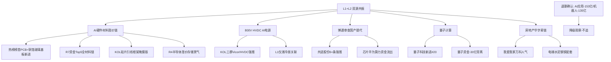

# 2026-09-24 · **群聊情绪共振**

> **数据源新鲜度**: ok
> **降级状态**: true（WeFlow 永久下线 · R1 degraded_flag · 热榜场景C）
> **置信度**: 0.64
> **情绪浓度**: 49/100（R1 基线 48 + 共振 3 − 背离 2）

## 一句话结论

AI 叙事内部资金再定价第二轮——0922 应用接棒硬件，0923 资金切回 **硬件材料涨价链（PCB/PET铜箔/玻璃基板/先进封装/MLCC/硅片）**，这是 0924 唯一四源同向的硬主线；AI应用/算力/机器人热榜在榜但资金大幅流出 = 退潮确认，只做材料链龙一/龙二低吸。

## 详细分析

**第一层 · 资金在说什么（L1 热榜 + R7 资金）**。0923 收盘热榜榜首再次易主：**PCB概念 3→1 新晋第一（+1.39%），PET铜箔 #2、玻璃基板 #3、先进封装 #8 同日新进 top20**，MLCC #5 升位、存储 #7 持平——热榜前 8 有 7 席是硬件材料链。R7 资金给出同样的答案：**主力净流入 Top5 全部是材料链**（复合集流体 +19.72 亿 #1、玻璃基板 +12.69 亿 #2、先进封装 +10.95 亿 #3、MLCC +9.37 亿 #4、光刻机 +9.21 亿 #5），概念资金侧先进封装 +47 亿/PCB +22 亿/MLCC +18 亿/PET铜箔 +12 亿/存储 +14 亿全正向。**同一时间 AI应用 1→12 大幅回落 + 概念资金 −153 亿、机器人概念 −135 亿、算力租赁 −71 亿**——0922 的 AI 应用主线确认退潮，资金在 AI 叙事内部第二次再定价：从应用/算力切回上游材料涨价链。北向 0923 净买 23.65 亿（5 日均 28.11 亿）持续托底。

**第二层 · 群里在喊什么（L2 KOL 五群）**。五群 456 条消息，仓位情绪从 0922 的\"满仓搞了\"明确转为**轻仓观望**（核心群诸葛大卫 15:47：\"上证震荡修整、箱体整理、量能未放、无突破动能，建议轻仓观望、不追涨、不急跌、静待方向明确\"）——与量化退潮（溢价转负/炸板率破线）共振向下。方向上仍聚焦科技硬件链细分：**800V HVDC/Vicor**（三群反复推，维谛专家 Rubin 机柜 90% 用 HVDC、26Q4 小批量 27 大批量）、**半导体材料涨价**（12 英寸硅片 +50%、引线框架康强 yoy+79%、空白掩膜版国产替代）、**量子计算**（IonQ 实时量子纠错突破，格尔软件辨识度高\"拉板容易爆\"）、**博通审查→国产替代**（共进股份白盒交换机 6+ 条强推、金字火腿 DSP）、**VNA 矢量网络分析仪**（新分支，东方中科/优利德/普源）、**3D 打印 PLA**（金丹/恒鑫/惠通）、**算力租赁涨价**（10/1 海外租金 +17-21%）。切出方向：地产华字辈（科技泡沫还得是房地产）、黄酒（会稽山翻倍→广东明珠）、券商互金（港股延长时间\"板上钉钉\"）。

**第三层 · 共振主题怎么排（L1+L2 双源）**。① **AI硬件材料涨价链**（热榜榜首 PCB + 新进 PET铜箔/玻璃基板/先进封装 + R7 资金 Top5 全材料链 + KOL 硅片/引线框架/掩膜版 + R4 半导体涨价/存储景气）= 四源同向最强，middle；② **800V HVDC/AI电源**（KOL 三群强共振，但 L1 仅液冷 #17 弱关联）= early，事件驱动须竞价转正；③ **半导体国产替代·博通审查**（芯片 #11 + KOL 多群 + R4 policy）= early，但芯片/华为/算力资金流出是硬伤；④ **量子计算**（量子科技新进 #20 + KOL 多群 IonQ）= early，量子 −30 亿背离；⑤ **房地产/华字辈链**（我爱我家 #4/万科A #8 人气 + 电梯水泥钢铁配套）= middle，仅个股人气层 L1。另有券商（央行放水 + 港股延长时间）与机器人（马斯克 1000 亿台）有 R4 事件但无 L1 热榜，放观察不入共振。

**第四层 · 情绪浓度怎么算**。R1 基线 48（震荡分化偏退潮：涨停 51 收缩、跌停 13 暴增 333%、炸板率 33.77% 破 25% 线、溢价 −0.37% 转负 9 月首次、高度 6→4、广度 0.53）→ 五主题 L1+L2 共振 +3（硬主题仅材料链 1 个）→ AI应用/机器人热榜在榜 vs 资金大幅流出（退潮前兆）−2 = **49**。五维法校验 48，差 1 < 15 不触发校验线；情绪真实强度 ≈ 48-49，中性偏冷，与退潮确认日匹配，仓位上限维持 0.45 或更低。

## 关键证据

- 证据 1: PCB概念 3→1 新晋热榜榜首，概念资金 +22 亿；PET铜箔/玻璃基板/先进封装同日新进 top20 · 来源 ths_hot + moneyflow_cnt_ths 0923
- 证据 2: R7 主力净流入 Top5 全为材料链（复合集流体 +19.72 亿 #1/玻璃基板 +12.69 亿 #2/先进封装 +10.95 亿 #3/MLCC +9.37 亿 #4/光刻机 +9.21 亿 #5）· 来源 R7_capital_flow
- 证据 3: AI应用 热榜 1→12 大幅回落 + 概念资金 −153 亿（0923 净流出前列）、机器人概念 −135 亿、算力租赁 −71 亿 = 退潮确认 · 来源 ths_hot + R7
- 证据 4: 五群 KOL 轻仓观望定调（诸葛大卫\"箱体整理/量能未放/静待方向\"）+ 800V HVDC/材料涨价/量子/博通替代多群发酵 · 来源 wechat_cli_5groups 456 条
- 证据 5: 超声电子 surge 58→6（+52）、太极实业 surge 85→13（+72）、中一科技/江南新材 first_entry，万科A cross_platform avg5.0 · 来源 attention_signals 0923
- 证据 6: R4 E001 央行 8000 亿 MLF + 万亿逆回购（券商/大金融）、E003 12 英寸硅片涨价 15-50%、E006 博通审查国产替代、E008 美股隔夜大跌费半 −2.02%（AI 算力全链负面）· 来源 R4_news

## 数据源审计

| 源 | 状态 | 抓取时间 | 记录数 | 备注 |
|---|---|---|---|---|
| 同花顺热榜（概念板块） | 🟢 | 2026-09-23 22:30 | 20 | T-1 baseline（场景C）0923 vs 0922 |
| 东财人气榜（A股） | 🟢 | 2026-09-23 22:30 | 100 | 个股人气双日 diff |
| 概念资金流 THS | 🟢 | 2026-09-23 19:00 | 387 | 材料链正向/应用算力机器人流出 |
| KOL 五群 | 🟢 | 2026-09-24 06:46 | 456 | 5/5 群全可用（颜晓滨 73/题材 114/核心 136/机构 7/盘中 126） |
| 多平台人气管道 | 🟢 | 2026-09-23 收盘 | 1785 | persistent 1785/surge 31/cross_platform 53 |
| R1 风格基线 | 🟡 | 2026-09-24 07:13 | — | complete（degraded_flag·美股0923夜盘缺失）· score 48 |
| R7 资金面 | 🟢 | 2026-09-24 07:16 | — | complete · 北向 +23.65 亿 · 材料链 Top5 |
| R4 消息面 | 🟢 | 2026-09-24 07:18 | 8 事件 | 央行放水/半导体涨价/博通审查/机器人/美股大跌 |
| WeFlow | 🔴 | — | — | 永久下线 2026-08-19 |

## 不确定性 / 反证

1. **退潮确认环境是最大背景约束**：R1 明确 0923 为 9 月首次\"溢价转负 + 炸板率破 25% 线\"双确认的高位震荡，跌停 13 家暴增 333%——即使材料链资金强，若 0924 炸板率破 40% 或高标断板，降档崩溃退潮型，一切共振主题先杀。
2. **唯一硬共振=材料链，其余 4 主题均带背离或 L1 弱支撑**：800V HVDC（仅液冷 #17 弱关联）、博通替代（芯片/华为/算力 −48/-138/-98 亿流出）、量子（−30 亿）、地产（仅个股人气层）——\"热榜在榜≠安全\"（20260915 教训），竞价资金不转正则全部降级观察。
3. **AI应用/机器人/算力是\"人气在榜但资金先撤\"形态**：AI应用 1→12 + −153 亿、机器人 −135 亿、算力租赁 −71 亿——这是退潮前兆最典型形态，09/17、09/22、09/23 连续第三次实战确认，严禁抄底高位回流。
4. **KOL 谨慎 vs 部分主题炒作热度背离**：群里 800V/量子/博通替代讨论火热，但诸葛大卫明确定调轻仓观望——喊题材的人自己在降仓位；退潮期题材讨论多 = 分歧大而非共识强。
5. **美股隔夜大跌（E008：纳指 −1.14%、费半 −2.02%、A50 夜盘 −0.50%、美联储 10 月加息概率 69.7%）**：外盘转弱是 0924 低开的主因之一，材料链若高开低走即证伪；半导体链情绪锚（费半）转负需警惕。

## 与其他 R/D/E 的关系

- 依赖: `R1_style.json`（情绪基线 48·退潮确认）· `attention_signals.json`（人气底座）· `R7_capital_flow.json`（材料链资金确认/应用机器人背离）· `R4_news.json`（事件催化）· `hotlist_signals.json`（R3 内联生成）
- 被消费: D1（canghai-plan 情绪浓度/共振主题输入·唯一硬主线=材料链）· R6（反证：AI应用退潮/机器人背离/800V HVDC 无 L1 确认移交）· E1（复盘对照）

## 共振图谱

## 首推票思维链（康强电子 002119 · AI硬件材料涨价链·先进封装/引线框架）

**买入理由**: 东财人气榜 dc #2（新进 top10，+10.01% 涨停）+ 引线框架景气第一梯队（26H1 营收 10.3 亿 yoy+79%，雲山群 KOL 点名）+ 先进封装概念资金 +47 亿全市场最强 + 机构专用席位净买（R7 hot_money 10.28 亿含 002119）+ 主板标的（无 20cm/无 688 前缀）符合仓位纪律。**大资金意图**: 0923 资金再定价明确切向硬件材料链——先进封装/引线框架是 AI 芯片功耗提升的直接受益环节（功率芯片需求大增 + 外资头部出清），康强是材料链里人气 + 资金 + 机构三合一的卡位票。**为什么走强**: 12 英寸硅片涨价 +50% 引爆半导体材料全面涨价叙事（R4 E003），引线框架/封装板块全线大涨，康强作为封装材料核心标的率先涨停 + 人气登顶。**逻辑够不够硬**: 涨价 + 业绩 + 资金三重确认，属材料链中段兑现逻辑，够硬但已在涨停位，须低吸不追高。

**风险点**: ① 退潮环境——若 0924 炸板率破 40% 全场降档，涨停票次日溢价最脆弱；② 高位接力——+10% 涨停后次日竞价若高开 > +5% 无回封即兑现；③ 板块内竞争——超声电子（surge +52）同属 PCB/材料链，若竞价弱于对手则退居二线。**止损条件**: 买入价 −5% 硬止损（或跌破 9/23 涨停启动平台 24.5 一线离场）；竞价高开 > +5% 不追（材料链退潮环境高开 = 兑现盘）。**可验证假设**: 0924 材料链竞价溢价 > +3% 且 10 点前封板/放量上攻 = 主线延续；若材料链高开低走或炸板率破 40%，证伪即出，隔日不恋战。

## 五主题三问速览（大资金意图 / 为什么走强 / 逻辑够不够硬）

| 主题 | 大资金意图 | 为什么走强 | 逻辑够不够硬 |
|---|---|---|---|
| AI硬件材料涨价链 | 应用/算力高位兑现后，资金切上游材料涨价 | 12 英寸硅片涨价 50% + 热榜榜首 + 资金 Top5 全材料链 | 四源同向最硬，middle 兑现阶段 |
| 800V HVDC/AI电源 | Vicor 上调指引 = AI 电源景气拐点 | KOL 三群反复推（Rubin 90% 用 HVDC） | 事件硬但缺 L1/资金确认，须竞价转正 |
| 博通审查国产替代 | 国产交换机/DSP 替代博通份额 | FT 消息 + 共进股份 6+ 条强推 | 事件驱动硬，但芯片/华为资金流出是硬伤 |
| 量子计算 | IonQ 实时纠错 = 商业化里程碑 | 量子科技新进 #20 + KOL 多群 | 事件硬但量子 −30 亿背离，博弈票 |
| 房地产华字辈链 | 科技退潮防御 + 华字辈玄学扩散 | 我爱我家/万科人气 + 电梯水泥钢铁配套 | 仅个股人气层 L1，防御轮动属性 |

## Sub-Agent 元数据

- skill: analyze_sentiment_resonance_v1
- artifact: data/research/20260924/R3_sentiment.json
- 生成耗时: 约 8 分钟
- model: deepseek-v4-flash-ga-260731
