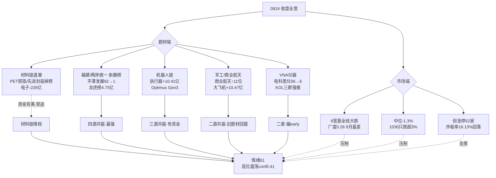

# 2026-09-25 · **群聊情绪共振**

> **数据源新鲜度**: ok
> **降级状态**: degraded（WeFlow 永久下线 · 场景C 热榜 T-1 baseline）
> **置信度**: 0.68

## 一句话结论
材料链退潮、福建/统一事件驱动新霸榜、机器人链资金真流入，情绪 61 高位震荡中性偏谨慎。

## 详细分析

**① 市场结构一夜切换：材料涨价链退潮确认，福建/统一主题接棒。**
0923 还是 PCB/PET铜箔/玻璃基板/MLCC/先进封装热榜+资金双霸的"唯一硬主线"，0924 收盘后这 6 个材料板块全部掉榜或排名骤降（PET铜箔 2→出榜、先进封装 8→出榜、玻璃基板 3→12、MLCC 5→11、PCB 1→3），R7 资金端同步确认：电子行业 -228.76 亿、PCB -74.13 亿、半导体 -93.21 亿、CPO 概念 -296 亿大幅流出，超声电子（PET铜箔人气票）跌停、沃格光电 0923 人气#3 → 0924 掉出榜单。这是标准的高位材料链退潮，KOL 虽仍有 CoWoS/玻璃基板/1.6T DSP 的研报转发（消息还在），但资金用脚投票——按纪律，材料链只保留康强电子（先进封装引线框架，dc#3/ths#2 双源硬人气）进候选，其余不可追。

**② 福建/两岸统一主题 = 0925 唯一四源同向新主线（事件驱动第一天）。**
催化源头是 R4 E002 中美元首会晤收官（特朗普称"伟大的会晤"），叠加两岸统一预期。L1 热榜概念#1 海峡两岸（新晋）+ #2 福建自贸区（新晋）；个股人气榜平潭发展 0923 rank90 → 0924 rank1（+10% 涨停），雷科防务#2、海峡创新#4（20cm）、福建水泥#11、厦门港务#28；飙升榜路桥信息 30cm#1（北交所福建）、铁拓机械#3；龙虎榜开源西安西大街席位 +10.27 亿集中买福建票、平潭发展 net_buy 4.75 亿居首；KOL 群B（题材群）全天最强推——国统股份（国家统一）/福建水泥/平潭发展/台华新材（台湾+华字辈）/厦门港务/新华都/国航远洋（台湾客轮+中美贸易+唯一30cm）。四源（热榜+人气+龙虎榜资金+KOL）高度同向，是 0925 最强新主题。但注意：这是事件驱动第一天、霸榜第一的海峡两岸板块指数当日收跌 -0.28%（热度>价格），情绪高标独走而板块未扩散，需次日验证是否成真主线，谨防高开兑现。

**③ 机器人链（Optimus Gen3）是唯一有真金白银流入的成长主线。**
KOL 群C/群D 全天刷屏：国盛张一鸣"节前积极配置机器人（Optimus 将是27年最大科技单品）"、Optimus Gen3 碳纤维骨架减重 33%、T 链审厂进度（震裕线性执行器 Tier1/均胜审厂通过/拓普三花维持 Tier1 + 新订单 5000-6000 部）、轴承涨停潮（襄阳轴承 10cm/洛轴股份 20cm/苏州股份 30cm）。L1 热榜人形机器人 rank13→9 ↑4；R7 资金机器人执行器 +10.41 亿 rank2、减速器 +6.38 亿 rank4、汽车零部件行业 +9.9 亿 rank1。KOL+热榜+资金三源同向，与 0924 普跌退潮完全独立的逻辑，是 0925 值得重点博弈的方向（核心票：洛轴股份/襄阳轴承/中马传动/均胜电子）。

**④ 军工/商业航天（L1+R7 二源）+ VNA 仪器国产替代（KOL 强推+人气跃升）为次级共振。**
商业航天热榜 rank18→7 ↑11（全场最强加速）且 R7 大飞机 +10.47 亿 rank1、空间站 +8.14 亿、卫星导航 +5.92 亿、军工电子 +7.5 亿资金流入，但 KOL 仅情绪面（长征电视剧），属 L1+R7 二源、旧题材回摆，强度中。VNA 矢量网络分析仪是 KOL 群B/C/D 三群反复强推的新题材（雷科防务恒达微波/电科思仪 20cm/振芯科技/同惠电子/海特高新/新劲刚），电科思仪人气 0923 rank56 → 0924 rank6 跃升 50 位、霍莱沃 20cm 飙升#9，但 L1 无板块级热榜、R7 无直接资金确认，仅二源且偏 early——题材新但证据面薄，情绪高标独走，不宜追后排。

**⑤ 情绪浓度 61：接力端修复（炸板率 16.13%/溢价+0.55%/高度 5 板）+ 市场端 9 月最差（广度 0.26/8 宽基全线大跌）的结构性热+全局性冷。**
R1 基线 58（高位震荡 conf0.41）+ 共振加成 +5（2 条硬主题 ×2 + 2 条次级 ×1.5，退潮收敛取温和值）- 出货扣减 -2（哈药股份 ths 热股#1+dc 人气#7 但跌停 -9.96% = hard L4 出货警报，移交 R6 反证）= 61。score_5d 五维校验 56，差 5<15 不触发校验线，两者同向=中性偏谨慎。KOL 仓位态度转积极（Jason 14:34"缩量下跌 抛压不重 继续加仓"，与 0923"轻仓观望"对比），但量化市场端 9 月最差——KOL 聚焦的是个股抱团机会，不是全市场贝塔。

## 主题结构图

## 推理深度三问（Top 分析对象）

### 福建/两岸统一（四源共振 #1）
- **大资金意图**: 中美元首会晤收官（R4 E002）制造了两岸缓和+统一预期的宏观事件窗口，游资（开源西安西大街席位 +10.27 亿）抢在事件落地日集中买入福建/统一概念，平潭发展龙虎榜 net_buy 4.75 亿居首——这是事件驱动型资金，目标是抢题材首日发酵，对手盘是次日接力的跟风资金。
- **为什么走强**: 位置——平潭发展 0923 还是 rank90 的人气杂毛（-7.21%），0924 直接涨停 rank1，属于低位+事件共振的弱转强；催化——中美会晤是硬时间锚；筹码——龙虎榜机构+游资双买，且福建板块集体涨停（福建水泥/厦门港务/漳州发展/新华都）形成板块效应，不是单票独走。
- **逻辑够不够硬**: 4 个独立源同向（热榜+人气+龙虎榜资金+KOL）是 0925 最强的共振，但硬事件锚是"会晤收官"这种一次性事件，没有业绩/政策持续性锚；证伪路径=次日高开无承接、板块指数继续收跌（0924 海峡两岸指数已 -0.28%，热度>价格），一旦 0925 高开兑现即一日游。

### 机器人链 Optimus Gen3（三源共振 #2）
- **大资金意图**: 机构资金在低位布局机器人执行器/减速器（R7 执行器 +10.41 亿 rank2、减速器 +6.38 亿 rank4），逻辑是 Optimus Gen3 量产爬坡（国盛张一鸣"10 月爬坡斜率陡峭"）+ T 链审厂确认订单（震裕/均胜/拓普/三花 Tier1 + 新订单 5000-6000 部）——这是产业逻辑驱动而非纯情绪，对手盘是尚未进场的犹豫资金。
- **为什么走强**: 位置——轴承/减速器个股（洛轴股份/襄阳轴承/中马传动）处于题材发酵中段，30 日未翻倍；催化——Gen3 碳纤维骨架减重 33% 是硬产品迭代+花旗 2027/2028 年 10 万/30 万台出货预测；筹码——多票涨停形成板块效应（10cm/20cm/30cm 全有）。
- **逻辑够不够硬**: 3 源同向（KOL+热榜+R7 资金）且有产业事件锚（审厂/出货目标），但高位震荡期（conf0.41）题材分歧大，证伪路径=高标断板或 R7 次日资金转为净流出。

### 哈药股份（hard L4 出货警报）
- **大资金意图**: 无。ths 热股#1 + dc 人气#7 是散户接盘热度的顶点信号，而当日 -9.96% 跌停说明大资金在借人气出货，创新药链（CRO rank9→18）同步崩。
- **为什么走弱**: 位置——高位滞涨后跳水；催化——无新增负面事件，纯获利盘兑现+人气见顶；筹码——跌停出货无法承接。
- **逻辑够不够硬**: 出货判定硬（热榜第一+跌停+板块同步），移交 R6 反证，不进入任何正向共振。

## 首推票思维链

### 平潭发展 000592.SZ（福建/统一龙头）
- **买入理由**: ① 产业逻辑——福建自贸区+两岸统一预期核心标的，中美会晤收官直接催化；② 数据锚——dc 人气 0923 rank90 → 0924 rank1，龙虎榜 net_buy 4.75 亿居首，开源西安西大街席位 +10.27 亿集中买入，板块效应（福建水泥/厦门港务/漳州发展/新华都同步涨停）。
- **风险点**: ① 短期——事件驱动首日，海峡两岸指数 0924 收跌 -0.28%，热度>价格，次日高开无承接即兑现；② 中期反证——事件一次性，无持续催化则 2-3 日退潮；高标抱团瓦解时普跌补跌无承接。
- **止损条件**: 买入价 -7% 硬止损；或跌破 0924 涨停实体（8.78 元）且 30 分钟不收回；或板块内福建水泥/厦门港务任一断板即减仓。
- **可验证假设**: 0925 竞价高开 3% 以上且 10:00 前封板=四源共振兑现（验证成功）；若高开 5% 以上 30 分钟内炸板不回封=事件一日游（证伪，立即离场）。

### 洛轴股份 301699.SZ（机器人轴承 20cm）
- **买入理由**: ① 产业逻辑——T 链审厂+轴承涨停潮核心（襄阳轴承 10cm/洛轴 20cm/苏州 30cm 梯队），Optimus Gen3 量产爬坡直接受益；② 数据锚——dc 人气#23，R7 减速器 +6.38 亿/执行器 +10.41 亿资金流入，KOL 群D 晟罡 10:29 点名"20cm 洛轴股份涨停"。
- **风险点**: ① 短期——20cm 高波动，炸板回撤 10%+；高位震荡期题材分歧；② 中期反证——机器人链若无持续审厂/订单催化，情绪退潮后回吐快；R7 资金次日转负即证伪。
- **止损条件**: 买入价 -10% 硬止损（20cm 票放宽）；或跌破涨停开盘价且 60 分钟不回封。
- **可验证假设**: 0925 机器人板块涨停家数 ≥5（梯队延续）=三源共振兑现；若襄阳轴承/中马传动集体断板而洛轴独强=孤立高标，次日补跌风险大（降级 watch）。

### 康强电子 002119.SZ（先进封装唯一双源硬人气）
- **买入理由**: ① 产业逻辑——先进封装引线框架，CoWoS 扩产+台积电 2027 涨价 3-6% 逻辑仍在；② 数据锚——dc#3/ths#2 双源在榜（avg_rank 2.5 全场第一），0923/0924 连续两日 rank2/3 稳定，是材料链退潮中唯一资金未撤的票。
- **风险点**: ① 短期——材料链整体退潮（R7 半导体 -93 亿），康强是逆势孤票，板块无合力；② 中期反证——若先进封装逻辑证伪（CoWoS 扩产不及预期），补跌空间大。
- **止损条件**: 买入价 -7% 硬止损；或跌破 5 日线且 R7 先进封装资金连续 2 日净流出。
- **可验证假设**: 0925 若材料链继续下跌而康强独立走强（分歧转一致）则验证；若随板块补跌破 29.61 元涨停价则材料链退潮深化（证伪）。

## 关键证据

- 证据 1: 材料链全线退潮——PET铜箔/先进封装掉出热榜top20，R7 电子-228.76亿/PCB-74.13亿/半导体-93.21亿，超声电子跌停 · 来源 tushare ths_hot diff + R7_capital_flow
- 证据 2: 福建/统一四源共振——海峡两岸概念热榜#1(99274.5热)+平潭发展dc人气92→1+龙虎榜4.75亿+开源西安西大街+10.27亿+KOL群B全天强推 · 来源 dc_hot/ths_hot/R7/R4 E002/群聊
- 证据 3: 机器人链资金真流入——R7 机器人执行器+10.41亿/减速器+6.38亿/汽车零部件+9.9亿，人形机器人热榜↑4，KOL 5群刷屏 Optimus Gen3+审厂 · 来源 R7_capital_flow + 群聊
- 证据 4: 哈药股份 hard L4 出货——ths热股#1+dc人气#7+跌停-9.96%，创新药链崩(CRO rank9→18) · 来源 ths_hot/dc_hot
- 证据 5: 商业航天热榜加速↑11 + R7 大飞机+10.47亿/军工电子+7.5亿资金流入 · 来源 ths_hot diff + R7_capital_flow

## 数据源审计

| 源 | 日期 | 状态 | 备注 |
|---|---|---|---|
| 群聊5群 | 2026-09-24 | 🟢 | 253 条 · 5/5 群可用(匿名: KOL群A-E) |
| THS热榜 | 2026-09-24 | 🟡 | 60 条 · 场景C T-1 baseline 0924vs0923(盘前当日未生成) |
| DC人气榜 | 2026-09-24 | 🟢 | 200 条 · 双日 rank diff |
| 板块资金流 | 2026-09-24 | 🟢 | 387 条 · 全市场普跌 |
| attention人气管道 | 2026-09-24 | 🟢 | 1865 条 · persistent1789/surge19/cross57 |
| R7资金面 | 2026-09-24 | 🟢 | resolved 0924 · degraded=false |
| R4消息面 | 2026-09-24 | 🟢 | 8 事件 · degraded=true |
| R1风格 | 2026-09-24 | 🟢 | baseline=58 · degraded_flag=true |
| WeFlow | - | 🔴 | 2026-08-19 永久下线 |

## 不确定性 / 反证

- **福建/统一主题是事件驱动第一天**：霸榜第一的海峡两岸板块指数当日收跌 -0.28%，热度远大于价格，若 0925 高开无承接则属一日游题材（对应纪律"不做一日游题材"），需 R2 主线判定 + 竞价验证；四源共振虽强但建立在单一宏观事件（中美会晤）上，事件消化后若无持续催化则快速退潮。
- **KOL 仓位转积极 vs 量化市场端 9 月最差**的背离仍未解：Jason"缩量下跌继续加仓"若误判，普跌+高标抱团瓦解的双杀会更剧烈（广度 0.26 已是 9 月最差）。
- **VNA 题材偏 early**：KOL 三群强推但 L1 无板块热榜、R7 无资金确认，只有个股人气跃升（电科思仪），题材新=分歧大而非共识强，追高后排风险高。
- **材料链消息还在、资金已撤**：KOL 仍在转 CoWoS/玻璃基板研报，与 R7 资金流出严重背离——KOL 火热≠资金认可，按退潮纪律材料链不可追。

## 与其他 R/D/E 的关系

- 依赖: R1_style.json(情绪基线58) → R7_capital_flow.json(资金交叉) → R4_news.json(事件交叉) → attention_signals.json(人气底座) → hotlist_signals.json(自写)
- 被消费: R2(主线判定需排除材料链退潮·关注福建/机器人) → R5(个股画像: 平潭发展/洛轴股份/襄阳轴承/康强电子) → R6(反证: 哈药出货已验证/福建事件驱动一日游风险) → D1(执行池: 机器人链+福建核心票·剔除材料链) → E1(复盘: 主题兑现率追踪)

## Sub-Agent 元数据

- skill: analyze_sentiment_resonance_v1
- artifact: data/research/20260925/R3_sentiment.json
- 生成耗时: 25 秒
- model: deepseek-v4-flash-ga-260731
