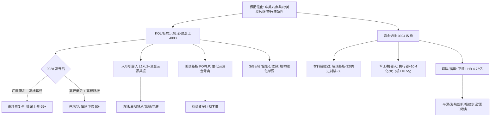

# 2026-09-28 · **群聊情绪共振**

> **数据源新鲜度**: partial（A股行情 0924 收盘 · 节假日滞后非缺失）
> **降级状态**: true（WeFlow 永久下线 · 场景C热榜 baseline 0924）
> **置信度**: 0.60

## 一句话结论

假期催化把情绪推到"必须涨上4000"的极端乐观，但 0924 收盘资金已在 材料链→军工/机器人/两岸 完成切换；0928 高开兑现 vs 高开修复二分，唯一三源硬共振是人形机器人。

## 详细分析

### 1. 情绪定位：极度乐观，但已被提前定价 ⚠️

KOL 5/5 群全活（122 条 · 0927 周日盘后），情绪底色是**极端乐观**：颜晓滨群「事以密成」直言"必须涨，明天必须上4000点·谈的这么好各种利好不给老大面子"，把中美八点共识、央行流动性、美股周五收涨全部定价为大涨。但同群「zZ」给出理性分歧："今年上证大概率收在3800-4200·短期还处于震荡回调中"。这是典型的**利好已被提前消化**的信号——R1 也据此给出"高开兑现 vs 高开修复"二分，情绪浓度 59（R1 基线 58 + 共振 3 - 出货 2），中性偏暖而非高潮。

### 2. 0924 收盘真实资金主线：材料链撤退 → 军工/机器人/两岸接管 🔀

R7 资金（0924 收盘）给出决定性结构：**材料链资金全线撤退**（玻璃基板 0923 +12.69→0924 -32.39、先进封装 +10.95→-49.88、复合集流体 +19.72→-9.67），**切向军工与机器人**（大飞机 +10.47 亿#1、机器人执行器 +10.41 亿#2、空间站 +8.14 亿#3、减速器进 top10），**两岸/福建事件驱动爆发**（平潭发展 90→1 人气 +89、LHB 净买 4.75 亿、开源西安西大街席位 +10.27 亿游资接力）。热榜同向：THS #1 海峡两岸、#2 福建自贸区双新进；DC 平潭发展登顶。**0928 的核心不是"涨不涨"，而是资金认哪条主线**。

### 3. 主题共振：5 个 L1+L2，只有人形机器人三源同向 🎯

| 排名 | 主题 | 共振等级 | 资金 | 阶段 |
|---:|---|---|:--:|---|
| 1 | 人形机器人/碳纤维 | L1+L2 | 🟢 机器人执行器 +10.41亿#2 | middle |
| 2 | 玻璃基板/FOPLP | L1+L2 | 🔴 玻璃基板 -32.39亿 | early |
| 3 | SiGe/锗/光互联 | L1+L2 | 🔴 通信 -98.73亿 | early |
| 4 | Muse/AI应用 | L1+L2 | 🟡 AI应用 -1.25% | early |
| 5 | 金刚石散热 | L1+L2 | 🟡 培育钻石 -2.51% | early |

人形机器人是**唯一热榜上升（13→9）+ KOL 双群强推（draven·高盛 89 万台/德银 5 万台/特斯拉 Optimus 10 倍）+ 资金正向（执行器 +10.41 亿）三源同向**的硬共振。玻璃基板/FOPLP 是"假期催化（英伟达加码/台积电嘉义二期）vs 0924 资金已撤"的最大分歧——竞价资金不回归=退潮确认。

### 4. 两岸统一：0924 最强主线，但 KOL 未点名板块 🚩

两岸/福建事件驱动（中美八点共识直接催化）在 L1 层是**三证极强**：热榜 #1#2、人气 surge（平潭 +89/福建水泥 +39/厦门港务首进）、资金（平潭 LHB 4.75 亿 + 游资席位 +10.27 亿）。但 KOL 仅以"必须涨上4000"的大盘情绪间接印证，**没有直接点名福建/两岸板块**——按红线 4 单源不进入共振 top5，放 l1_only 观察 rank1 供 R2/D1 直接消费。这是"资金热度与舆论热度分离"的典型，0928 竞价看平潭/福建链换手与承接。

## 推理深度三问

### 人形机器人（今日唯一三源硬共振）
- **大资金意图**: 0924 主力净流入机器人执行器 +10.41 亿#2、减速器进 top10，是把"人形机器人量产"从主题叙事定价为产业兑现——高盛/德银同时上调出货预测、特斯拉 Optimus 产量 10 倍、碳纤维减重 33% 是数据锚。对手盘是 0923 仍在流出（-135 亿）的旧空头与踏空资金，0928 高开即面临兑现与接力博弈。
- **为什么走强**: 位置=高位题材（人形机器人 0923 已在榜、非首日启动），催化=机构上调出货+Optimus 10 倍+碳纤维轻量化（硬事件），筹码=机器人轴承（洛轴/襄阳 20cm）+ 执行器资金正向。三维交叉后属于"主升中继+新催化"而非"低位启动"，只做龙一龙二低吸。
- **逻辑够不够硬**: 三源独立（L1 热榜上升 + L2 draven 双群 + R7 资金正向）共振，产业逻辑有高盛/德银/特斯拉三重数据锚，够硬。证伪路径=竞价资金转负（执行器净流出）+ 高标断板，则退潮前兆成立。

### 两岸统一/福建自贸区（0924 最强事件主线 · L1_only）
- **大资金意图**: 平潭发展 LHB 净买 4.75 亿 + 开源西安西大街席位 +10.27 亿游资接力，是机构+游资对中美八点共识的事件定价——把"习近平访美圆满"映射为两岸融合预期。对手盘是节前获利盘与高位兑现盘，0928 是节后首日的首轮兑现窗口。
- **为什么走强**: 位置=事件首日爆发（平潭 rank90→1 是首日暴升，0924 涨停潮发酵 1 天），催化=中美八点共识（硬政策锚·R4 high），筹码=福建链涨停潮（海峡创新 20cm/福建水泥/厦门港务）+ 游资席位大买。但注意 KOL 未点名板块=舆论热度未跟上，属资金先行型。
- **逻辑够不够硬**: 事件催化硬（政策级），但 L2 缺位 + 已发酵 1 天 + 假期利好已定价 → 逻辑硬但位置偏晚，middle 偏 early。证伪路径=0928 高开低走/平潭炸板，则事件一日游确认。

### 玻璃基板/FOPLP（最大分歧主题）
- **大资金意图**: 假期英伟达加码玻璃基板+台积电嘉义二期 5 厂是产业级催化，但 0924 资金已从玻璃基板（-32.39 亿）和先进封装（-49.88 亿）大幅撤离——主力节前选择落袋，0928 是否回归取决于高开后的承接。
- **为什么走强**: 位置=高位回调（玻璃基板 3→12 降 9、沃格光电人气 rank3→89 崩塌），催化=假期新催化（硬），筹码=长电/通富/文一 KOL 点名但人气退坡。三维交叉=催化 vs 资金背离，是"高开兑现"的最大风险源。
- **逻辑够不够硬**: 产业逻辑硬（英伟达/台积电双锚），但资金已用脚投票 → 标 early 而非 middle，竞价资金回归才做，不回归即确认退潮。

## 每票思维链

### 洛轴股份（301699 · 人形机器人轴承 · 20cm 人气王）
- **买入理由**: ①人形机器人三源硬共振（热榜 13→9 + 资金执行器 +10.41 亿 + draven 双群），轴承是 draven 明确点名的"已经暴涨"方向；②洛轴 dc#23 20cm +19.99%，机器人轴承纯正标的，弹性最大。
- **风险点**: ①创业板 20cm 波动剧烈，高开兑现风险大；②轴承板块已暴涨数日（洛轴/襄阳/国机精工），追高即接最后一棒。
- **止损条件**: 买入价 -7%（20cm 票放宽至 -7~-10% 硬区间），或机器人执行器主力资金转负即走。
- **可验证假设**: 0928 竞价机器人执行器板块主力净流入为正 + 洛轴高开 <5% 承接良好 → 持有；竞价转负或高开 >7% 无量 → 放弃。

### 平潭发展（000592 · 两岸统一人气龙头）
- **买入理由**: ①两岸/福建事件主线龙头（THS#1 海峡两岸 + 平潭 rank90→1 人气 +89）；②LHB 净买 4.75 亿 + 开源席位游资接力 + 机构 6.99 亿，资金三证同向。
- **风险点**: ①KOL 未点名板块=舆论未跟上，事件一日游风险；②0924 已涨停，0928 高开兑现压力大。
- **止损条件**: 买入价 -5%，或海峡两岸概念竞价转弱/板块炸板率 >35% 即走。
- **可验证假设**: 0928 竞价平潭高开 <5% + 福建链换手承接良好 → 事件延续；高开无溢价 + 平潭封单弱 → 兑现确认，不参与。

### 麦格米特（002851 · AI电源超容 · 机构研报首推）
- **买入理由**: ①天风深度：谷歌万套超容柜订单谈妥（年化收入 130-165 亿/利润 30-40 亿）+ xAI PowerShelf 50% 份额，26Q4 兑现窗口明确；②超容系统效率 96%→99%+，AI 数据中心标配无替代路线。
- **风险点**: ①L1 无直接热榜支撑 + 算力链资金流出（背离），机构推但市场未确认；②目标市值 1200 亿含乐观假设，兑现不及预期回撤大。
- **止损条件**: 买入价 -5%，或谷歌超容订单官方证伪/延期。
- **可验证假设**: 0928 竞价 AI 电源/算力链主力净流入转正 + 麦格米特放量高开 → 进；资金仍流出则观察。

## 关键证据

- 证据 1: 人形机器人 13→9 热榜上升 + 机器人执行器主力 +10.41 亿#2 + draven 双群强推（高盛 2030 89 万台/德银 2026 5 万台/特斯拉 Optimus 10 倍/碳纤维减重 33%）· 来源 THS+DC+R7+KOL
- 证据 2: 平潭发展 90→1 人气 surge +89（+10.03% 涨停）+ LHB 净买 4.75 亿 + 开源西安西大街席位 +10.27 亿 · 来源 attention+R7
- 证据 3: 材料链 0924 资金全线撤退：玻璃基板 -32.39/先进封装 -49.88/复合集流体 -9.67 · 来源 R7
- 证据 4: THS 海峡两岸 #1 新进 + 福建自贸区 #2 新进（0924）· 来源 ths_hot
- 证据 5: 玻璃基板 FOPLP 假期强催化（英伟达加码/台积电嘉义二期 5 厂·风中追风/翻一番双群）+ 但沃格光电人气 rank3→89 崩塌 · 来源 KOL+attention
- 证据 6: 创新药出货 watch：哈药股份 dc rank7 但 -9.96% 跌停 + 创新药概念 -2.50% · 来源 dc_hot
- 证据 7: 颜晓滨群「事以密成」"必须涨明天上4000" vs 「zZ」"3800-4200 震荡回调" · 来源 wechat_cli_5groups

## 数据源审计

| 源 | 日期 | 状态 | 备注 |
|---|---|:--:|---|
| wechat_cli_5groups | 2026-09-27 | 🟢 | 122 条 · 5 群全活（匿名） |
| tushare ths_hot | 2026-09-24 | 🟢 | 20 条 · 概念板块 |
| tushare dc_hot | 2026-09-24 | 🟢 | 100 条 · A股人气榜 |
| tushare stock_basic | 2026-09-28 | 🟢 | 8 只 KOL 点名票代码核验 |
| attention_signals | 2026-09-24 | 🟢 | persistent 1789/surge 19/cross 57 |
| R7_capital_flow | 2026-09-24 | 🟢 | 主力/北向/游资 0924 收盘 |
| R4_news | 2026-09-28 | 🟢 | 中美共识/半导体景气/金刚石散热 |
| R1_style | 2026-09-28 | 🟢 | sentiment=58 · 主线扩散型(高标抱团) |
| weflow_analytics | - | 🔴 | 永久下线 2026-08-19 |
| mcp_health | 2026-09-28 | 🟡 | global_severity=2 · tushare/xtick ok |

## 不确定性 / 反证

1. **最不确定点**：玻璃基板/FOPLP 是"假期催化 vs 0924 资金已撤"的最大分歧。英伟达加码/台积电嘉义二期催化真实，但 0924 沃格光电人气 rank3→89 崩塌 + 玻璃基板资金 -32.39 亿，说明**节前资金已用脚投票**。若 0928 材料链资金继续流出，则确认退潮而非再启动——本判断标 early 而非 middle 正是为此留出证伪空间。
2. **两岸统一是 L1_only**：热榜/人气/资金三证极强但 KOL 未点名，可能是"资金已先行、舆论未跟上"的早段，也可能是"事件一日游"的顶部。0924 已涨停潮发酵 1 天 + 假期利好已定价，0928 追高风险大。
3. **KOL 乐观情绪可信度打折**：「必须涨上4000」是情绪宣泄而非分析结论，同群已有 zZ 的震荡回调对冲。情绪浓度 59 未给到 65+ 正是对"极端乐观"的纪律性折价。
4. **A股行情口径滞后**：核心量化全部停在 0924 收盘（中秋休市 3 日），0928 首日的真实盘面（竞价溢价/广度修复/高标承接）需 P1 竞价校准，本文件对 0928 的预判是条件式而非断言式。

## 与其他 R/D/E 的关系

- 依赖: data/research/20260928/R1_style.json（情绪基线）· R7_capital_flow.json（资金交叉）· R4_news.json（催化交叉）· attention_signals.json（人气底座）
- 被消费: D1 主决策（resonance_top_themes + l1_only_top_observations + sentiment_score）· R2 主线板块（两岸统一/人形机器人候选池）· R6 反证（创新药出货/玻璃基板背离）

## Sub-Agent 元数据

- skill: analyze_sentiment_resonance_v1
- artifact: data/research/20260928/R3_sentiment.json + data/research/20260928/hotlist_signals.json
- 生成耗时: ~8 分钟
- model: deepseek-v4-flash-ga-260731
