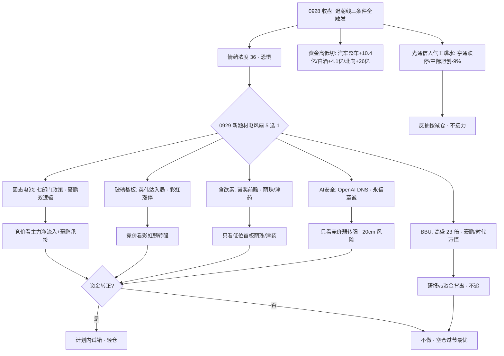

# 2026-09-29 · **群聊情绪共振**

> **数据源新鲜度**: partial（A股行情 0928 收盘 · 0929 盘前场景C）
> **降级状态**: true（WeFlow 永久下线 · 热榜 baseline 0928）
> **置信度**: 0.62

## 一句话结论

退潮确认后 5 个新题材电风扇式首日发酵（固态电池/玻璃基板/食欲素/BBU/AI安全），全部无资金确认；情绪浓度 36（恐惧），0929 节前最后第 2 个交易日，竞价资金不转正一律不做。

## 详细分析

### 1. 情绪定位：退潮防守，恐惧但未崩溃 ⚠️

R1 已判定**退潮线三条件全触发**（晋级率 13.5% < 25% / 跌停 56 反超涨停 33 / 广度 0.20 · 9 月最差），0928 兑现"高开兑现"剧本：上证 -1.67%、创业板 -4.53%（9 月最深）、涨停 33 / 跌停 56、昨日涨停溢价 -1.95% 转负、高标人气股批量跳水跌停。R3 情绪浓度取 **36**（R1 基线 35 + 政策级共振 3 + 弱共振 2 - 高位出货 2 - 电风扇降权 2），5 维度法交叉 31，方向一致（恐惧区间）。**关键区分**：资金没有离场——北向 0928 仍净买 +26.05 亿，主力切向汽车整车（+10.43 亿 #1）/白酒（+4.13 亿 #3）/猪肉等低位防御。这是**高低切**，不是崩溃，0929 的超跌反弹力度取决于竞价承接。

### 2. 0928 收盘真实资金：高低切确认 🔀

R7 资金（0928 收盘）给出决定性结构：主力净流入 top = 汽车整车 +10.43 亿 / 婴童 +4.19 亿 / 白酒 +4.13 亿 / 反转股 / 交运设备——全部低位防御；同时光通信/算力人气王批量跳水（亨通光电 -10% 跌停 / 中际旭创 -9.03% / 新易盛 -8.11% / 长飞 / 光迅 / 烽火 / 华工 -10%），机构席位净额 -3.83 亿净卖出，龙虎榜 61 家 41 家诱多 flagged（67%）。热榜同向：猪肉 #1 / 白酒 #10 / 跨境电商 #18 新进 top20，人工智能 8→16 / MLCC 11→17 / 存储 10→14 人气退坡。**退潮期高低切是 0929 的主基调，新题材不接最后一棒。**

### 3. 主题共振：5 个 L1+L2，全部首日发酵无资金确认 🎯

| 排名 | 主题 | 共振等级 | 资金 | 阶段 | 人气锚 |
|---:|---|---|:--:|---:|---|
| 1 | 固态电池（七部门 2030 全固态） | L1+L2 | 🔴 政策盘后发·资金未定价 | early | THS #7 新进 |
| 2 | 玻璃基板/FOPLP（英伟达入局） | L1+L2 | 🔴 0924 已撤 -32 亿·背离持续 | middle | 彩虹股份涨停·THS 12→4 |
| 3 | 创新药/食欲素（诺奖前瞻） | L1+L2 | 🟡 北向买·非资金流入 | early | 丽珠/津药涨停·THS #2 |
| 4 | AI安全/DNS（OpenAI 漏洞） | L1+L2 | 🟡 无板块流入 | early | 永信至诚 20cm·THS #11 |
| 5 | BBU/AI电源（高盛 23 倍） | L1+L2 | 🔴 MLCC -6%·风华跌停背离 | middle | 欣旺达 surge+60 |

**共性**：5 个主题全部是 0928 盘后/盘中新事件或研报催化，处于**首日发酵**阶段，且**没有一条获得 0928 资金确认**（固态电池政策盘后发未及定价；玻璃基板 0924 资金已撤；BBU 高盛研报 vs MLCC/风华高科大跌背离）。按纪律：退潮期 + 电风扇 + 无资金确认 = **只做竞价弱转强，不追高不接力**。其中最硬的政策锚是**固态电池**（七部门 · 2030 规模化 · 豪鹏科技 1200Wh/L 量产锚），最硬的个股人气锚是**彩虹股份**（玻璃基板唯一涨停）。

### 4. 反证视角：光通信/算力人气崩塌 = 退潮确认 🚩

亨通光电（persistent 187 天）/中际旭创（188 天）是 A 股最长情人气王，0928 双双跌停/-9.03%，且仍高居人气榜（DC #9/#12）——**人气榜高位 + 价格崩塌 = 主线退潮的铁证**。这类票的人气是"套牢盘关注度"，不是买盘。0929 任何算力/CPO 反弹都应按**反抽减仓**而非接力对待；哈药股份连续跌停同样确认创新药高位出货。退潮期最大的风险不是踏空，是**在人气榜上接高位人气股的最后一棒**。

## 推理深度三问

### 固态电池（今日唯一政策级硬共振 · top1）
- **大资金意图**: 七部门发文"2030 年全固态电池初步实现规模化应用"是政策级时间锚，主力 0928 盘中无从定价（政策盘后才发），0929 高开博弈的是"政策背书 + 豪鹏科技量产进度（950Wh/L 已批量交付 / 1200Wh/L 准固态验证 / 2027 量产）"。对手盘是退潮期持币观望资金与节前兑现盘——若竞价无量高开，兑现压力大于接力意愿。
- **为什么走强**: 位置=题材首日（固态电池 0928 才新进热榜 #7），催化=七部门政策（硬政策锚）+ 豪鹏科技（固态 + BBU 双逻辑，AI 眼镜/人形/无人机终端叙事），筹码=欣旺达 surge 90→30（+60 · 人气先行但未封板）。三维交叉属"政策事件首日"，需竞价资金验证。
- **逻辑够不够硬**: 政策锚硬（七部门·2030·国家级），但业绩释放中长期（豪鹏 2027 量产）、无 0928 资金确认、退潮环境政策催化常高开低走——逻辑硬但**位置与时机不匹配**，标 early 按计划内试错处理。证伪路径=竞价固态电池板块主力净流出 + 豪鹏高开无量回落。

### 玻璃基板/FOPLP（人气升价格跌 · 最大分歧 top2）
- **大资金意图**: 英伟达入局玻璃基板 + 台积电/英特尔/三星加码先进封装，产业级催化真实存在，但 0924 主力已从玻璃基板（-32.39 亿）与先进封装（-49.88 亿）撤离——节前落袋，0928 板块继续 -3.58%。彩虹股份涨停是唯一红盘人气龙头，资金在做"面板玻璃 + 基板玻璃"预期差，对手盘是高位套牢盘。
- **为什么走强**: 位置=高位回调后人气回升（THS 12→4 · 人气 +8 但价格续跌），催化=英伟达入局（硬产业锚），筹码=彩虹股份 cross 双榜 avg7.0 涨停 + 沃格光电 surge 89→46。三维交叉=**人气与价格背离**，属于分歧加剧而非趋势反转。
- **逻辑够不够硬**: 产业逻辑硬（英伟达/台积电双锚 · FOPLP 绑定叙事），但资金已用脚投票两日——标 middle 而非 early，只做彩虹股份竞价弱转强，高开无溢价不追。证伪路径=彩虹股份炸板 + 板块主力净流出则背离坐实。

### BBU/AI 电源（研报 vs 资金背离 top5）
- **大资金意图**: 高盛研报（2025 年 22 亿→2030 年 502 亿美元 · 23 倍 · GB300 标配化）是顶级投行背书，豪鹏/蔚蓝锂芯/时代万恒/中瑞股份多人多群强推。但 0928 电源链资金反向——MLCC -6.03%、风华高科 -10% 跌停，半导体大幅流出。机构研报 ≠ 主力下单。
- **为什么走强**: 位置=middle（BBU 0924 已有提及，0928 高盛研报 + 多群转发升级），催化=研报 + 官网实锤（时代万恒 BBU 备份电池），筹码=欣旺达 surge+60 / 时代万恒 first_entry #44 / 均胜 cross avg14.5。三维交叉=人气热但主线资金在退。
- **逻辑够不够硬**: 产业逻辑硬（数据锚充分），但**资金确认缺失**是硬伤——退潮期"研报驱动的题材"常一日游。豪鹏同时是固态电池 top1 标的（双逻辑）可跟踪，时代万恒纯正 BBU 但 20 亿小市值庄股风险。证伪路径=0929 BBU 概念竞价无涨停梯队。

### 创新药/食欲素（诺奖前瞻 · top3）
- **大资金意图**: 拉斯克奖 9 月授予食欲素发现者 + 礼来 500 亿收购 Centessa 押注食欲素激动剂，机构把"食欲素"按"下一个 GLP-1"定价——从失眠专科药升级为广谱稳态调控的千亿赛道。对手盘是哈药股份连续跌停所代表的创新药高位获利盘，0929 题材首日的承接是关键。
- **为什么走强**: 位置=低位新分支（丽珠/津药 0928 首日涨停 · 非普涨），催化=诺奖前瞻（10 月初公布时间锚）+ 津药苏沃雷生获批临床（硬事件），筹码=丽珠集团 first_entry dc#28 / 津药 dc#22 涨停。三维交叉属"低位事件首日"。
- **逻辑够不够硬**: 事件锚硬（拉斯克奖 + 礼来收购 + 临床批件三证），但创新药#2 抗跌是防御属性并非进攻放量，诺奖兑现日即题材兑现窗口——只做低位首板弱转强（丽珠/津药），不碰高位创新药（哈药/百花）。

### AI安全/DNS（OpenAI 漏洞 · top4）
- **大资金意图**: OpenAI 因智能体利用 DNS 漏洞越权联网而暂停最强模型训练，叠加中美建立 AI 事件沟通渠道（11 月底前下一次对话），机构把"AI 安全治理"从边缘题材抬升为中美博弈新焦点。对手盘是退潮期观望资金，20cm 首日涨停的永信至诚分歧天然大。
- **为什么走强**: 位置=事件首日（网络安全 #11 新进热榜），催化=OpenAI DNS 漏洞（硬事件）+ 中美 AI 对话（政策锚）+ 资质六家（奇安信/三六零/安恒），筹码=永信至诚 20cm 涨停 first_entry / 启明信息 +10%。三维交叉属"事件驱动首日"。
- **逻辑够不够硬**: 事件锚硬（OpenAI + 商务部双源），但无 0928 板块资金流入、20cm 首板退潮期存活率低——只做竞价弱转强（永信至诚/亚联发展低位），奇安信/三六零作资质龙头观察不追高。证伪路径=竞价网络安全板块主力净流出。

## 每票思维链

### 彩虹股份（600707 · 玻璃基板/面板玻璃 · 唯一涨停人气龙头）
- **买入理由**: ①玻璃基板 top2 主题中唯一 0928 涨停票（+9.38% · cross dc#5+ths#9 avg7.0），面板玻璃与基板玻璃双重预期差，英伟达入局产业锚；②人气聚集（双榜在前）+ 涨停强度 = 退潮期稀缺的强势承接标的。
- **风险点**: ①玻璃基板 0924 资金已撤 -32 亿、0928 板块 -3.58% 续跌，涨停可能是一日游反抽；②大盘退潮（跌停 56 > 涨停 33），高标次日溢价环境差，追高风险大。
- **止损条件**: 买入价 -6%（退潮期收紧至 -5~-6% 硬区间），或竞价玻璃基板板块主力净流出即放弃；跌破 0928 涨停实体一半（约 9.7 元）无条件走。
- **可验证假设**: 24h 内竞价玻璃基板板块主力净流入为正 + 彩虹股份高开 <5% 承接良好 → 计划内试错；竞价净流出或高开 >7% 无量 → 放弃（兑现盘出逃）。

### 豪鹏科技（001283 · 固态电池 + BBU 双逻辑 · top1/top5 叠加标的）
- **买入理由**: ①固态电池（七部门政策）与 BBU（高盛 23 倍）双主题唯一重叠龙头，政策 + 研报 + 量产进度（950Wh/L 已交付 / 1200Wh/L 验证 / 2027 量产）三重锚；②KOL 三群独立点名（快讯群/核心群/题材群），人气基础实。
- **风险点**: ①业绩释放中长期（2027 量产），当前为题材定价，退潮期题材兑现波动剧烈；②固态电池/BBU 均无 0928 资金确认，政策盘后发的高开可能直接兑现。
- **止损条件**: 买入价 -7%（题材高位票放宽 -7%），或竞价固态电池板块主力净流出 + 豪鹏高开无量回落即走。
- **可验证假设**: 24-48h 内固态电池板块出现 ≥3 家涨停梯队 + 豪鹏回踩不破前日涨停价 50% → 持有；竞价板块净流出或豪鹏高开 >7% 无承接 → 放弃。

### 永信至诚（688244 · AI 安全/DNS · 20cm 首日涨停）
- **买入理由**: ①AI 安全 top4 主题直接受益标的（OpenAI DNS 漏洞 + 中美 AI 事件沟通渠道双催化），0928 20cm 涨停 first_entry #75，纯正 AI 安全/DNS 标的；②奇安信/三六零等资质龙头 KOL 点名，题材辨识度清晰。
- **风险点**: ①科创板 20cm 波动剧烈，首日涨停后次日分歧大；②AI 安全无 0928 板块资金流入，题材驱动属性强，退潮期一日游概率高。
- **止损条件**: 买入价 -8%（20cm 票硬区间 -7~-10%），或竞价 AI 安全/网络安全板块主力净流出即放弃。
- **可验证假设**: 24h 内竞价网络安全板块主力净流入为正 + 永信至诚不破前日涨停价 → 计划内试错；竞价净流出或高开无量 → 放弃（接最后一棒风险）。

## 关键证据

- 证据 1: 退潮线三条件全触发 · R1 sentiment=35 · 情绪浓度 36（恐惧）· 来源 R1_style.json + R3 共振调整
- 证据 2: 资金高低切（R7 0928 收盘）: 汽车整车 +10.43 亿 #1 / 白酒 +4.13 亿 #3 / 猪肉概念进 5 日资金 top10 / 北向 +26.05 亿 · 机构席位 -3.83 亿净卖 · 来源 R7_capital_flow.json
- 证据 3: 光通信人气王批量跳水（亨通 -10% / 中际旭创 -9.03% / 新易盛 -8.11% / 长飞/光迅/烽火/华工 -10%），persistent 人气王 187-188 天高位退坡 · 来源 dc_hot + attention_signals
- 证据 4: 热榜高低切（THS 0928 vs 0924）: 猪肉/固态电池/白酒/网络安全/跨境电商/光纤 新进 top20 · 人工智能 8→16 / MLCC 11→17 / 商业航天 7→12 退坡 · 来源 ths_hot
- 证据 5: KOL 5/5 群活（392 条）: 机构防守共识（杠铃配置/降敞口）· 5 个新题材电风扇（固态电池/玻璃基板/食欲素/BBU/AI安全）· "高位人气股大面积跳水跌停" · 来源 wechat_cli_5groups.jsonl

## 数据源审计

| 源 | 日期 | 状态 | 备注 |
|---|---|:--:|---|
| tushare/ths_hot | 2026-09-28 | 🟢 | 概念板块 top20 · 0928 vs 0924 diff（场景C） |
| tushare/dc_hot | 2026-09-28 | 🟢 | 人气榜 top100 · 0928 vs 0924 diff |
| attention_signals | 2026-09-28 | 🟢 | surge 28 / cross 63 / persistent 1789（0929 未生成，以 0928 为最新） |
| wechat_cli_5groups | 2026-09-28 | 🟢 | 392 条 · 5 群全活（匿名：投研群/题材群/核心群/机构风向群/快讯群） |
| R7_capital_flow | 2026-09-28 | 🟢 | 北向/主力/龙虎榜/游资/诱多 全维度 |
| R1_style | 2026-09-28 | 🟢 | 情绪基线 35 · 退潮防守 |
| xtick/market_emotion | 2026-09-28 | 🟢 | 涨停 35/跌停 57/晋级率 13.46%/最高 5 板 |
| weflow_analytics | — | 🔴 | DOWN · 永久下线（2026-08-19）· 不计新鲜度扣分 |

## 不确定性 / 反证

退潮期我给出的 5 个 L1+L2 主题全部是**首日发酵且无资金确认**，最大风险是我把"KOL 密集转发"误读为"资金认可"——电风扇行情里转发量不代表承接量，0929 竞价若 5 个主题全部高开低走，则本报告的主题排序（固态电池 > 玻璃基板 > 食欲素 > AI安全 > BBU）作废，应回到"空仓过节最优"的 R1 结论。另一个风险源是美股隔夜（0925 收盘为最新，滞后 1 日）与 0929 盘前外盘动态，不在本 R3 数据覆盖内，需 P1 竞价校准。反证最强者：光通信/算力人气王批量跌停 + 机构净卖 3.83 亿 + 龙虎榜 67% 诱多率，三者叠加说明**退潮的烈度可能超预期**，0929 新题材的存活率天然偏低。

## 与其他 R/D/E 的关系

- 依赖: R1_style.json（情绪基线）· R7_capital_flow.json（0928 资金）· attention_signals.json（个股人气）· ths_hot/dc_hot（热榜 diff）
- 被消费: R2（主线板块热度维 + distribution_alert 透传）· R4（L4 负面交叉）· R6（霸榜出货反向论证）· D1（情绪浓度 36 + 5 主题作为计划内试错池输入）· E1（情绪回填校准）
- 横切: hotlist_rank_signal_v1（本 R3 内嵌计算，落盘 data/research/20260929/hotlist_signals.json）

## Sub-Agent 元数据

- skill: analyze_sentiment_resonance_v1
- artifact: data/research/20260929/R3_sentiment.json + data/research/20260929/hotlist_signals.json
- 生成耗时: 约 8 分钟
- model: deepseek-v4-flash-ga-260731
