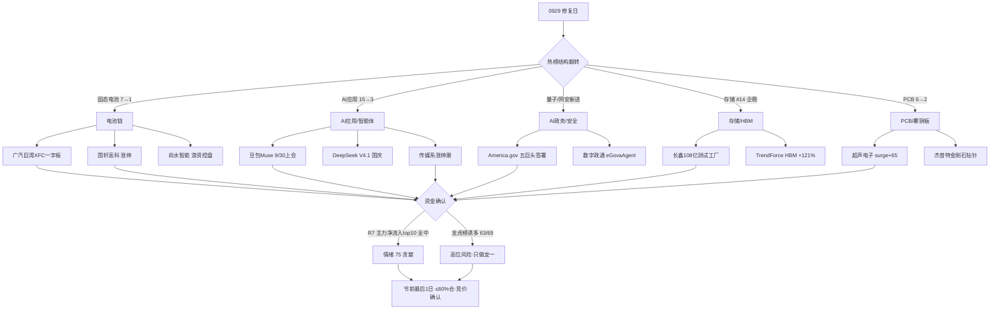

# 2026-09-30 · **群聊情绪共振**

> **数据源新鲜度**: partial
> **降级状态**: yes (WeFlow 永久下线 · L1 为 T-1 baseline)
> **置信度**: 0.62

## 一句话结论
修复日全面点火，AI应用/电池/存储/PCB 五主题共振，情绪 75 贪婪，节前最后一天只做龙一低吸。

## 详细分析

**1. 修复日结构彻底翻转**。0929 是 0928 退潮日的 V 型反转：热榜榜首从防御的猪肉(#1)换成进攻的固态电池(#1)，AI应用人气榜从 #15 飙到 #3(+12)，PCB #2、锂电池/华为/量子科技/AI视频/算力租赁/快手六板块新进 top20。KOL 五个群 401 条无一例外在谈同一件事——"今天是修复的一天"(核心投研圈)，游资 Jason 直言"决定持股过节这个方向了"。R7 资金给足背书：北向连续 5 日净买(+21.29亿)，主力净流入 top10 里 AI应用、固态电池、锂电池、PCB、存储全部上榜——人气、资金、KOL 三个独立源同向，这是**主升修复的完整证据链**。

**2. 最强主线是 AI应用/智能体，而且催化就在今天**。豆包对标 Muse 的智能体产品 9/30（今天）上会内测，这是 S 级事件的时间锚；叠加可灵 Kling4.0 内测、DeepSeek V4.1 Pro 国庆发布、Manus2.0 发布，AI 智能体军备竞赛从美股(华创计算机:Muse 登顶引爆 CPU 主线)传导到 A 股传媒系涨停潮(新华传媒/掌阅科技/新华文轩/环球印务/值得买/南威软件)。**注意**：这是情绪扩散型行情，今天买入就是押"国庆 8 天假期 AI 催化不熄火"，传媒股业绩支撑弱，必须竞价弱转强确认，不追高。

**3. 电池链是资金最硬的方向**。固态电池热榜登顶 + 主力净流入 #5(24.36亿)/电池技术 #6/锂电池 #7，三板块同进 top10；广汽一字板(巨湾 XFC 超充+固态双轮)、国轩高科/上海洗霸/金龙羽/尚水智能集体涨停。游资 Jason 重仓尚水智能 2 个月("预计翻倍"、"流通盘 10 亿不到、1 亿基本控盘")——**这个控盘数据本身就是庄股特征警报**，已提示 R5 核实股东户数，只做国轩/广汽这类龙一。

**4. 事件驱动里 AI政务最锐**。America.gov 上线 + 白宫 AI 行政令五巨头签署(谷歌/Anthropic/Meta/OpenAI/英伟达)，KOL 深夜连发 5 条"大超预期·贝壳+携程+BOSS直聘+大众点评合体"；数字政通 eGovaAgent、榕基软件、中新赛克(今日涨停)、南威软件直接映射。但 R7 显示量子科技 -11.53 亿流出、网安资金中性——**事件已到、资金未到**，竞价看承接，不转正不做。

**5. 高位风险不能装看不见**。龙虎榜 69 家 63 家被诱多 flag(91%，近期极值)；光通信人气王亨通光电(THS热股#1·188 天)0929 仍 -5.82%，中际旭创 189 天人气王排名退到 90——**0928 的算力出货余波未止**，这批票不进正向共振。万科A(地产 DC#1)被龙虎榜标记"机构净卖+疑似对倒"，地产涨停潮是政策脉冲(购房贴息 10/1 实施)不是主线。节前最后一天，买入即持股过节 8 天，总仓 ≤60%，高标分歧就降 40% 以下。

## 关键证据

- 证据 1: THS 热榜 0929 vs 0928 — 固态电池 7→1 登顶、AI应用 15→3(+12)、玻璃基板 4→19(-15) · 来源 ths_hot (tushare)
- 证据 2: DC 人气榜 0929 top20 — 广汽集团 99→7(+92)、超声电子 70→5(+65)、国轩高科 first_entry#2 · 来源 dc_hot (tushare)
- 证据 3: "豆包全线紧急重构对标 Meta Muse 的 AI 智能体，9 月 30 日上会内测，国产 Agent 军备竞赛全面引爆" · 来源 核心群(题材群/快讯群同源转发) · 12:55-13:50
- 证据 4: "特朗普携手马斯克、黄仁勋办发布会，推 AI 驱动的新网站 America.gov…29000 网站合一，贝壳+携程+BOSS直聘+大众点评" · 来源 核心群/快讯群 song×4 · 13:01-23:30
- 证据 5: R7 主力净流入 — 固态电池+24.36亿#5、PCB+25.77亿#4、AI应用+17.13亿#9、存储+19.05亿#8；北向 +21.29 亿连续 5 日 · 来源 R7_capital_flow
- 证据 6: 龙虎榜 69 家 63 家诱多 flag(91%)；万科A 机构净卖+疑似对倒 · 来源 R7 lhb_bull_trap

## 推理深度三问（top5 主题）

**① AI应用/AI智能体**
- **大资金意图**: 字节 S 级任务 9/30 今日上会内测 + OpenAI Dots + DeepSeek 国庆发布，AI 智能体从美股叙事(华创计算机:Muse 登顶引爆 CPU)切换为 A 股可交易催化；传媒系小票是情绪放大器，大资金借"国产 Agent 军备竞赛"窗口做多 AI 应用补涨，对手盘是节前兑现的获利盘。
- **为什么走强**: 位置(热榜 15→3 人气飙升·修复日低位点火)+ 催化(豆包 9/30 上会·时间锚硬)+ 筹码(新华传媒/掌阅/新华文轩连板·传媒股筹码轻·情绪扩散快)三维共振。
- **逻辑够不够硬**: 硬事件(今天上会)+ 三群独立转发 + R7 资金(AI应用+17亿#9/人工智能+26亿#3)确认 = 硬；但传媒业绩支撑弱、涨停潮是情绪扩散，证伪路径=竞价高标不转正/传媒股大面积高开低走。

**② 电池链（固态/广汽XFC）**
- **大资金意图**: 固态电池七部门 2030 政策 + 广汽巨湾 XFC 装车埃安替代宁德 + R7 三板块主力净流入 top10(固态+24亿/电池技术+22亿/锂电池+21亿)——产业替代叙事下机构在修复日抢筹，对手盘是 0928 恐慌割肉盘。
- **为什么走强**: 位置(固态 7→1 登顶·修复日领涨)+ 催化(广汽一字板·国轩/上海洗霸/金龙羽集体涨停·产业事件密集)+ 筹码(广汽/国轩为机构可容纳大票)三维共振。
- **逻辑够不够硬**: 政策(七部门 2030)+ 产业(巨湾 XFC 已装车)+ 资金(三板块 top10)三独立源 = 硬；⚠️尚水智能 301513"1 亿控盘"= 庄股特征，须 R5 核实股东户数后才可交易。

**③ AI政务/AI安全**
- **大资金意图**: America.gov 29000 网站合一 + 白宫 AI 行政令五巨头签署(谷歌/Anthropic/Meta/OpenAI/英伟达)——全球 AI 治理里程碑，A 股映射数字政通/榕基/中新赛克做政务智能体；资金尚未完全进场(量子-11.5亿流出)，机构在等竞价承接。
- **为什么走强**: 位置(量子科技/网络安全新进 top20·中新赛克/南威涨停)+ 催化(凌晨新华社/财联社 America.gov·事件新鲜)+ 筹码(政务软件小市值·弹性大)共振。
- **逻辑够不够硬**: 事件级硬催化 + KOL 4 人独立跨群 + R4 E001 high = 硬事件；但资金面未确认是最大软肋，证伪路径=竞价承接不足/高开兑现。

**④ 存储/HBM**
- **大资金意图**: 长鑫 108 亿测试工厂(设备投资 81.8 亿)+ 三星 HBM 占 DRAM 产能 30% + TrendForce 上修 2027 HBM 均价 +121%——国产存储测试设备替代逻辑，机构买测试设备细分(联讯仪器)不买存储芯片整体，对手盘是 0928 长鑫公告日的恐慌盘。
- **为什么走强**: 位置(存储 #14 企稳·-5.01%→+0.52% 修复)+ 催化(长鑫 108 亿·设备投资 75.74%)+ 资金(R7 存储+19亿#8)共振。
- **逻辑够不够硬**: 硬投资额(108 亿)+ 产业共振(三星/TrendForce)+ 资金确认 = 硬；但存储链 0928 刚大跌，是修复不是新高，证伪路径=联讯仪器竞价不转正/板块回落。

**⑤ PCB/覆铜板**
- **大资金意图**: PCB 热榜 #2 + 主力 +25.77 亿#4 + 深股通买超声电子——修复日资金回流 AI 硬件载板；开源证券 1018 字深度推杰普特金刚石钻针(与尖点科技 MOU)，机构在做"PCB 钻针第二成长曲线"预期差。
- **为什么走强**: 位置(超声电子 surge 70→5·+65·涨停)+ 催化(杰普特 MOU·机构研报级)+ 资金(PCB+25.77亿#4)共振。
- **逻辑够不够硬**: 资金 + 研报 + 人气三源 = 硬；但超声电子是 0928 大跌(-9.4%)后的超跌反弹，证伪路径=竞价弱转强失败/覆铜板板块分歧。

## 首推票思维链

**002074 国轩高科（电池链龙一）**
- **买入理由**: ①锂电池/固态电池正宗龙头，0929 first_entry DC#2 涨停(28.68 元)，主力电池链三板块 top10 净流入(固态+24.36亿)；②R7 深股通 top_net_buy 在列，机构可容纳大票，非游资独食。
- **风险点**: ①节前最后 1 日买入即持股过节 8 天，外盘(加息/美债/伊朗)不可控；②龙虎榜诱多 63/69 高企，涨停票需盘中确认封单承接。
- **止损条件**: 竞价不及预期(高开 <2% 或低开)不买；已买入则跌破 0929 涨停价 28.68 的 -5%(27.25 元)离场，隔日不涨停即走(游资纪律: 高标隔日兑现)。
- **可验证假设**: 0930 竞价高开 2%+ 且 09:45 前固态电池板块主力净流入保持正 → 修复延续；若板块 09:45 转净流出或炸板 → 假设证伪，不参与。

**600825 新华传媒（AI应用传媒人气龙）**
- **买入理由**: ①0929 连板涨停(9.41 元·+10.06%)，DC 人气榜 #4 双平台(avg6.0)在榜；②豆包 Muse 9/30 今日上会内测 = 今日直接催化，AI 应用热榜 15→3 人气榜首梯队。
- **风险点**: ①传媒股业绩支撑弱，涨停潮为情绪扩散，若豆包发布会不及预期一日游；②新华文轩/掌阅/环球印务同板块内竞争龙一地位，高度板容易被卡。
- **止损条件**: 竞价弱转强失败(高开 <3% 或翻绿)不追；买入后跌破 0929 收盘价 9.41 的 -5%(8.94 元)止损，隔日不涨停即出。
- **可验证假设**: 0930 竞价高开 3%+ 且 09:35 前封板 → AI 应用主线延续；若高开兑现回落或板块涨停家数 <5 → 证伪，退出观望。

**300075 数字政通（AI政务正宗映射）**
- **买入理由**: ①America.gov 五巨头签署 + 白宫 AI 行政令(凌晨新华社)，KOL 瑞寅点名 eGovaAgent 已发布；②政务智能体 A 股最纯正标的之一，事件级催化 0930 首日发酵。
- **风险点**: ①资金未确认(量子科技 -11.53 亿流出)，事件到资金未到，高开兑现概率大；②政务软件小市值高波动。
- **止损条件**: 竞价承接不足(高开 <2% 或低开)不做；买入后跌破当日买入价 -6% 离场(事件驱动不给深套空间)。
- **可验证假设**: 0930 竞价高开且 09:45 前网络安全/政务软件板块主力净流入转正 → 事件资金到位；若板块资金 09:45 仍净流出 → 证伪，不追高。

## 数据源审计

| 源 | 状态 | 抓取时间 | 记录数 | 备注 |
|---|---|---|---|---|
| wechat_cli_5groups | 🟢 | 2026-09-29 22:30 | 401 | 5/5 群 ok · 投研/题材/核心/机构风向/快讯 |
| ths_hot (tushare) | 🟢 | 2026-09-29 22:30 | 20 | 概念板块 · 0929 收盘 22:30 快照 |
| dc_hot (tushare) | 🟢 | 2026-09-29 22:30 | 100 | 人气榜 · 0929 收盘 |
| attention_signals | 🟢 | 2026-09-30 06:47 | 1797 | trade_date 20260929 · surge21/cross58 |
| R7_capital_flow | 🟢 | 2026-09-30 07:18 | - | 0929 收盘 · 北向/主力/龙虎榜 |
| R4_news | 🟢 | 2026-09-30 07:10 | 8 | America.gov/央行PSL/豆包Muse/存储三共振 |
| R1_style | 🟢 | 2026-09-30 07:10 | - | sentiment 70 · 连板情绪型主升修复 |
| 美股/外盘(经 R1/R4 转引) | 🟡 | 2026-09-28 收盘 | - | 滞后 1 日 · 0929 隔夜由 news_cls 补充 |
| xtick_market_emotion | 🟢 | 2026-09-29 22:30 | - | 涨停57/跌停11/炸板8/晋级率28.57%/最高6板 |
| weflow_analytics | 🔴 | - | 0 | ngrok 隧道离线 · 永久下线 (2026-08-19) |

## 不确定性 / 反证

- **情绪 75 vs 五维法 63(差 12)**：五维法因炸板率权重惩罚修复日、且缺杠杆外资实时数据(中位 50 假设)；多源共振法给 AI应用/电池/AI政务 加分。方向一致(贪婪)，但真实强度可能是 63-75 区间——若竞价高标不延续，情绪回落至 65 以下也合理。
- **龙虎榜诱多 91% 是最大反证**：修复日涨停潮背后是高位兑现，万科A/我爱我家已 flag"机构净卖+疑似对倒"，光通信亨通/中际旭创人气王仍在出货。若 0930 高标炸板率高企，修复一日游即证伪。
- **AI政务资金未到**：量子科技 -11.53 亿流出 vs 华为 +25.93 亿流入，事件级催化的承接是最大不确定性。
- **节前持股过节风险**：国庆约 8 天，外盘(美联储加息概率 50%/美债/伊朗/日债)不可控，任何"持股过节"决策都带长假隔夜风险溢价。

## 与其他 R/D/E 的关系

- 依赖: R1_style(情绪基线 70 · 主升修复) · R7_capital_flow(资金确认) · R4_news(事件交叉) · attention_signals(人气底座) · ths/dc_hot(L1 热榜 diff)
- 输出被下游使用: R2(主线板块 · 热度维 + distribution_alert 透传) · R5(个股画像 · 共振主题候选池) · R6(反证 · 霸榜/诱多名单) · D1(盘前预案 · sentiment_score 基线) · E1(复盘 · 情绪兑现校验)

## Sub-Agent 元数据

- skill: analyze_sentiment_resonance_v1
- artifact: data/research/20260930/R3_sentiment.json
- 生成耗时: 约 900 秒
- model: deepseek-v4-flash-ga-260731
