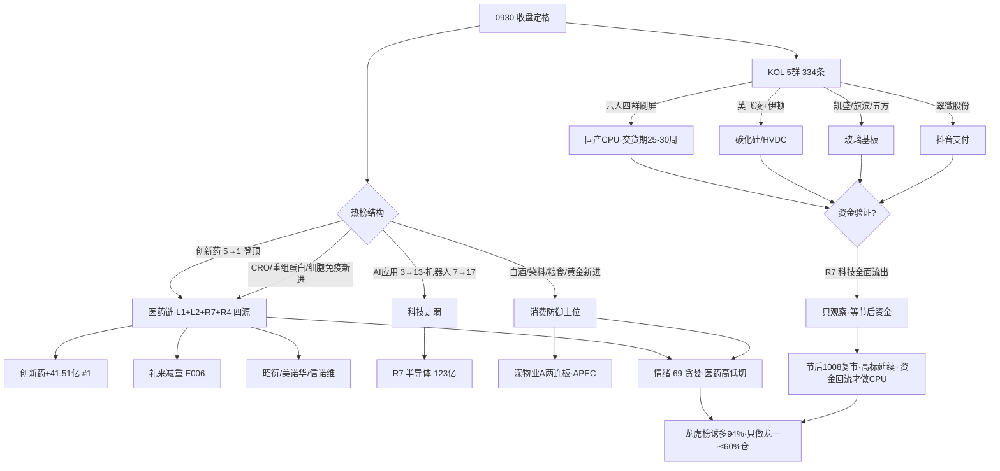

# 2026-10-01 · **群聊情绪共振**

> **数据源新鲜度**: partial
> **降级状态**: yes (WeFlow 永久下线 · 0930 收盘定格 · 国庆休市)
> **置信度**: 0.60

## 一句话结论
医药高低切登顶、KOL 全在 CPU 科技，情绪 69 贪婪但高标孤岛，节后 1008 才是胜负手。

## 详细分析

**1. 0930 是"医药高低切"而非"全面点火"**。热榜榜首从科技换成创新药(#1 登顶)，CRO/重组蛋白/细胞免疫三板块新进 top20，白酒/染料/粮食/黄金等消费防御同步上位；反观 AI应用 3→13(-10)、机器人 7→17(-10)、人工智能直接掉出 top20。资金面给出同样铁证：主力净流入 top11 全医药(创新药+41.51亿#1、医药医疗+37.9亿#2、CRO+27.27亿#3)，而科技全面失血(半导体-123亿、存储-95亿、华为-71亿)。这与 R1"高标孤岛+普跌分化"的节前收官判定完全同向——**资金在弃科技、抱医药**。

**2. KOL 与资金的极端背离是全篇最大张力**。五个群 334 条里最强音是国产 CPU：华创计算机/开源海外/行胜于言/song/ldm/崔龙 六人四群独立刷屏——Muse 登顶引爆 CPU、交货期 16-20 周拉到 25-30 周、Agent 需求重估、song 一句"综艺股份走龙了"，叠加 0930 晚 DeepSeek 开源昇腾全套组件。但同一时刻 R7 显示半导体 -123 亿、国产芯片 -122 亿出逃。**KOL 讲的是节后(1008)的预期差，不是今天的买点**——CPU/玻璃基板全线只列观察，等节后竞价资金信号。

**3. 最强共振是医药链，且是四源齐备**。创新药热榜登顶(L1) + 信诺维/美诺华/均瑶健康减肥益生菌(KOL) + 创新药主力流入#1(R7) + 礼来减重 23% 创纪录(R4 E006)——L1+L2+R7+R4 四源共振，是当日唯一"人气、资金、KOL、事件"全部确认的方向。但要清醒：这是防御性轮动，涨的是 CRO/重组蛋白/减肥药等低位细分，创新药指数 30 日才刚转正，只做资金确认的龙一，不追高标。

**4. 高位兑现风险没装看不见**。龙虎榜诱多 74/79=94%，较昨日 91% 再升：深物业A(涨停净卖+机构净卖+疑似对倒)、尚水智能(换手 41% 净卖-8447万)、金健米业(换手 35% 净卖-1.29亿)全被 flag。游资 Jason 自己都在说"今天不涨停就出货""大仓位一只票挣 20% 是努力"——节前最后一天高位资金清仓式兑现。光通信人气王亨通(189天)/中际旭创(190天)人气仍在退坡，0928 的算力出货余波未止。

**5. 长假 8 天的不确定性溢价**。R4 E008 美 30 年国债 5.62% 创 24 年新高 + 美联储加息预期升温，1001-1007 休市期间任何外盘利空都不可控。节后(1008)复市剧本二分：科技资金回流+高标延续 → CPU 预期差兑现、情绪可上修；高标断板/科技继续失血 → 情绪回落 65 以下，仓位砍到 40% 以下。

## 关键证据

- 证据 1: THS 热榜 0930 vs 0929 — 创新药 5→1 登顶、CRO/重组蛋白/细胞免疫/白酒/染料/粮食/黄金七板块新进 top20、AI应用 3→13(-10) · 来源 ths_hot (tushare)
- 证据 2: DC 人气榜 0930 top20 — 哈药股份 76→14(+62)、茅台 77→27(+50)、彩虹 85→30(+55)、昭衍新药/美诺华/陆家嘴 first_entry 涨停 · 来源 dc_hot (tushare)
- 证据 3: "Muse 登顶引爆美股 CPU 主线，交货期 16-20 周→25-30 周，国产 CPU 三重催化(海光/长城/禾盛/综艺)" · 来源 题材群/核心群/快讯群 华创计算机×4群 · 09:06-21:36
- 证据 4: "英飞凌与伊顿达成合作，SiC 固态变压器拿 IEC 认证，台达发布 Vera Rubin HVDC 机柜，瀚天天成获近亿美元 SiC 外延增购大单" · 来源 题材群/核心群/快讯群 Kindness/咖啡要加冰/稷下 · 09:13-09:26
- 证据 5: R7 主力净流入 — 创新药+41.51亿#1、CRO+27.27亿#3、医药医疗+37.9亿#2；流出 — 半导体-123.38亿、存储-95.09亿、华为-71.7亿；北向+20.79亿连续5日 · 来源 R7_capital_flow
- 证据 6: 龙虎榜 79 家 74 家诱多 flag(94%)；深物业A/尚水智能/金健米业 机构净卖+疑似对倒 · 来源 R7 lhb_bull_trap
- 证据 7: R4 E006 礼来 eloralintide+Mounjaro 减重 23% 创纪录(LLY+2.6% 创新高)、E008 美债 5.62% 创新高 · 来源 R4_news

## 推理深度三问（top5 主题）

**① 创新药/医药链**
- **大资金意图**: 科技失血后资金寻找低位避风港——CRO/重组蛋白/减肥药全是 30 日深调后的低位细分，礼来减重数据(平均减 24.5kg)提供海外映射，医药是节前最后一天"落袋+防御"的最优载体。
- **为什么走强**: 位置(创新药热榜 5→1 登顶·低位)+ 催化(礼来 E006 创纪录)+ 资金(主力流入 #1-#11 全医药)三维共振，KOL 信诺维/美诺华/均瑶同步点名。
- **逻辑够不够硬**: 四源(人气+资金+KOL+事件)齐备=硬；但本质是防御轮动非主升，创新药指数 30 日刚转正，证伪路径=节后科技资金回流、医药失血。

**② 深圳国资地产/APEC**
- **大资金意图**: APEC 峰会 11 月深圳召开倒计时，深物业A 两连板打辨识度，游资在做"深圳国资+地产+APEC"的题材脉冲，深振业/建科院/柏星龙是比价补涨梯队。
- **为什么走强**: 深物业A 12→3(+9)涨停 + 陆家嘴涨停 + 我爱我家 surge+18，人气强共振；KOL 板爷/记忆中的夏天/风起1996 四人独立。
- **逻辑够不够硬**: 人气硬但资金未全面确认(深圳特区 -23.87 亿流出 vs AH股 +21 亿#6)，且深物业A 已被龙虎榜标诱多——证伪路径=节后竞价高标不转正/地产资金继续流出。

**③ 固态电池/电池链**
- **大资金意图**: 电池 10 月排产环比 +5% 同比 40-50%(林童 数据)提供基本面托底，善水科技 20CM 三连板维持题材热度，但资金已从电池切向医药。
- **为什么走强**: 固态电池热榜 #3(1→3 微退)+ 上海洗霸/传艺/龙蟠涨停 + 善水三连板，KOL 尚水智能/建新/N力勤镍持续提及。
- **逻辑够不够硬**: L1+L2 硬共振但热榜微退+R7 资金退出 top15=退坡中段；尚水智能换手 41% 净卖 = 游资兑现盘，只做龙一(上海洗霸/传艺)不接高位。

**④ 玻璃基板/先进封装**
- **大资金意图**: 科技"高切低"的题材叙事——试验线/中试线阶段、量产 28 年，凯盛/旗滨/彩虹/五方/联得是标的池，机构(蒋颖)在推杰普特 PCB 钻针第二曲线。
- **为什么走强**: 热榜 #19 保持 + 彩虹 surge+55 + 五方涨停，KOL 五人独立刷屏(冰雨/阿童木/温耀k/牛大爱打板/Sheng)。
- **逻辑够不够硬**: 人气+研报硬，但 R7 科技全面流出=资金未到，量产 28 年=业绩兑现远，证伪路径=节后科技资金不回流即一日游。

**⑤ 国产CPU/算力**
- **大资金意图**: Muse 登顶→CPU 交货期拉到 25-30 周→Agent 需求重估(AMD 2027 产能售罄)+DeepSeek 开源昇腾，这是假期(1001-1007)最可能持续发酵的预期差。
- **为什么走强**: KOL 六人四群独立刷屏(华创/开源海外/行胜于言/song/ldm/崔龙)，song 明确"综艺股份走龙了"，R4 E002/E004/E001 三事件 high。
- **逻辑够不够硬**: 叙事+事件极硬，但 L1 热榜排名下滑+ R7 半导体 -123 亿流出 = 盘面资金与叙事背离。证伪路径=节后竞价科技资金不回流，CPU 一日游。**只观察，不接力**。

## 首推票思维链

**603127 昭衍新药（医药链龙一·CRO 龙头）**
- **买入理由**: ①0930 涨停(49.3 元)，DC 人气榜 first_entry#11，创新药/CRO 热榜登顶(创新药#1、CRO#2)；②R7 创新药+41.51亿#1、CRO+27.27亿#3，医药链主力流入 top11 全占。
- **风险点**: ①医药为防御轮动，节后科技若回流则医药失血；②龙虎榜诱多 94% 高企，涨停票须盘中确认封单承接。
- **止损条件**: 竞价不及预期(高开 <2% 或低开)不买；买入后跌破 0930 涨停价 49.3 的 -5%(46.84 元)离场，隔日不涨停即走。
- **可验证假设**: 1008 竞价医药板块高开 2%+ 且 09:45 前 CRO 主力净流入保持正 → 医药延续；若板块转净流出或炸板 → 假设证伪，不参与。

**603538 美诺华（减肥药/原料药·医药链弹性）**
- **买入理由**: ①0930 涨停(28.59 元)，DC first_entry#13，减肥益生菌(均瑶2板+美诺华涨停助攻)KOL 同步点名；②礼来减重 E006 提供海外催化，减肥药 R7 +15.4亿#10。
- **风险点**: ①减肥药为题材脉冲，均瑶健康已是 2 板高位，跟风溢价有限；②原料药毛利波动大。
- **止损条件**: 竞价弱转强失败(高开 <3% 或翻绿)不追；买入后跌破 0930 收盘 28.59 的 -6%(26.87 元)止损，隔日不涨停即出。
- **可验证假设**: 1008 竞价高开 3%+ 且 09:35 前封板 → 减肥药主线延续；若高开兑现回落 → 证伪退出。

**000011 深物业A（深圳国资 APEC 龙一）**
- **买入理由**: ①0930 两连板涨停(12.24 元)，DC 12→3(+9)，APEC 11 月深圳倒计时事件锚；②深振业/建科院/柏星龙补涨梯队成型，KOL 四人独立。
- **风险点**: ①龙虎榜已 flag"涨停净卖出+机构专用净卖+疑似对倒"——高位承接存疑；②深圳特区资金 -23.87 亿流出，地产链资金未全面确认。
- **止损条件**: 竞价不及预期(高开 <2% 或低开)不买；买入后跌破 0930 涨停价 12.24 的 -5%(11.63 元)离场，隔日不涨停即走。
- **可验证假设**: 1008 竞价高开且 09:45 前深圳本地/地产板块主力净流入转正 → 题材资金到位；若资金仍净流出 → 证伪，不参与。

## 数据源审计

| 源 | 状态 | 抓取时间 | 记录数 | 备注 |
|---|---|---|---|---|
| wechat_cli_5groups | 🟢 | 2026-09-30 22:30 | 334 | 5/5 群 ok · 投研71/题材81/核心84/机构风向8/快讯90 |
| ths_hot (tushare) | 🟢 | 2026-09-30 22:30 | 20 | 概念板块 · 0930 收盘快照 |
| dc_hot (tushare) | 🟢 | 2026-09-30 22:30 | 100 | 人气榜 · 0930 收盘 |
| attention_signals | 🟢 | 2026-10-01 06:02 | 1803 | trade_date 20260930 · surge20/cross57 |
| R7_capital_flow | 🟢 | 2026-10-01 07:18 | - | 0930 收盘 · 北向/主力/龙虎榜 诱多94% |
| R4_news | 🟢 | 2026-10-01 07:12 | 8 | 礼来减重/美债新高/CPU需求/昇腾开源 |
| R1_style | 🟢 | 2026-10-01 07:20 | - | sentiment 65 · 连板情绪型高标孤岛 |
| xtick_market_emotion | 🟢 | 2026-09-30 22:30 | - | 涨停56/跌停11/炸板12/晋级率21.05%/最高7板(与R1 tushare口径略差·方向一致) |
| 美股/外盘(经 R1/R4 转引) | 🟡 | 2026-09-29 收盘 | - | 滞后 1 日 · 0930 隔夜由 news_cls 补充 |
| weflow_analytics | 🔴 | - | 0 | ngrok 隧道离线 · 永久下线 (2026-08-19) |

## 不确定性 / 反证

- **情绪 69 vs 五维法 61(差 8)**：多源共振法给医药/地产/支付多点共振加分，五维法因炸板率权重惩罚 0930 修复日、缺杠杆外资实时数据(中位 50 假设)。方向一致(贪婪)，但真实强度可能是 61-69 区间——若节后科技资金回流，医药失血，情绪中枢会下移。
- **KOL vs 资金背离是最大反证**：KOL 六人四群狂推 CPU/玻璃基板，但 R7 半导体 -123 亿、存储 -95 亿出逃。若节后竞价科技继续失血，CPU/玻璃基板全部一日游，KOL 方向全灭。
- **龙虎榜诱多 94% 是次大反证**：深物业A/尚水智能/金健米业 全被标记机构净卖+疑似对倒，高位涨停票的承接是最大不确定性——只做龙一且竞价确认，不碰任何高换手高位票。
- **长假 8 天外盘风险**：美 30 年国债 5.62% 创 24 年新高+美联储加息预期升温(E008)，1001-1007 期间任何外盘利空都不可控，节后开盘映射风险溢价极高。

## 与其他 R/D/E 的关系

- 依赖: R1_style(情绪基线 65 · 高标孤岛) · R7_capital_flow(资金确认·医药top11/科技流出) · R4_news(事件交叉·礼来/美债/CPU) · attention_signals(人气底座·surge/cross) · ths/dc_hot(L1 热榜 diff)
- 输出被下游使用: R2(主线板块 · 热度维 + distribution_alert 透传) · R5(个股画像 · 共振主题候选池·医药/APEC) · R6(反证 · 霸榜/诱多名单·万科A/尚水智能) · D1(盘前预案 · sentiment_score 基线·仓位上限60%) · E1(复盘 · 情绪兑现校验)

## Sub-Agent 元数据

- skill: analyze_sentiment_resonance_v1
- artifact: data/research/20261001/R3_sentiment.json
- 生成耗时: 约 680 秒
- model: deepseek-v4-flash-ga-260731
