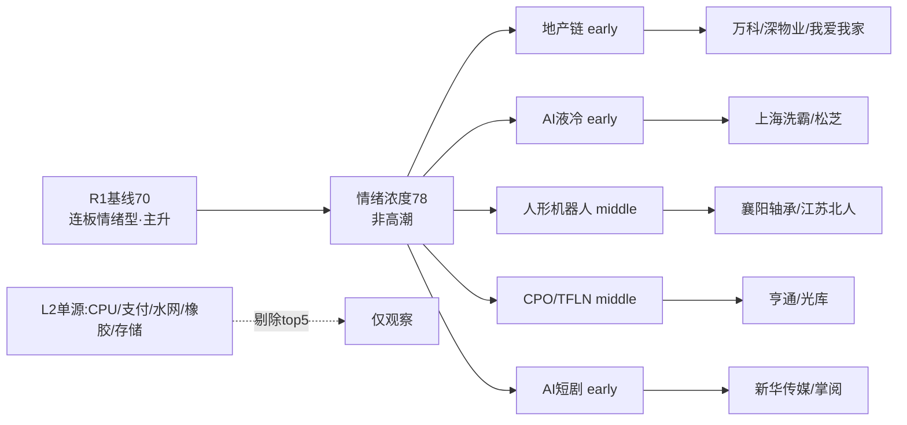

# 2026年10月8日 · 群聊情绪共振

> 数据源新鲜度: partial
> 降级状态: true（R1自身degraded + L1节前口径；L1+L2双源仍成立）
> 置信度: 0.68

## 一句话结论

🧭 主升段位延续但非高潮，情绪浓度 **78**（R1基线70+五条双源共振10-节前口径折2）；地产重启 + AI液冷 + AI短剧三股新钱首日博弈，老主线CPO/机器人分歧中只认前排。

## 详细分析

节前最后一日 52 家涨停、封板率 81%、涨停溢价 +1.66%、连板天梯 7 级、炸板率 18.75%——R1 据此判风格为**连板情绪型**、情绪周期以 0.49 微弱优势落在**主升**，高位震荡（0.39）尾随，情绪基线定 70（贪婪下沿）。这意味着今日可以做多，但**不能用高潮期打法无脑顶中位**：钱只给龙头和低位新题材。R1 建议总仓上限 65%，与本结论一致。

假期 KOL 叙事高度发散，真正与节前热榜（L1）对得上、构成 L1+L2 双源共振的收敛为五条，每条 +2 共加成 10。地产是资金面最硬的一条——节前尾盘资金已抢跑，万科双平台人气 avg_rank 1.5、深物业 A 东财第 3、我爱我家排名 26→8，叠加假期港股地产与深圳地产消息，属**重启首日**而非高位接力。AI 液冷由摩根大通机柜 BOM 上修报告点燃（Vera Rubin Ultra 单柜冷却 9.85 万美元、QD 快接头翻倍），A 股映射刚起步。AI短剧是 C 端真实出圈数据（微博热搜第二、《漂亮的恶意》三集破亿、新华社站台），低位试错性质。

机器人与 CPO 是**老主线分歧段**：物理 AI 有 AMD 收购 World Labs、英伟达开源 GR00T 的新催化，但板块年内反复炒作；CPO 借薄膜铌酸锂分支更新，亨通光电节前却回调 -3.94%。这两条只做右侧确认的前排。

**需要专门提示**：CPU 是假期 KOL 讨论度最高的方向（AMD Venice 2027 产能售罄、Muse 类 Agent 带动 TAM 60% CAGR），但 L1 板块榜上 CPU 无独立热度佐证，按单源不共振红线**不进 top5，仅列观察**，等竞价/盘中资金确认。同理支付牌照、水网、橡胶、存储涨价均为 L2 单源。

### 推理深度三问（Top3）

| 主题 | 大资金意图 | 为什么走强 | 逻辑够不够硬 |
|---|---|---|---|
| 🏠 地产链 | 节前尾盘抢跑+假期持仓博弈，赌节后政策与港股映射 | 人气榜霸榜+港股地产走强+深圳催化 | 中硬：重启首日位置低，但需竞价封单验证承接 |
| 💧 AI液冷 | 借海外大厂机柜BOM上修做新分支卡位 | 功耗倒逼，QD/冷板价值翻倍有数据 | 偏软：业绩兑现2027，纯情绪，龙头封不住即退潮 |
| 🤖 机器人 | 老主线新催化，芯片巨头为"大脑"定价 | AMD/英伟达绑定模型层+出货+300% | 中硬：反复炒作品种，只认前排襄阳轴承等 |

## 关键证据

- 证据1: R1当日基线=70，连板情绪型/主升，涨停52/封板率81%/天梯7/炸板18.75% · 来源 R1_style.json
- 证据2: 万科双平台人气 avg_rank=1.5、深物业A东财第3、我爱我家排名26→8 · 来源 attention管道(L1)+G3/G5(L2)
- 证据3: Vera Rubin Ultra 单柜冷却部件9.85万美元、QD快接头由1.1万升至2.05万美元 · 来源 摩根大通纪要 G2/G3
- 证据4: "看完AI短剧只想说真人短剧完了"微博热搜第二、《漂亮的恶意》三集破亿 · 来源 G2/G5
- 证据5: AMD Venice EPYC 2027产能售罄（CPU，L2单源仅观察）· 来源 G2/G5 + 国海/华福路演

## 数据源审计

| 源 | 状态 | 抓取时间 | 记录数 | 备注 |
|---|---|---|---|---|
| R1_style基线 | 🟡 | 2026-10-08 | 70分 | 当日已落盘，自身degraded但分数可用 |
| L1 Tushare热榜 | 🟡 | 2026-09-30 | 57合力 | 节前收盘口径，盘前最新 |
| L2 wechat五群 | 🟢 | 2026-10-08 00:19 | 121 | 五群全部ok |
| WeFlow | 🔴 | — | — | 永久下线 |

## 不确定性 / 反证

主升判定置信度仅 0.49，高位震荡 0.39 几乎并列，若今日竞价高标核按钮、炸板率冲到 35% 以上，应立即把情绪下调为震荡并砍半候选。地产若高开低走、封单无承接，则"重启首日"证伪，不追。液冷/短剧为纯情绪新题材，一日游概率不低，错了隔日快切。L1 为节前口径，若今日盘中热榜与节前显著背离，应以盘中榜为准重估。

## 与其他 R/D/E 的关系

- 依赖: data/research/20261008/R1_style.json（当日情绪基线）、data/raw/20261008/wechat_cli_5groups.jsonl、data/research/20260930/attention_signals.json
- 被消费: D1(main_decision)、R6(反证)、E1(复盘)
- 说明: CPU/支付等L2单源主题请D1结合R7资金面再裁定，R3不越权给正分。

## Sub-Agent 元数据

- skill: analyze_sentiment_resonance_v1
- artifact: data/research/20261008/R3_sentiment.json
- model: ark-code-latest
- 共振模式: L1+L2（WeFlow下线后最高等级）
