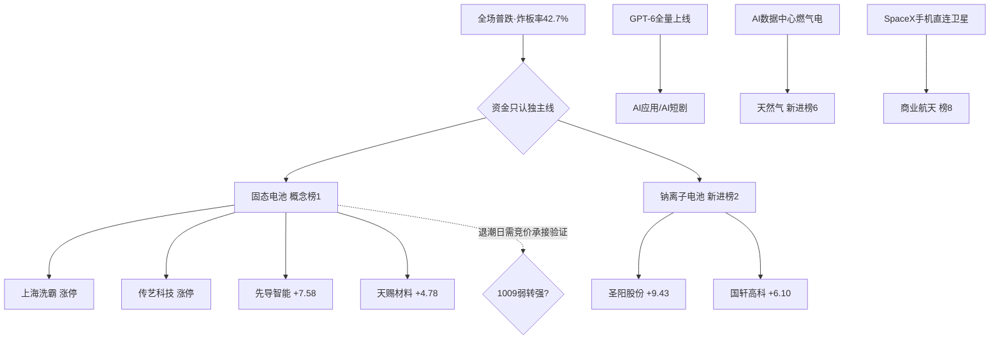

# 2026-10-09 · 群聊情绪共振（L1+L2 双源）

> **数据源新鲜度**: partial（L1=1008收盘口径）
> **降级状态**: true（WeFlow永久下线）
> **置信度**: 0.60

## 一句话结论

全场退潮、独主线独活：情绪浓度 50，只认新能源链龙一弱转强，其余热点一律观察、不开新仓。

## 情绪浓度与段位

R1 当日基线 **48 分**（高位震荡偏退潮，仓位上限 0.35）。R3 不推翻段位，仅作微调：5 条 L1+L2 双源共振里，独主线新能源链被热榜与 KOL 同时确认，给予聚焦溢价 **+5**；创新药榜位 1→3 且当日 -2.16% 的退潮信号扣分 **−3**，最终 **50 分**。

炸板率 42.7%（破 40% 退潮线）、昨日涨停溢价 -1.85%（接力隔日亏钱）、3748 只下跌——按纪律，情绪明确标注 **震荡/主跌边缘**，候选数量砍半，只做龙一确认，不做中位补涨、不抄底科技。

## 共振传导图

## L1+L2 双源共振 Top5

| 排名 | 主题 | 榜位变化 | 阶段 | 态度 |
|---|---|---|---|---|
| 1 | 🔋 固态电池/新型电池 | 概念榜 3→1 | middle | **进**（仅龙一弱转强） |
| 2 | 🧂 钠离子电池 | 新进榜 2 | early | 观察偏进（让位于龙一） |
| 3 | 🤖 AI应用/AI短剧 | AI应用榜 13（持平） | early | 观察（有催化无强势板） |
| 4 | ⛽ 天然气/AI燃气供电 | 新进榜 6 | early | 观察（单票映射） |
| 5 | 🛰️ 商业航天/手机直连 | 榜 8（7→8） | middle | 观察（板块当日走弱） |

### ① 固态电池/新型电池（唯一可进方向）

- **大资金意图**：普跌日资金无处可去，抱团到有政策（十五五规划 2030 全固态规模化）+ 有排产（10 月头部 6 厂 214.6GWh、同比 +57%）双重背书的逆势方向，属于防御性抱团而非全场进攻。
- **为什么走强**：概念榜 3→1、热度 17307→99797，上海洗霸/传艺科技/龙蟠科技涨停，是全场唯一兼具榜位、板型与基本面排产的方向。
- **逻辑够不够硬**：产业逻辑硬，但建立在退潮日独苗基础上，宽度不足；**进的前提是 1009 竞价龙一有承接、弱转强**，否则主线不成立。

**买入理由**：独主线 + 政策落地 + 排产高增 + 涨停板块分布一致。
**风险点**：八板高标若核按钮，情绪正式滑入主跌，接力票全部承压。
**止损条件**：龙一低开无承接或盘中跌破竞价低点即撤；总仓严守 ≤35%。
**可验证假设**：固态电池板块竞价溢价为正、涨停票封单不撤、炸板率回落至 40% 以下。

### ② 钠离子电池 —— early

与固态电池同属新能源链，圣阳股份 +9.43、国轩高科 +6.10。题材跟随性质强，独立持续性待验证，**优先让位于固态电池龙一**，只在龙一强势时考虑最强承接票。

### ③ AI应用/AI短剧 —— early

GPT-6 全量上线（覆盖 12 亿周活）、国庆档票房仅去年一半、AI 剧成本 1/20、留存 90%。产业催化硬，但 A 股 AI 应用当日 -2.05、无强势板，科技退潮日不开新仓，等 R2/R5 落点与 R7 资金确认。

### ④ 天然气/AI 数据中心自备燃气供电 —— early

海外 AI 数据中心表后供电趋势，水发燃气进入 GE Vernova/西门子/三菱供应链。逻辑新、标的稀缺但板块宽度不足，单票映射，列观察。

### ⑤ 商业航天/手机直连卫星 —— middle

FCC 批准 SpaceX 1.5 万颗直连卫星（S 波段、330 公里低轨）。顺灏股份涨停、西部材料 +8.45，但板块当日 -1.62、合力不足，不追。

## 单源红线处理（不进 Top5）

**仅 L2（KOL 热、热榜无板块佐证）**：AI PC/端侧AI（春秋电子）、金属镁/稀土/铋反制（宝武镁业、东江环保）、华为刹车踏板（宁波高发）、莱茵河断航维生素（浙江医药、新和成）、数据中心液冷（维尔利）——按红线 3 不算强共振，降为观察，交 D1 结合 R7 资金面裁定。

**仅 L1（热榜有、KOL 无方向）**：粮食概念（金健米业热股第2）、煤化工（金牛化工涨停）不算共振。风电/海风（大金重工热股第3、盘后仅一条汇总）接近共振但 L2 偏弱，列观察。

## 关键证据

- 证据 1: 固态电池概念榜 3→1、热度翻 5.7 倍 · 来源 tushare ths_hot
- 证据 2: 头部电池厂 10 月排产 214.6GWh 同比 +57%、VC 高位不跌价 · 来源 G2 机构调研
- 证据 3: 全场炸板率 42.7%、涨停溢价 -1.85%、3748 只下跌 · 来源 R1（1008收盘）
- 证据 4: CPO/光模块榜第4但当日 -4.17%、东山精密/源杰科技跌停（FCC 10/13 新规）· 负向热度不作共振
- 证据 5: 创新药 0930 霸榜第1 → 1008 第3 且 -2.16% · 前主线退潮

## 数据源审计

| 源 | 状态 | 抓取口径 | 记录数 | 备注 |
|---|---|---|---|---|
| R1_style | 🟢 ok | 1009 06:35 | 1 | 基线48，非降级 |
| wechat_cli 5群 | 🟢 ok | 1008全天 | 396 | G1–G5 全部匿名化 |
| tushare ths_hot | 🟢 ok | 1008 22:30收盘 | 100 | 概念板块+热股 |
| attention_signals | 🟢 ok | 1008 | 57合力/24跳升 | 多平台人气底座 |
| WeFlow | 🔴 error | — | 0 | 永久下线，L1+L2即最高 |
| XTick | ⚪ 未调用 | — | — | L1以tushare为准 |

## 不确定性 / 反证

独主线判断高度依赖 1008 单日逆势表现，退潮日的逆势方向次日常见补跌；固态电池若竞价不能弱转强，则全场无主线、应直接进入空仓模式。CPO 负向热度是否在 FCC 新规落地（10/13）前持续出清，也会压制科技整体情绪。R3 的 50 分是“聚焦溢价”与“退潮扣分”对冲后的结果，并非情绪改善。

## 与其他 R/D/E 的关系

- **依赖**: R1_style（当日基线48）、attention_signals、wechat_cli_5groups、tushare热榜
- **被消费**: D1（主决策·只做固态电池龙一弱转强）、R6（反证可读本件）、E1（复盘对照）
- **边界**: 不做板块排序(R2)、不做个股画像(R5)，Top3–5 仅给观察方向不给个股结论。

## Sub-Agent 元数据

- skill: analyze_sentiment_resonance_v1
- artifact: data/research/20261009/R3_sentiment.json
- model: ark-code-latest
- method: llm_v1 · L1+L2 双源（WeFlow下线）
