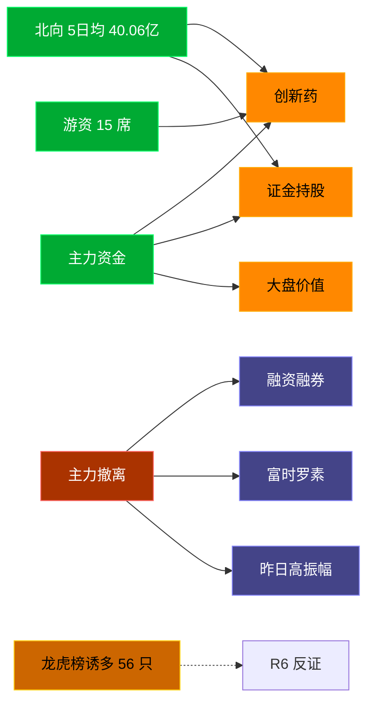

# 2026-07-07 · **资金面**

> **数据源新鲜度**: partial
> **降级状态**: true (xtick 全域 DOWN → Tushare fallback)
> **置信度**: 0.75

## 一句话结论
北向近 5 日均 40.06亿维持健康区间，主力集中「创新药/证金持股」；资金撤离端 top1「融资融券」，龙虎榜诱多 56 只需警惕。

## 资金流转拓扑图

## 详细分析

**1) 北向时序**
最新净流入 39.63 亿；5 日均 40.06 亿，20 日均 40.57 亿。近 5 日: 0629 42.7 → 0630 36.5 → 0702 42.4 → 0703 39.1 → 0706 39.6。整体维持 35-45 亿健康区间，无明显撤离。

**2) 主力板块 (concept · REF_DATE=20260706)**
- 流入 TOP10：创新药 +26.6亿 / 证金持股 +24.6亿 / 大盘价值 +22.9亿 / 红利股 +22.1亿 / 金融地产风格 +19.6亿 / 阿里概念 +18.0亿 / 破净股 +16.3亿 / 单抗概念 +15.9亿 / 减肥药 +15.4亿 / 医药医疗风格 +15.0亿
- 流出 TOP10：融资融券 -830.1亿 / 富时罗素 -543.9亿 / 昨日高振幅 -539.8亿 / 深股通 -467.5亿 / MSCI中国 -380.3亿 / 沪股通 -360.5亿 / 深成500 -330.1亿 / 标准普尔 -327.6亿 / 东方财富热股 -307.1亿 / 百元股 -301.1亿

**大资金意图**: 从流入端「创新药 / 证金持股 / 大盘价值」的结构看，主力仍在防御 + 政策主线间做双线布局；非趋势瓦解，是资金再分配。
**为什么走强**: 创新药 连续多日排名靠前 + 北向配合，说明是有配置盘认可的方向，不是纯短线炒作。
**逻辑够不够硬**: xtick DOWN → 无实时超大单验证，Tushare 数据 T+1 存在延迟；建议 D1 侧以「板块方向」而非「精准金额」使用。

**3) 昨日前十 5 日追踪 (核心)**
- **创新药**: 0630:-22.7 → 0701:+18.9 → 0702:+10.6 → 0703:+18.3 → 0706:+26.6 亿 | 累计 +51.7 亿 · 正流入 4/5 · **加速流入**
- **证金持股**: 0630:+9.6 → 0701:+60.5 → 0702:-59.5 → 0703:+41.8 → 0706:+24.6 亿 | 累计 +77.0 亿 · 正流入 4/5 · **持续净入**
- **大盘价值**: 0630:-34.5 → 0701:+30.9 → 0702:+14.3 → 0703:+22.1 → 0706:+22.9 亿 | 累计 +55.8 亿 · 正流入 4/5 · **加速流入**
- **红利股**: 0630:-16.9 → 0701:+3.8 → 0702:+14.0 → 0703:+8.4 → 0706:+22.1 亿 | 累计 +31.4 亿 · 正流入 4/5 · **加速流入**
- **金融地产风格**: 0630:-12.5 → 0701:+115.3 → 0702:-28.6 → 0703:+2.7 → 0706:+19.6 亿 | 累计 +96.5 亿 · 正流入 3/5 · **加速流入**
- **阿里概念**: 0630:+25.4 → 0701:-51.3 → 0702:-66.2 → 0703:-4.1 → 0706:+18.0 亿 | 累计 -78.3 亿 · 正流入 2/5 · **流入衰减**
- **破净股**: 0630:-32.3 → 0701:+41.6 → 0702:-1.1 → 0703:+3.8 → 0706:+16.3 亿 | 累计 +28.4 亿 · 正流入 3/5 · **加速流入**
- **单抗概念**: 0630:-4.7 → 0701:+13.5 → 0702:+8.8 → 0703:+9.2 → 0706:+15.9 亿 | 累计 +42.7 亿 · 正流入 4/5 · **加速流入**
- **减肥药**: 0630:-10.1 → 0701:+10.1 → 0702:+1.5 → 0703:+11.3 → 0706:+15.4 亿 | 累计 +28.2 亿 · 正流入 4/5 · **加速流入**
- **医药医疗风格**: 0630:-23.0 → 0701:+20.0 → 0702:+9.1 → 0703:+19.2 → 0706:+15.0 亿 | 累计 +40.2 亿 · 正流入 4/5 · **持续净入**

**4) 游资 (龙虎榜 · 20260706)**
具名活跃席位 15 席，3 日协同信号 51 条。TOP 5:
- 量化基金: 净额 193130.8 万，覆盖 45 票
- 量化打板: 净额 92315.4 万，覆盖 15 票
- 紫阳东路: 净额 37272.9 万，覆盖 4 票
- 章盟主: 净额 13353.2 万，覆盖 2 票
- 温州帮: 净额 -10971.1 万，覆盖 10 票

**5) 龙虎榜诱多识别 (核心)**
当日总计 95 只上榜，命中诱多规则 **56 只**。前 10：

| 代码 | 名称 | 涨幅 | 换手 | 龙虎榜净额(万) | 机构净额(万) | 模式 | 上榜原因 |
|---|---|---|---|---|---|---|---|
| 000301.SZ | 东方盛虹 | +10.04% | 1.8% | -33004 | -8438 | 涨停净卖出 + 机构专用净卖 | 日涨幅偏离值达到7%的前5只证券 |
| 688103.SH | 国力电子 | +16.78% | 9.5% | -4089 | -1566 | 涨停净卖出 + 机构专用净卖 + 疑似对倒:高盛(中国)证券有限… | 有价格涨跌幅限制的连续3个交易日内收盘价格涨幅偏离值累计达到30%的证券 |
| 688689.SH | 银河微电 | +18.70% | 12.4% | -2235 | +0 | 涨停净卖出 + 疑似对倒:摩根大通证券(中国)… | 有价格涨跌幅限制的日收盘价格涨幅达到15%的前五只证券 |
| 300716.SZ | *ST泉为 | +19.07% | 8.1% | -1468 | +2379 | 涨停净卖出 + 疑似对倒:中信建投证券股份有限… | 连续三个交易日内，涨幅偏离值累计达到30%的证券 |
| 128119.SZ | 龙大转债 | +20.00% | 0.0% | -710 | +0 | 涨停净卖出 + 疑似对倒:方正证券股份有限公司… | 连续三个交易日内，涨幅偏离值累计达到30%的可转债 |
| 600105.SH | 永鼎股份 | -8.22% | 10.7% | -38116 | -136610 | 机构专用净卖 | 有价格涨跌幅限制的日价格振幅达到15%的前五只证券 |
| 300684.SZ | 中石科技 | +20.00% | 22.8% | +1831 | -31128 | 机构专用净卖 | 日涨幅达到15%的前5只证券 |
| 300684.SZ | 中石科技 | +20.00% | 22.8% | +14321 | -31128 | 机构专用净卖 | 连续三个交易日内，涨幅偏离值累计达到30%的证券 |
| 000938.SZ | 紫光股份 | +10.01% | 11.0% | +35726 | -22189 | 机构专用净卖 | 日涨幅偏离值达到7%的前5只证券 |
| 000657.SZ | 中钨高新 | -10.00% | 7.5% | +7474 | -18990 | 机构专用净卖 | 日跌幅偏离值达到7%的前5只证券 |

**6) 板块跷跷板**
_未检出显著跷跷板配对。_

**7) ETF / 期货**
ETF 净流入 -12.67 亿(4 只代表)；股指期货基差: -88.8。

## 关键证据
- 主力流入 top1 创新药 +26.6 亿 · 来源 tushare.moneyflow_ind_dc
- 5 日追踪：创新药 累计 51.69 亿, 4/5 日正流入
- 流出 top1 融资融券 -830.1 亿 · 来源 tushare.moneyflow_ind_dc
- 龙虎榜诱多 56 只，其中「涨停净卖出」5 只 · 来源 tushare.top_list+top_inst
- 游资 3 日协同 51 条 · 来源 tushare.hm_detail

## 数据源审计
| 源 | 状态 | 抓取日期 | 备注 |
|---|---|---|---|
| tushare.moneyflow_hsgt | 🟢 ok | 20260706 | 20 日北向 |
| tushare.moneyflow_ind_dc | 🟢 ok | 20260706 | 概念板块 5 日 |
| tushare.top_list | 🟢 ok | 20260706 | 95 行 |
| tushare.top_inst | 🟢 ok | 20260706 | 985 席位 |
| tushare.hm_detail | 🟢 ok | 20260706 | 15 具名席位 |
| xtick(canghai-sise) | 🔴 DOWN | — | 全域降级 |
| DataPro | 🟡 up 未调 | — | 非 LLM cron 环境 |

## 不确定性 / 反证
- 参考交易日 20260706，非当日实时；盘中若大级别政策/外围事件本判断失效。
- 龙虎榜诱多规则为静态启发式，未剔除 T+1 高开对冲情形，可能高估诱多密度；供 R6 反证参考，不作 hard_reject。
- xtick 全域 DOWN 导致主力/游资维度无实时超大单，Tushare hm_detail 存在 T+1 延迟。
- 5 日追踪只跟踪昨日 top10，若今日风格切换到昨日 top20+ 板块，本追踪盲区。
- ETF 净流入基于 4 只代表 ETF 份额×收盘价估算，非真实一级市场资金流水。

## 与其他 R/D/E 的关系
- 依赖: data/raw/20260707/manifest.json, mcp_health.json; data/research/20260707/R1_style.json
- 被消费: D1(main_decision_v1) · R2(analyze_main_sectors_v1) · R5(analyze_stock_profile_v1) · R6(analyze_devil_advocate_v1)

## Sub-Agent 元数据
- skill: analyze_capital_flow_v1
- artifact: /Users/chenyang/Downloads/demo/沧海巨浪/data/research/20260707/R7_capital_flow.json
- 生成方式: enrich_r7_20260707.py (增量补齐 sector_5d_tracking + lhb_bull_trap + mermaid)
- model: ark-code-latest
