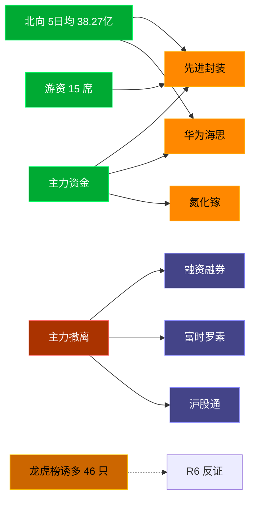

# 2026-07-08 · **资金面**

> **数据源新鲜度**: partial
> **降级状态**: true (xtick 全域 DOWN → Tushare fallback)
> **置信度**: 0.75

## 一句话结论
北向近 5 日均 38.27亿维持健康区间，主力集中「先进封装/华为海思」；资金撤离端 top1「融资融券」，龙虎榜诱多 46 只需警惕。

## 资金流转拓扑图

## 详细分析

**1) 北向时序**
最新净流入 33.7 亿；5 日均 38.27 亿，20 日均 40.23 亿。近 5 日: 0630 36.5 → 0702 42.4 → 0703 39.1 → 0706 39.6 → 0707 33.7。整体维持 30-45 亿健康区间，无明显撤离。

**2) 主力板块 (concept · REF_DATE=20260707)**
- 流入 TOP10：先进封装 +37.6亿 / 华为海思 +34.9亿 / 氮化镓 +26.7亿 / 中芯概念 +20.4亿 / IGBT概念 +18.0亿 / 碳化硅 +16.8亿 / 抖音概念(字节概念) +14.2亿 / 文娱消费 +11.9亿 / 蓝宝石 +9.6亿 / LED概念 +8.9亿
- 流出 TOP10：融资融券 -758.2亿 / 富时罗素 -416.1亿 / 沪股通 -411.0亿 / 深股通 -393.8亿 / MSCI中国 -364.6亿 / 昨日高振幅 -351.2亿 / 标准普尔 -307.6亿 / 大盘股 -289.9亿 / HS300_ -243.6亿 / 创业板综 -242.0亿

**大资金意图**: 从流入端「先进封装 / 华为海思 / 氮化镓」的结构看，主力在半导体产业链国产替代主线上做集中加仓；非趋势瓦解，是资金再分配。
**为什么走强**: 先进封装 连续多日排名靠前 + 北向配合，说明是有配置盘认可的方向，不是纯短线炒作。
**逻辑够不够硬**: xtick DOWN → 无实时超大单验证，Tushare 数据 T+1 存在延迟；建议 D1 侧以「板块方向」而非「精准金额」使用。

**3) 昨日前十 5 日追踪 (核心)**
- **先进封装**: 0701:-111.0 → 0702:-160.9 → 0703:-60.1 → 0706:-26.7 → 0707:+37.6 亿 | 累计 -321.1 亿 · 正流入 1/5 · **持续净入**
- **华为海思**: 0701:-11.9 → 0702:-64.0 → 0703:-28.0 → 0706:-17.9 → 0707:+34.9 亿 | 累计 -86.9 亿 · 正流入 1/5 · **持续净入**
- **氮化镓**: 0701:-44.2 → 0702:-57.5 → 0703:-38.0 → 0706:-23.3 → 0707:+26.7 亿 | 累计 -136.2 亿 · 正流入 1/5 · **持续净入**
- **中芯概念**: 0701:-71.1 → 0702:-220.2 → 0703:-140.8 → 0706:-77.8 → 0707:+20.4 亿 | 累计 -489.4 亿 · 正流入 1/5 · **持续净入**
- **IGBT概念**: 0701:-26.0 → 0702:-88.4 → 0703:-33.7 → 0706:-18.7 → 0707:+18.0 亿 | 累计 -148.8 亿 · 正流入 1/5 · **持续净入**
- **碳化硅**: 0701:-65.1 → 0702:-71.1 → 0703:-50.3 → 0706:-20.5 → 0707:+16.8 亿 | 累计 -190.2 亿 · 正流入 1/5 · **持续净入**
- **抖音概念(字节概念)**: 0701:-41.9 → 0702:-33.8 → 0703:-9.3 → 0706:-8.9 → 0707:+14.2 亿 | 累计 -79.8 亿 · 正流入 1/5 · **持续净入**
- **文娱消费**: 0701:+5.3 → 0702:+23.5 → 0703:-24.0 → 0706:-8.8 → 0707:+11.9 亿 | 累计 +7.9 亿 · 正流入 3/5 · **持续净入**
- **蓝宝石**: 0701:-51.3 → 0702:-63.2 → 0703:-32.1 → 0706:-27.1 → 0707:+9.6 亿 | 累计 -164.1 亿 · 正流入 1/5 · **持续净入**
- **LED概念**: 0701:-123.7 → 0702:-67.2 → 0703:-67.5 → 0706:-56.5 → 0707:+8.9 亿 | 累计 -306.0 亿 · 正流入 1/5 · **持续净入**

**4) 游资 (龙虎榜 · 20260707)**
具名活跃席位 15 席，3 日协同信号 47 条。TOP 5:
- 佛山系: 净额 28436.3 万，覆盖 2 票
- 紫阳东路: 净额 27102.5 万，覆盖 1 票
- 曲江池: 净额 -14486.8 万，覆盖 1 票
- 量化打板: 净额 13393.4 万，覆盖 12 票
- 量化基金: 净额 -11689.9 万，覆盖 32 票

**5) 龙虎榜诱多识别 (核心)**
当日总计 90 只上榜，命中诱多规则 **46 只**。前 10：

| 代码 | 名称 | 涨幅 | 换手 | 龙虎榜净额(万) | 机构净额(万) | 模式 | 上榜原因 |
|---|---|---|---|---|---|---|---|
| 600288.SH | 大恒科技 | +9.97% | 27.8% | -19254 | +0 | 涨停净卖出 | 有价格涨跌幅限制的日换手率达到20%的前五只证券 |
| 300745.SZ | 欣锐科技 | +12.72% | 14.5% | -12988 | +93 | 涨停净卖出 | 连续三个交易日内，涨幅偏离值累计达到30%的证券 |
| 920527.BJ | 夜光明 | +25.06% | 16.3% | -1220 | +0 | 涨停净卖出 + 疑似对倒:方正证券股份有限公司… | 当日收盘价涨幅达到20%的前5只股票 |
| 002747.SZ | 埃斯顿 | +6.45% | 22.5% | -30398 | -17892 | 机构专用净卖 | 连续三个交易日内，涨幅偏离值累计达到20%的证券 |
| 002767.SZ | 先锋电子 | -6.75% | 12.7% | -3626 | -7741 | 机构专用净卖 | 日振幅值达到15%的前5只证券 |
| 603757.SH | 大元泵业 | -6.33% | 11.3% | -13197 | -6916 | 机构专用净卖 + 疑似对倒:高盛(中国)证券有限… | 有价格涨跌幅限制的日价格振幅达到15%的前五只证券 |
| 000949.SZ | 新乡化纤 | -10.03% | 4.9% | -3629 | -6763 | 机构专用净卖 | 日跌幅偏离值达到7%的前5只证券 |
| 000007.SZ | 全新好 | -10.02% | 4.8% | -2702 | -5898 | 机构专用净卖 | 日振幅值达到15%的前5只证券 |
| 603538.SH | 美诺华 | +5.10% | 33.2% | -4186 | -4616 | 机构专用净卖 + 疑似对倒:摩根大通证券(中国)… | 有价格涨跌幅限制的日换手率达到20%的前五只证券 |
| 000962.SZ | 东方钽业 | -6.38% | 6.5% | +14770 | -4049 | 机构专用净卖 | 连续三个交易日内，跌幅偏离值累计达到20%的证券 |

**6) 板块跷跷板**
_未检出显著跷跷板配对。_

**7) ETF / 期货**
ETF 净流入 -3.82 亿(4 只代表)；股指期货基差: -88.86。

## 关键证据
- 主力流入 top1 先进封装 +37.6 亿 · 来源 tushare.moneyflow_ind_dc
- 5 日追踪：先进封装 累计 -321.08 亿, 1/5 日正流入
- 流出 top1 融资融券 -758.2 亿 · 来源 tushare.moneyflow_ind_dc
- 龙虎榜诱多 46 只，其中「涨停净卖出」3 只 · 来源 tushare.top_list+top_inst
- 游资 3 日协同 47 条 · 来源 tushare.hm_detail

## 数据源审计
| 源                        | 状态       | 抓取日期     | 备注            |
| ------------------------ | -------- | -------- | ------------- |
| tushare.moneyflow_hsgt   | 🟢 ok    | 20260707 | 20 日北向        |
| tushare.moneyflow_ind_dc | 🟢 ok    | 20260707 | 概念板块 5 日      |
| tushare.top_list         | 🟢 ok    | 20260707 | 90 行          |
| tushare.top_inst         | 🟢 ok    | 20260707 | 925 席位        |
| tushare.hm_detail        | 🟢 ok    | 20260707 | 15 具名席位       |
| xtick(canghai-sise)      | 🔴 DOWN  | —        | 全域降级          |
| DataPro                  | 🟡 up 未调 | —        | 非 LLM cron 环境 |

## 不确定性 / 反证
- 参考交易日 20260707，非当日实时；盘中若大级别政策/外围事件本判断失效。
- 龙虎榜诱多规则为静态启发式，未剔除 T+1 高开对冲情形，可能高估诱多密度；供 R6 反证参考，不作 hard_reject。
- xtick 全域 DOWN 导致主力/游资维度无实时超大单，Tushare hm_detail 存在 T+1 延迟。
- 5 日追踪只跟踪昨日 top10，若今日风格切换到昨日 top20+ 板块，本追踪盲区。
- ETF 净流入基于 4 只代表 ETF 份额×收盘价估算，非真实一级市场资金流水。

## 与其他 R/D/E 的关系
- 依赖: data/raw/20260708/manifest.json, mcp_health.json; data/research/20260708/R1_style.json
- 被消费: D1(main_decision_v1) · R2(analyze_main_sectors_v1) · R5(analyze_stock_profile_v1) · R6(analyze_devil_advocate_v1)

## Sub-Agent 元数据
- skill: analyze_capital_flow_v1
- artifact: /Users/chenyang/Downloads/demo/沧海巨浪/data/research/20260708/R7_capital_flow.json
- 生成方式: enrich_r7_20260708.py (增量补齐 sector_5d_tracking + lhb_bull_trap + mermaid)
- model: ark-code-latest
