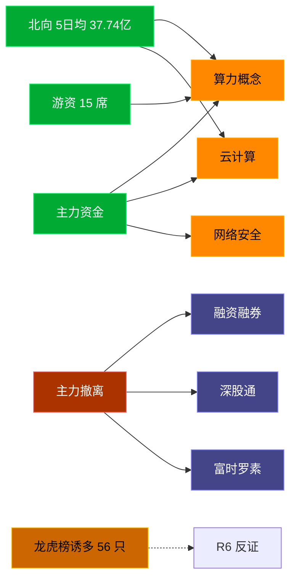

# 2026-07-09 · **资金面**

> **数据源新鲜度**: partial
> **降级状态**: true (xtick 全域 DOWN → Tushare fallback)
> **置信度**: 0.75

## 一句话结论
北向近 5 日均 37.74 亿维持健康区间，主力集中「算力概念/云计算」；资金撤离端 top1「融资融券」，龙虎榜诱多 56 只需警惕。

## 资金流转拓扑图

## 详细分析

**1) 北向时序**
最新净流入 33.84 亿；5 日均 37.74 亿，20 日均 40.07 亿。近 5 日: 0702 42.4 → 0703 39.1 → 0706 39.6 → 0707 33.7 → 0708 33.8。整体维持健康区间，无明显撤离。

**2) 主力板块 (concept · REF_DATE=20260708)**
- 流入 TOP10：算力概念 +135.9亿 / 云计算 +95.5亿 / 网络安全 +78.9亿 / 车联网(车路云) +70.1亿 / 大数据 +57.5亿 / 边缘计算 +55.9亿 / 数字经济 +53.8亿 / 互联网服务 +50.9亿 / 英伟达概念 +48.1亿 / DeepSeek概念 +46.4亿
- 流出 TOP10：融资融券 -683.0亿 / 深股通 -382.2亿 / 富时罗素 -356.8亿 / 昨日高振幅 -290.2亿 / 沪股通 -288.5亿 / 半导体概念 -286.9亿 / 标准普尔 -270.9亿 / MSCI中国 -262.0亿 / 电池技术 -256.4亿 / 深成500 -246.7亿

**大资金意图**: 从流入端「算力概念 / 云计算 / 网络安全」的结构看，主力集中加仓强势主线；非趋势瓦解，是资金再分配。
**为什么走强**: 算力概念 昨日排名居首 + 北向配合，说明有配置盘认可，不是纯短线炒作。
**逻辑够不够硬**: xtick DOWN → 无实时超大单验证，Tushare 数据 T+1 存在延迟；建议 D1 以「板块方向」而非「精准金额」使用。

**3) 昨日前十 5 日追踪 (核心)**
- **算力概念**: 0702:-257.3 → 0703:-23.9 → 0706:-93.4 → 0707:-47.3 → 0708:+135.9 亿 | 累计 -286.1 亿 · 正流入 1/5 · **持续净入**
- **云计算**: 0702:-103.8 → 0703:-4.6 → 0706:-20.7 → 0707:-67.8 → 0708:+95.5 亿 | 累计 -101.5 亿 · 正流入 1/5 · **持续净入**
- **网络安全**: 0702:-67.8 → 0703:+1.5 → 0706:-14.4 → 0707:-50.3 → 0708:+78.9 亿 | 累计 -52.1 亿 · 正流入 2/5 · **持续净入**
- **车联网(车路云)**: 0702:-39.7 → 0703:+36.3 → 0706:-17.0 → 0707:-33.7 → 0708:+70.1 亿 | 累计 +16.0 亿 · 正流入 2/5 · **持续净入**
- **大数据**: 0702:-144.6 → 0703:-36.4 → 0706:-68.5 → 0707:-99.7 → 0708:+57.5 亿 | 累计 -291.7 亿 · 正流入 1/5 · **持续净入**
- **边缘计算**: 0702:-36.1 → 0703:+12.0 → 0706:-27.7 → 0707:-16.4 → 0708:+55.9 亿 | 累计 -12.4 亿 · 正流入 2/5 · **持续净入**
- **数字经济**: 0702:-11.8 → 0703:+15.5 → 0706:+11.2 → 0707:-28.9 → 0708:+53.8 亿 | 累计 +39.7 亿 · 正流入 3/5 · **持续净入**
- **互联网服务**: 0702:-23.7 → 0703:-15.4 → 0706:-15.9 → 0707:-37.4 → 0708:+50.9 亿 | 累计 -41.5 亿 · 正流入 1/5 · **持续净入**
- **英伟达概念**: 0702:-86.2 → 0703:+20.0 → 0706:-23.8 → 0707:-32.3 → 0708:+48.1 亿 | 累计 -74.2 亿 · 正流入 2/5 · **持续净入**
- **DeepSeek概念**: 0702:-70.9 → 0703:-12.7 → 0706:-17.5 → 0707:-42.1 → 0708:+46.4 亿 | 累计 -96.8 亿 · 正流入 1/5 · **持续净入**

**4) 游资 (龙虎榜 · 20260708)**
具名活跃席位 15 席，3 日协同信号 37 条。TOP 5:
- 量化基金: 净额 79740.4 万，覆盖 36 票
- 量化打板: 净额 38946.0 万，覆盖 10 票
- T王: 净额 17084.8 万，覆盖 31 票
- 欢乐海岸: 净额 -12443.1 万，覆盖 2 票
- 红岭路: 净额 11261.8 万，覆盖 2 票

**5) 龙虎榜诱多识别 (核心)**
当日总计 93 只上榜，命中诱多规则 **56 只**。前 10：

| 代码 | 名称 | 涨幅 | 换手 | 龙虎榜净额(万) | 机构净额(万) | 模式 | 上榜原因 |
|---|---|---|---|---|---|---|---|
| 301251.SZ | 威尔高 | +19.99% | 29.6% | -3190 | -26168 | 涨停净卖出 + 机构专用净卖 + 疑似对倒:广发证券股份有限公司… | 日涨幅达到15%的前5只证券 |
| 688508.SH | 芯朋微 | +16.80% | 15.4% | -5116 | -16722 | 涨停净卖出 + 机构专用净卖 + 疑似对倒:高盛(中国)证券有限… | 有价格涨跌幅限制的日收盘价格涨幅达到15%的前五只证券 |
| 603137.SH | 恒尚节能 | +9.99% | 25.5% | -1527 | -4844 | 涨停净卖出 + 机构专用净卖 | 非S证券连续三个交易日内收盘价格涨幅偏离值累计达到20%的证券 |
| 603137.SH | 恒尚节能 | +9.99% | 25.5% | -1519 | -4844 | 涨停净卖出 + 机构专用净卖 | 有价格涨跌幅限制的日换手率达到20%的前五只证券 |
| 603183.SH | 建研院 | +10.05% | 11.3% | -1420 | -1219 | 涨停净卖出 + 机构专用净卖 + 疑似对倒:高盛(中国)证券有限… | 有价格涨跌幅限制的日收盘价格涨幅偏离值达到7%的前五只证券 |
| 301520.SZ | 万邦医药 | +13.25% | 44.9% | -726 | -428 | 涨停净卖出 | 日换手率达到30%的前5只证券 |
| 001365.SZ | 天海电子 | +10.01% | 36.7% | -3818 | +2605 | 涨停净卖出 + 换手异常且净卖出 + 疑似对倒:中泰证券股份有限公司… | 日换手率达到20%的前5只证券 |
| 920088.BJ | 科力股份 | +11.13% | 20.4% | -1665 | +0 | 涨停净卖出 + 疑似对倒:国信证券股份有限公司… | 当日换手率达到20%的前5只股票 |
| 002910.SZ | 庄园牧场 | +10.00% | 18.2% | -538 | +1497 | 涨停净卖出 + 疑似对倒:招商证券股份有限公司… | 连续三个交易日内，涨幅偏离值累计达到20%的证券 |
| 603678.SH | 火炬电子 | -9.99% | 7.9% | +13602 | -81870 | 机构专用净卖 | 非S证券连续三个交易日内收盘价格跌幅偏离值累计达到20%的证券 |

**6) 板块跷跷板**
_未检出显著跷跷板配对。_

**7) ETF / 期货**
ETF 净流入 31.17 亿(4 只代表)；股指期货基差: -87.53。

## 关键证据
- 主力流入 top1 算力概念 +135.9 亿 · 来源 tushare.moneyflow_ind_dc
- 5 日追踪：算力概念 累计 -286.15 亿, 1/5 日正流入
- 流出 top1 融资融券 -683.0 亿 · 来源 tushare.moneyflow_ind_dc
- 龙虎榜诱多 56 只，其中「涨停净卖出」9 只 · 来源 tushare.top_list+top_inst
- 游资 3 日协同 37 条 · 来源 tushare.hm_detail

## 数据源审计
| 源 | 状态 | 抓取日期 | 备注 |
|---|---|---|---|
| tushare.moneyflow_hsgt | 🟢 ok | 20260708 | 20 日北向 |
| tushare.moneyflow_ind_dc | 🟢 ok | 20260708 | 概念板块 5 日 |
| tushare.top_list | 🟢 ok | 20260708 | 93 行 |
| tushare.top_inst | 🟢 ok | 20260708 | 953 席位 |
| tushare.hm_detail | 🟢 ok | 20260708 | 15 具名席位 |
| xtick(canghai-sise) | 🔴 DOWN | — | 全域降级 |
| DataPro | 🟡 up 未调 | — | 非 LLM cron 环境 |

## 不确定性 / 反证
- 参考交易日 20260708，非当日实时；盘中若大级别政策/外围事件本判断失效。
- 龙虎榜诱多规则为静态启发式，未剔除 T+1 高开对冲情形，可能高估诱多密度；供 R6 反证参考，不作 hard_reject。
- xtick 全域 DOWN 导致主力/游资维度无实时超大单，Tushare hm_detail 存在 T+1 延迟。
- 5 日追踪只跟踪昨日 top10，若今日风格切换到昨日 top20+ 板块，本追踪盲区。
- ETF 净流入基于 4 只代表 ETF 份额×收盘价估算，非真实一级市场资金流水。

## 与其他 R/D/E 的关系
- 依赖: data/raw/20260709/manifest.json, mcp_health.json; data/research/20260709/R1_style.json
- 被消费: D1(main_decision_v1) · R2(analyze_main_sectors_v1) · R5(analyze_stock_profile_v1) · R6(analyze_devil_advocate_v1)

## Sub-Agent 元数据
- skill: analyze_capital_flow_v1
- artifact: /Users/chenyang/Downloads/demo/沧海巨浪/data/research/20260709/R7_capital_flow.json
- 生成方式: enrich_r7_20260709.py (build 核心 + sector_5d_tracking + lhb_bull_trap + mermaid)
- model: ark-code-latest
