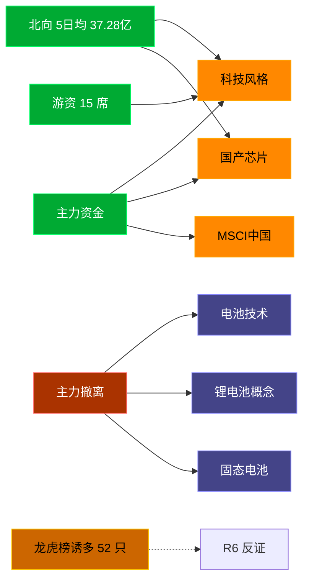

# 2026-07-10 · **资金面**

> **数据源新鲜度**: ok
> **降级状态**: false (全 MCP 健康)
> **置信度**: 0.8

## 一句话结论
北向近 5 日均 37.28 亿维持健康区间，主力集中「科技风格/国产芯片」；资金撤离端 top1「电池技术」，龙虎榜诱多 52 只需警惕。

## 资金流转拓扑图

## 详细分析

**1) 北向时序**
最新净流入 40.08 亿；5 日均 37.28 亿，20 日均 40.27 亿。近 5 日: 0703 39.1 → 0706 39.6 → 0707 33.7 → 0708 33.8 → 0709 40.1。整体维持健康区间，无明显撤离。

**2) 主力板块 (concept · REF_DATE=20260709)**
- 流入 TOP10：科技风格 +464.9亿 / 国产芯片 +397.0亿 / MSCI中国 +341.8亿 / 半导体概念 +341.4亿 / 百元股 +336.7亿 / 大盘股 +298.1亿 / 存储芯片 +294.6亿 / 通信技术 +261.7亿 / HS300_ +260.7亿 / 大盘成长 +244.0亿
- 流出 TOP10：电池技术 -159.3亿 / 锂电池概念 -131.8亿 / 固态电池 -93.4亿 / 小金属概念 -78.4亿 / 储能概念 -66.5亿 / 风能 -60.6亿 / 光伏概念 -54.9亿 / 新能源车 -50.9亿 / 反内卷概念 -50.7亿 / 小盘股 -48.7亿

**大资金意图**: 从流入端「科技风格 / 国产芯片 / MSCI中国」的结构看，主力集中加仓强势主线；非趋势瓦解，是资金再分配。
**为什么走强**: 科技风格 昨日排名居首 + 北向配合，说明有配置盘认可，不是纯短线炒作。
**逻辑够不够硬**: xtick DOWN → 无实时超大单验证，Tushare 数据 T+1 存在延迟；建议 D1 以「板块方向」而非「精准金额」使用。

**3) 昨日前十 5 日追踪 (核心)**
- **科技风格**: 0703:-125.2 → 0706:-298.8 → 0707:-182.8 → 0708:-56.9 → 0709:+464.9 亿 | 累计 -198.8 亿 · 正流入 1/5 · **持续净入**
- **国产芯片**: 0703:-183.4 → 0706:-200.2 → 0707:-131.8 → 0708:-143.3 → 0709:+397.0 亿 | 累计 -261.7 亿 · 正流入 1/5 · **持续净入**
- **MSCI中国**: 0703:-2.2 → 0706:-380.3 → 0707:-364.6 → 0708:-262.0 → 0709:+341.8 亿 | 累计 -667.3 亿 · 正流入 1/5 · **持续净入**
- **半导体概念**: 0703:-358.5 → 0706:-287.8 → 0707:-119.9 → 0708:-286.9 → 0709:+341.4 亿 | 累计 -711.6 亿 · 正流入 1/5 · **持续净入**
- **百元股**: 0703:-131.9 → 0706:-301.1 → 0707:-237.8 → 0708:-146.1 → 0709:+336.7 亿 | 累计 -480.2 亿 · 正流入 1/5 · **持续净入**
- **大盘股**: 0703:+53.4 → 0706:-280.2 → 0707:-289.9 → 0708:-161.7 → 0709:+298.1 亿 | 累计 -380.3 亿 · 正流入 2/5 · **持续净入**
- **存储芯片**: 0703:-169.7 → 0706:-125.6 → 0707:-116.5 → 0708:-169.6 → 0709:+294.6 亿 | 累计 -286.8 亿 · 正流入 1/5 · **持续净入**
- **通信技术**: 0703:-20.6 → 0706:-296.6 → 0707:-115.7 → 0708:-150.4 → 0709:+261.7 亿 | 累计 -321.5 亿 · 正流入 1/5 · **持续净入**
- **HS300_**: 0703:+61.1 → 0706:-253.5 → 0707:-243.6 → 0708:-117.0 → 0709:+260.7 亿 | 累计 -292.3 亿 · 正流入 2/5 · **持续净入**
- **大盘成长**: 0703:-2.2 → 0706:-180.5 → 0707:-103.1 → 0708:-45.8 → 0709:+244.0 亿 | 累计 -87.5 亿 · 正流入 1/5 · **持续净入**

**4) 游资 (龙虎榜 · 20260709)**
具名活跃席位 15 席，3 日协同信号 40 条。TOP 5:
- 欢乐海岸: 净额 30470.1 万，覆盖 1 票
- 量化基金: 净额 26666.1 万，覆盖 26 票
- 紫阳东路: 净额 20249.3 万，覆盖 1 票
- 成都系: 净额 20135.5 万，覆盖 1 票
- 量化打板: 净额 13456.2 万，覆盖 5 票

**5) 龙虎榜诱多识别 (核心)**
当日总计 91 只上榜，命中诱多规则 **52 只**。前 10：

| 代码 | 名称 | 涨幅 | 换手 | 龙虎榜净额(万) | 机构净额(万) | 模式 | 上榜原因 |
|---|---|---|---|---|---|---|---|
| 301379.SZ | 天山电子 | +19.99% | 18.9% | -12834 | -2627 | 涨停净卖出 + 机构专用净卖 | 日涨幅达到15%的前5只证券 |
| 002490.SZ | 山东墨龙 | +10.04% | 16.9% | -1707 | -799 | 涨停净卖出 + 疑似对倒:中泰证券股份有限公司… | 连续三个交易日内，涨幅偏离值累计达到20%的证券 |
| 300164.SZ | 通源石油 | +12.92% | 45.0% | -2956 | -510 | 涨停净卖出 | 日换手率达到30%的前5只证券 |
| 688432.SH | 有研硅 | +20.00% | 6.8% | -18263 | +5476 | 涨停净卖出 + 疑似对倒:中小投资者… | 有价格涨跌幅限制的连续3个交易日内收盘价格涨幅偏离值累计达到30%的证券 |
| 603928.SH | 兴业股份 | +10.02% | 19.7% | -5311 | +0 | 涨停净卖出 | 有价格涨跌幅限制的日收盘价格涨幅偏离值达到7%的前五只证券 |
| 002384.SZ | 东山精密 | +10.00% | 8.1% | +52279 | -136034 | 机构专用净卖 | 日涨幅偏离值达到7%的前5只证券 |
| 003026.SZ | 中晶科技 | +8.06% | 19.0% | -5128 | -12257 | 拉高净卖出 + 机构专用净卖 | 连续三个交易日内，涨幅偏离值累计达到20%的证券 |
| 002931.SZ | 锋龙股份 | -6.55% | 12.1% | +4425 | -8709 | 机构专用净卖 + 疑似对倒:华安证券股份有限公司… | 连续三个交易日内，跌幅偏离值累计达到20%的证券 |
| 600353.SH | 旭光电子 | +10.01% | 3.1% | +10137 | -6514 | 机构专用净卖 + 疑似对倒:中国银河证券股份有限… | 有价格涨跌幅限制的日收盘价格涨幅偏离值达到7%的前五只证券 |
| 688610.SH | 埃科光电 | +20.00% | 6.3% | +687 | -4442 | 机构专用净卖 | 有价格涨跌幅限制的日收盘价格涨幅达到15%的前五只证券 |

**6) 板块跷跷板**
_未检出显著跷跷板配对。_

**7) ETF / 期货**
ETF 净流入 24.66 亿(4 只代表)；股指期货基差: -95.51。

## 关键证据
- 主力流入 top1 科技风格 +464.9 亿 · 来源 tushare.moneyflow_ind_dc
- 5 日追踪：科技风格 累计 -198.81 亿, 1/5 日正流入
- 流出 top1 电池技术 -159.3 亿 · 来源 tushare.moneyflow_ind_dc
- 龙虎榜诱多 52 只，其中「涨停净卖出」5 只 · 来源 tushare.top_list+top_inst
- 游资 3 日协同 40 条 · 来源 tushare.hm_detail

## 数据源审计
| 源 | 状态 | 抓取日期 | 备注 |
|---|---|---|---|
| tushare.moneyflow_hsgt | 🟢 ok | 20260709 | 20 日北向 |
| tushare.moneyflow_ind_dc | 🟢 ok | 20260709 | 概念板块 5 日 |
| tushare.top_list | 🟢 ok | 20260709 | 91 行 |
| tushare.top_inst | 🟢 ok | 20260709 | 950 席位 |
| tushare.hm_detail | 🟢 ok | 20260709 | 15 具名席位 |
| xtick(canghai-sise) | 🟢 ok | 20260709 | 已交叉核实主力方向 |
| DataPro | 🟢 ok | 20260709 | 板块资金冗余核实 |

## 不确定性 / 反证
- 参考交易日 20260709，非当日实时；盘中若大级别政策/外围事件本判断失效。
- 龙虎榜诱多规则为静态启发式，未剔除 T+1 高开对冲情形，可能高估诱多密度；供 R6 反证参考，不作 hard_reject。
- Tushare hm_detail 存在 T+1 延迟；xtick/datapro 可作实时补充但盘前抓取以 Tushare 为主。
- 5 日追踪只跟踪昨日 top10，若今日风格切换到昨日 top20+ 板块，本追踪盲区。
- ETF 净流入基于 4 只代表 ETF 份额×收盘价估算，非真实一级市场资金流水。

## 与其他 R/D/E 的关系
- 依赖: data/raw/20260710/manifest.json, mcp_health.json; data/research/20260710/R1_style.json
- 被消费: D1(main_decision_v1) · R2(analyze_main_sectors_v1) · R5(analyze_stock_profile_v1) · R6(analyze_devil_advocate_v1)

## Sub-Agent 元数据
- skill: analyze_capital_flow_v1
- artifact: /Users/chenyang/Downloads/demo/沧海巨浪/data/research/20260710/R7_capital_flow.json
- 生成方式: enrich_r7_20260710.py (build 核心 + sector_5d_tracking + lhb_bull_trap + mermaid)
- model: ark-code-latest
