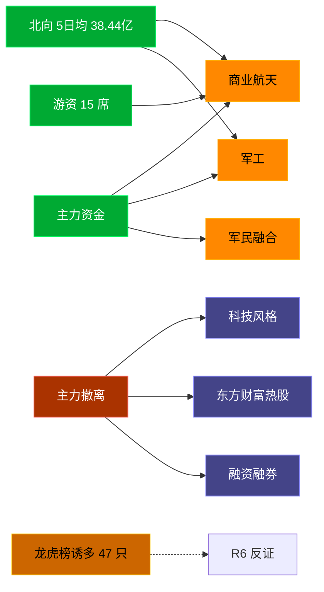

# 2026-07-13 · **资金面**

> **数据源新鲜度**: ok
> **降级状态**: false (全 MCP 健康)
> **置信度**: 0.8

## 一句话结论
北向近 5 日均 38.44 亿维持健康区间，主力集中「商业航天/军工」；资金撤离端 top1「科技风格」，龙虎榜诱多 47 只需警惕。

## 资金流转拓扑图

## 详细分析

**1) 北向时序**
最新净流入 44.93 亿；5 日均 38.44 亿，20 日均 40.77 亿。近 5 日: 0706 39.6 → 0707 33.7 → 0708 33.8 → 0709 40.1 → 0710 44.9。整体维持健康区间，无明显撤离。

**2) 主力板块 (concept · REF_DATE=20260710)**
- 流入 TOP10：商业航天 +110.9亿 / 军工 +96.0亿 / 军民融合 +76.2亿 / 卫星互联网 +62.9亿 / 低空经济 +47.8亿 / 破增发价股 +47.8亿 / 西部大开发 +47.5亿 / 北斗导航 +45.6亿 / DeepSeek概念 +41.7亿 / 无人机 +40.1亿
- 流出 TOP10：科技风格 -459.5亿 / 东方财富热股 -437.0亿 / 融资融券 -427.2亿 / 大盘股 -410.8亿 / MSCI中国 -380.2亿 / 百元股 -378.0亿 / HS300_ -356.4亿 / 富时罗素 -341.9亿 / 昨日高振幅 -318.3亿 / 半导体概念 -309.2亿

**大资金意图**: 从流入端「商业航天 / 军工 / 军民融合」的结构看，主力集中加仓强势主线；非趋势瓦解，是资金再分配。
**为什么走强**: 商业航天 昨日排名居首 + 北向配合，说明有配置盘认可，不是纯短线炒作。
**逻辑够不够硬**: xtick DOWN → 无实时超大单验证，Tushare 数据 T+1 存在延迟；建议 D1 以「板块方向」而非「精准金额」使用。

**3) 昨日前十 5 日追踪 (核心)**
- **商业航天**: 0706:-100.5 → 0707:-103.1 → 0708:-81.2 → 0709:+5.6 → 0710:+110.9 亿 | 累计 -168.3 亿 · 正流入 2/5 · **加速流入**
- **军工**: 0706:-77.7 → 0707:-101.1 → 0708:-67.3 → 0709:-4.5 → 0710:+96.0 亿 | 累计 -154.6 亿 · 正流入 1/5 · **持续净入**
- **军民融合**: 0706:-26.5 → 0707:-46.6 → 0708:-42.7 → 0709:-10.2 → 0710:+76.2 亿 | 累计 -49.8 亿 · 正流入 1/5 · **持续净入**
- **卫星互联网**: 0706:-46.1 → 0707:-36.4 → 0708:-8.6 → 0709:+77.1 → 0710:+62.9 亿 | 累计 +48.9 亿 · 正流入 2/5 · **持续净入**
- **低空经济**: 0706:-57.8 → 0707:-64.5 → 0708:-38.9 → 0709:+43.1 → 0710:+47.8 亿 | 累计 -70.3 亿 · 正流入 2/5 · **加速流入**
- **破增发价股**: 0706:-31.3 → 0707:-48.4 → 0708:-32.5 → 0709:-39.2 → 0710:+47.8 亿 | 累计 -103.6 亿 · 正流入 1/5 · **持续净入**
- **西部大开发**: 0706:-81.2 → 0707:-59.6 → 0708:-96.7 → 0709:-41.8 → 0710:+47.5 亿 | 累计 -231.9 亿 · 正流入 1/5 · **持续净入**
- **北斗导航**: 0706:-5.4 → 0707:-21.0 → 0708:-10.1 → 0709:+6.2 → 0710:+45.6 亿 | 累计 +15.2 亿 · 正流入 2/5 · **加速流入**
- **DeepSeek概念**: 0706:-17.5 → 0707:-42.1 → 0708:+46.4 → 0709:+44.4 → 0710:+41.7 亿 | 累计 +72.9 亿 · 正流入 3/5 · **持续净入**
- **无人机**: 0706:-59.5 → 0707:-47.5 → 0708:-50.8 → 0709:+16.9 → 0710:+40.1 亿 | 累计 -100.7 亿 · 正流入 2/5 · **加速流入**

**4) 游资 (龙虎榜 · 20260710)**
具名活跃席位 15 席，3 日协同信号 40 条。TOP 5:
- 量化基金: 净额 -356487.5 万，覆盖 34 票
- T王: 净额 17837.3 万，覆盖 34 票
- 成都系: 净额 14502.3 万，覆盖 4 票
- 独股一剑: 净额 13256.5 万，覆盖 2 票
- 低位挖掘: 净额 11925.7 万，覆盖 3 票

**5) 龙虎榜诱多识别 (核心)**
当日总计 98 只上榜，命中诱多规则 **47 只**。前 10：

| 代码 | 名称 | 涨幅 | 换手 | 龙虎榜净额(万) | 机构净额(万) | 模式 | 上榜原因 |
|---|---|---|---|---|---|---|---|
| 300071.SZ | 福石控股 | +19.17% | 33.9% | -6805 | +10006 | 涨停净卖出 + 换手异常且净卖出 + 疑似对倒:国新证券股份有限公司… | 日换手率达到30%的前5只证券 |
| 003020.SZ | 立方制药 | +9.98% | 10.6% | -3671 | +1664 | 涨停净卖出 + 疑似对倒:华鑫证券有限责任公司… | 连续三个交易日内，涨幅偏离值累计达到20%的证券 |
| 000892.SZ | 欢瑞世纪 | +9.95% | 20.2% | -3661 | +1367 | 涨停净卖出 + 疑似对倒:华鑫证券有限责任公司… | 连续三个交易日内，涨幅偏离值累计达到20%的证券 |
| 600378.SH | 昊华科技 | -8.49% | 8.9% | +11577 | -35446 | 机构专用净卖 | 有价格涨跌幅限制的日价格振幅达到15%的前五只证券 |
| 688596.SH | 正帆科技 | -15.31% | 14.4% | +7266 | -26611 | 机构专用净卖 | 有价格涨跌幅限制的日收盘价格跌幅达到15%的前五只证券 |
| 002353.SZ | 杰瑞股份 | -10.00% | 2.9% | -16512 | -25752 | 机构专用净卖 | 日跌幅偏离值达到7%的前5只证券 |
| 002497.SZ | 雅化集团 | -7.43% | 10.4% | -52384 | -20883 | 机构专用净卖 | 连续三个交易日内，跌幅偏离值累计达到20%的证券 |
| 002617.SZ | 露笑科技 | -10.02% | 17.4% | -19001 | -20044 | 机构专用净卖 | 日跌幅偏离值达到7%的前5只证券 |
| 003043.SZ | 华亚智能 | -10.00% | 12.2% | +2007 | -8335 | 机构专用净卖 | 日跌幅偏离值达到7%的前5只证券 |
| 688549.SH | 中巨芯 | -17.10% | 22.2% | -3090 | -4928 | 机构专用净卖 | 有价格涨跌幅限制的日收盘价格跌幅达到15%的前五只证券 |

**6) 板块跷跷板**
_未检出显著跷跷板配对。_

**7) ETF / 期货**
ETF 净流入 -2.35 亿(4 只代表)；股指期货基差: -76.19。

## 关键证据
- 主力流入 top1 商业航天 +110.9 亿 · 来源 tushare.moneyflow_ind_dc
- 5 日追踪：商业航天 累计 -168.27 亿, 2/5 日正流入
- 流出 top1 科技风格 -459.5 亿 · 来源 tushare.moneyflow_ind_dc
- 龙虎榜诱多 47 只，其中「涨停净卖出」3 只 · 来源 tushare.top_list+top_inst
- 游资 3 日协同 40 条 · 来源 tushare.hm_detail

## 数据源审计
| 源 | 状态 | 抓取日期 | 备注 |
|---|---|---|---|
| tushare.moneyflow_hsgt | 🟢 ok | 20260710 | 20 日北向 |
| tushare.moneyflow_ind_dc | 🟢 ok | 20260710 | 概念板块 5 日 |
| tushare.top_list | 🟢 ok | 20260710 | 98 行 |
| tushare.top_inst | 🟢 ok | 20260710 | 1048 席位 |
| tushare.hm_detail | 🟢 ok | 20260710 | 15 具名席位 |
| xtick(canghai-sise) | 🟢 ok | 20260710 | 已交叉核实主力方向 |
| DataPro | 🟢 ok | 20260710 | 板块资金冗余核实 |

## 不确定性 / 反证
- 参考交易日 20260710，非当日实时；盘中若大级别政策/外围事件本判断失效。
- 龙虎榜诱多规则为静态启发式，未剔除 T+1 高开对冲情形，可能高估诱多密度；供 R6 反证参考，不作 hard_reject。
- Tushare hm_detail 存在 T+1 延迟；xtick/datapro 可作实时补充但盘前抓取以 Tushare 为主。
- 5 日追踪只跟踪昨日 top10，若今日风格切换到昨日 top20+ 板块，本追踪盲区。
- ETF 净流入基于 4 只代表 ETF 份额×收盘价估算，非真实一级市场资金流水。

## 与其他 R/D/E 的关系
- 依赖: data/raw/20260713/manifest.json, mcp_health.json; data/research/20260713/R1_style.json
- 被消费: D1(main_decision_v1) · R2(analyze_main_sectors_v1) · R5(analyze_stock_profile_v1) · R6(analyze_devil_advocate_v1)

## Sub-Agent 元数据
- skill: analyze_capital_flow_v1
- artifact: /Users/chenyang/Downloads/demo/沧海巨浪/data/research/20260713/R7_capital_flow.json
- 生成方式: enrich_r7_20260713.py (build 核心 + sector_5d_tracking + lhb_bull_trap + mermaid)
- model: ark-code-latest
