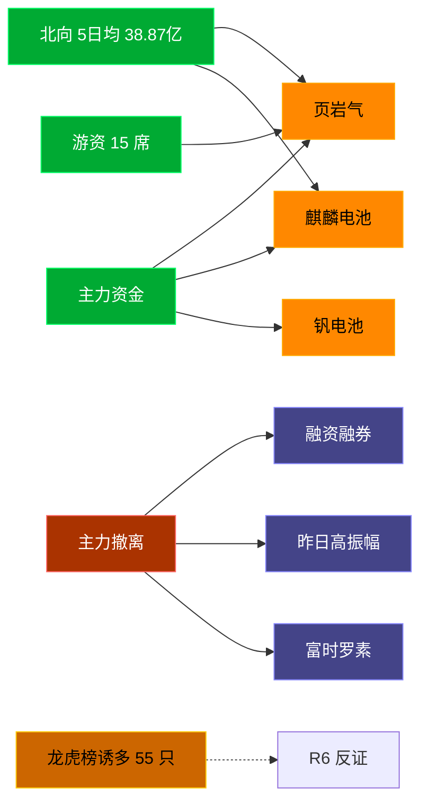

# 2026-07-14 · **资金面**

> **数据源新鲜度**: ok
> **降级状态**: false (全 MCP 健康)
> **置信度**: 0.8

## 一句话结论
北向近 5 日均 38.87 亿维持健康区间，主力集中「页岩气/麒麟电池」；资金撤离端 top1「融资融券」，龙虎榜诱多 55 只需警惕。

## 资金流转拓扑图

## 详细分析

**1) 北向时序**
最新净流入 41.78 亿；5 日均 38.87 亿，20 日均 41.16 亿。近 5 日: 0707 33.7 → 0708 33.8 → 0709 40.1 → 0710 44.9 → 0713 41.8。整体维持健康区间，无明显撤离。

**2) 主力板块 (concept · REF_DATE=20260713)**
- 流入 TOP10：页岩气 +5.9亿 / 麒麟电池 +5.7亿 / 钒电池 +3.9亿 / CRO +3.7亿 / 特色药 +2.8亿 / 独家药品 +2.6亿 / 华为欧拉 +2.4亿 / 微盘股 +2.3亿 / 创新药 +2.3亿 / 中药概念 +2.0亿
- 流出 TOP10：融资融券 -1644.6亿 / 昨日高振幅 -964.3亿 / 富时罗素 -918.9亿 / MSCI中国 -898.6亿 / 深股通 -892.0亿 / 沪股通 -746.1亿 / 半导体概念 -707.6亿 / 标准普尔 -662.8亿 / 大盘股 -652.6亿 / 百元股 -650.2亿

**大资金意图**: 从流入端「页岩气 / 麒麟电池 / 钒电池」的结构看，主力集中加仓强势主线；非趋势瓦解，是资金再分配。
**为什么走强**: 页岩气 昨日排名居首 + 北向配合，说明有配置盘认可，不是纯短线炒作。
**逻辑够不够硬**: xtick DOWN → 无实时超大单验证，Tushare 数据 T+1 存在延迟；建议 D1 以「板块方向」而非「精准金额」使用。

**3) 昨日前十 5 日追踪 (核心)**
- **页岩气**: 0707:+2.2 → 0708:+5.6 → 0709:+5.9 → 0710:-3.4 → 0713:+5.9 亿 | 累计 +16.1 亿 · 正流入 4/5 · **持续净入**
- **麒麟电池**: 0707:+0.2 → 0708:-13.6 → 0709:+6.3 → 0710:-20.8 → 0713:+5.7 亿 | 累计 -22.1 亿 · 正流入 3/5 · **持续净入**
- **钒电池**: 0707:-0.5 → 0708:-2.5 → 0709:-2.2 → 0710:+2.8 → 0713:+3.9 亿 | 累计 +1.5 亿 · 正流入 2/5 · **加速流入**
- **CRO**: 0707:-17.2 → 0708:-14.4 → 0709:-3.0 → 0710:+16.8 → 0713:+3.7 亿 | 累计 -14.2 亿 · 正流入 2/5 · **持续净入**
- **特色药**: 0707:-4.5 → 0708:-0.1 → 0709:-3.8 → 0710:+7.2 → 0713:+2.8 亿 | 累计 +1.6 亿 · 正流入 2/5 · **持续净入**
- **独家药品**: 0707:-4.8 → 0708:-1.2 → 0709:-2.5 → 0710:+2.7 → 0713:+2.6 亿 | 累计 -3.1 亿 · 正流入 2/5 · **持续净入**
- **华为欧拉**: 0707:-5.5 → 0708:+5.0 → 0709:+2.6 → 0710:+0.2 → 0713:+2.4 亿 | 累计 +4.7 亿 · 正流入 4/5 · **加速流入**
- **微盘股**: 0707:-0.0 → 0708:+1.3 → 0709:+0.7 → 0710:-1.4 → 0713:+2.3 亿 | 累计 +2.9 亿 · 正流入 3/5 · **持续净入**
- **创新药**: 0707:-59.6 → 0708:-36.8 → 0709:-19.6 → 0710:+29.3 → 0713:+2.3 亿 | 累计 -84.5 亿 · 正流入 2/5 · **持续净入**
- **中药概念**: 0707:-16.8 → 0708:-5.8 → 0709:-6.0 → 0710:+6.5 → 0713:+2.0 亿 | 累计 -20.1 亿 · 正流入 2/5 · **持续净入**

**4) 游资 (龙虎榜 · 20260713)**
具名活跃席位 15 席，3 日协同信号 44 条。TOP 5:
- T王: 净额 40045.8 万，覆盖 29 票
- 低位挖掘: 净额 -23573.4 万，覆盖 3 票
- 温州帮: 净额 -17145.0 万，覆盖 5 票
- 量化打板: 净额 10447.4 万，覆盖 6 票
- 粉葛: 净额 -9860.3 万，覆盖 1 票

**5) 龙虎榜诱多识别 (核心)**
当日总计 91 只上榜，命中诱多规则 **55 只**。前 10：

| 代码 | 名称 | 涨幅 | 换手 | 龙虎榜净额(万) | 机构净额(万) | 模式 | 上榜原因 |
|---|---|---|---|---|---|---|---|
| 605090.SH | 九丰能源 | +10.01% | 8.0% | -19246 | -46002 | 涨停净卖出 + 机构专用净卖 | 非S证券连续三个交易日内收盘价格涨幅偏离值累计达到20%的证券 |
| 301092.SZ | 争光股份 | +11.42% | 26.9% | -6835 | -4818 | 涨停净卖出 + 机构专用净卖 + 疑似对倒:国新证券股份有限公司… | 连续三个交易日内，涨幅偏离值累计达到30%的证券 |
| 002379.SZ | 宏桥控股 | +10.03% | 5.4% | -2330 | -1688 | 涨停净卖出 + 机构专用净卖 | 日涨幅偏离值达到7%的前5只证券 |
| 001395.SZ | 亚联机械 | +9.99% | 22.4% | -1787 | -96 | 涨停净卖出 | 日涨幅偏离值达到7%的前5只证券 |
| 600664.SH | 哈药股份 | +10.09% | 8.0% | -6520 | +0 | 涨停净卖出 | 有价格涨跌幅限制的日收盘价格涨幅偏离值达到7%的前五只证券 |
| 301310.SZ | 鑫宏业 | +17.39% | 39.1% | -3730 | +388 | 涨停净卖出 + 疑似对倒:中信建投证券股份有限… | 日涨幅达到15%的前5只证券 |
| 603313.SH | 梦百合 | +10.06% | 13.0% | -3205 | +0 | 涨停净卖出 + 疑似对倒:浙商证券股份有限公司… | 有价格涨跌幅限制的日收盘价格涨幅偏离值达到7%的前五只证券 |
| 603137.SH | 恒尚节能 | +10.02% | 15.2% | -2645 | +0 | 涨停净卖出 + 疑似对倒:中小投资者… | 非S证券连续三个交易日内收盘价格涨幅偏离值累计达到20%的证券 |
| 600629.SH | 华建集团 | +10.04% | 4.4% | -1333 | +0 | 涨停净卖出 + 疑似对倒:高盛(中国)证券有限… | 有价格涨跌幅限制的日收盘价格涨幅偏离值达到7%的前五只证券 |
| 301310.SZ | 鑫宏业 | +17.39% | 39.1% | -1215 | +388 | 涨停净卖出 + 疑似对倒:中信建投证券股份有限… | 连续三个交易日内，涨幅偏离值累计达到30%的证券 |

**6) 板块跷跷板**
_未检出显著跷跷板配对。_

**7) ETF / 期货**
ETF 净流入 134.52 亿(4 只代表)；股指期货基差: -60.78。

## 关键证据
- 主力流入 top1 页岩气 +5.9 亿 · 来源 tushare.moneyflow_ind_dc
- 5 日追踪：页岩气 累计 16.13 亿, 4/5 日正流入
- 流出 top1 融资融券 -1644.6 亿 · 来源 tushare.moneyflow_ind_dc
- 龙虎榜诱多 55 只，其中「涨停净卖出」10 只 · 来源 tushare.top_list+top_inst
- 游资 3 日协同 44 条 · 来源 tushare.hm_detail

## 数据源审计
| 源 | 状态 | 抓取日期 | 备注 |
|---|---|---|---|
| tushare.moneyflow_hsgt | 🟢 ok | 20260713 | 20 日北向 |
| tushare.moneyflow_ind_dc | 🟢 ok | 20260713 | 概念板块 5 日 |
| tushare.top_list | 🟢 ok | 20260713 | 91 行 |
| tushare.top_inst | 🟢 ok | 20260713 | 935 席位 |
| tushare.hm_detail | 🟢 ok | 20260713 | 15 具名席位 |
| xtick(canghai-sise) | 🟢 ok | 20260713 | 已交叉核实主力方向 |
| DataPro | 🟢 ok | 20260713 | 板块资金冗余核实 |

## 不确定性 / 反证
- 参考交易日 20260713，非当日实时；盘中若大级别政策/外围事件本判断失效。
- 龙虎榜诱多规则为静态启发式，未剔除 T+1 高开对冲情形，可能高估诱多密度；供 R6 反证参考，不作 hard_reject。
- Tushare hm_detail 存在 T+1 延迟；xtick/datapro 可作实时补充但盘前抓取以 Tushare 为主。
- 5 日追踪只跟踪昨日 top10，若今日风格切换到昨日 top20+ 板块，本追踪盲区。
- ETF 净流入基于 4 只代表 ETF 份额×收盘价估算，非真实一级市场资金流水。

## 与其他 R/D/E 的关系
- 依赖: data/raw/20260714/manifest.json, mcp_health.json; data/research/20260714/R1_style.json
- 被消费: D1(main_decision_v1) · R2(analyze_main_sectors_v1) · R5(analyze_stock_profile_v1) · R6(analyze_devil_advocate_v1)

## Sub-Agent 元数据
- skill: analyze_capital_flow_v1
- artifact: /Users/chenyang/Downloads/demo/沧海巨浪/data/research/20260714/R7_capital_flow.json
- 生成方式: enrich_r7_20260714.py (build 核心 + sector_5d_tracking + lhb_bull_trap + mermaid)
- model: ark-code-latest
