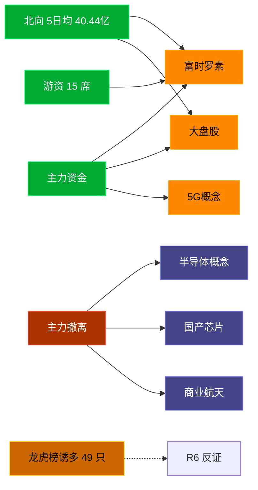

# 2026-07-15 · **资金面**

> **数据源新鲜度**: ok
> **降级状态**: false (全 MCP 健康)
> **置信度**: 0.8

## 一句话结论
北向近 5 日均 40.44 亿维持健康区间，主力集中「富时罗素/大盘股」；资金撤离端 top1「半导体概念」，龙虎榜诱多 49 只需警惕。

## 资金流转拓扑图

## 详细分析

**1) 北向时序**
最新净流入 41.59 亿；5 日均 40.44 亿，20 日均 40.78 亿。近 5 日: 0708 33.8 → 0709 40.1 → 0710 44.9 → 0713 41.8 → 0714 41.6。整体维持健康区间，无明显撤离。

**2) 主力板块 (concept · REF_DATE=20260714)**
- 流入 TOP10：富时罗素 +238.9亿 / 大盘股 +209.1亿 / 5G概念 +198.9亿 / 标准普尔 +197.2亿 / 周期股 +197.1亿 / HS300_ +196.4亿 / 通信技术 +192.2亿 / MSCI中国 +183.3亿 / 2026中报预增 +170.8亿 / PCB +161.7亿
- 流出 TOP10：半导体概念 -148.9亿 / 国产芯片 -87.4亿 / 商业航天 -79.0亿 / 专精特新 -78.8亿 / 中芯概念 -70.6亿 / 人工智能 -70.3亿 / 军工 -67.1亿 / 信创 -65.2亿 / 区块链 -63.9亿 / 存储芯片 -52.7亿

**大资金意图**: 从流入端「富时罗素 / 大盘股 / 5G概念」的结构看，主力集中加仓强势主线；非趋势瓦解，是资金再分配。
**为什么走强**: 富时罗素 昨日排名居首 + 北向配合，说明有配置盘认可，不是纯短线炒作。
**逻辑够不够硬**: xtick DOWN → 无实时超大单验证，Tushare 数据 T+1 存在延迟；建议 D1 以「板块方向」而非「精准金额」使用。

**3) 昨日前十 5 日追踪 (核心)**
- **富时罗素**: 0708:-356.8 → 0709:+237.0 → 0710:-341.9 → 0713:-918.9 → 0714:+238.9 亿 | 累计 -1141.7 亿 · 正流入 2/5 · **持续净入**
- **大盘股**: 0708:-161.7 → 0709:+298.1 → 0710:-410.8 → 0713:-652.6 → 0714:+209.1 亿 | 累计 -717.9 亿 · 正流入 2/5 · **持续净入**
- **5G概念**: 0708:-105.5 → 0709:+194.9 → 0710:-155.7 → 0713:-457.0 → 0714:+198.9 亿 | 累计 -324.4 亿 · 正流入 2/5 · **持续净入**
- **标准普尔**: 0708:-270.9 → 0709:+197.2 → 0710:-146.3 → 0713:-662.8 → 0714:+197.2 亿 | 累计 -685.6 亿 · 正流入 2/5 · **持续净入**
- **周期股**: 0708:-110.5 → 0709:-13.4 → 0710:-181.9 → 0713:-164.4 → 0714:+197.1 亿 | 累计 -273.2 亿 · 正流入 1/5 · **持续净入**
- **HS300_**: 0708:-117.0 → 0709:+260.7 → 0710:-356.4 → 0713:-517.9 → 0714:+196.4 亿 | 累计 -534.3 亿 · 正流入 2/5 · **持续净入**
- **通信技术**: 0708:-150.4 → 0709:+261.7 → 0710:-140.2 → 0713:-468.1 → 0714:+192.2 亿 | 累计 -304.7 亿 · 正流入 2/5 · **持续净入**
- **MSCI中国**: 0708:-262.0 → 0709:+341.8 → 0710:-380.2 → 0713:-898.6 → 0714:+183.3 亿 | 累计 -1015.8 亿 · 正流入 2/5 · **持续净入**
- **2026中报预增**: 0708:-15.1 → 0709:-18.5 → 0710:-221.7 → 0713:-243.7 → 0714:+170.8 亿 | 累计 -328.1 亿 · 正流入 1/5 · **持续净入**
- **PCB**: 0708:-123.2 → 0709:+53.9 → 0710:-83.8 → 0713:-229.5 → 0714:+161.7 亿 | 累计 -220.8 亿 · 正流入 2/5 · **持续净入**

**4) 游资 (龙虎榜 · 20260714)**
具名活跃席位 15 席，3 日协同信号 36 条。TOP 5:
- 量化打板: 净额 54739.1 万，覆盖 13 票
- 成都系: 净额 10001.9 万，覆盖 1 票
- 山东帮: 净额 -9799.1 万，覆盖 1 票
- 上海溧阳路: 净额 7617.2 万，覆盖 1 票
- T王: 净额 6838.1 万，覆盖 26 票

**5) 龙虎榜诱多识别 (核心)**
当日总计 80 只上榜，命中诱多规则 **49 只**。前 10：

| 代码 | 名称 | 涨幅 | 换手 | 龙虎榜净额(万) | 机构净额(万) | 模式 | 上榜原因 |
|---|---|---|---|---|---|---|---|
| 300164.SZ | 通源石油 | +20.04% | 44.0% | -5961 | -8878 | 涨停净卖出 + 机构专用净卖 | 连续三个交易日内，涨幅偏离值累计达到30%的证券 |
| 300566.SZ | 激智科技 | +20.01% | 14.7% | -5546 | +2234 | 涨停净卖出 | 日涨幅达到15%的前5只证券 |
| 002379.SZ | 宏桥控股 | +10.00% | 9.7% | -3284 | +2950 | 涨停净卖出 | 连续三个交易日内，涨幅偏离值累计达到20%的证券 |
| 920125.BJ | 鸿仕达 | +18.51% | 12.7% | -1447 | +1058 | 涨停净卖出 + 疑似对倒:国信证券股份有限公司… | 当日价格振幅达到30%的前5只股票 |
| 002185.SZ | 华天科技 | +6.42% | 25.2% | -256177 | -269147 | 机构专用净卖 | 日换手率达到20%的前5只证券 |
| 002842.SZ | 翔鹭钨业 | +2.85% | 23.7% | -26929 | -14843 | 机构专用净卖 | 日换手率达到20%的前5只证券 |
| 688519.SH | 南亚新材 | +18.43% | 4.4% | +3321 | -14587 | 机构专用净卖 | 有价格涨跌幅限制的日收盘价格涨幅达到15%的前五只证券 |
| 301259.SZ | 艾布鲁 | +19.98% | 13.2% | +598 | -10546 | 机构专用净卖 | 日涨幅达到15%的前5只证券 |
| 002617.SZ | 露笑科技 | -8.68% | 12.6% | -5616 | -9577 | 机构专用净卖 | 连续三个交易日内，跌幅偏离值累计达到20%的证券 |
| 300164.SZ | 通源石油 | +20.04% | 44.0% | +13472 | -8878 | 机构专用净卖 | 日涨幅达到15%的前5只证券 |

**6) 板块跷跷板**
_未检出显著跷跷板配对。_

**7) ETF / 期货**
ETF 净流入 58.09 亿(4 只代表)；股指期货基差: -106.5。

## 关键证据
- 主力流入 top1 富时罗素 +238.9 亿 · 来源 tushare.moneyflow_ind_dc
- 5 日追踪：富时罗素 累计 -1141.68 亿, 2/5 日正流入
- 流出 top1 半导体概念 -148.9 亿 · 来源 tushare.moneyflow_ind_dc
- 龙虎榜诱多 49 只，其中「涨停净卖出」4 只 · 来源 tushare.top_list+top_inst
- 游资 3 日协同 36 条 · 来源 tushare.hm_detail

## 数据源审计
| 源 | 状态 | 抓取日期 | 备注 |
|---|---|---|---|
| tushare.moneyflow_hsgt | 🟢 ok | 20260714 | 20 日北向 |
| tushare.moneyflow_ind_dc | 🟢 ok | 20260714 | 概念板块 5 日 |
| tushare.top_list | 🟢 ok | 20260714 | 80 行 |
| tushare.top_inst | 🟢 ok | 20260714 | 909 席位 |
| tushare.hm_detail | 🟢 ok | 20260714 | 15 具名席位 |
| xtick(canghai-sise) | 🟢 ok | 20260714 | 已交叉核实主力方向 |
| DataPro | 🟢 ok | 20260714 | 板块资金冗余核实 |

## 不确定性 / 反证
- 参考交易日 20260714，非当日实时；盘中若大级别政策/外围事件本判断失效。
- 龙虎榜诱多规则为静态启发式，未剔除 T+1 高开对冲情形，可能高估诱多密度；供 R6 反证参考，不作 hard_reject。
- Tushare hm_detail 存在 T+1 延迟；xtick/datapro 可作实时补充但盘前抓取以 Tushare 为主。
- 5 日追踪只跟踪昨日 top10，若今日风格切换到昨日 top20+ 板块，本追踪盲区。
- ETF 净流入基于 4 只代表 ETF 份额×收盘价估算，非真实一级市场资金流水。

## 与其他 R/D/E 的关系
- 依赖: data/raw/20260715/manifest.json, mcp_health.json; data/research/20260715/R1_style.json
- 被消费: D1(main_decision_v1) · R2(analyze_main_sectors_v1) · R5(analyze_stock_profile_v1) · R6(analyze_devil_advocate_v1)

## Sub-Agent 元数据
- skill: analyze_capital_flow_v1
- artifact: /Users/chenyang/Downloads/demo/沧海巨浪/data/research/20260715/R7_capital_flow.json
- 生成方式: enrich_r7_20260715.py (build 核心 + sector_5d_tracking + lhb_bull_trap + mermaid)
- model: ark-code-latest
